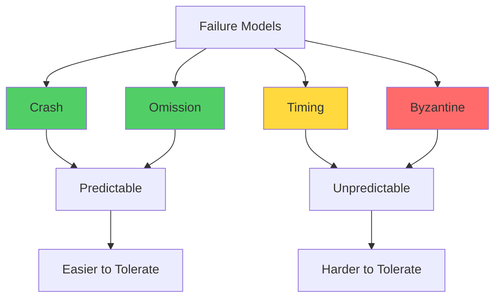

# Byzantine Failures

Byzantine failures represent the most challenging class of faults in distributed systems, where faulty components may exhibit arbitrary malicious behavior including sending contradictory information to different nodes.

## Overview

The term "Byzantine" comes from the **Byzantine Generals Problem**, formulated by Lamport, Shostak, and Pease in 1982 [[lamport-shostak-pease-1982-byzantine]]. The problem illustrates the challenge of achieving consensus when some participants may be malicious and actively try to prevent agreement.

**Byzantine failure** refers to a fault that presents different symptoms to different observers, making it difficult or impossible for other nodes in the system to determine whether the faulty node is actually faulty or simply slow.

## Failure Model Spectrum

Distributed systems literature defines several failure models, ordered from least to most severe:

### 1. Crash Failures (Benign)

**Definition**: A node stops executing and never recovers.

**Characteristics:**
- Node fails by halting permanently
- No incorrect behavior before crashing
- Other nodes can eventually detect the crash (with failure detectors)
- **Not Byzantine**: Behavior is predictable

**Example**: A server loses power and goes offline permanently.

### 2. Omission Failures (Benign)

**Definition**: A node fails to send or receive messages it should have sent/received.

**Characteristics:**
- Messages are lost or delayed indefinitely
- Node continues to execute but misses communication
- Can be send-omission, receive-omission, or both
- **Not Byzantine**: Still follows protocol, just misses messages

**Example**: Network partition causes a node to miss heartbeat messages.

### 3. Timing Failures (Partially Malicious)

**Definition**: A node fails to respond within expected time bounds.

**Characteristics:**
- Response is correct but arrives too early or too late
- Violates synchrony assumptions
- Relevant only in synchronous or partially synchronous models
- **Not Byzantine** in asynchronous systems (no timing assumptions)

**Example**: A slow node responds after a timeout, causing protocol to proceed without it.

### 4. Byzantine Failures (Arbitrary/Malicious)

**Definition**: A node may exhibit **any arbitrary behavior**, including acting maliciously to disrupt the protocol.

**Characteristics:**
- Can send contradictory messages to different nodes (equivocation)
- Can lie about received values
- Can collude with other Byzantine nodes
- Can selectively participate in protocol phases
- May appear correct to some nodes, faulty to others
- **Cannot be distinguished** from correct behavior by local observation alone

**Example**: A compromised node tells half the network "I vote YES" and the other half "I vote NO."



## Byzantine Attack Scenarios

### Equivocation

**Definition**: Sending different, conflicting values to different recipients.

**Impact**: Breaks agreement if nodes cannot detect the inconsistency.

**Example:**
```
Byzantine node B sends to node 1: "My value is 0"
Byzantine node B sends to node 2: "My value is 1"
```

If nodes 1 and 2 don't communicate, they each believe B sent a different value.

**Defense**: Provable broadcast mechanisms that create evidence of what was sent.

### Selective Participation

**Definition**: Byzantine node participates in some protocol phases but not others.

**Impact**: Can stall progress (violates liveness) without being obviously faulty.

**Example:**
```
Byzantine node participates in proposal phase but refuses to vote.
```

**Defense**: Timeouts and view changes that allow protocol to proceed without unresponsive nodes.

### Collusion

**Definition**: Multiple Byzantine nodes coordinate their attack.

**Impact**: Amplifies the damage a single Byzantine node could cause.

**Example:**
```
f Byzantine nodes all report the same false value, 
making it appear to be the majority.
```

**Defense**: Require supermajorities (> 2f nodes) to make decisions, ensuring honest nodes outnumber Byzantine ones.

### Message Delay/Withholding

**Definition**: Byzantine node delays messages to specific nodes to manipulate timing.

**Impact**: In partially synchronous systems, can cause timeout-based view changes.

**Example:**
```
Byzantine leader delays messages to one replica 
to exclude it from the consensus round.
```

**Defense**: Asynchronous protocols that don't rely on timing assumptions.

## Why Byzantine Tolerance Is Difficult

1. **Indistinguishability**: Cannot tell if a node is Byzantine, slow, or partitioned by local observation.

2. **Requires Majority Agreement**: To overcome f Byzantine nodes, need agreement from > 2f nodes (total n > 3f).

3. **Exponential Message Complexity**: Naive solutions require exponential message exchanges to verify consistency.

4. **Cannot Achieve Common Knowledge**: In asynchronous systems, nodes cannot attain true common knowledge, which consensus requires.

5. **Sybil Attacks**: In permissionless settings, Byzantine actors can create multiple fake identities.

## Practical Sources of Byzantine Failures

### In Real Systems

Byzantine failures arise from:

1. **Software Bugs**: Deterministic bugs may cause different outputs for different inputs
2. **Hardware Failures**: Memory corruption, bit flips can cause arbitrary behavior
3. **Malicious Actors**: Intentional compromise (hacked nodes, insider threats)
4. **Non-Determinism**: Different implementations or compiler versions producing different results
5. **Network Attacks**: Man-in-the-middle attacks injecting or modifying messages

### In Blockchain Systems

Byzantine tolerance is critical for:

- **Cryptocurrency Networks**: Malicious miners/validators trying to double-spend or censor transactions
- **Smart Contract Platforms**: Compromised validators trying to manipulate contract execution
- **Permissioned Ledgers**: Insider threats in consortium blockchains

## Byzantine Fault Tolerance Threshold

The fundamental result for Byzantine consensus is:

$$
f < \frac{n}{3}
$$

Where:
- $n$ = total number of nodes
- $f$ = maximum number of Byzantine faulty nodes

**Proof Intuition**: 
- Need at least $n - f$ honest nodes
- Need to distinguish honest majority from Byzantine nodes + silent honest nodes
- Requires $n - f > 2f$, which gives $n > 3f$

For detailed explanation, see [[fault-tolerance-threshold]].

**Practical Implications:**
- **4 nodes**: Can tolerate 1 Byzantine failure (4 > 3×1)
- **7 nodes**: Can tolerate 2 Byzantine failures (7 > 3×2)
- **100 nodes**: Can tolerate 33 Byzantine failures (100 > 3×33)

## Byzantine vs. Crash Fault Tolerance

| Aspect | Crash Fault Tolerance | Byzantine Fault Tolerance |
|--------|----------------------|--------------------------|
| **Fault Model** | Nodes only fail-stop | Nodes can behave arbitrarily |
| **Threshold** | $f < n/2$ | $f < n/3$ |
| **Detection** | Timeout-based (eventually) | Cannot reliably detect locally |
| **Protocols** | Paxos, Raft, Viewstamped Replication | PBFT, HoneyBadgerBFT, HotStuff |
| **Message Complexity** | $O(n)$ to $O(n^2)$ | $O(n^2)$ to $O(n^3)$ (naive) |
| **Use Cases** | Database replication, cloud services | Blockchain, adversarial networks |
| **Assumptions** | Fail-stop behavior | Arbitrary behavior |

## Byzantine Quorums

To make decisions under Byzantine faults, protocols use **Byzantine quorums**:

**Quorum Size**: At least $n - f$ nodes (more than $\frac{2n}{3}$ when $f < \frac{n}{3}$)

**Intersection Property**: Any two quorums must intersect in at least $f + 1$ nodes, guaranteeing at least one honest node.

**Example (n=4, f=1)**:
- Quorum size: 4 - 1 = 3 nodes
- Any two 3-node quorums intersect in at least 2 nodes
- Since f=1, at least one of those 2 is honest

This ensures that conflicting decisions cannot both gather quorums.

## Testing for Byzantine Resilience

### Chaos Engineering Approaches

- **Random Message Dropping**: Simulate omission failures
- **Message Corruption**: Inject invalid data
- **Equivocation Injection**: Send conflicting messages from test nodes
- **Selective Delays**: Test timeout-based view changes
- **Collusion Simulation**: Coordinate multiple faulty nodes

### Formal Verification

- **Model Checking**: Exhaustively test all possible Byzantine behaviors in small models
- **Theorem Proving**: Mechanically verify that protocol maintains safety/liveness despite f Byzantine nodes
- See [[formal-verification]] for techniques

## Historical Context

### The Byzantine Generals Problem (1982)

**Scenario**: Byzantine generals surround a city. Some are traitors. They must agree on a coordinated attack plan, but traitors may send false messages.

**Formalization**: $n$ generals, up to $f$ traitors
- All loyal generals must agree on the same plan
- A small number of traitors cannot cause loyal generals to adopt a bad plan

**Result**: Consensus is possible if and only if $n > 3f$ (for synchronous message-passing systems).

**Impact**: Established the theoretical foundation for Byzantine fault tolerance.

### FLP Impossibility (1985)

Fischer, Lynch, and Paterson proved that **deterministic consensus is impossible** in asynchronous systems with even a single crash failure [[fischer-lynch-paterson-1985-flp]].

**Implications for Byzantine Tolerance:**
- Asynchronous Byzantine consensus is even harder
- Practical protocols use randomization (HoneyBadgerBFT) or partial synchrony (PBFT, HotStuff)

## See Also

- [[fundamentals]] - Core BFT consensus concepts
- [[safety-properties]] - What Byzantine nodes cannot violate
- [[liveness-properties]] - Progress guarantees despite Byzantine nodes
- [[fault-tolerance-threshold]] - Mathematical foundation for f < n/3
- [[pbft]] - First practical Byzantine fault tolerant protocol
- [[honeybadger-bft]] - Asynchronous BFT protocol
- [[hotstuff]] - Modern linear-complexity BFT protocol

## Further Reading

- **Byzantine Generals Problem**: [[lamport-shostak-pease-1982-byzantine]]
- **FLP Impossibility**: [[fischer-lynch-paterson-1985-flp]]
- **Textbook Treatment**: [[cachin-guerraoui-rodrigues-2011-textbook]]

---

**Self-Assessment Questions:**

1. What makes Byzantine failures more challenging than crash failures?
2. Why is the threshold $f < n/3$ for Byzantine tolerance, but $f < n/2$ for crash tolerance?
3. Give an example of an equivocation attack and explain why it's dangerous.
4. In a 10-node network, how many Byzantine failures can be tolerated? Why?
5. Can you prove that two Byzantine quorums (with $n=7, f=2$) must intersect in at least one honest node?
