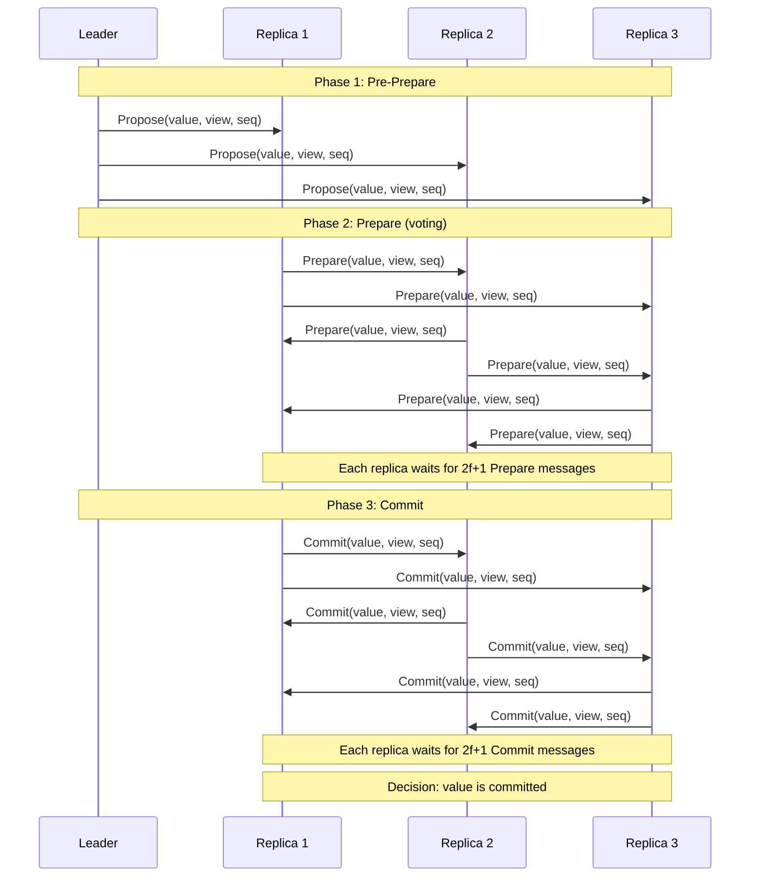

# BFT Consensus Fundamentals

**Byzantine Fault Tolerant (BFT) Consensus** is the problem of achieving agreement among distributed nodes when some nodes may behave arbitrarily or maliciously. This is one of the most challenging problems in distributed systems.

## Overview

In distributed systems, nodes must coordinate to make decisions—whether it's agreeing on the state of a blockchain, committing a transaction in a database, or electing a leader. When all nodes are honest and the network is reliable, this is straightforward. The challenge emerges when:

1. **Some nodes are faulty** and may behave maliciously
2. **The network** may delay or reorder messages
3. **Honest nodes** cannot always distinguish faulty behavior from network delays

BFT consensus solves this problem by enabling correct nodes to reach agreement despite the presence of Byzantine (arbitrary) failures.

## The Byzantine Generals Problem

The classic formulation, introduced by Lamport, Shostak, and Pease in 1982[^1], imagines Byzantine generals surrounding a city:

- Generals must coordinate an attack plan
- Some generals may be traitors (Byzantine)
- Loyal generals must agree on a plan
- A few traitors should not disrupt coordination

This abstraction captures the essence of distributed consensus under malicious failures.

**Key Insight**: With n generals and f traitors, consensus is possible if and only if **n ≥ 3f + 1** (i.e., f < n/3).

## Core Consensus Properties

Every consensus protocol must satisfy three properties:

### 1. Agreement (Safety)

**Informal**: All correct (non-faulty) nodes decide on the same value.

**Formal**:
$$
\forall i,j \in \text{Correct} : \text{decided}(i) \land \text{decided}(j) \to \text{value}(i) = \text{value}(j)
$$

This is a **safety property**: "something bad never happens" (in this case, disagreement).

### 2. Validity (Safety)

**Informal**: The decided value must be a value that was actually proposed by some correct node.

**Formal**:
$$
\text{decided}(v) \to \exists i \in \text{Correct} : \text{proposed}(i, v)
$$

This prevents trivial solutions like "always decide on a fixed default value."

### 3. Termination (Liveness)

**Informal**: All correct nodes eventually decide on a value.

**Formal**:
$$
\forall i \in \text{Correct} : \Diamond \text{decided}(i)
$$
(where ◇ means "eventually" in temporal logic)

This is a **liveness property**: "something good eventually happens."

## Synchrony Models

BFT protocols make different assumptions about message timing:

### Synchronous Model

- **Assumption**: Known upper bound on message delays and process execution speeds
- **Pro**: Simpler protocols, deterministic termination
- **Con**: Unrealistic in real-world networks (Internet, wireless)
- **Example Use**: Theoretical analysis, some permissioned networks

### Asynchronous Model

- **Assumption**: No bounds on message delays; messages eventually arrive
- **Pro**: Realistic for real-world networks
- **Con**: FLP impossibility—deterministic consensus is impossible[^2]
- **Workaround**: Randomization (e.g., HoneyBadgerBFT) or eventual synchrony
- **Example**: [[protocols/honeybadger-bft|HoneyBadgerBFT]]

### Partial Synchrony

- **Assumption**: Eventually, there exists a bound on message delays (but bound is unknown, or holds only after some time)
- **Pro**: Balances realism and achievability
- **Con**: More complex protocols
- **Example**: [[protocols/pbft|PBFT]], [[protocols/hotstuff|HotStuff]]

**Most practical BFT protocols use partial synchrony.**

## The f < n/3 Threshold

Byzantine consensus requires **n ≥ 3f + 1** nodes to tolerate **f** Byzantine faults.

### Why This Bound?

**Intuition**: 
- You need a majority to agree (> n/2)
- But Byzantine nodes can pretend to be in the majority
- You need a **supermajority** large enough that even if f nodes are Byzantine, the honest supermajority still outweighs the Byzantine nodes plus any honest nodes they might trick

**Mathematical Proof Sketch**:
1. A quorum must have at least n - f nodes (to ensure progress despite f failures)
2. Two quorums must intersect in at least one honest node (to ensure agreement)
3. This requires: (n - f) + (n - f) - n ≥ f + 1
4. Simplifying: 2(n - f) - n ≥ f + 1 → 2n - 2f - n ≥ f + 1 → n ≥ 3f + 1

See [[properties/fault-tolerance-threshold|Fault Tolerance Threshold]] for detailed proof.

### Examples

| Total Nodes (n) | Max Byzantine Faults (f) | Required for Quorum |
|-----------------|-------------------------|---------------------|
| 4 | 1 | 3 |
| 7 | 2 | 5 |
| 10 | 3 | 7 |
| 100 | 33 | 67 |

## Key Mechanisms

BFT protocols use several common mechanisms:

### Quorums

A **quorum** is a subset of nodes large enough to ensure:
1. Any two quorums intersect in at least one honest node
2. At least one quorum contains only honest nodes

**Typical size**: n - f nodes (where f < n/3)

### Voting/Echo Phases

Nodes exchange messages in multiple rounds:
1. **Propose**: A leader or nodes propose values
2. **Vote/Echo**: Nodes vote on proposals or echo received messages
3. **Commit**: Nodes commit when they see sufficient votes/echoes

This prevents a Byzantine leader from equivocating (sending different values to different nodes).

### Certificates

Modern BFT protocols use **certificates** (proofs) that a message has been accepted by a quorum:
- **Quorum Certificate**: Collection of signatures from n - f nodes
- **Delivery Certificate**: Proof that a message was delivered (see [[../provable-broadcast/provable-broadcast|Provable Broadcast]])

Certificates enable compact proofs and reduce communication.

### Leader-Based vs. Leaderless

- **Leader-Based** (PBFT, HotStuff): One node proposes; others validate
  - Pro: Simpler in the common case
  - Con: Leader failure requires view change
- **Leaderless** (HoneyBadgerBFT, DAG-based): All nodes participate equally
  - Pro: No single point of coordination failure
  - Con: Higher communication overhead

## Safety vs. Liveness Trade-offs

BFT protocols face inherent trade-offs:

### Safety-First Approaches

- **Prioritize**: Never violate agreement
- **Accept**: May stall (violate liveness) if network is asynchronous
- **Example**: PBFT during network partitions

### Liveness-First Approaches

- **Prioritize**: Always make progress
- **Accept**: Requires randomization or weaker guarantees
- **Example**: HoneyBadgerBFT (uses randomness for asynchronous liveness)

**FLP Impossibility**: You cannot have deterministic consensus with both safety and liveness in an asynchronous system with even one faulty process[^2].

## Communication Complexity

BFT protocols differ in message complexity:

| Protocol | Complexity | Notes |
|----------|------------|-------|
| PBFT | O(n²) | All-to-all communication |
| HotStuff | O(n) | Linear via leader aggregation |
| HoneyBadgerBFT | O(n² × \|batch\|) | Batched transactions |

Lower complexity → better scalability.

## Example: Simple Consensus Flow

Here's a simplified BFT consensus flow (e.g., PBFT-style):

**Key Points**:
- Multiple phases ensure agreement
- 2f + 1 messages (quorum) required at each phase
- Byzantine nodes cannot create fake quorums

## Relationship to Other Concepts

### BFT ↔ Provable Broadcast

Many modern BFT protocols use **provable broadcast** as a building block:
- Provable broadcast provides delivery certificates
- BFT consensus uses these certificates to prove agreement
- See [[../provable-broadcast/provable-broadcast|Provable Broadcast]]

### BFT ↔ Logic Models

**Formal verification** of BFT protocols uses logic models:
- Safety/liveness properties are expressed in temporal logic
- Model checkers verify protocol correctness
- Knowledge-based reasoning explains why f < n/3
- See [[../logic-models/overview|Logic Models Overview]]

## Summary

**Byzantine Fault Tolerant Consensus** enables distributed agreement despite malicious failures:

✅ **Requires**: n ≥ 3f + 1 nodes to tolerate f Byzantine faults  
✅ **Properties**: Agreement, Validity, Termination  
✅ **Trade-offs**: Synchrony assumptions, communication complexity, safety vs. liveness  
✅ **Mechanisms**: Quorums, voting phases, certificates, leader rotation  

## Next Steps

- **Understand the threat model**: [[byzantine-failures|Byzantine Failures]]
- **Explore safety properties**: [[properties/safety-properties|Safety Properties]]
- **Explore liveness properties**: [[properties/liveness-properties|Liveness Properties]]
- **Study specific protocols**:
  - [[protocols/pbft|PBFT]] - Classic partially synchronous BFT
  - [[protocols/honeybadger-bft|HoneyBadgerBFT]] - Asynchronous BFT
  - [[protocols/hotstuff|HotStuff]] - Linear-complexity BFT
- **Compare protocols**: [[protocols/protocol-comparison|Protocol Comparison]]

## References

[^1]: [[references#lamport-shostak-pease-1982-byzantine|Lamport, Shostak, & Pease (1982)]] - The Byzantine Generals Problem
[^2]: [[references#fischer-lynch-paterson-1985-flp|Fischer, Lynch, & Paterson (1985)]] - FLP Impossibility

## See Also

- [[../index|Knowledge Base Home]]
- [[glossary|Glossary]]
- [[../integration/relationships|How BFT Relates to Broadcast and Logic Models]]
