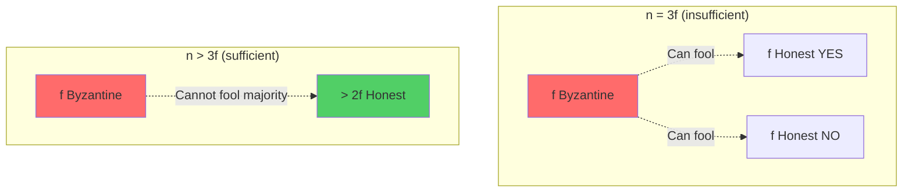

# Fault Tolerance Threshold: Why f < n/3 for Byzantine Failures

The fundamental threshold for Byzantine fault tolerance is one of the most important results in distributed systems theory. This note explains why consensus protocols can tolerate at most $f < \frac{n}{3}$ Byzantine failures.

## The Core Inequality

**Theorem**: Byzantine consensus with $n$ nodes can tolerate at most $f$ Byzantine failures if and only if:

$$
f < \frac{n}{3}
$$

Or equivalently:

$$
n > 3f
$$

**Minimum Configuration Examples**:
- **4 nodes**: Can tolerate 1 Byzantine failure ($4 > 3 \times 1$)
- **7 nodes**: Can tolerate 2 Byzantine failures ($7 > 3 \times 2$)
- **100 nodes**: Can tolerate 33 Byzantine failures ($100 > 3 \times 33$, but not 34)

## Why $f < n/3$ Is Necessary

### Intuitive Explanation

To achieve consensus under Byzantine failures, correct nodes must:

1. **Distinguish honest majority from Byzantine nodes**
2. **Account for silent honest nodes** (which might appear Byzantine)
3. **Ensure quorum intersection contains at least one honest node**

**The Three-Way Split:**

Consider $n$ nodes partitioned into three groups of equal size $\frac{n}{3}$:
- **Group A**: $\frac{n}{3}$ Byzantine nodes (adversary controlled)
- **Group B**: $\frac{n}{3}$ honest nodes that vote YES
- **Group C**: $\frac{n}{3}$ honest nodes that vote NO (or are silent)

If $f = \frac{n}{3}$, Byzantine nodes can:
- Tell Group B: "I vote YES"
- Tell Group C: "I vote NO"
- Cause Group B to decide YES, Group C to decide NO
- **Result**: Agreement violated

**Why $n > 3f$ prevents this:**
- Honest nodes ($n - f$) outnumber Byzantine nodes ($f$) by more than 2:1
- Any quorum of size $\geq n - f$ contains a majority of honest nodes
- Byzantine nodes cannot create conflicting quorums



### Formal Proof (Quorum Intersection)

**Requirement**: Byzantine quorums must intersect in at least one honest node.

**Quorum Size**: $Q \geq n - f$ (to ensure intersection)

**Proof that $n > 3f$ is necessary:**

Let $Q_1$ and $Q_2$ be two different quorums, each of size $\geq n - f$.

**Intersection Size**: 
$$
|Q_1 \cap Q_2| \geq |Q_1| + |Q_2| - n \geq (n - f) + (n - f) - n = n - 2f
$$

**For safety**: Need at least one honest node in intersection:
$$
|Q_1 \cap Q_2| > f
$$

**Combining**:
$$
n - 2f > f \\
n > 3f
$$

**Conclusion**: If $n \leq 3f$, intersection might contain only Byzantine nodes, allowing conflicting quorums.

### Example: Why $n = 3f$ Is Insufficient

**Configuration**: $n = 6$ nodes, $f = 2$ Byzantine nodes

**Quorum Size**: $n - f = 6 - 2 = 4$ nodes

**Scenario**:
```
Nodes: {1, 2, 3, 4, 5, 6}
Byzantine: {1, 2}
Honest: {3, 4, 5, 6}

Quorum Q1 = {1, 2, 3, 4}  (supports value A)
Quorum Q2 = {1, 2, 5, 6}  (supports value B)

Intersection: Q1 ∩ Q2 = {1, 2} (both Byzantine!)
```

**Problem**: Intersection contains only Byzantine nodes, which can lie to both quorums.

**Result**: Node 3,4 believe A is decided; Node 5,6 believe B is decided → **Agreement violated**

### Example: Why $n > 3f$ Is Sufficient

**Configuration**: $n = 7$ nodes, $f = 2$ Byzantine nodes

**Quorum Size**: $n - f = 7 - 2 = 5$ nodes

**Scenario**:
```
Nodes: {1, 2, 3, 4, 5, 6, 7}
Byzantine: {1, 2}
Honest: {3, 4, 5, 6, 7}

Quorum Q1 = {1, 2, 3, 4, 5}
Quorum Q2 = {1, 2, 5, 6, 7}

Intersection: Q1 ∩ Q2 = {1, 2, 5}
```

**Intersection Size**: $7 - 2 \times 2 = 3 > 2$ (contains at least $f + 1$ nodes)

**Guarantee**: At least one honest node (e.g., node 5) is in the intersection.

**Safety**: Honest node 5 cannot support conflicting values → prevents conflicting quorums.

## Comparison: Byzantine vs. Crash Fault Tolerance

| Fault Model | Threshold | Minimum Nodes for f=1 | Minimum Nodes for f=2 |
|-------------|-----------|----------------------|----------------------|
| **Crash Failures** | $f < \frac{n}{2}$ | $n \geq 3$ (3 nodes) | $n \geq 5$ (5 nodes) |
| **Byzantine Failures** | $f < \frac{n}{3}$ | $n \geq 4$ (4 nodes) | $n \geq 7$ (7 nodes) |

**Why the difference?**

**Crash Failures**:
- Faulty nodes simply stop responding
- Honest majority ($n - f > f$) is sufficient
- Requires $n > 2f$

**Byzantine Failures**:
- Faulty nodes can lie and equivocate
- Must distinguish Byzantine nodes from silent honest nodes
- Requires $n > 3f$ (stronger condition)

### Crash Fault Tolerance: $n > 2f$

**Quorum Size**: $\lceil \frac{n}{2} \rceil + 1$ (simple majority)

**Example (n=5, f=2)**:
```
Quorum size = 3
Two quorums of size 3 must intersect in at least 1 node
If at most 2 nodes crashed, intersection contains at least 1 honest node
```

**Why sufficient**: Crashed nodes don't send conflicting messages, so simple majority suffices.

### Byzantine Fault Tolerance: $n > 3f$

**Quorum Size**: $n - f$ (supermajority)

**Example (n=7, f=2)**:
```
Quorum size = 5
Two quorums of size 5 must intersect in at least 3 nodes
At most 2 are Byzantine, so at least 1 is honest
```

**Why necessary**: Byzantine nodes can lie, so need larger quorums and intersections.

## The Role of Synchrony

The $f < \frac{n}{3}$ bound applies to **all synchrony models**:

### Synchronous Systems

**Bound**: $f < \frac{n}{3}$

**Reason**: Even with timing assumptions, Byzantine nodes can lie about values, requiring quorum intersection with honest nodes.

**Note**: Synchronous Byzantine consensus is possible (with exponential message complexity), but still requires $n > 3f$.

### Asynchronous Systems

**Bound**: $f < \frac{n}{3}$ (same as synchronous)

**Additional Challenge**: FLP impossibility requires randomization for liveness.

**Safety**: Same quorum intersection argument applies.

### Partially Synchronous Systems

**Bound**: $f < \frac{n}{3}$ (same as synchronous/asynchronous)

**Liveness**: Guaranteed only after Global Stabilization Time (GST).

**Safety**: Always maintained with $n > 3f$.

**Conclusion**: The threshold $f < \frac{n}{3}$ is **independent of synchrony assumptions** - it's a fundamental limit for safety.

## Authenticated vs. Unauthenticated Channels

### Authenticated Channels (Digital Signatures)

**Setting**: Nodes use digital signatures to authenticate messages.

**Threshold**: $f < \frac{n}{3}$ (same as above)

**Why**: Even with signatures, Byzantine nodes can selectively sign different values for different recipients (equivocation).

**Benefit**: Signatures provide non-repudiation, making equivocation detectable (but threshold remains $n > 3f$).

### Unauthenticated Channels (No Signatures)

**Setting**: No cryptographic authentication, only point-to-point channels.

**Threshold**: $f < \frac{n}{3}$ (same!)

**Surprise**: Even without signatures, threshold doesn't worsen for Byzantine consensus.

**Reason**: The bound comes from quorum intersection, not authentication.

**Note**: The original Byzantine Generals solution [[lamport-shostak-pease-1982-byzantine|lamport-shostak-pease-1982-byzantine]] uses oral messages (unauthenticated) and still achieves $n > 3f$.

### Stronger Result: Authenticated Broadcast

With **authenticated broadcast** (unforgeable signatures + reliable channels):

**Threshold**: Still $f < \frac{n}{3}$ for consensus

**But**: Can achieve **Byzantine Broadcast** with $f < \frac{n}{2}$ (weaker problem than consensus)

**Example**: Byzantine Reliable Broadcast can tolerate $f < \frac{n}{2}$ because it doesn't require all nodes to agree on the same value, just that honest nodes deliver the same value.

## Lower Bound Proof Sketch

**Theorem (Impossibility)**: Byzantine consensus is impossible if $f \geq \frac{n}{3}$.

**Proof by Counterexample**:

Assume $n = 3f$ (boundary case).

**Scenario**:
1. Partition nodes into three groups: $A$, $B$, $C$, each of size $f$
2. Run three concurrent executions:
   - **Execution 1**: $A$ is Byzantine, $B \cup C$ are honest → decides 0
   - **Execution 2**: $B$ is Byzantine, $A \cup C$ are honest → decides 1
   - **Execution 3**: $C$ is Byzantine, $A \cup B$ are honest → decides ?

**Indistinguishability**:
- Nodes in $A$ cannot distinguish Execution 1 (where $A$ is honest) from Execution 2 (where $A$ is honest but $B$ is Byzantine)
- Similarly for $B$ and $C$

**Result**: Nodes cannot determine which execution they're in, leading to potential disagreement.

**Conclusion**: $n = 3f$ is insufficient. Need $n > 3f$.

**See [[bft-consensus-analysis/bft-consensus/byzantine-failures|Byzantine Failures]] for detailed fault model discussion.**

## Practical Implications

### Network Size Planning

**Question**: How many nodes do I need to tolerate $f$ Byzantine failures?

**Answer**: $n \geq 3f + 1$

| Desired Fault Tolerance | Minimum Nodes Required |
|------------------------|------------------------|
| $f = 1$ | $n \geq 4$ |
| $f = 2$ | $n \geq 7$ |
| $f = 3$ | $n \geq 10$ |
| $f = 5$ | $n \geq 16$ |
| $f = 10$ | $n \geq 31$ |

### Cost vs. Fault Tolerance Trade-off

**Observation**: Each additional Byzantine fault requires **3 additional nodes**.

**Cost Implications**:
- **Crash Fault Tolerance**: Each fault adds 2 nodes ($n = 2f + 1$)
- **Byzantine Fault Tolerance**: Each fault adds 3 nodes ($n = 3f + 1$)

**Example**:
```
Tolerate f=10 Byzantine failures:
- Requires n=31 nodes
- vs. f=10 crash failures: only n=21 nodes

Additional cost: 10 extra nodes (48% overhead)
```

**Trade-off Decision**:
- **Use BFT** when adversarial behavior is expected (blockchain, cross-organization)
- **Use CFT** when failures are benign (data center, trusted environment)

### Blockchain Validator Sets

**Example (Ethereum Consensus)**:
- Active validator set: ~hundreds of thousands
- Committee size for consensus: ~128 validators per slot
- Fault tolerance: Can tolerate ~42 Byzantine validators per committee

**Practical Formula**:
$$
f_{\text{tolerated}} = \left\lfloor \frac{n - 1}{3} \right\rfloor
$$

### Permissioned vs. Permissionless

**Permissioned BFT** (known validators):
- Can directly apply $n > 3f$
- Examples: Hyperledger Fabric, R3 Corda

**Permissionless BFT** (unknown validators):
- Must prevent Sybil attacks (adversary creating fake identities)
- Solutions: Proof-of-Work, Proof-of-Stake (make Byzantine nodes costly)
- Threshold still applies to effective validator set

## Advanced: Stronger Fault Models

### Beyond $f < n/3$: Synchronous Authenticated Byzantine Broadcast

**Problem**: Byzantine Reliable Broadcast (not full consensus)

**Threshold**: $f < \frac{n}{2}$ (weaker bound!)

**Why**: Broadcast doesn't require agreement among all nodes on who proposed what, only that honest nodes deliver the same value from a given sender.

**Protocol Example**: Bracha's Byzantine Broadcast [[bracha-1987-asynchronous-broadcast|bracha-1987-asynchronous-broadcast]]

### Partial Synchrony with Signatures: No Improvement

**Claim**: Digital signatures **do not** improve the $f < \frac{n}{3}$ threshold for consensus.

**Reasoning**: Signatures prevent forgery but don't prevent equivocation (signing different messages for different recipients).

**Benefit of Signatures**: Evidence of equivocation (accountability), but threshold remains $n > 3f$.

## Verifying the Threshold in Protocols

### PBFT (Practical Byzantine Fault Tolerance)

**Configuration**: $n = 3f + 1$ replicas

**Quorum Size**: $2f + 1$ (which equals $n - f$)

**Verification**:
```
n = 3f + 1
Quorum = 2f + 1 = n - f ✓
Intersection of two quorums:
  (2f + 1) + (2f + 1) - (3f + 1) = f + 1 ✓ (> f)
```

**See [[bft-consensus-analysis/bft-consensus/protocols/pbft|PBFT: Practical Byzantine Fault Tolerance]] for protocol details.**

### HoneyBadgerBFT

**Configuration**: $n = 3f + 1$ nodes

**Asynchronous Common Subset**: Waits for $n - f = 2f + 1$ proposals

**Verification**:
```
n = 3f + 1
Threshold for ACS = n - f = 2f + 1 ✓
Byzantine nodes can block at most f proposals
Honest nodes (n - f = 2f + 1) ensure progress ✓
```

**See [[bft-consensus-analysis/bft-consensus/protocols/honeybadger-bft|HoneyBadgerBFT: Asynchronous Byzantine Consensus]] for protocol details.**

### HotStuff

**Configuration**: $n = 3f + 1$ replicas

**Quorum Certificate (QC)**: $n - f = 2f + 1$ signatures

**Verification**:
```
n = 3f + 1
QC size = 2f + 1 = n - f ✓
Two QCs intersect in at least f + 1 nodes ✓
At least one honest node in intersection ✓
```

**See [[bft-consensus-analysis/bft-consensus/protocols/hotstuff|HotStuff: Linear-Complexity BFT Consensus]] for protocol details.**

## See Also

- [[bft-consensus-analysis/bft-consensus/byzantine-failures|Byzantine Failures]] - Fault model requiring this threshold
- [[bft-consensus-analysis/bft-consensus/properties/safety-properties|Safety Properties in BFT Consensus]] - Properties guaranteed by quorum intersection
- [[bft-consensus-analysis/bft-consensus/fundamentals|BFT Consensus Fundamentals]] - Core BFT concepts
- [[bft-consensus-analysis/bft-consensus/protocols/pbft|PBFT: Practical Byzantine Fault Tolerance]] - First practical $n = 3f + 1$ protocol
- [[bft-consensus-analysis/bft-consensus/protocols/honeybadger-bft|HoneyBadgerBFT: Asynchronous Byzantine Consensus]] - Asynchronous protocol with $n > 3f$
- [[bft-consensus-analysis/bft-consensus/protocols/hotstuff|HotStuff: Linear-Complexity BFT Consensus]] - Modern optimized protocol with $n > 3f$

## Further Reading

- **Original Byzantine Generals**: [[lamport-shostak-pease-1982-byzantine|lamport-shostak-pease-1982-byzantine]]
- **PBFT Threshold Analysis**: [[castro-liskov-1999-pbft|castro-liskov-1999-pbft]]
- **Textbook Treatment**: [[cachin-guerraoui-rodrigues-2011-textbook|cachin-guerraoui-rodrigues-2011-textbook]]

---

**Self-Assessment Questions:**

1. Why is $n > 3f$ necessary for Byzantine consensus? Explain using quorum intersection.
2. Calculate the minimum number of nodes needed to tolerate 5 Byzantine failures.
3. Why is the threshold for crash fault tolerance ($f < n/2$) weaker than for Byzantine fault tolerance ($f < n/3$)?
4. In a network with $n = 10$ nodes, how many Byzantine failures can be tolerated? What happens if there are 4 Byzantine nodes?
5. Does the threshold $f < n/3$ change for asynchronous vs. synchronous consensus? Why or why not?
