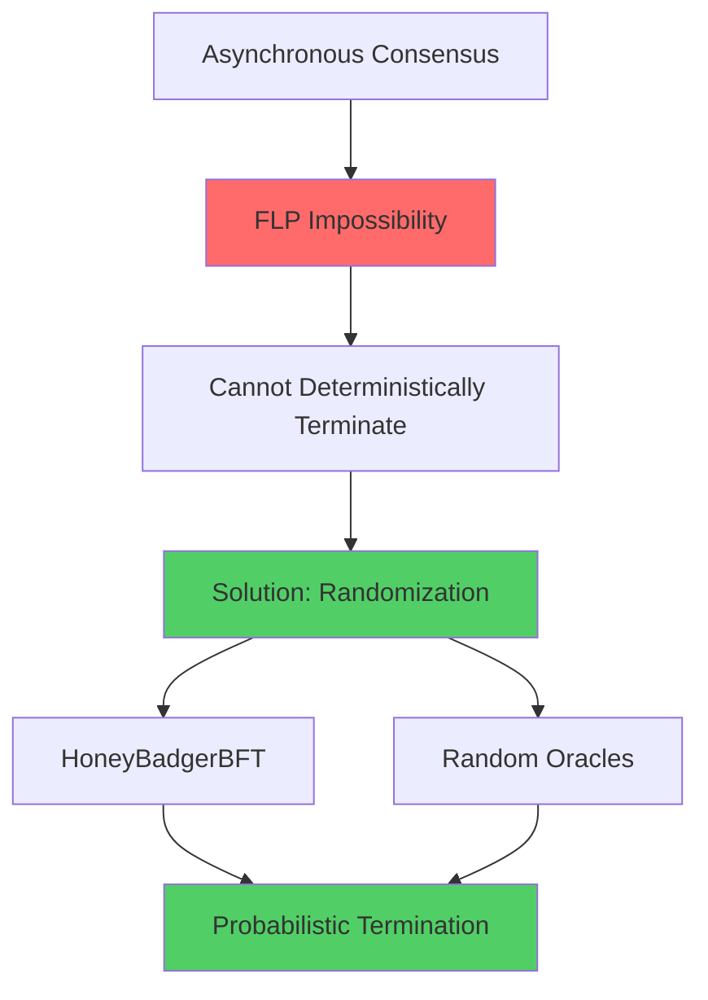
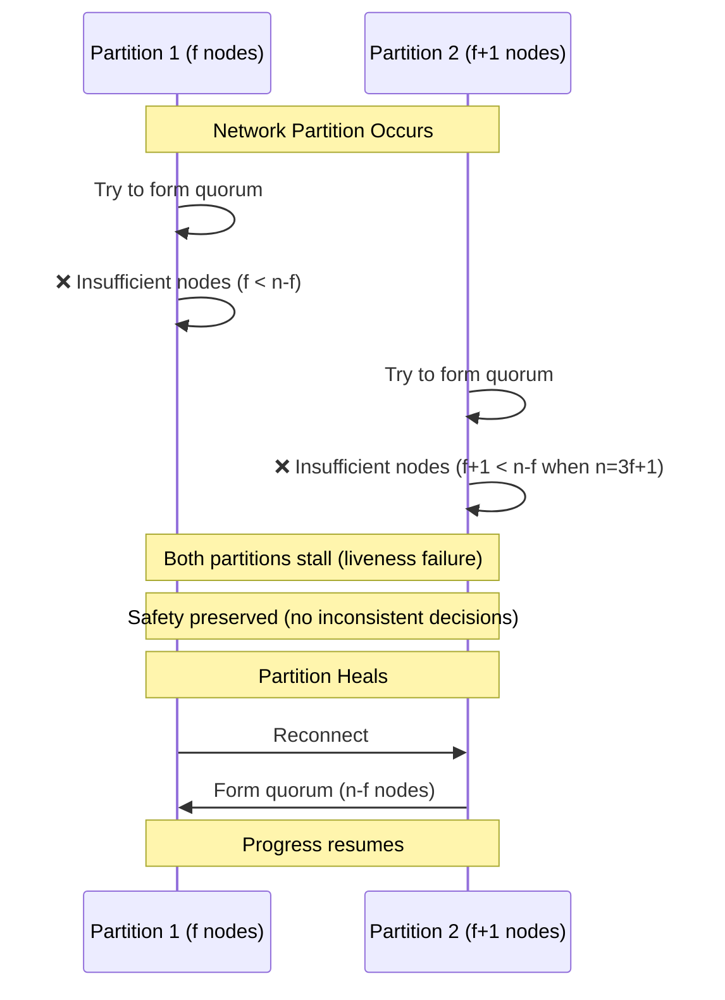

# Liveness Properties in BFT Consensus

Liveness properties specify that "something good eventually happens" - the system makes progress and doesn't get stuck forever. In consensus, liveness means that correct nodes eventually decide on a value.

## Overview

**Liveness** (also called **progress** or **termination**) is the dual of safety:

- **Safety**: "Nothing bad ever happens" (invariant maintained)
- **Liveness**: "Something good eventually happens" (progress guaranteed)

Unlike safety violations (which are permanent), liveness violations can be temporary. A protocol may stall for a period but later resume progress.

**Fundamental Challenge**: The FLP Impossibility Theorem proves that **deterministic consensus is impossible** in asynchronous systems with even one crash failure [[fischer-lynch-paterson-1985-flp|fischer-lynch-paterson-1985-flp]]. BFT consensus faces even stronger liveness challenges.

## Core Liveness Properties

### 1. Termination (Basic Liveness)

**Informal**: Every correct node eventually decides on some value.

**Formal Definition**:
$$
\forall i \in \text{Correct} : \Diamond \text{decided}(i)
$$

Where $\Diamond$ means "eventually" (at some future time).

**Importance**: Without termination, the protocol could stall forever, making it useless.

**Example Violation**:
```
All correct nodes wait for a message from a crashed leader.
Leader never responds.
→ Liveness violation: nodes never decide.
```

### 2. Non-Blocking (Guaranteed Progress)

**Informal**: The protocol makes progress even if some nodes (up to $f$) fail or act maliciously.

**Formal Definition**:
$$
\left(|\text{Byzantine}| \leq f\right) \implies \left(\forall i \in \text{Correct} : \Diamond \text{decided}(i)\right)
$$

**Importance**: Ensures the system is fault-tolerant - Byzantine nodes cannot indefinitely block progress.

**Example (HoneyBadgerBFT)**:
```
Up to f Byzantine nodes refuse to participate.
Asynchronous protocol continues with n-f honest nodes.
→ Progress maintained despite Byzantine obstruction.
```

### 3. Validity of Decided Value

**Informal**: The decided value must be one that was proposed by some correct node (or satisfy validity criteria).

**Relation to Safety**: This overlaps with the validity safety property but emphasizes the liveness aspect: a "good" value is eventually chosen.

**Formal Definition**:
$$
\Diamond \left( \text{decided}(i, v) \land \exists j \in \text{Correct} : \text{proposed}(j, v) \right)
$$

## Liveness in Different Consensus Models

### Synchronous Systems

**Timing Assumption**: Messages are delivered within a known bound $\Delta$.

**Liveness Guarantee**: **Always** (deterministic termination guaranteed).

**Why**: Can use timeouts to detect failures definitively. If a node doesn't respond within $\Delta$, it's faulty.

**Example Protocol**: Synchronous Byzantine agreement (exponential rounds, but guaranteed termination).

**Trade-off**: Synchrony assumption is strong and often unrealistic in real networks.

### Asynchronous Systems

**Timing Assumption**: **None** - messages can be arbitrarily delayed.

**Liveness Guarantee**: **Cannot be deterministically guaranteed** (FLP impossibility).

**Solutions**:
1. **Randomization**: Use randomness to break symmetry (e.g., cryptographic coin flips)
2. **Probabilistic Termination**: Terminate with probability 1 (expected finite time)

**Example Protocol**: HoneyBadgerBFT uses threshold cryptography for random beacons.

**Advantage**: Liveness holds even in worst-case network conditions (no timing assumptions to violate).



### Partially Synchronous Systems

**Timing Assumption**: Synchrony holds **eventually** after an unknown Global Stabilization Time (GST).

**Liveness Guarantee**: **Eventually** (after GST, with high probability).

**Before GST**: Network may be asynchronous, protocol may stall.

**After GST**: Timing bounds hold, protocol makes progress.

**Example Protocols**: PBFT, HotStuff, Tendermint.

**Practical Rationale**: Most real networks are "usually synchronous" with occasional asynchronous periods (e.g., temporary partitions).

**Design Pattern**:
```
while (not decided):
    try to make progress with current leader
    if timeout (suggesting asynchrony):
        trigger view change to new leader
        # Eventually, after GST, timeouts will be accurate
```

## Mechanisms for Ensuring Liveness

### 1. View Changes (Leader Rotation)

**Problem**: Byzantine or crashed leader can block progress.

**Solution**: Detect unresponsive leader via timeout, rotate to a new leader.

**Protocol Flow**:
```
1. Leader proposes value
2. Replicas set timer
3. If timer expires without progress:
   → Trigger view change
   → Elect new leader (e.g., round-robin)
4. New leader continues from safe state
```

**Example (PBFT)**:
- If replicas don't see progress, they broadcast VIEW-CHANGE messages
- Once $2f + 1$ replicas agree on view change, new leader takes over
- New leader proves correctness via quorum certificates from previous view

**Liveness Guarantee**: Eventually (after GST), an honest leader is elected and makes progress.

### 2. Randomized Leader Election

**Problem**: Adversary might predict and target the next leader.

**Solution**: Use randomness to select leader unpredictably.

**Techniques**:
- **Cryptographic Sortition**: Use verifiable random function (VRF) to select leader
- **Random Beacon**: Threshold cryptography generates shared randomness

**Example (HoneyBadgerBFT)**:
- Uses threshold encryption for common randomness
- All nodes agree on the same random beacon
- Leader selection is unpredictable to adversary

**Liveness Guarantee**: With probability 1, an honest leader is eventually selected.

### 3. Timeout Mechanisms

**Purpose**: Detect potential liveness failures and trigger recovery.

**Adaptive Timeouts**:
- Start with optimistic (short) timeout
- Double timeout on each retry (exponential backoff)
- Eventually exceeds actual message delay, enabling progress

**Example (HotStuff)**:
```python
timeout = INITIAL_TIMEOUT
while not decided:
    wait_for_quorum_certificate(timeout)
    if timed_out:
        trigger_view_change()
        timeout *= 2  # Exponential backoff
```

**Liveness Guarantee**: After GST, timeouts exceed actual message delays, allowing progress.

### 4. Asynchronous Common Subset (ACS)

**Problem**: In asynchronous settings, cannot wait for all proposals.

**Solution**: Wait for $n - f$ proposals (a quorum), proceed without waiting for Byzantine nodes.

**Protocol (HoneyBadgerBFT ACS)**:
```
1. Each node broadcasts its proposal via provable broadcast
2. Wait until n-f provable broadcasts complete
3. Use agreement protocol to decide on common subset of n-f proposals
4. Combine decided proposals into final output
```

**Liveness Guarantee**: Even if $f$ Byzantine nodes never send proposals, protocol terminates using $n - f$ honest proposals.

## Liveness vs. Safety Trade-offs

### The Fundamental Tension

| Property | Priority | Can Sacrifice? | Impact of Sacrifice |
|----------|----------|----------------|---------------------|
| **Safety** | Higher | ❌ No | Permanent inconsistency (catastrophic) |
| **Liveness** | Lower | ✅ Yes | Temporary stall (recoverable) |

**Design Philosophy**: **Safety first, liveness eventually.**

**Reasoning**:
- Safety violations are **irreversible** (e.g., double-spend cannot be undone)
- Liveness violations are **temporary** (system may stall but can resume)

### Practical Manifestations

#### Network Partition

**Scenario**: Network splits into two partitions, neither has quorum.

**Safety Response**: Refuse to make decisions (no quorum, no commits).

**Liveness Impact**: ❌ Progress halts until partition heals.

**Recovery**: When partition heals, quorum reforms, progress resumes.



#### Byzantine Leader

**Scenario**: Current leader is Byzantine and refuses to propose.

**Safety Response**: Replicas do not commit without valid proposal.

**Liveness Impact**: ❌ Progress blocked by malicious leader.

**Recovery**: View change timeout triggers, new leader elected.

**Time to Recovery**: Depends on timeout settings and synchrony assumptions.

#### Too Many Byzantine Nodes ($f \geq n/3$)

**Scenario**: More than $f$ nodes are Byzantine where $f \geq n/3$.

**Safety Response**: ❌ **Safety may be violated** (Byzantine quorums can form).

**Liveness Impact**: ✅ Progress may continue (but with incorrect decisions).

**Outcome**: System has **failed catastrophically** (both safety and liveness guarantees broken).

## FLP Impossibility and Practical Implications

### The FLP Theorem (1985)

**Statement**: No deterministic consensus protocol can guarantee termination in an asynchronous system with even **one crash failure**.

**Implications for BFT**:
- Byzantine failures are strictly harder than crash failures
- Asynchronous BFT consensus cannot provide **deterministic liveness**

**Why It Matters**: Explains why all practical BFT protocols make additional assumptions:
- **Partial synchrony** (PBFT, HotStuff): Assume eventual synchrony
- **Randomization** (HoneyBadgerBFT): Use randomness to break symmetry

### Escaping FLP: Randomization

**Approach**: Use randomness to achieve probabilistic termination.

**Mechanism**: Common coin or random beacon provides shared randomness.

**Guarantee**: Terminate with probability 1 (expected finite rounds).

**Example (HoneyBadgerBFT)**:
- Uses threshold cryptography to generate unpredictable random beacons
- Byzantine nodes cannot bias the randomness
- Expected termination time: $O(1)$ rounds

### Escaping FLP: Partial Synchrony

**Approach**: Assume synchrony holds eventually.

**Mechanism**: Use timeouts to detect failures (work correctly after GST).

**Guarantee**: Terminate eventually (after GST and after an honest leader is elected).

**Example (PBFT)**:
- View changes triggered by timeouts
- After GST, timeouts are accurate, honest leader makes progress

## Measuring Liveness

### Termination Time

**Metric**: Time from start of consensus to decision.

**Typical Values**:
- **Synchronous protocols**: $O(f)$ to $O(f^2)$ rounds (deterministic)
- **Partially synchronous protocols**: Expected $O(1)$ to $O(\log n)$ rounds after GST
- **Asynchronous protocols**: Expected $O(1)$ rounds (probabilistic)

### Throughput (Transactions per Second)

**Metric**: Number of consensus decisions per unit time.

**Factors**:
- Message complexity: $O(n)$ (HotStuff) vs $O(n^2)$ (PBFT)
- Latency: Time to finalize one consensus instance
- Pipelining: Overlapping multiple consensus instances

**Example**:
```
HotStuff: ~thousands TPS (with pipelining)
PBFT: ~hundreds TPS (without optimizations)
HoneyBadgerBFT: ~variable TPS (depends on network conditions)
```

### Time to Recovery After Liveness Failure

**Metric**: Time from liveness failure (e.g., view change) to resumption of progress.

**Depends On**:
- View change protocol complexity
- Network conditions (synchrony)
- Adaptive timeout settings

## Liveness Attacks

### Denial of Service (DoS)

**Attack**: Flood network with messages to prevent legitimate communication.

**Impact**: Delays message delivery, can cause liveness failure.

**Defense**:
- Rate limiting
- Authentication and filtering
- Asynchronous protocols (no timing assumptions to exploit)

### Leader Suppression

**Attack**: Target the current leader to force view changes.

**Impact**: Repeated view changes delay progress.

**Defense**:
- Randomized leader selection (unpredictable targets)
- Fast view change protocols
- Cryptographic leader election (VRFs)

### Selective Message Dropping

**Attack**: Byzantine nodes selectively drop messages to delay consensus.

**Impact**: Slows down consensus, may prevent quorum formation.

**Defense**:
- Require $n - f$ responses (quorum), don't wait for all
- Timeout-based retransmission
- Provable broadcast (ensures message propagation)

## Protocol-Specific Liveness Mechanisms

### PBFT Liveness

**Model**: Partial synchrony

**Liveness Mechanism**:
- View changes with exponential backoff timeouts
- New leader proves safety via quorum certificates
- Eventually, after GST, an honest leader is elected

**Guarantee**: Termination after GST and after $O(f)$ view changes (expected).

**See [[bft-consensus-analysis/bft-consensus/protocols/pbft|PBFT]] for details.**

### HoneyBadgerBFT Liveness

**Model**: Fully asynchronous

**Liveness Mechanism**:
- Asynchronous Common Subset (ACS) waits for $n - f$ proposals
- Threshold cryptography for randomness (prevents Byzantine bias)
- No timeouts or synchrony assumptions

**Guarantee**: Probabilistic termination with high probability in expected constant rounds.

**See [[bft-consensus-analysis/bft-consensus/protocols/honeybadger-bft|HoneyBadgerBFT]] for details.**

### HotStuff Liveness

**Model**: Partial synchrony

**Liveness Mechanism**:
- Linear communication complexity ($O(n)$ per round)
- Fast leader-based progression
- Pipelined consensus for high throughput
- View changes with exponential timeout adaptation

**Guarantee**: Termination after GST with responsive (actual network delay) latency.

**See [[bft-consensus-analysis/bft-consensus/protocols/hotstuff|HotStuff]] for details.**

## Temporal Logic Specification

Using Linear Temporal Logic (LTL) to express liveness:

### Termination Property

$$
\forall i \in \text{Correct} : \Diamond \text{Decided}(i)
$$

"For all correct nodes $i$, eventually $i$ decides."

### Fairness Property

$$
\square \Diamond \text{Progress}
$$

"Always, progress is eventually made" (infinitely often).

This prevents perpetual stalling.

**See [[bft-consensus-analysis/logic-models/temporal-logic|Expressing Safety & Liveness]] for detailed formal specifications.**

## See Also

- [[bft-consensus-analysis/bft-consensus/properties/safety-properties|Safety]] - Complementary correctness guarantees
- [[bft-consensus-analysis/bft-consensus/fundamentals|BFT Fundamentals]] - Core BFT consensus concepts
- [[bft-consensus-analysis/bft-consensus/byzantine-failures|Byzantine Failures]] - Fault model affecting liveness
- [[bft-consensus-analysis/bft-consensus/properties/fault-tolerance-threshold|Fault Tolerance Threshold: Why f < n/3 for Byzantine Failures]] - Limits of fault tolerance
- [[bft-consensus-analysis/bft-consensus/protocols/pbft|PBFT]] - Partially synchronous liveness
- [[bft-consensus-analysis/bft-consensus/protocols/honeybadger-bft|HoneyBadgerBFT]] - Asynchronous liveness via randomization
- [[bft-consensus-analysis/bft-consensus/protocols/hotstuff|HotStuff]] - Linear-complexity liveness
- [[bft-consensus-analysis/logic-models/temporal-logic|Expressing Safety & Liveness]] - Formal specification of liveness properties

## Further Reading

- **FLP Impossibility**: [[fischer-lynch-paterson-1985-flp|fischer-lynch-paterson-1985-flp]]
- **PBFT Liveness**: [[castro-liskov-1999-pbft|castro-liskov-1999-pbft]]
- **Asynchronous Liveness**: [[miller-2016-honeybadger|miller-2016-honeybadger]]
- **Modern Optimizations**: [[yin-2019-hotstuff|yin-2019-hotstuff]]

---

**Self-Assessment Questions:**

1. Why does the FLP impossibility theorem not contradict the existence of practical BFT consensus protocols?
2. Explain why partial synchrony allows liveness "eventually" but not "always."
3. How does randomization in HoneyBadgerBFT circumvent the FLP impossibility?
4. In a network partition with no quorum available, which is sacrificed: safety or liveness? Why?
5. Compare the liveness guarantees of PBFT and HoneyBadgerBFT under different network conditions.
