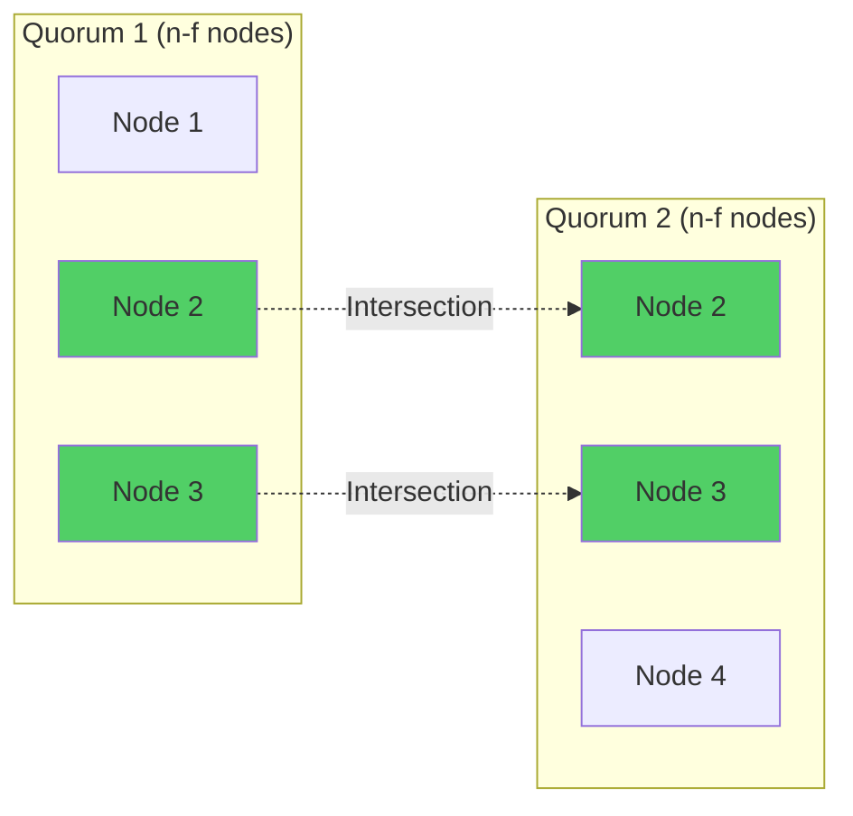

# Safety Properties in BFT Consensus

Safety properties specify what "bad things" must **never** happen in a consensus protocol, even in the presence of Byzantine failures. Safety violations are permanent and irreversible.

## Overview

In distributed systems, **safety** is a liveness property's complement:

- **Safety**: "Nothing bad ever happens" (bad states are unreachable)
- **Liveness**: "Something good eventually happens" (progress is eventually made)

Safety properties are **trace properties** - they can be violated by a finite execution trace. Once violated, a safety property cannot be restored.

**Fundamental Principle**: BFT consensus protocols must guarantee safety **always**, even during periods of asynchrony or when up to $f < n/3$ nodes are Byzantine.

## Core Safety Properties

### 1. Agreement (Consistency)

**Informal**: No two correct nodes decide on different values.

**Formal Definition**:
$$
\forall i, j \in \text{Correct} : \text{decided}(i) \land \text{decided}(j) \implies \text{value}(i) = \text{value}(j)
$$

Where:
- $\text{Correct}$ = set of non-Byzantine nodes
- $\text{decided}(i)$ = node $i$ has decided on a value
- $\text{value}(i)$ = the value node $i$ decided

**Importance**: Agreement is the core safety property. If violated, the system has split-brain - different nodes have inconsistent views of the system state.

**Example Violation**:
```
Node 1 decides: "Block A is committed"
Node 2 decides: "Block B is committed"
→ Safety violation! Irreversible inconsistency.
```

**How BFT Protocols Ensure Agreement:**
- Require quorums of size $\geq n - f$ (more than $\frac{2n}{3}$ nodes)
- Any two quorums intersect in at least $f + 1$ nodes
- At least one node in the intersection is honest
- Honest nodes never change their decision → prevents conflicting quorums



### 2. Validity (Integrity)

**Informal**: If all correct nodes propose the same value $v$, then only $v$ can be decided.

**Formal Definition**:
$$
\left(\forall i \in \text{Correct} : \text{proposed}(i, v)\right) \implies \left(\forall j \in \text{Correct} : \text{decided}(j) \implies \text{value}(j) = v\right)
$$

**Importance**: Prevents Byzantine nodes from forcing a decision on an arbitrary value that no correct node proposed.

**Example Violation**:
```
All correct nodes propose: "Value = 100"
Byzantine nodes inject: "Value = 999"
System decides: "Value = 999"
→ Validity violation! Byzantine nodes hijacked the decision.
```

**Stronger Variants:**

**External Validity**: The decided value must satisfy some application-specific predicate $P(v)$.
- Example: In blockchain, decided block must be structurally valid (correct signatures, valid transactions)

**Non-Triviality**: Cannot always decide the same predetermined value regardless of proposals.
- Prevents degenerate solutions like "always decide 0"

### 3. Integrity (No Duplication/Creation)

**Informal**: A correct node decides at most once, and only on a value that was actually proposed by some node.

**Formal Definition**:

**Uniqueness Part**:
$$
\text{decided}(i, v) \land \text{decided}(i, w) \implies v = w
$$

**Validity Part**:
$$
\text{decided}(i, v) \implies \exists j : \text{proposed}(j, v)
$$

**Importance**: Prevents nodes from spontaneously deciding multiple times or deciding on values that never existed.

**Example Violation**:
```
Node 1 first decides: "Commit block A"
Node 1 later decides: "Commit block B"
→ Integrity violation! Node changed its decision.
```

## Safety in Different Consensus Models

### Synchronous Systems

**Timing Assumption**: Message delivery bounds are known and respected.

**Safety Guarantee**: Can achieve safety **always**, even if timing assumptions are violated.

**Why**: Safety proofs don't rely on timing - even if messages are arbitrarily delayed, agreement cannot be violated (though liveness may be lost).

**Example**: If a decision was made with a quorum certificate, delayed messages cannot undo it.

### Asynchronous Systems

**Timing Assumption**: No bounds on message delays.

**Safety Guarantee**: Can achieve safety **always** (FLP impossibility is about liveness, not safety).

**Challenge**: Cannot distinguish slow nodes from crashed nodes, but this doesn't threaten safety.

**Example Protocol**: HoneyBadgerBFT maintains safety in fully asynchronous settings.

### Partially Synchronous Systems

**Timing Assumption**: Synchrony holds eventually after an unknown Global Stabilization Time (GST).

**Safety Guarantee**: Safety must hold **always**, even during periods of asynchrony.

**Liveness Guarantee**: Liveness holds only after GST.

**Example Protocols**: PBFT, HotStuff assume partial synchrony.

**Critical Design Principle**: Safety mechanisms (quorum certificates, agreement rules) must not depend on timing assumptions.

## Mathematical Foundations

### Quorum Intersection Theorem

For Byzantine quorums of size $Q \geq n - f$ where $f < \frac{n}{3}$:

**Theorem**: Any two quorums $Q_1$ and $Q_2$ intersect in at least $f + 1$ nodes.

**Proof**:
1. $|Q_1| \geq n - f$ and $|Q_2| \geq n - f$
2. By inclusion-exclusion: $|Q_1 \cap Q_2| \geq |Q_1| + |Q_2| - n$
3. $|Q_1 \cap Q_2| \geq (n - f) + (n - f) - n = n - 2f$
4. Since $f < \frac{n}{3}$, we have $n > 3f$, so $n - 2f > f$
5. Therefore $|Q_1 \cap Q_2| > f$, guaranteeing at least $f + 1$ nodes

**Implication**: At least one node in the intersection is honest, ensuring conflicting decisions cannot both gather quorum certificates.

### Common Knowledge and Safety

From Halpern-Moses knowledge framework [[halpern-moses-1990-knowledge|halpern-moses-1990-knowledge]]:

**Common Knowledge Requirement**: Agreement requires that all correct nodes achieve (approximate) common knowledge of the decided value.

**Challenge in Asynchronous Systems**: True common knowledge is unattainable.

**Practical Solution**: Protocols achieve "sufficiently strong" knowledge through quorum certificates:
- If $\geq n - f$ nodes acknowledge a value, every correct node knows a majority supports it
- Intersection property ensures no conflicting majority can exist

## Safety Violations and Prevention

### Potential Safety Violations

#### Double-Spend in Blockchain

**Scenario**: Two conflicting transactions both committed.

**Example**:
```
Transaction A: Alice pays Bob 10 BTC
Transaction B: Alice pays Carol 10 BTC (same input)
Both transactions committed → Safety violation
```

**Prevention**: Consensus ensures only one transaction per input can be decided.

#### Conflicting State Transitions

**Scenario**: Nodes diverge on state machine state.

**Example**:
```
Node 1 state: Account balance = 100
Node 2 state: Account balance = 50
→ Inconsistency violates agreement
```

**Prevention**: State machine replication with BFT consensus ensures all correct nodes execute the same sequence of operations.

### Defense Mechanisms

#### 1. Cryptographic Quorum Certificates

**Mechanism**: Collect $\geq n - f$ signed messages endorsing a value.

**Why It Works**:
- Byzantine nodes cannot forge honest nodes' signatures
- Honest nodes sign only once per round
- Certificate proves that a supermajority supports the value

**Example (HotStuff)**:
```
Quorum Certificate (QC) = {
  round: r,
  value: v,
  signatures: [sig_1, sig_2, ..., sig_{n-f}]
}
```

If a QC exists for value $v$ in round $r$, no conflicting QC for value $w \neq v$ can exist in the same round.

#### 2. View-Change Safety Rules

**Challenge**: When leader is suspected faulty, switching to new leader (view change) must preserve safety.

**Solution**: New leader must prove previous round's state via quorum certificates.

**Example (PBFT View Change)**:
```
New leader collects:
- Prepare certificates from prior view
- Ensures continuity: only repropose values with quorum support
```

**Safety Invariant**: View changes cannot allow conflicting values to gain quorum support.

#### 3. Lock-Based Mechanisms

**Mechanism**: Once a node votes for value $v$, it "locks" on $v$ and refuses to vote for conflicting values in lower rounds.

**Example (Tendermint/HotStuff)**:
```
if node is locked on value v at round r:
    refuse to vote for w ≠ v in round r' ≤ r
    can unlock only with quorum certificate for w at round r' > r
```

**Why It Works**: Ensures that if a quorum voted for $v$, no conflicting quorum can form in the same or earlier round.

## Safety Proofs for BFT Protocols

### Proof Structure (General Approach)

**Goal**: Show that if two correct nodes decide, they decide the same value.

**Proof by Contradiction**:
1. Assume two correct nodes decide different values $v$ and $w$ (where $v \neq w$)
2. Show that both must have obtained quorum certificates
3. Prove that quorum certificates must intersect in at least one honest node
4. Derive contradiction: honest node cannot support both $v$ and $w$
5. Conclude: agreement property holds

### Example: PBFT Safety Proof Sketch

**Claim**: If two correct nodes commit values in the same sequence number, they commit the same value.

**Proof Outline**:
1. A node commits only after receiving $2f + 1$ COMMIT messages for value $v$
2. Another node committing $w \neq v$ requires $2f + 1$ COMMIT messages for $w$
3. Two sets of $2f + 1$ nodes (out of $n = 3f + 1$) must intersect in at least $f + 1$ nodes
4. Since at most $f$ nodes are Byzantine, at least one honest node is in the intersection
5. Honest nodes send COMMIT for only one value per sequence number
6. Contradiction: honest node cannot have sent COMMIT for both $v$ and $w$
7. Therefore $v = w$

**See [[bft-consensus-analysis/bft-consensus/protocols/pbft|PBFT]] for full protocol details.**

## Temporal Logic Specification

Using Linear Temporal Logic (LTL) to express safety:

### Agreement Property

$$
\boxed{\square} \left( \text{Decided}(i, v) \land \text{Decided}(j, w) \implies v = w \right)
$$

Where $\boxed{\square}$ means "always" (in all future states).

### Integrity Property

$$
\boxed{\square} \left( \text{Decided}(i, v) \implies \bigvee_{j} \text{Proposed}(j, v) \right)
$$

This states: "Always, if a node decides $v$, then some node must have proposed $v$."

**See [[bft-consensus-analysis/logic-models/temporal-logic|Expressing Safety & Liveness]] for detailed treatment of formal specifications.**

## Safety vs. Liveness Trade-offs

### CAP Theorem Perspective

In the face of network **Partitions**:
- **Consistency** (Safety): Sacrifice liveness, refuse to make progress to avoid inconsistency
- **Availability** (Liveness): Sacrifice safety, allow potentially inconsistent decisions to maintain progress

**BFT Consensus Choice**: Prioritize **safety** over liveness.
- During asynchrony, the protocol may stall (liveness failure)
- But safety (agreement) is **never** violated

### Practical Implications

**Design Philosophy**: "It's better to make no decision than the wrong decision."

**Example Scenarios**:

| Situation | BFT Response | Safety | Liveness |
|-----------|-------------|--------|----------|
| Network partition | Quorum unavailable, nodes wait | ✅ Preserved | ❌ Blocked |
| f Byzantine nodes | Quorum still achievable | ✅ Preserved | ✅ Maintained |
| f+1 Byzantine nodes | Quorum may form incorrectly | ❌ **Violated** | ✅ Maintained |

**Threshold Importance**: Safety holds **if and only if** $f < \frac{n}{3}$.

## Monitoring and Detecting Safety Violations

### Runtime Monitoring

**Approach**: Instrument nodes to detect inconsistencies.

**Techniques**:
1. **Quorum Certificate Validation**: Verify all signatures in certificates
2. **State Comparison**: Periodically compare state hashes across nodes
3. **Audit Logs**: Record all decisions with cryptographic proofs

**Example (Blockchain)**:
```python
def monitor_safety(node1_chain, node2_chain):
    for height in range(min(len(node1_chain), len(node2_chain))):
        if node1_chain[height] != node2_chain[height]:
            raise SafetyViolation(f"Fork detected at height {height}")
```

### Post-Hoc Analysis

**Approach**: Analyze execution logs to verify safety properties held.

**Tools**:
- **Model Checkers**: TLA+, Spin can verify safety on execution traces
- **Formal Verification**: Coq, Isabelle/HOL can prove safety mechanically

**See [[bft-consensus-analysis/logic-models/formal-verification|Formal Verification Techniques]] for verification techniques.**

## See Also

- [[bft-consensus-analysis/bft-consensus/properties/liveness-properties|Liveness]] - Complementary progress guarantees
- [[bft-consensus-analysis/bft-consensus/fundamentals|BFT Fundamentals]] - Core BFT concepts
- [[bft-consensus-analysis/bft-consensus/byzantine-failures|Byzantine Failures]] - Fault model that safety must tolerate
- [[bft-consensus-analysis/bft-consensus/properties/fault-tolerance-threshold|Fault Tolerance Threshold: Why f < n/3 for Byzantine Failures]] - Why $f < n/3$ is necessary
- [[bft-consensus-analysis/bft-consensus/protocols/pbft|PBFT]] - Safety mechanisms in PBFT
- [[bft-consensus-analysis/bft-consensus/protocols/hotstuff|HotStuff]] - Modern safety-preserving optimizations
- [[bft-consensus-analysis/logic-models/temporal-logic|Expressing Safety & Liveness]] - Formal specification of safety properties

## Further Reading

- **Byzantine Generals**: [[lamport-shostak-pease-1982-byzantine|lamport-shostak-pease-1982-byzantine]]
- **PBFT Safety**: [[castro-liskov-1999-pbft|castro-liskov-1999-pbft]]
- **Textbook Treatment**: [[cachin-guerraoui-rodrigues-2011-textbook|cachin-guerraoui-rodrigues-2011-textbook]]
- **Knowledge Foundations**: [[halpern-moses-1990-knowledge|halpern-moses-1990-knowledge]]

---

**Self-Assessment Questions:**

1. Why is agreement considered a safety property while termination is a liveness property?
2. Prove that two Byzantine quorums of size $n - f$ (with $n = 7, f = 2$) must intersect in at least $f + 1$ nodes.
3. In partial synchrony, can safety be violated during periods of asynchrony? Why or why not?
4. Explain why a node that locks on value $v$ in round $r$ refuses to vote for $w \neq v$ in the same round.
5. If a BFT protocol violates safety, can it be recovered? Explain your reasoning.
