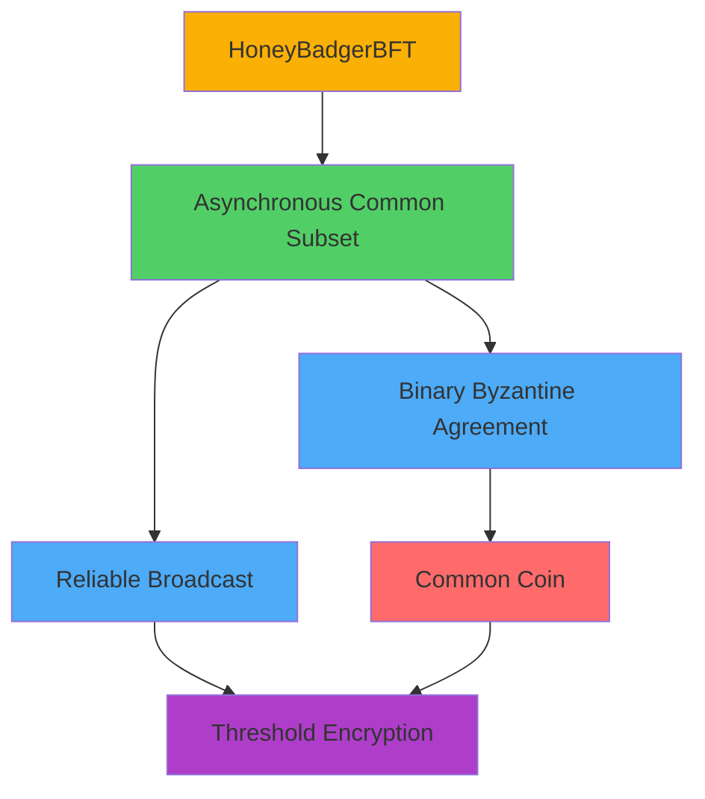
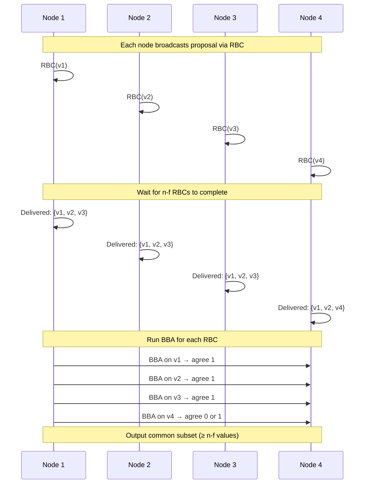

# HoneyBadgerBFT: Asynchronous Byzantine Consensus

HoneyBadgerBFT is the first practical **fully asynchronous** Byzantine fault-tolerant consensus protocol that provides **guaranteed liveness** without any timing assumptions. Introduced by Miller et al. in 2016, it achieves consensus even in worst-case network conditions.

## Overview

**Key Innovation**: HoneyBadgerBFT achieves consensus in a fully asynchronous network model using **randomization** and **threshold cryptography**, circumventing the FLP impossibility result.

**Model**:
- **Synchrony**: Fully asynchronous (no timing assumptions)
- **Fault Tolerance**: Tolerates $f < \frac{n}{3}$ Byzantine failures with $n = 3f + 1$ nodes
- **Liveness**: Probabilistic termination (expected constant rounds)
- **Communication**: Authenticated channels with threshold encryption

**Name Origin**: "Honey Badger don't care" - the protocol continues making progress regardless of network conditions, malicious nodes, or timing.

## Why Asynchronous Consensus Is Hard

### The FLP Impossibility

Fischer, Lynch, and Paterson (1985) proved that **deterministic consensus is impossible** in asynchronous systems with even one crash failure.

**Implication**: Cannot achieve consensus without:
1. **Timing assumptions** (partial synchrony) - used by PBFT, HotStuff
2. **Randomization** - used by HoneyBadgerBFT

**HoneyBadgerBFT's Approach**: Use **common coin** (shared randomness) to break symmetry and achieve probabilistic termination.

**See [[bft-consensus-analysis/bft-consensus/properties/liveness-properties|Liveness]] for FLP discussion.**

## Protocol Architecture

HoneyBadgerBFT is built from three cryptographic primitives:



### 1. Reliable Broadcast (RBC)

**Purpose**: Each node broadcasts its proposed value reliably.

**Properties**:
- **Validity**: If honest sender broadcasts $m$, all honest nodes deliver $m$
- **Agreement**: If any honest node delivers $m$, all honest nodes deliver $m$
- **Integrity**: Each message is delivered at most once, and only if it was sent

**Mechanism**: Erasure coding + quorum-based validation
- Sender encodes message with Reed-Solomon coding (tolerates $f$ missing pieces)
- Sender sends shards to all nodes
- Nodes exchange validation messages when they receive enough shards
- Deliver when $2f + 1$ nodes validate

**See [[bft-consensus-analysis/provable-broadcast/reliable-broadcast|Reliable Broadcast]] and [[bft-consensus-analysis/provable-broadcast/provable-broadcast|Provable Broadcast Mechanisms]] for details.**

### 2. Binary Byzantine Agreement (BBA)

**Purpose**: Agree on a single bit (0 or 1) in an asynchronous setting.

**Key Challenge**: Without synchrony, cannot distinguish slow nodes from crashed nodes.

**Solution**: Use **common coin** to break ties when nodes are split between 0 and 1.

**Protocol Sketch**:
1. Each node proposes a bit (0 or 1)
2. Nodes exchange votes via reliable broadcast
3. If $\geq n - f$ nodes vote for same bit $b$, decide $b$
4. If votes are split, use common coin $c$ and vote for $c$ in next round
5. Repeat until agreement is reached

**Termination**: Expected $O(1)$ rounds (probabilistic).

### 3. Common Coin (Shared Randomness)

**Purpose**: Generate unpredictable shared randomness that Byzantine nodes cannot bias.

**Mechanism**: **Threshold signatures** (e.g., BLS threshold signatures)
- Each node holds a **share** of a secret key
- To generate coin for round $r$, each node signs $r$ with its share
- Combine $f + 1$ signature shares → full signature (deterministic and unpredictable)
- Use signature to determine coin value (0 or 1)

**Key Property**: Byzantine nodes cannot predict or bias the coin value (as long as at least one honest node's share is used).

**Cryptographic Assumption**: Requires threshold cryptographic setup (e.g., distributed key generation).

### 4. Asynchronous Common Subset (ACS)

**Purpose**: Agreement on a common subset of at least $n - f$ proposed values.

**Problem**: In asynchronous networks, cannot wait for all $n$ proposals (some might be Byzantine and never send).

**Solution**:
1. Each node $i$ initiates **Reliable Broadcast** of its proposal $v_i$
2. Each node waits until $n - f$ RBCs complete (delivers $n - f$ values)
3. Each node runs **Binary Byzantine Agreement** for each RBC:
   - Vote 1 if RBC delivered, 0 otherwise
4. Output the subset of proposals with BBA output = 1

**Guarantee**: All honest nodes agree on the same subset of $\geq n - f$ proposals.



## Main Protocol: Batch Consensus

HoneyBadgerBFT runs ACS repeatedly to agree on batches of transactions.

**Per Epoch**:
1. **Input**: Each node has a set of pending transactions
2. **Propose**: Node buffers transactions and proposes batch when ready
3. **ACS**: Run Asynchronous Common Subset to agree on $\geq n - f$ batches
4. **Output**: Combine agreed batches, order them (e.g., by hash), output transactions
5. **Next Epoch**: Proceed to next epoch with remaining transactions

**Transaction Ordering**:
- Deterministic ordering within each epoch (e.g., sort by cryptographic hash)
- Epochs are sequential (epoch $i$ before epoch $i+1$)

**Throughput Optimization**: Batch multiple transactions per proposal to amortize consensus cost.

## Safety Guarantees

**Agreement**: All honest nodes output the same sequence of transaction batches.

**Proof Sketch**:
1. ACS ensures all honest nodes agree on the same subset of proposals
2. Deterministic ordering ensures same transaction sequence
3. Epochs are totally ordered
4. **Therefore**: All honest nodes execute the same sequence of transactions

**Validity**: If an honest node proposes a transaction, it is eventually included in the output.

**Proof**: 
- Honest node's RBC will eventually be delivered (RBC validity)
- At least one honest node will vote 1 for this RBC in BBA
- BBA ensures agreement, so all nodes will eventually include this proposal

**See [[bft-consensus-analysis/bft-consensus/properties/safety-properties|Safety]] for general safety framework.**

## Liveness Guarantees

**Termination**: With probability 1, all honest nodes eventually decide.

**Expected Time**: $O(1)$ rounds (constant expected number of asynchronous rounds).

**Why Liveness Holds**:
1. **No timing assumptions**: Protocol doesn't rely on synchrony
2. **Randomization**: Common coin breaks deadlock when nodes are split
3. **ACS completes**: Once $n - f$ RBCs complete, ACS makes progress
4. **BBA terminates**: Expected constant rounds due to random coin

**Comparison**:
- **PBFT**: Liveness only after GST (eventual synchrony)
- **HoneyBadgerBFT**: Liveness **always** (even in adversarial networks)

**Trade-off**: Guaranteed liveness vs. higher latency variance.

**See [[bft-consensus-analysis/bft-consensus/properties/liveness-properties|Liveness]] for asynchronous liveness discussion.**

## Message Complexity

### Per ACS Instance

**Reliable Broadcast** (per node):
- Erasure coding: $O(n^2)$ shards sent
- Validation messages: $O(n^2)$ exchanges

**Binary Byzantine Agreement** (per proposal):
- Each round: $O(n^2)$ messages
- Expected $O(1)$ rounds
- Total per BBA: $O(n^2)$

**Total for ACS**: $O(n^3)$ messages (with $n$ BBAs)

**Optimization**: Batching transactions amortizes this cost.

**Example**:
```
n = 100 nodes, batch size = 10,000 transactions
Total messages per ACS: ~1,000,000 (O(n^3))
Effective cost per transaction: ~100 messages (amortized)
```

### Comparison

| Protocol | Message Complexity | Amortized (Batching) |
|----------|-------------------|---------------------|
| PBFT | $O(n^2)$ per request | N/A |
| HotStuff | $O(n)$ per request | N/A |
| HoneyBadgerBFT | $O(n^3)$ per ACS | $O(n^3 / B)$ per tx |

Where $B$ = batch size.

## Cryptographic Requirements

### Threshold Cryptography

**Setup**: Distributed Key Generation (DKG) protocol
- Generates public key and private key shares for each node
- Threshold $t = f + 1$ (any $f + 1$ shares can reconstruct)

**Operations**:
- **Threshold Encryption**: Encrypt batch proposals for privacy
- **Threshold Signatures**: Generate common coin

**Security Assumption**: Discrete log hardness (e.g., BLS signatures on elliptic curves)

**Overhead**: Cryptographic operations add computational cost (but enable asynchrony).

### Erasure Coding

**Purpose**: Reliable broadcast with $f$ Byzantine nodes.

**Mechanism**: Reed-Solomon encoding
- Encode message into $n$ shards
- Any $n - 2f$ shards can reconstruct original message
- Byzantine nodes can withhold up to $f$ shards

**Benefit**: Reduces communication compared to sending full message to all nodes.

## Performance Characteristics

### Throughput

**Original Paper Results** (Miller et al., 2016):
- ~20,000 transactions/second (with batching)
- Competitive with PBFT in good network conditions
- **Superior to PBFT** in adversarial networks (PBFT stalls, HoneyBadgerBFT continues)

**Scalability**: $O(n^3)$ limits scalability; practical for $n < 100$.

### Latency

**Expected Latency**: Variable (depends on network conditions)
- **Good network**: Comparable to partially synchronous protocols
- **Bad network**: Higher latency but **guaranteed progress**

**Latency Variance**: Higher than PBFT/HotStuff due to asynchrony and randomization.

**Trade-off**: Robustness (liveness) vs. predictable latency.

## Use Cases and Deployments

### Ideal Scenarios

1. **Adversarial Networks**: Where timing assumptions are unreliable (e.g., global WANs, censored networks)
2. **Permissioned Blockchains**: Where threshold crypto setup is feasible
3. **High-Value Transactions**: Where robustness is more important than low latency

### Real-World Deployments

- **HoneyBadgerBFT Library**: Open-source implementation (Python, Rust)
- **Research Prototypes**: Various blockchain projects experimenting with async BFT
- **Not Mainstream**: Higher complexity and latency variance limit adoption compared to PBFT/HotStuff

### Limitations for Production

1. **Setup Complexity**: DKG for threshold cryptography is complex
2. **Latency Variance**: Unpredictable latency not ideal for user-facing apps
3. **Message Overhead**: $O(n^3)$ limits scalability
4. **Cryptographic Assumptions**: Threshold crypto introduces additional security assumptions

## Variants and Optimizations

### BEAT (2018)

**Improvement**: Reduces message complexity from $O(n^3)$ to $O(n^2)$ using threshold encryption more efficiently.

### Dumbo (2020)

**Improvements**:
- Multi-valued BBA (agree on values, not just bits)
- Reduces number of BBAs needed
- Better throughput and latency

### DAG-Based Async BFT

**Approach**: Use Directed Acyclic Graph (DAG) structure for consensus
- Each node creates vertices containing transactions
- Vertices reference prior vertices (DAG edges)
- Asynchronous agreement on DAG structure

**Examples**: DAG-Rider, Tusk

**See [[bft-consensus-analysis/integration/case-studies/dag-rider-analysis|DAG-Based BFT Analysis]] case study.**

## Comparison to PBFT and HotStuff

| Aspect | PBFT | HoneyBadgerBFT | HotStuff |
|--------|------|----------------|----------|
| **Synchrony Model** | Partial | None (fully async) | Partial |
| **Liveness** | After GST | Always (probabilistic) | After GST |
| **Message Complexity** | $O(n^2)$ | $O(n^3)$ per ACS | $O(n)$ |
| **Latency (Normal)** | 3 rounds (predictable) | Variable (random) | 3 rounds (predictable) |
| **Latency (Adversarial)** | Can stall | Continues (higher variance) | Can stall |
| **Cryptography** | Signatures | Threshold crypto | Threshold sigs (optional) |
| **Setup** | Simple | DKG required | Simple |
| **Best For** | Fast LANs, predictable networks | Adversarial networks, WANs | Large-scale, efficient |

**See [[bft-consensus-analysis/bft-consensus/protocols/protocol-comparison|Protocol Comparison]] for detailed analysis.**

## Theoretical Significance

### Circumventing FLP

**FLP Impossibility**: Deterministic consensus impossible in asynchronous systems.

**HoneyBadgerBFT**: Uses **randomization** (common coin) to achieve probabilistic termination.

**Key Insight**: Random coin provides enough unpredictability to break deadlock, while threshold crypto ensures Byzantine nodes cannot bias randomness.

### Optimal Resilience

**Resilience**: $f < \frac{n}{3}$ is **optimal** for Byzantine consensus (matching synchronous and partially synchronous bounds).

**HoneyBadgerBFT**: Achieves optimal resilience in the strongest adversary model (fully asynchronous).

### Contribution to Consensus Theory

- **Proof of concept**: Async BFT can be practical (not just theoretical)
- **Cryptographic approach**: Threshold crypto as a tool for distributed systems
- **Asynchronous composability**: Building blocks (RBC, BBA, ACS) can be reused

## See Also

- [[bft-consensus-analysis/bft-consensus/protocols/pbft|PBFT]] - Partially synchronous alternative
- [[bft-consensus-analysis/bft-consensus/protocols/hotstuff|HotStuff]] - Modern linear-complexity protocol
- [[bft-consensus-analysis/bft-consensus/protocols/protocol-comparison|Protocol Comparison]] - Side-by-side comparison
- [[bft-consensus-analysis/provable-broadcast/reliable-broadcast|Reliable Broadcast]] - Building block for HoneyBadgerBFT
- [[bft-consensus-analysis/provable-broadcast/provable-broadcast|Provable Broadcast Mechanisms]] - Broadcast with delivery proofs
- [[bft-consensus-analysis/bft-consensus/properties/liveness-properties|Liveness]] - How randomization enables liveness
- [[bft-consensus-analysis/integration/case-studies/dag-rider-analysis|DAG-Based BFT Analysis]] - Modern DAG-based async BFT (case study)

## Further Reading

- **Original Paper**: [[miller-2016-honeybadger|miller-2016-honeybadger]]
- **Survey**: [[comprehensive-bft-survey-2022|comprehensive-bft-survey-2022]]
- **Code**: [[github-honeybadgerbft|github-honeybadgerbft]]

---

**Self-Assessment Questions:**

1. Why does HoneyBadgerBFT use randomization? How does it circumvent the FLP impossibility?
2. Explain the role of threshold cryptography in generating the common coin.
3. Why does Asynchronous Common Subset (ACS) wait for $n - f$ proposals instead of all $n$?
4. Compare the liveness guarantees of HoneyBadgerBFT vs. PBFT under network partition.
5. What are the trade-offs of using HoneyBadgerBFT vs. HotStuff in a blockchain system?
