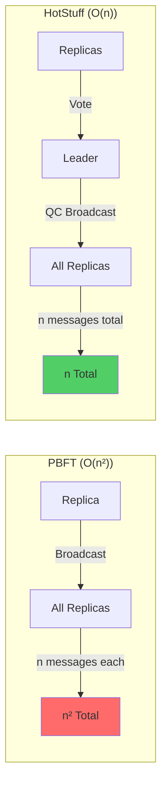
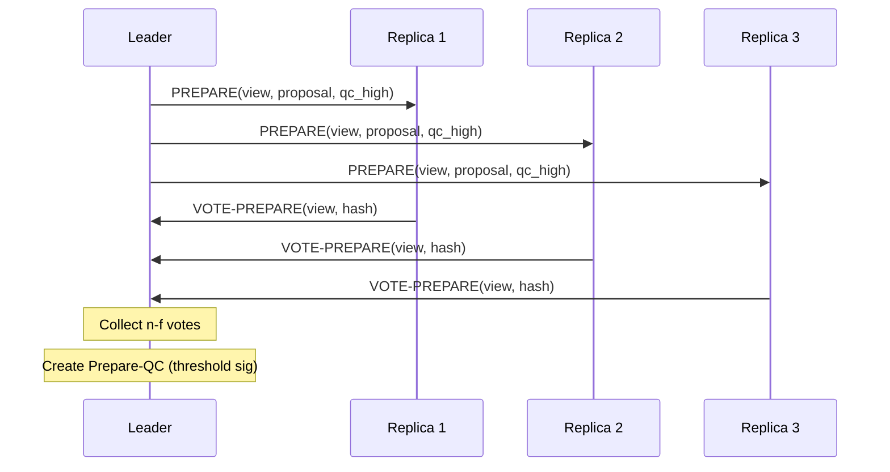
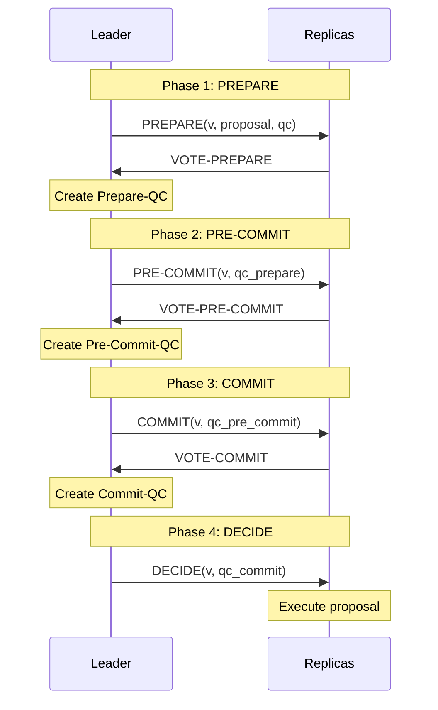

# HotStuff: Linear-Complexity BFT Consensus

HotStuff is a modern Byzantine fault-tolerant consensus protocol that achieves **linear message complexity** ($O(n)$ per round) and enables efficient **pipelining** for high throughput. Introduced in 2019, it's the foundation for blockchain systems like Facebook's Diem (formerly Libra).

## Overview

**Key Innovation**: HotStuff achieves the same safety and liveness guarantees as PBFT with **linear communication complexity** ($O(n)$ vs PBFT's $O(n^2)$) using threshold signatures.

**Model**:
- **Synchrony**: Partially synchronous (assumes eventual synchrony after GST)
- **Fault Tolerance**: Tolerates $f < \frac{n}{3}$ Byzantine failures with $n = 3f + 1$ replicas
- **Communication**: $O(n)$ messages per round (vs $O(n^2)$ in PBFT)
- **Latency**: 3-phase commit with pipelining for high throughput

**Impact**: Enables BFT consensus at scale (hundreds to thousands of nodes).

## Why Linear Complexity Matters

### PBFT's Quadratic Bottleneck

**PBFT Message Pattern**:
- **Prepare phase**: Each of $n$ replicas broadcasts to $n-1$ others = $O(n^2)$ messages
- **Commit phase**: Each of $n$ replicas broadcasts to $n-1$ others = $O(n^2)$ messages

**Scaling Problem**:
```
n = 10 nodes:  O(100) messages
n = 100 nodes: O(10,000) messages
n = 1000 nodes: O(1,000,000) messages per decision
```

**Bottleneck**: Quadratic growth makes PBFT impractical for large validator sets.

### HotStuff's Linear Solution

**Key Technique**: **Leader collects votes** and creates **Quorum Certificate (QC)** with threshold signature.

**Message Pattern**:
- **Vote phase**: $n-1$ replicas send vote to leader = $O(n)$ messages
- **Leader broadcasts**: Leader sends QC to all replicas = $O(n)$ messages

**Scaling**:
```
n = 10 nodes:  O(10) messages
n = 100 nodes: O(100) messages
n = 1000 nodes: O(1,000) messages per decision
```

**Improvement**: ~1000x fewer messages for $n = 1000$ compared to PBFT!



## Core Concepts

### Quorum Certificate (QC)

**Definition**: A **Quorum Certificate** is cryptographic proof that at least $n - f$ replicas voted for a specific value.

**Structure**:
```
QC = {
    type: "prepare" | "pre-commit" | "commit",
    view: v,
    node: hash(proposal),
    signature: threshold_signature
}
```

**Properties**:
- **Compact**: Single aggregated signature (vs $n$ individual signatures)
- **Verifiable**: Anyone can verify QC with public key
- **Non-forgeable**: Requires $\geq n - f$ honest replica signatures

**Cryptography**: Uses **threshold signatures** (e.g., BLS signatures)
- Each replica holds a key share
- $n - f$ signature shares combine into a single aggregate signature
- Aggregate signature proves quorum support

### View-Based Leader Rotation

**View**: A period during which a specific leader proposes values.

**Leader Selection**: Deterministic rotation (e.g., leader = view mod $n$)

**View Change**: If progress stalls (timeout), replicas advance to next view with new leader.

**Safety**: View changes preserve safety via QC chaining.

## Three-Phase Commit Protocol

HotStuff uses a **three-phase** commit protocol, similar to PBFT but optimized:

### Phase 1: PREPARE

**Leader proposes**:
1. Leader broadcasts `PREPARE(view, proposal, qc_high)` to all replicas
   - `qc_high` = highest QC from previous view (ensures safety)

**Replicas validate and vote**:
2. Replica validates proposal (correct view, extends from `qc_high`, etc.)
3. Replica sends `VOTE-PREPARE(view, hash(proposal))` **to leader** (not broadcast!)

**Leader creates Prepare-QC**:
4. Leader collects $n - f$ votes
5. Leader creates **Prepare-QC** (threshold signature on proposal)

**Outcome**: Proposal is **prepared** (locked at this view).



### Phase 2: PRE-COMMIT

**Leader advances**:
1. Leader broadcasts `PRE-COMMIT(view, qc_prepare)` to all replicas

**Replicas validate and vote**:
2. Replica validates `qc_prepare`
3. Replica sends `VOTE-PRE-COMMIT(view, hash)` **to leader**

**Leader creates Pre-Commit-QC**:
4. Leader collects $n - f$ votes
5. Leader creates **Pre-Commit-QC**

**Outcome**: Proposal is **pre-committed** (two-chain lock).

### Phase 3: COMMIT

**Leader finalizes**:
1. Leader broadcasts `COMMIT(view, qc_pre_commit)` to all replicas

**Replicas validate and vote**:
2. Replica validates `qc_pre_commit`
3. Replica sends `VOTE-COMMIT(view, hash)` **to leader**

**Leader creates Commit-QC**:
4. Leader collects $n - f$ votes
5. Leader creates **Commit-QC**

**Outcome**: Proposal is **committed** (three-chain lock, safe to execute).

### Phase 4: DECIDE

**Leader notifies**:
1. Leader broadcasts `DECIDE(view, qc_commit)` to all replicas

**Replicas execute**:
2. Replicas receive `qc_commit` and **execute** the committed proposal
3. Update state machine
4. Send response to client

**Outcome**: Proposal is **decided** (executed).



## Pipelining for High Throughput

**Key Optimization**: Overlap multiple proposals to hide latency.

**Basic Idea**: While current proposal is in Commit phase, start Prepare phase for next proposal.

**Pipeline Depth**: Multiple proposals in flight simultaneously.

**Example (3 proposals)**:
```
Time 1: Proposal A - PREPARE
Time 2: Proposal A - PRE-COMMIT,  Proposal B - PREPARE
Time 3: Proposal A - COMMIT,      Proposal B - PRE-COMMIT,  Proposal C - PREPARE
Time 4: Proposal A - DECIDE,      Proposal B - COMMIT,      Proposal C - PRE-COMMIT, ...
```

**Throughput**: With pipelining, can commit a new proposal **every round** (vs every 3 rounds).

**Effective Latency**: Amortized 1 round per commit (vs 3 rounds for a single proposal).

**View Change Impact**: Pipeline must be drained and rebuilt after view change.

## Safety via QC Chaining

**Safety Mechanism**: **Three-chain rule** - proposal is committed when it has three consecutive QCs.

**Chain Structure**:
```
Block n-2  →  Block n-1  →  Block n
  (Prepare-QC) (Pre-Commit-QC) (Commit-QC)
```

**Safety Guarantee**: Once a proposal has a Commit-QC, no conflicting proposal can be committed in any future view.

**Proof Sketch**:
1. For a conflicting proposal to commit, it needs a three-chain in a higher view
2. View change protocol ensures new leader locks on the highest Prepare-QC
3. Any new proposal must extend from locked proposal (cannot conflict)
4. **Therefore**: Committed proposals are immutable

**Comparison to PBFT**: HotStuff's three-phase structure is similar, but:
- PBFT: Phases use all-to-all broadcast ($O(n^2)$)
- HotStuff: Phases use leader aggregation ($O(n)$)

**See [[bft-consensus-analysis/bft-consensus/properties/safety-properties|Safety]] for general safety framework.**

## Liveness via View Changes

**Trigger**: Replica advances to new view if timeout expires without progress.

**View Change Protocol**:

1. **Timeout**: Replica suspects current leader is faulty
2. **Advance View**: Replica increments view number, new leader = (view mod $n$)
3. **Send NEW-VIEW**: Replica sends `NEW-VIEW(view, qc_high)` to new leader
   - `qc_high` = highest Prepare-QC the replica knows
4. **Leader Aggregates**: New leader waits for $n - f$ `NEW-VIEW` messages
5. **Leader Proposes**: New leader creates aggregated QC and proposes in new view

**Safety Preservation**: New leader's proposal must extend from `qc_high` (highest locked proposal).

**Liveness Guarantee**: After GST, timeouts are accurate, and an honest leader eventually makes progress.

**Expected View Changes**: At most $f$ (until an honest leader is elected).

**See [[bft-consensus-analysis/bft-consensus/properties/liveness-properties|Liveness]] for liveness under partial synchrony.**

## Message Complexity Analysis

### Normal Case (Per Round)

**Leader → Replicas**: 1 message × $n$ recipients = $O(n)$

**Replicas → Leader**: $n - 1$ votes to leader = $O(n)$

**Total per phase**: $O(n)$

**Total for 3 phases**: $3 \times O(n) = O(n)$

### View Change

**Replicas → New Leader**: $n - 1$ `NEW-VIEW` messages = $O(n)$

**New Leader → Replicas**: 1 aggregated QC to $n$ replicas = $O(n)$

**Total per view change**: $O(n)$ (vs $O(n^2)$ in PBFT)

### Comparison

| Protocol | Normal Case | View Change | Pipelined Throughput |
|----------|-------------|-------------|---------------------|
| PBFT | $O(n^2)$ | $O(n^2)$ | Low (no pipelining) |
| HotStuff | $O(n)$ | $O(n)$ | High (overlapping proposals) |
| HoneyBadgerBFT | $O(n^3)$ per ACS | N/A (async) | Moderate (batching) |

## Cryptographic Requirements

### Threshold Signatures

**Purpose**: Aggregate $n - f$ individual signatures into a single compact signature.

**Mechanism**: BLS (Boneh-Lynn-Shacham) signatures
- **Setup**: Distributed Key Generation (DKG) produces public key and key shares
- **Sign**: Each replica signs with its key share
- **Aggregate**: Combine $n - f$ signature shares → single signature
- **Verify**: Verify aggregate signature with public key

**Benefits**:
- **Compact QCs**: Single signature instead of $n$ signatures
- **Linear Communication**: Leader sends one aggregate signature, not $n$ signatures

**Overhead**: DKG setup, signature aggregation computation.

### Optional: Threshold Encryption

**Use Case**: Leader election privacy (prevent adversary from targeting next leader).

**Mechanism**: Encrypt future leader identity, decrypt only when needed.

**Trade-off**: Additional complexity for enhanced security.

## Performance Characteristics

### Throughput

**Theoretical**: With pipelining, can commit 1 proposal per round.

**Practical**: Tens of thousands of transactions per second (with batching).

**Scalability**: Linear complexity enables large validator sets ($n = 100$ to $n = 1000+$).

### Latency

**Normal Case**: 3 network delays (one per phase) + cryptographic operations.

**Pipelined**: Amortized 1 network delay per commit (steady state).

**View Change**: Additional latency (timeout + new leader election).

**Comparison**:
- **Similar to PBFT**: Both have 3-phase commit
- **Better than PBFT**: Pipelining reduces amortized latency
- **More predictable than HoneyBadgerBFT**: Deterministic phases (no randomization)

## Real-World Deployments

### Facebook Diem (Libra)

**Context**: Cryptocurrency project (discontinued but influential).

**Protocol**: DiemBFT (based on HotStuff).

**Modifications**:
- Pacemaker (heartbeat mechanism for view changes)
- Mempool for transaction ordering
- Additional optimizations for global deployment

### Other Deployments

- **Casper FFG (Ethereum)**: Inspired by HotStuff's finality gadget
- **Tendermint**: Simplified variant of HotStuff structure
- **Research Prototypes**: Many blockchain projects exploring HotStuff variants

## Variants and Optimizations

### Chained HotStuff

**Optimization**: Combine phases more efficiently by chaining QCs.

**Mechanism**: Each new proposal includes previous proposal's QC, implicitly advancing phases.

**Benefit**: Reduces message rounds while maintaining safety.

### Fast-HotStuff

**Optimization**: Optimistic fast path with 2 phases (instead of 3).

**Condition**: Works when network is synchronous and leader is honest.

**Fallback**: Revert to 3-phase protocol if fast path fails.

### Responsive HotStuff

**Goal**: Commit latency responsive to actual network delay (not timeout).

**Mechanism**: Don't wait for timeout; proceed as fast as network allows.

**Benefit**: Lower latency in good network conditions.

## Limitations

1. **Partial Synchrony Assumption**: Liveness requires eventual synchrony (like PBFT)
2. **Threshold Crypto Setup**: DKG is complex (though one-time per epoch)
3. **View Change Overhead**: Still requires timeout-based leader rotation
4. **Leader Bottleneck**: Leader processes all votes (can become bottleneck at extreme scale)

## Comparison to PBFT and HoneyBadgerBFT

| Aspect | PBFT | HotStuff | HoneyBadgerBFT |
|--------|------|----------|----------------|
| **Synchrony** | Partial | Partial | None (async) |
| **Message Complexity** | $O(n^2)$ | $O(n)$ | $O(n^3)$ per ACS |
| **View Change** | $O(n^2)$ | $O(n)$ | N/A |
| **Pipelining** | No | Yes | Via batching |
| **Throughput** | Moderate | High | Moderate-High |
| **Latency (Normal)** | 3 rounds | 3 rounds (amortized 1 with pipelining) | Variable (async) |
| **Scalability** | n < 20 | n < 1000 | n < 100 |
| **Cryptography** | Signatures | Threshold signatures | Threshold crypto + erasure coding |
| **Best For** | Small clusters, proven stability | Large-scale blockchains, high throughput | Adversarial networks, no timing assumptions |

**See [[bft-consensus-analysis/bft-consensus/protocols/protocol-comparison|Protocol Comparison]] for detailed analysis.**

## Theoretical Significance

### Optimal Communication Complexity

**Lower Bound**: Any BFT protocol requires $\Omega(n)$ messages (every replica must receive at least one message).

**HotStuff**: Achieves $O(n)$, matching the lower bound!

**Implication**: HotStuff is **communication-optimal** for leader-based BFT consensus.

### Responsive Safety

**Property**: Safety holds immediately (no waiting for timeouts).

**HotStuff**: Commits are safe as soon as QC is formed (even if network is asynchronous).

**Liveness**: Requires eventual synchrony (like PBFT).

## See Also

- [[bft-consensus-analysis/bft-consensus/protocols/pbft|PBFT]] - Foundational partially synchronous protocol
- [[bft-consensus-analysis/bft-consensus/protocols/honeybadger-bft|HoneyBadgerBFT]] - Asynchronous alternative
- [[bft-consensus-analysis/bft-consensus/protocols/protocol-comparison|Protocol Comparison]] - Side-by-side comparison
- [[bft-consensus-analysis/bft-consensus/properties/safety-properties|Safety]] - Safety via QC chaining
- [[bft-consensus-analysis/bft-consensus/properties/liveness-properties|Liveness]] - Liveness under partial synchrony
- [[bft-consensus-analysis/bft-consensus/fundamentals|BFT Fundamentals]] - BFT consensus foundations

## Further Reading

- **Original Paper**: [[yin-2019-hotstuff|yin-2019-hotstuff]]
- **Survey**: [[comprehensive-bft-survey-2022|comprehensive-bft-survey-2022]]
- **Code**: [[github-hotstuff|github-hotstuff]]

---

**Self-Assessment Questions:**

1. Why does HotStuff achieve $O(n)$ message complexity while PBFT requires $O(n^2)$?
2. Explain the three-chain rule and why it ensures safety.
3. How does pipelining improve throughput in HotStuff?
4. What is the role of threshold signatures in creating Quorum Certificates?
5. Compare the liveness guarantees of HotStuff vs. HoneyBadgerBFT under network partition.
