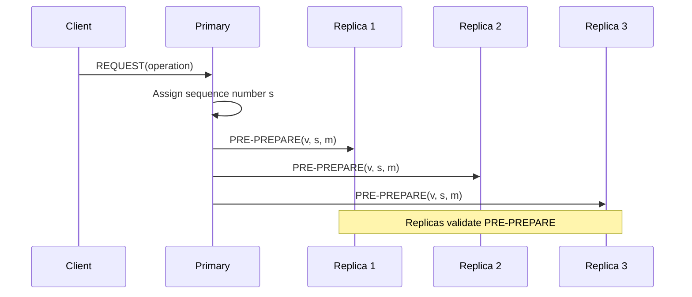
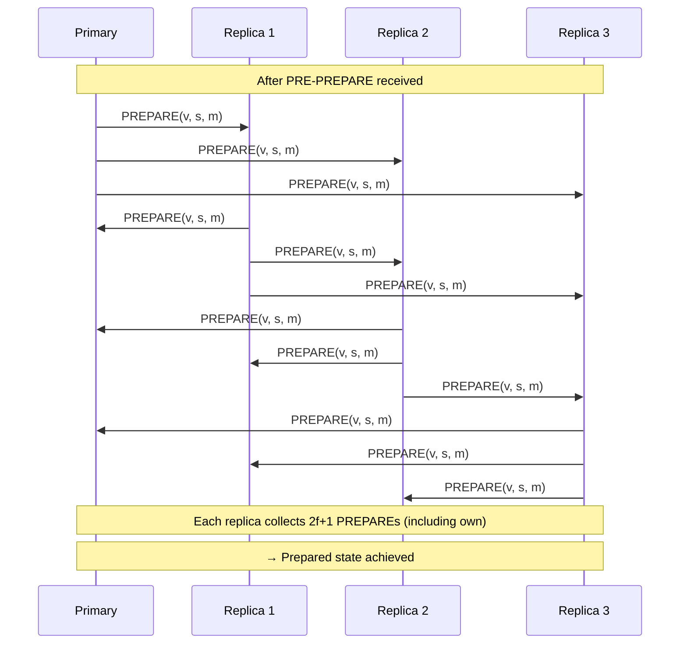
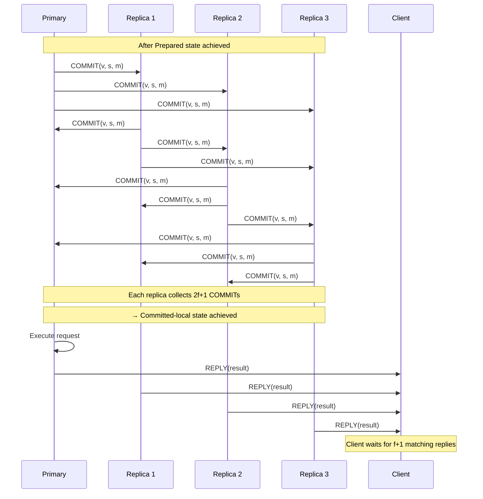
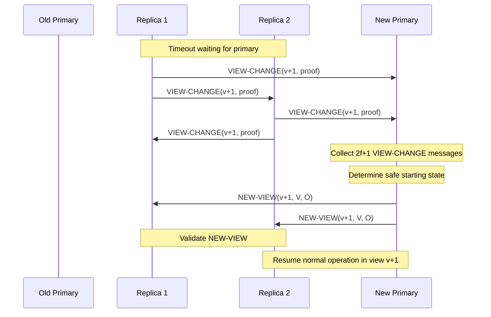

# PBFT: Practical Byzantine Fault Tolerance

PBFT (Practical Byzantine Fault Tolerance) is the first Byzantine fault-tolerant consensus protocol efficient enough for practical use in real systems. Introduced by Castro and Liskov in 1999, PBFT made BFT consensus practical by reducing message complexity and demonstrating real-world performance.

## Overview

**Key Innovation**: PBFT achieved **state machine replication** with Byzantine fault tolerance in a partially synchronous network model while maintaining reasonable performance (thousands of operations per second).

**Historical Impact**: Before PBFT, Byzantine consensus was considered too expensive for practical systems. PBFT showed that BFT could be deployed in real-world applications like distributed databases and file systems.

**Model**:
- **Synchrony**: Partially synchronous (assumes eventual synchrony after GST)
- **Fault Tolerance**: Tolerates $f < \frac{n}{3}$ Byzantine failures with $n = 3f + 1$ replicas
- **Communication**: Authenticated messages with digital signatures
- **Configuration**: One primary (leader), $n-1$ backups (replicas)

## Protocol Phases

PBFT operates in a sequence of **views**, each with a designated primary. Normal case operation has three phases:

### 1. Pre-Prepare Phase

**Purpose**: Primary proposes a value and sequence number to replicas.

**Flow**:
1. Client sends request to primary
2. Primary assigns sequence number $s$ to request
3. Primary broadcasts `PRE-PREPARE(v, s, m)` to all replicas

Where:
- $v$ = current view number
- $s$ = sequence number
- $m$ = client message (request)

**Validation**: Replicas accept `PRE-PREPARE` if:
- Signature is valid
- View number matches current view
- Sequence number is within acceptable range
- No conflicting `PRE-PREPARE` for same view/sequence exists

### 2. Prepare Phase

**Purpose**: Replicas agree on the ordering of the request within the current view.

**Flow**:
1. Each replica (including primary) broadcasts `PREPARE(v, s, m)` to all other replicas
2. Replica waits until it receives `PRE-PREPARE(v, s, m)` and $2f$ matching `PREPARE` messages from different replicas

**Prepared Predicate**: Replica $i$ is **prepared** for request $m$ with sequence $s$ in view $v$ if:
- $i$ has `PRE-PREPARE(v, s, m)` from primary
- $i$ has $2f$ matching `PREPARE(v, s, m)` from different replicas (including itself)

**Significance**: Prepared means that if any honest replica commits this value, no conflicting value can be committed in the same sequence number (even in future views).

### 3. Commit Phase

**Purpose**: Ensure global commitment across all honest replicas.

**Flow**:
1. Once prepared, each replica broadcasts `COMMIT(v, s, m)` to all replicas
2. Replica waits until it receives $2f + 1$ `COMMIT` messages (including its own)
3. Replica executes the request and sends reply to client

**Committed Predicate**: Replica $i$ is **committed** for request $m$ with sequence $s$ if:
- $i$ has $2f + 1$ `COMMIT(v, s, m)` messages from different replicas

**Committed-Local Predicate**: Replica $i$ has **committed-local** if:
- $i$ is prepared for $m$ at sequence $s$
- $i$ has $2f + 1$ `COMMIT(v, s, m)` messages

**Guarantee**: If one honest replica commits, all honest replicas will eventually commit the same value for that sequence number.

## View Changes

**Trigger**: If replicas suspect the primary is faulty (via timeout), they initiate a view change.

**Purpose**: Replace a faulty or slow primary with a new primary to restore liveness.

### View Change Protocol

1. **Initiate View Change**: Replica $i$ broadcasts `VIEW-CHANGE(v+1, P_i)` where $P_i$ is a proof of prepared requests
2. **Collect View-Change Messages**: New primary (replica $(v+1) \mod n$) waits for $2f + 1$ `VIEW-CHANGE` messages
3. **New-View Message**: New primary broadcasts `NEW-VIEW(v+1, V, O)` where:
   - $V$ = set of $2f + 1$ valid `VIEW-CHANGE` messages
   - $O$ = set of `PRE-PREPARE` messages for un-committed requests
4. **Resume Normal Operation**: Replicas validate `NEW-VIEW` and resume processing with new primary

**Safety Invariant**: New primary re-proposes any value that might have been committed in the previous view, ensuring continuity.

## Safety Proof Sketch

**Claim**: If two honest replicas commit values for the same sequence number, they commit the same value.

**Proof**:
1. For replica $i$ to commit value $v$ at sequence $s$:
   - $i$ must receive $2f + 1$ `COMMIT(v, s, m)` messages
2. For replica $j$ to commit value $w \neq v$ at sequence $s$:
   - $j$ must receive $2f + 1$ `COMMIT(w, s, m')` messages
3. Two sets of $2f + 1$ messages (out of $n = 3f + 1$ replicas) must intersect in at least $f + 1$ replicas
4. At most $f$ replicas are Byzantine, so at least one honest replica is in the intersection
5. Honest replicas send `COMMIT` for only one value per sequence number
6. **Contradiction**: Honest replica cannot have sent `COMMIT` for both $v$ and $w$
7. **Therefore**: $v = w$ (agreement holds)

**View Change Safety**: The `NEW-VIEW` protocol ensures that any value that might have been committed in the previous view is re-proposed in the new view, preventing loss of committed values.

**See [[bft-consensus-analysis/bft-consensus/properties/safety-properties|Safety Properties in BFT Consensus]] for general safety guarantees.**

## Liveness Under Partial Synchrony

**Assumption**: Eventually, the network becomes synchronous (after unknown GST).

**Guarantee**: After GST, if the current primary is honest, progress is made.

**Mechanism**:
- Replicas use exponentially increasing timeouts
- Eventually, timeouts exceed actual message delays (after GST)
- View changes occur at most $f$ times until an honest primary is elected
- Honest primary makes progress

**Expected Time to Commit**: $O(1)$ rounds in the normal case (no view changes).

**See [[bft-consensus-analysis/bft-consensus/properties/liveness-properties|Liveness Properties in BFT Consensus]] for general liveness guarantees.**

## Message Complexity

### Normal Case (No View Changes)

**Per Request**:
- `PRE-PREPARE`: 1 message from primary to $n-1$ replicas = $O(n)$
- `PREPARE`: $n$ replicas broadcast to $n-1$ others = $O(n^2)$
- `COMMIT`: $n$ replicas broadcast to $n-1$ others = $O(n^2)$

**Total**: $O(n^2)$ messages per consensus decision

**Signatures**: Each message requires verification, adding computational overhead.

### View Change

**Per View Change**:
- `VIEW-CHANGE`: $n$ replicas send to new primary = $O(n)$
- `NEW-VIEW`: New primary sends to $n-1$ replicas = $O(n)$
- Reproposing requests: $O(n^2)$ (for all pending requests)

**Total**: $O(n^2)$ per view change

**Comparison to HotStuff**: HotStuff optimizes this to $O(n)$ per round using threshold signatures.

## Optimizations

### 1. Message Aggregation

**Technique**: Batch multiple client requests into a single consensus instance.

**Benefit**: Amortize $O(n^2)$ cost over multiple requests.

**Example**: Process 100 requests in one PBFT round → effective complexity is $O(n^2 / 100)$ per request.

### 2. Tentative Execution

**Technique**: Execute request after prepared (before committed-local).

**Benefit**: Reduce latency (don't wait for commit phase).

**Safety**: Must be able to roll back if view change occurs before commit.

### 3. Checkpoint Protocol

**Purpose**: Garbage collect old messages and simplify state transfer.

**Mechanism**:
- Periodically (every $K$ requests), replicas broadcast `CHECKPOINT(s, d)` where $d$ is state digest at sequence $s$
- Once $2f + 1$ replicas agree on checkpoint, discard messages for sequence $< s$

**Benefit**: Prevents unbounded message log growth.

### 4. Read-Only Optimization

**Technique**: For read-only requests (no state change), skip consensus.

**Mechanism**: Client sends read to all replicas, waits for $2f + 1$ matching responses.

**Benefit**: Reads complete in one round-trip (vs. three phases for writes).

## Practical Deployment Considerations

### Configuration

**Typical Setup**: $n = 4$ (tolerate $f = 1$ Byzantine failure)

**Why**: Balance fault tolerance with performance overhead.

**Larger Deployments**: Blockchain validators often use $n = 100+$ (tolerate $f = 33+$).

### Performance Characteristics

**Throughput** (Castro & Liskov experiments, 1999):
- ~10,000 requests/second (simple writes)
- ~500-1000 operations/second (NFS workload)

**Latency**:
- Normal case: 3 message delays (one per phase)
- With tentative execution: 2 message delays
- After view change: Higher latency due to reproposing

**Scalability**: $O(n^2)$ message complexity limits scalability (typically $n < 20$ for performance).

### Failure Scenarios

| Scenario | Impact | Recovery |
|----------|--------|----------|
| **Primary crash** | Liveness blocked | View change after timeout |
| **f Byzantine replicas** | Normal operation | Quorums ensure safety |
| **Network partition** | Liveness blocked (no quorum) | Resume after partition heals |
| **f+1 Byzantine replicas** | ❌ **Safety violated** | **System failed** |

## Comparison to Other Protocols

| Aspect | PBFT | HotStuff | HoneyBadgerBFT |
|--------|------|----------|----------------|
| **Synchrony** | Partial | Partial | Fully asynchronous |
| **Message Complexity** | $O(n^2)$ | $O(n)$ | $O(n^2)$ (with batching) |
| **Latency** | 3 rounds | 3 rounds (pipelined) | Variable (async) |
| **View Change** | $O(n^2)$ | $O(n)$ | N/A (no views) |
| **Liveness** | After GST | After GST | Always (probabilistic) |
| **Year** | 1999 | 2019 | 2016 |

**See [[bft-consensus-analysis/bft-consensus/protocols/protocol-comparison|BFT Protocol Comparison: PBFT, HoneyBadgerBFT, and HotStuff]] for detailed analysis.**

## Limitations

1. **Quadratic Message Complexity**: $O(n^2)$ limits scalability
2. **Partial Synchrony Assumption**: Liveness depends on eventual synchrony
3. **Leader Bottleneck**: Primary must process all requests
4. **View Change Cost**: $O(n^2)$ messages per view change
5. **Fixed Membership**: Reconfiguration (adding/removing replicas) is complex

## Historical Impact and Legacy

**Significance**:
- **First practical BFT protocol**: Made Byzantine fault tolerance viable for real systems
- **Proved BFT can be efficient**: Dispelled belief that BFT was too slow
- **Inspired blockchain protocols**: Foundational ideas used in Tendermint, Cosmos, Libra/Diem

**Descendants**:
- **Zyzzyva** (2007): Optimistic fast path with 2 rounds
- **Aardvark** (2009): Leader-based improvements
- **Tendermint** (2014): Simplified variant for blockchain
- **HotStuff** (2019): Linear message complexity variant

**Real-World Use**:
- **BFT-SMaRt**: Open-source Java implementation
- **Hyperledger Fabric**: Ordering service (earlier versions)
- **Zilliqa**: Blockchain consensus layer

## See Also

- [[bft-consensus-analysis/bft-consensus/protocols/hotstuff|HotStuff: Linear-Complexity BFT Consensus]] - Modern linear-complexity evolution of PBFT
- [[bft-consensus-analysis/bft-consensus/protocols/honeybadger-bft|HoneyBadgerBFT: Asynchronous Byzantine Consensus]] - Asynchronous alternative
- [[bft-consensus-analysis/bft-consensus/protocols/protocol-comparison|BFT Protocol Comparison: PBFT, HoneyBadgerBFT, and HotStuff]] - Side-by-side comparison
- [[bft-consensus-analysis/bft-consensus/properties/safety-properties|Safety Properties in BFT Consensus]] - Safety guarantees PBFT provides
- [[bft-consensus-analysis/bft-consensus/properties/liveness-properties|Liveness Properties in BFT Consensus]] - Liveness guarantees under partial synchrony
- [[bft-consensus-analysis/bft-consensus/fundamentals|BFT Consensus Fundamentals]] - BFT consensus foundations

## Further Reading

- **Original Paper**: [[castro-liskov-1999-pbft|castro-liskov-1999-pbft]]
- **Tutorial**: [[decentralized-thoughts-2025-pbft|decentralized-thoughts-2025-pbft]]
- **Textbook**: [[cachin-guerraoui-rodrigues-2011-textbook|cachin-guerraoui-rodrigues-2011-textbook]]

---

**Self-Assessment Questions:**

1. Why does PBFT require three phases (pre-prepare, prepare, commit) instead of two?
2. Explain the difference between "prepared" and "committed-local" predicates.
3. How does PBFT ensure safety during view changes?
4. Calculate the total number of messages in the normal case for $n = 7$ replicas.
5. Why is PBFT's message complexity $O(n^2)$ while HotStuff achieves $O(n)$?
