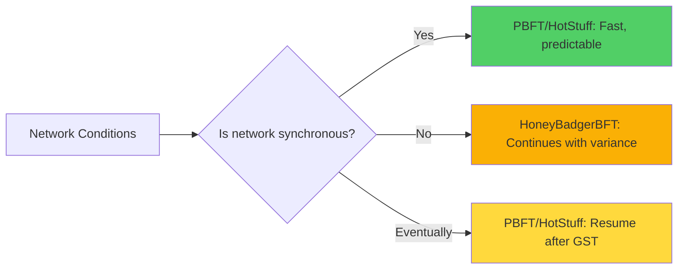
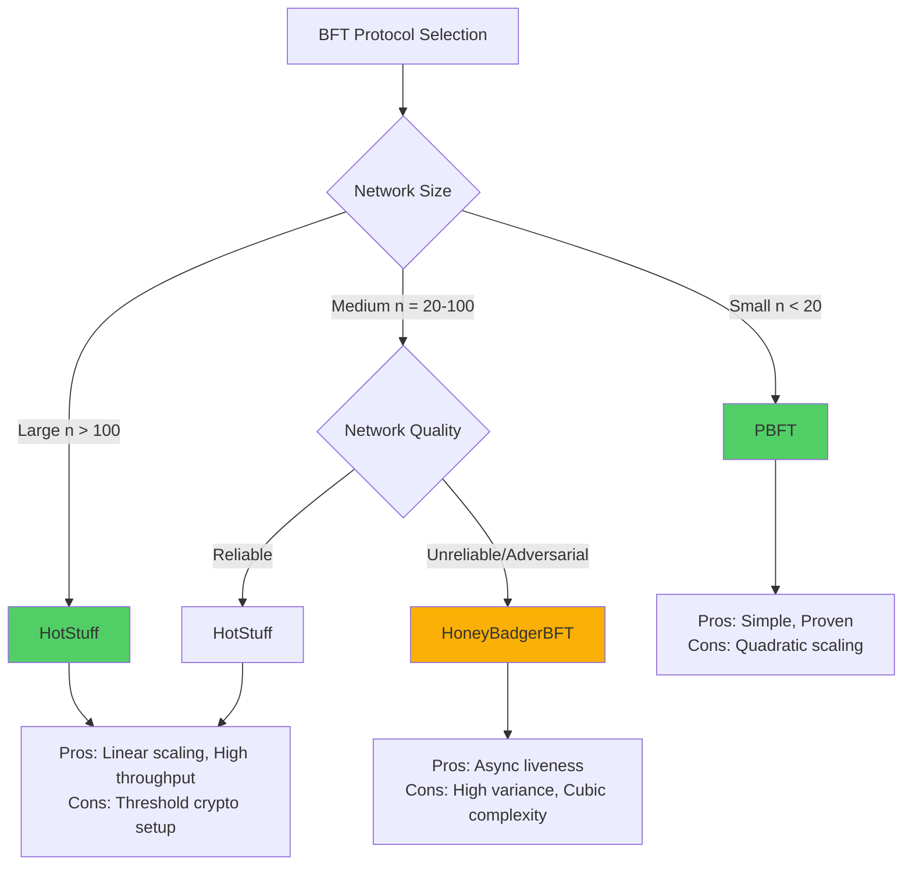

# BFT Protocol Comparison: PBFT, HoneyBadgerBFT, and HotStuff

This note provides a comprehensive comparison of three major Byzantine fault-tolerant consensus protocols, highlighting their design trade-offs and use cases.

## Protocol Overview

### PBFT (1999)

**Practical Byzantine Fault Tolerance** - The first practical BFT consensus protocol.

**Key Characteristics**:
- Partially synchronous (assumes eventual synchrony)
- $O(n^2)$ message complexity
- 3-phase commit protocol
- Leader-based with view changes

**Historical Significance**: Proved BFT could be practical, not just theoretical.

**See [[pbft]] for detailed analysis.**

### HoneyBadgerBFT (2016)

**Asynchronous Byzantine Consensus** - First practical fully asynchronous BFT protocol.

**Key Characteristics**:
- Fully asynchronous (no timing assumptions)
- $O(n^3)$ message complexity per epoch
- Randomization for liveness
- No leader (symmetric protocol)

**Historical Significance**: Showed asynchronous BFT is achievable in practice.

**See [[honeybadger-bft]] for detailed analysis.**

### HotStuff (2019)

**Linear-Complexity BFT** - Modern protocol optimizing communication efficiency.

**Key Characteristics**:
- Partially synchronous (like PBFT)
- $O(n)$ message complexity
- 3-phase commit with pipelining
- Leader-based with efficient view changes

**Historical Significance**: Enabled BFT at scale (hundreds to thousands of nodes).

**See [[hotstuff]] for detailed analysis.**

## Synchrony Model Comparison

| Protocol | Model | Liveness Condition | Safety Condition |
|----------|-------|-------------------|------------------|
| **PBFT** | Partial Synchrony | After GST + honest leader | Always |
| **HoneyBadgerBFT** | Fully Asynchronous | Always (probabilistic) | Always |
| **HotStuff** | Partial Synchrony | After GST + honest leader | Always |

### Implications

**Partial Synchrony** (PBFT, HotStuff):
- **Assumption**: Network eventually becomes synchronous (after unknown GST)
- **Liveness**: Guaranteed **only after GST**
- **Before GST**: Protocol may stall (liveness failure, but safety preserved)
- **Practical**: Most real networks are "usually synchronous"

**Full Asynchrony** (HoneyBadgerBFT):
- **Assumption**: **No timing assumptions**
- **Liveness**: Guaranteed **always** (with probability 1)
- **Advantage**: Robust to worst-case network conditions
- **Trade-off**: Higher latency variance, more complex cryptography



## Message Complexity

| Protocol | Normal Case | View Change / Epoch | Amortized (Batching) |
|----------|-------------|---------------------|---------------------|
| **PBFT** | $O(n^2)$ per request | $O(n^2)$ | N/A |
| **HoneyBadgerBFT** | $O(n^3)$ per ACS epoch | N/A (no views) | $O(n^3 / B)$ per tx |
| **HotStuff** | $O(n)$ per round | $O(n)$ | $O(n)$ per tx (pipelined) |

**Where**:
- $n$ = number of nodes
- $B$ = batch size (number of transactions per epoch)

### Scaling Implications

**Small Networks** ($n < 10$):
- All three protocols are viable
- PBFT: Proven, simple
- HotStuff: Slight overhead from threshold crypto
- HoneyBadgerBFT: Higher latency variance

**Medium Networks** ($n = 10$ to $100$):
- PBFT: $O(n^2)$ becomes noticeable bottleneck
- HotStuff: Efficient, good throughput
- HoneyBadgerBFT: Viable with batching

**Large Networks** ($n > 100$):
- PBFT: **Not practical** (quadratic message explosion)
- HotStuff: **Recommended** (linear complexity scales well)
- HoneyBadgerBFT: **Limited** (cubic complexity prohibitive without large batches)

### Visualization: Message Complexity Scaling

```
n = 10:   PBFT: 100,   HotStuff: 10,    HoneyBadgerBFT: 1,000
n = 100:  PBFT: 10K,   HotStuff: 100,   HoneyBadgerBFT: 1M
n = 1000: PBFT: 1M,    HotStuff: 1,000, HoneyBadgerBFT: 1B
```

**Conclusion**: HotStuff scales to large networks; PBFT and HoneyBadgerBFT do not.

## Latency and Throughput

| Protocol | Latency (Normal) | Latency (Adversarial) | Throughput | Predictability |
|----------|------------------|----------------------|------------|---------------|
| **PBFT** | 3 network delays | Can stall indefinitely | Moderate (~1K TPS) | High (deterministic) |
| **HoneyBadgerBFT** | Variable (expected constant) | Variable (continues) | High (~20K TPS with batching) | Low (random) |
| **HotStuff** | 3 network delays (amortized 1 with pipelining) | Can stall indefinitely | Very High (~10K+ TPS) | High (deterministic) |

### Latency Analysis

**PBFT**:
- **Normal case**: 3 message delays (Pre-Prepare, Prepare, Commit)
- **Optimistic**: Can execute after Prepare (2 delays) with tentative execution
- **View change**: Additional delay (timeout + leader rotation)

**HoneyBadgerBFT**:
- **Normal case**: Expected $O(1)$ asynchronous rounds (variable time)
- **Worst case**: No upper bound (asynchronous model), but probabilistic termination
- **Advantage**: Continues making progress even in adversarial networks

**HotStuff**:
- **Normal case**: 3 message delays (Prepare, Pre-Commit, Commit)
- **Pipelined**: Amortized 1 message delay per commit (overlapping proposals)
- **View change**: $O(n)$ messages (faster than PBFT's $O(n^2)$)

### Throughput Optimization

**PBFT**: Limited by $O(n^2)$ message complexity.
- **Batching**: Helps amortize cost, but doesn't eliminate quadratic overhead.

**HoneyBadgerBFT**: Batching is essential.
- **Large batches**: 10K+ transactions per epoch amortize $O(n^3)$ cost.
- **Throughput**: Can exceed PBFT with large batches.

**HotStuff**: Pipelining dramatically improves throughput.
- **Overlap**: Process multiple proposals concurrently.
- **Steady state**: Commit one proposal per round (vs every 3 rounds).

## Cryptographic Requirements

| Protocol | Cryptography | Setup Complexity | Computational Overhead |
|----------|-------------|------------------|----------------------|
| **PBFT** | Digital Signatures | Simple (key pairs) | Low (sign/verify) |
| **HoneyBadgerBFT** | Threshold Crypto + Erasure Coding | High (DKG required) | High (threshold ops) |
| **HotStuff** | Threshold Signatures | Moderate (DKG for aggregation) | Moderate (aggregation) |

### PBFT

**Requirements**: 
- Standard public-key signatures (e.g., RSA, ECDSA)
- Each replica has a key pair

**Advantages**:
- Simple setup
- Well-understood security

**Disadvantages**:
- Each message requires separate signature (contributes to $O(n^2)$ overhead)

### HoneyBadgerBFT

**Requirements**:
- **Threshold encryption**: For message privacy and reliable broadcast
- **Threshold signatures**: For common coin (shared randomness)
- **Erasure coding**: Reed-Solomon for reliable broadcast

**Advantages**:
- Enables asynchronous consensus
- Byzantine-resilient randomness

**Disadvantages**:
- **Complex setup**: Distributed Key Generation (DKG) protocol needed
- **Computational cost**: Threshold operations are expensive
- **Additional assumptions**: Relies on threshold crypto security

### HotStuff

**Requirements**:
- **Threshold signatures**: BLS signatures for Quorum Certificates
- Optional: Threshold encryption for leader privacy

**Advantages**:
- Enables linear message complexity
- Compact Quorum Certificates (single aggregate signature)

**Disadvantages**:
- **Moderate setup**: DKG for threshold signature scheme
- **Aggregation overhead**: Leader must aggregate signatures

## Fault Tolerance and Resilience

All three protocols tolerate the same threshold:

$$
f < \frac{n}{3} \quad \text{(or equivalently, } n \geq 3f + 1\text{)}
$$

**Why**: This is the **fundamental limit** for Byzantine consensus.

**See [[fault-tolerance-threshold]] for detailed explanation.**

### Failure Scenario Comparison

| Failure Scenario | PBFT | HoneyBadgerBFT | HotStuff |
|------------------|------|----------------|----------|
| **f Byzantine nodes** | ✅ Normal operation | ✅ Normal operation | ✅ Normal operation |
| **Byzantine leader** | ⚠️ View change (stall until new leader) | ✅ No leader (continues) | ⚠️ View change (stall until new leader) |
| **Network partition (no quorum)** | ❌ Liveness failure | ❌ Liveness failure | ❌ Liveness failure |
| **Asynchronous network** | ⚠️ Liveness failure (until GST) | ✅ Continues (async model) | ⚠️ Liveness failure (until GST) |
| **f+1 Byzantine nodes** | ❌ **System failure** (safety violated) | ❌ **System failure** (safety violated) | ❌ **System failure** (safety violated) |

**Key Insight**: HoneyBadgerBFT uniquely maintains liveness in asynchronous networks.

## Use Case Recommendations

### When to Use PBFT

**Best For**:
- **Small networks** ($n < 20$ nodes)
- **Low-latency requirements** (predictable 3-round commit)
- **Proven stability** (20+ years of research and deployment)
- **Simple deployment** (no complex cryptographic setup)

**Use Cases**:
- Permissioned blockchain consortia (small validator sets)
- Distributed databases (geo-replicated across data centers)
- Critical infrastructure with trusted environment

**Examples**:
- BFT-SMaRt (state machine replication)
- Hyperledger Fabric (older versions)

### When to Use HoneyBadgerBFT

**Best For**:
- **Adversarial networks** (e.g., global WANs, censored networks)
- **No timing assumptions** (network conditions unpredictable)
- **High-value transactions** (where robustness > low latency)
- **Medium batch sizes** (to amortize $O(n^3)$ cost)

**Use Cases**:
- Cryptocurrency networks (Byzantine validators expected)
- Cross-border financial systems (unreliable network)
- Censorship-resistant systems

**Examples**:
- Research prototypes (not yet mainstream)
- Specialized blockchain projects requiring async guarantees

### When to Use HotStuff

**Best For**:
- **Large networks** ($n = 100$ to $1000+$ nodes)
- **High throughput** (pipelining for many transactions/sec)
- **Scalable BFT** (linear message complexity essential)
- **Modern blockchain** (validators distributed globally)

**Use Cases**:
- Public/permissioned blockchains with many validators
- Large-scale consensus systems (consortium with 100+ members)
- High-performance distributed ledgers

**Examples**:
- Facebook Diem/Libra (DiemBFT variant)
- Casper FFG (Ethereum finality)
- Modern blockchain protocols (Tendermint-like)

## Trade-off Summary



### Simplified Decision Matrix

| Criterion | Prioritize | Choose |
|-----------|-----------|--------|
| **Network size > 100** | Scalability | **HotStuff** |
| **Adversarial network** | Liveness robustness | **HoneyBadgerBFT** |
| **Small trusted network** | Simplicity | **PBFT** |
| **High throughput** | Performance | **HotStuff** |
| **Predictable latency** | Determinism | **PBFT** or **HotStuff** |
| **No synchrony assumption** | Async guarantee | **HoneyBadgerBFT** |

## Performance Benchmarking (Approximate)

Based on research papers and real-world deployments:

### Throughput (Transactions per Second)

| Protocol | Small Network (n=4) | Medium Network (n=100) | Large Network (n=1000) |
|----------|---------------------|----------------------|----------------------|
| **PBFT** | ~10,000 TPS | ~1,000 TPS | ❌ Not viable |
| **HoneyBadgerBFT** | ~5,000 TPS (batched) | ~20,000 TPS (batched) | ❌ Not viable (cubic) |
| **HotStuff** | ~20,000 TPS (pipelined) | ~50,000 TPS (pipelined) | ~10,000+ TPS |

**Note**: Actual throughput depends heavily on network conditions, hardware, and implementation quality.

### Latency (Milliseconds, LAN)

| Protocol | Normal Case | After View Change |
|----------|-------------|------------------|
| **PBFT** | ~10-50ms (3 delays) | ~100-500ms (timeout + repropose) |
| **HoneyBadgerBFT** | ~50-200ms (variable) | N/A (no view changes) |
| **HotStuff** | ~30-100ms (pipelined: ~10-30ms amortized) | ~50-200ms (linear VC) |

**Note**: WAN latencies are significantly higher (100s of ms to seconds).

## Evolution and Future Directions

### From PBFT to HotStuff

**Progression**:
1. **PBFT (1999)**: First practical BFT
2. **Zyzzyva (2007)**: Optimistic fast path (2 phases when network is good)
3. **Tendermint (2014)**: Simplified PBFT for blockchain
4. **HotStuff (2019)**: Linear complexity + pipelining

**Key Innovation**: Threshold signatures enable linear message complexity.

### From HoneyBadgerBFT to DAG-Based Async BFT

**Progression**:
1. **HoneyBadgerBFT (2016)**: First practical async BFT
2. **BEAT (2018)**: Reduced complexity to $O(n^2)$
3. **Dumbo (2020)**: Multi-valued BBA, better throughput
4. **DAG-Rider (2021+)**: DAG structure for async consensus

**Key Innovation**: DAG structures reduce complexity and improve throughput.

**See [[dag-rider-analysis]] case study.**

### Hybrid Approaches

**Optimistic Protocols**: Fast path for synchronous periods, fallback for asynchrony.
- **Example**: Sync HotStuff (optimistic 2-phase) + fallback to 3-phase

**Flexible Quorums**: Adapt quorum size based on synchrony detection.

**Cross-Chain Consensus**: BFT protocols for multi-chain interoperability.

## Limitations Common to All Three

Despite their differences, all three protocols share some fundamental limitations:

1. **$f < n/3$ Threshold**: Cannot tolerate more than 1/3 Byzantine nodes (fundamental limit).
2. **Permissioned Setting**: Require known validator sets (Sybil attack vulnerability in permissionless).
3. **State Transfer Complexity**: Bringing new or recovering nodes up to speed is non-trivial.
4. **Configuration Changes**: Adding/removing validators requires careful coordination.

## See Also

- [[pbft]] - Detailed PBFT analysis
- [[honeybadger-bft]] - Detailed HoneyBadgerBFT analysis
- [[hotstuff]] - Detailed HotStuff analysis
- [[fundamentals]] - BFT consensus foundations
- [[byzantine-failures]] - Fault model all three tolerate
- [[safety-properties]] - Safety guarantees provided by all three
- [[liveness-properties]] - Liveness guarantees (differ by protocol)
- [[fault-tolerance-threshold]] - Why all three require $f < n/3$

## Further Reading

- **PBFT**: [[castro-liskov-1999-pbft]]
- **HoneyBadgerBFT**: [[miller-2016-honeybadger]]
- **HotStuff**: [[yin-2019-hotstuff]]
- **Survey**: [[comprehensive-bft-survey-2022]]

---

**Self-Assessment Questions:**

1. Why does HotStuff scale better than PBFT for large networks?
2. In what scenario would you choose HoneyBadgerBFT over HotStuff?
3. Compare the view change complexity of PBFT vs. HotStuff. Why is HotStuff more efficient?
4. All three protocols tolerate $f < n/3$ Byzantine failures. Why is this threshold the same despite different synchrony models?
5. Explain the trade-off between HoneyBadgerBFT's liveness guarantee and its latency variance.
