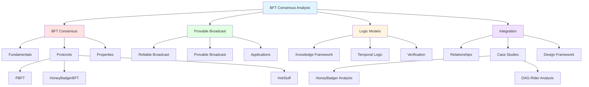

# BFT Consensus Analysis: Integrated Knowledge Base

Welcome to the comprehensive analysis of **Byzantine Fault Tolerant (BFT) Consensus**, **Provable Broadcast**, and **Logic Models** for distributed systems.

## What You'll Find Here

This knowledge base explores three interconnected areas of distributed systems theory and practice:

### 🛡️ Byzantine Fault Tolerant Consensus

Understanding how distributed systems reach agreement even when some participants are malicious or faulty.

- **Core Concepts**: [[bft-consensus-analysis/bft-consensus/fundamentals|BFT Fundamentals]], [[bft-consensus-analysis/bft-consensus/byzantine-failures|Byzantine Failures]]
- **Protocols**: [[bft-consensus-analysis/bft-consensus/protocols/pbft|PBFT]], [[bft-consensus-analysis/bft-consensus/protocols/honeybadger-bft|HoneyBadgerBFT]], [[bft-consensus-analysis/bft-consensus/protocols/hotstuff|HotStuff]]
- **Properties**: [[bft-consensus-analysis/bft-consensus/properties/safety-properties|Safety]], [[bft-consensus-analysis/bft-consensus/properties/liveness-properties|Liveness]]

### 📡 Provable Broadcast

Communication primitives that provide cryptographic proof of message delivery.

- **Foundations**: [[bft-consensus-analysis/provable-broadcast/reliable-broadcast|Reliable Broadcast]], [[bft-consensus-analysis/provable-broadcast/byzantine-reliable-broadcast|Byzantine Reliable Broadcast]]
- **Key Innovation**: [[bft-consensus-analysis/provable-broadcast/provable-broadcast|Provable Broadcast Mechanisms]]
- **Comparisons**: [[bft-consensus-analysis/provable-broadcast/vs-reliable-broadcast|Provable vs Reliable Broadcast]]
- **Applications**: [[bft-consensus-analysis/provable-broadcast/applications|Real-World Usage in Blockchain & DLT]]

### 🔬 Logic Models

Formal frameworks for specifying and verifying consensus protocol correctness.

- **Foundations**: [[bft-consensus-analysis/logic-models/knowledge-framework|Halpern-Moses Knowledge Framework]]
- **Temporal Logic**: [[bft-consensus-analysis/logic-models/temporal-logic|Expressing Safety & Liveness]]
- **Verification**: [[bft-consensus-analysis/logic-models/formal-verification|Formal Verification Techniques]]
- **Tools**: [[bft-consensus-analysis/logic-models/threshold-automata|Threshold Automata]] and Model Checking

### 🔗 Integration & Synthesis

How these three areas connect and complement each other.

- **Relationships**: [[bft-consensus-analysis/integration/relationships|Three-Way Connections]]
- **Case Studies**: 
  - [[bft-consensus-analysis/integration/case-studies/honeybadger-complete|HoneyBadgerBFT Complete Analysis]]
  - [[bft-consensus-analysis/integration/case-studies/dag-rider-analysis|DAG-Based BFT Analysis]]
- **Design Guide**: [[bft-consensus-analysis/integration/design-framework|Applying All Three Perspectives]]

## Quick Start

Choose your entry point based on your background:

| Your Background | Start Here |
|----------------|-----------|
| **New to distributed systems** | [[bft-consensus-analysis/bft-consensus/fundamentals|BFT Fundamentals]] |
| **Blockchain developer** | [[bft-consensus-analysis/provable-broadcast/applications|Real-World Usage in Blockchain & DLT]] |
| **Formal verification engineer** | [[bft-consensus-analysis/logic-models/overview|Logic Models Overview]] |
| **Experienced practitioner** | [[bft-consensus-analysis/integration/relationships|Three-Way Connections]] |
| **Want protocol comparison** | [[bft-consensus-analysis/bft-consensus/protocols/protocol-comparison|Protocol Comparison]] |

📖 **Detailed navigation guide**: See [[bft-consensus-analysis/quickstart|Quickstart]]

## Key Insights

This knowledge base provides a **unique integrated perspective**:

1. **BFT Consensus Algorithms** define *what* we want to achieve (agreement despite Byzantine faults)
2. **Provable Broadcast** provides *how* we communicate reliably (with cryptographic delivery proofs)
3. **Logic Models** enable *formal verification* that our protocols are correct

Understanding all three perspectives makes you a more effective:
- **Protocol Designer**: Choose the right mechanisms for your use case
- **System Implementer**: Understand trade-offs and guarantees
- **Verification Engineer**: Prove correctness formally

## Learning Paths

### 📚 Path 1: Fundamentals First (Beginners)

1. [[bft-consensus-analysis/glossary|Glossary]] - Key terminology
2. [[bft-consensus-analysis/bft-consensus/fundamentals|BFT Fundamentals]] - Consensus basics
3. [[bft-consensus-analysis/bft-consensus/byzantine-failures|Byzantine Failures]] - Threat model
4. [[bft-consensus-analysis/provable-broadcast/reliable-broadcast|Reliable Broadcast]] - Communication primitives
5. [[bft-consensus-analysis/bft-consensus/protocols/pbft|PBFT]] - Classic BFT protocol
6. [[bft-consensus-analysis/integration/relationships|Three-Way Connections]] - Synthesis

**Time**: 4-6 hours

### ⚙️ Path 2: Protocol-Centric (Practitioners)

1. [[bft-consensus-analysis/bft-consensus/protocols/protocol-comparison|Protocol Comparison]] - Overview
2. Deep dive: [[bft-consensus-analysis/bft-consensus/protocols/honeybadger-bft|HoneyBadgerBFT]] or [[bft-consensus-analysis/bft-consensus/protocols/hotstuff|HotStuff]]
3. [[bft-consensus-analysis/provable-broadcast/overview|Provable Broadcast Overview]] - Broadcast mechanisms
4. [[bft-consensus-analysis/integration/case-studies/honeybadger-complete|HoneyBadgerBFT Complete Analysis]] - Complete analysis
5. [[bft-consensus-analysis/integration/design-framework|Applying All Three Perspectives]] - Apply to your work

**Time**: 3-4 hours

### 🔬 Path 3: Formal Verification (Researchers)

1. [[bft-consensus-analysis/logic-models/overview|Logic Models Overview]] - Introduction
2. [[bft-consensus-analysis/logic-models/knowledge-framework|Halpern-Moses Knowledge Framework]] - Halpern-Moses foundations
3. [[bft-consensus-analysis/logic-models/temporal-logic|Expressing Safety & Liveness]] - Specifications
4. [[bft-consensus-analysis/logic-models/formal-verification|Formal Verification Techniques]] - Techniques
5. [[bft-consensus-analysis/integration/case-studies/honeybadger-complete|HoneyBadgerBFT Complete Analysis]] - Applied verification

**Time**: 5-7 hours

## Visual Knowledge Map

## Essential Resources

### Within This Knowledge Base

- 📖 [[bft-consensus-analysis/glossary|Glossary]] - Technical terminology
- 📚 [[bft-consensus-analysis/references|References]] - Bibliography and citations
- 🧭 [[bft-consensus-analysis/quickstart|Quickstart]] - Detailed navigation guide

### External Resources

- **Decentralized Thoughts**: Authoritative blog on consensus (decentralizedthoughts.github.io)
- **Halpern & Moses (2000)**: "Knowledge and common knowledge" (arXiv cs/0006009)
- **Original Papers**: See [[bft-consensus-analysis/references|References]] for PBFT, HoneyBadgerBFT, HotStuff papers

## Common Questions

**Q: What is Byzantine fault tolerance?**  
A: The ability to reach consensus even when some nodes behave maliciously. See [[bft-consensus-analysis/bft-consensus/fundamentals|BFT Fundamentals]].

**Q: Why the f < n/3 limit?**  
A: Mathematical impossibility—you cannot distinguish correct from faulty if too many are faulty. See [[bft-consensus-analysis/bft-consensus/properties/fault-tolerance-threshold|Fault Tolerance Threshold: Why f < n/3 for Byzantine Failures]].

**Q: How is provable broadcast different from reliable broadcast?**  
A: Provable broadcast adds cryptographic delivery certificates. See [[bft-consensus-analysis/provable-broadcast/vs-reliable-broadcast|Provable vs Reliable Broadcast]].

**Q: Can I verify my protocol is correct?**  
A: Yes, using logic models and model checkers. See [[bft-consensus-analysis/logic-models/formal-verification|Formal Verification Techniques]].

**Q: Which BFT protocol should I use?**  
A: Depends on your synchrony assumptions, threat model, and performance needs. See [[bft-consensus-analysis/bft-consensus/protocols/protocol-comparison|Protocol Comparison]].

## About This Knowledge Base

- **Version**: 1.0 (Complete)
- **Status**: ✅ All phases complete (Phases 1-6)
- **Feature**: 001-bft-consensus-analysis
- **Created**: 2026-01-21
- **Last Updated**: 2026-01-22
- **Total Notes**: 30 (9 BFT Consensus, 7 Provable Broadcast, 6 Logic Models, 4 Integration, 4 Foundation)
- **Quality Assurance**: Validated (See QA report in specs/)

## Navigation

Use these Obsidian features:

- **Wikilinks**: Click `[[full/path/to/note|Note Title]]` to navigate
- **Graph View**: Visualize connections (View → Open Graph View)
- **Search**: Find content (Cmd/Ctrl + Shift + F)
- **Tags**: Filter by `#bft`, `#broadcast`, `#logic-model`, etc.
- **Backlinks**: See incoming references (right sidebar)

## Get Started

Ready to explore? Choose your path:

➡️ **Beginner**: [[bft-consensus-analysis/bft-consensus/fundamentals|BFT Fundamentals]]  
➡️ **Practitioner**: [[bft-consensus-analysis/bft-consensus/protocols/protocol-comparison|Protocol Comparison]]  
➡️ **Researcher**: [[bft-consensus-analysis/logic-models/overview|Logic Models Overview]]  
➡️ **Browse**: [[bft-consensus-analysis/quickstart|Quickstart]]

---

*This knowledge base synthesizes understanding across Byzantine consensus, provable broadcast, and formal verification to provide an integrated perspective on distributed systems design and analysis.*
