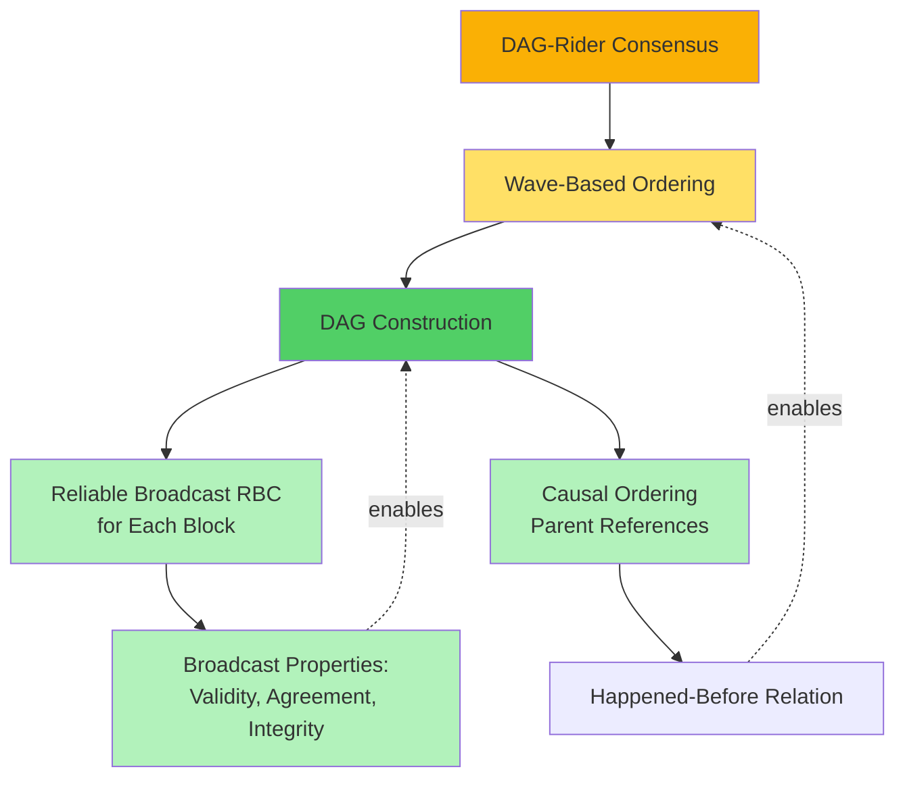

# DAG-Rider: Asynchronous DAG-Based BFT Analysis

This case study analyzes **DAG-Rider**, a modern asynchronous Byzantine Fault Tolerant consensus protocol that achieves high throughput by building a Directed Acyclic Graph (DAG) of blocks and extracting a total ordering. We examine DAG-Rider through the integrated lens of **BFT consensus**, **provable broadcast**, and **formal logic models**.

## Executive Summary

**DAG-Rider** (Keidar et al., 2021) is a fully asynchronous BFT consensus protocol that achieves **high throughput** and **low latency** by separating data dissemination (DAG construction) from ordering (DAG interpretation). It represents a paradigm shift from traditional round-based consensus to graph-based consensus.

**Three-Perspective Integration**:


**Key Innovation**: Decouples **data dissemination** (build DAG via RBC) from **ordering** (interpret DAG structure) to achieve high throughput with constant expected latency.

---

## Part 1: BFT Consensus Perspective

### 1.1 Protocol Overview

**Goal**: Achieve consensus on a totally ordered sequence of transactions in a fully asynchronous network.

**System Model**:
- **Nodes**: $n = 3f + 1$ validators (e.g., $n = 100$ with $f = 33$)
- **Fault Model**: Up to $f$ Byzantine failures
- **Network**: Fully asynchronous (no timing assumptions)
- **Cryptography**: Digital signatures, hash functions

**Properties**:
- **Safety (Agreement)**: All honest nodes commit the same sequence of transactions in the same order
- **Liveness (Termination)**: All honest nodes' transactions are eventually committed
- **Validity**: If an honest node proposes transaction $tx$, all honest nodes eventually commit $tx$

### 1.2 DAG-Based Consensus Paradigm

**Traditional Consensus** (PBFT, HoneyBadger):
- **Round-based**: Nodes proceed in synchronized rounds (propose → vote → commit)
- **Sequential**: Each round depends on previous round's completion
- **Bottleneck**: Latency = rounds × round-trip time

**DAG-Based Consensus** (DAG-Rider, Narwhal, Tusk):
- **Graph-based**: Nodes create blocks concurrently and link to previous blocks (DAG structure)
- **Parallel**: Blocks are created independently; ordering emerges from DAG structure
- **High Throughput**: Multiple blocks created simultaneously


**Advantages of DAG-Based**:
- **Parallel Data Dissemination**: All nodes broadcast blocks concurrently
- **Decoupled Ordering**: Ordering is extracted from DAG structure (local computation, no messages)
- **Amortized Efficiency**: One broadcast per block; many transactions per block

### 1.3 DAG Structure

**DAG (Directed Acyclic Graph)**:
- **Vertices**: Blocks created by validators
- **Edges**: References to previous blocks (parent pointers)
- **Properties**: Acyclic (no cycles), causally ordered (parents created before children)

**Block Structure**:

```yaml
Block:
  author: validator_id         # Who created this block
  round: r                     # Wave/round number
  parents: [hash1, hash2, ...] # References to 2f+1 blocks from previous round
  transactions: [tx1, tx2, ...] # Payload (transactions)
  signature: sig               # Digital signature by author
```

**DAG Construction**:


**Parent Rules**:
- Each block in round $r$ references **at least $2f+1$ blocks** from round $r-1$
- This ensures **Byzantine quorum**: Any two blocks' parent sets share at least one honest block

### 1.4 DAG-Rider Protocol Phases

#### Phase 1: Data Dissemination (Build DAG)

**Continuous Process**: Each validator continuously creates and broadcasts blocks.

**Block Creation Algorithm** (for validator $i$ in round $r$):

```pseudocode
function CreateBlock(round r):
    1. Collect 2f+1 blocks from round r-1 (parents)
    2. Include new transactions from mempool
    3. Create block B with:
       - author = i
       - round = r
       - parents = {hash(B') for B' in collected blocks from r-1}
       - transactions = [pending transactions]
    4. Sign block: B.signature = Sign(B, sk_i)
    5. Broadcast B via Reliable Broadcast (RBC)
    6. Wait for 2f+1 blocks from round r
    7. Proceed to round r+1
```

**Broadcast Mechanism**: Each block is broadcast using **Reliable Broadcast** (RBC) to ensure:
- **Validity**: If honest validator broadcasts block $B$, all honest validators deliver $B$
- **Agreement**: If any honest validator delivers $B$, all honest validators deliver $B$
- **Integrity**: $B$ is delivered at most once and only if broadcast by author

**See [[bft-consensus-analysis/provable-broadcast/reliable-broadcast|Reliable Broadcast]] for RBC details.**

#### Phase 2: Wave-Based Ordering (Extract Sequence from DAG)

**DAG Interpretation**: Once DAG is built, extract a total order of transactions.

**Waves**: Group every 4 consecutive rounds into a "wave"
- **Wave $w$**: Rounds $4w, 4w+1, 4w+2, 4w+3$
- **Leader Selection**: Deterministic function of wave number (e.g., $\text{leader}(w) = w \mod n$)

**Commit Rule**:

A block $B$ in wave $w$ is **committed** if:
1. $B$ is the **leader block** for wave $w$ (created by designated leader in round $4w$)
2. There exists a **path** in the DAG from a block in round $4w + 3$ to $B$
3. At least $2f+1$ blocks in round $4w + 3$ have paths to $B$

**Ordering Rule**:
- Blocks are **committed** wave by wave (wave 0, then wave 1, then wave 2, ...)
- Within a wave, transactions are ordered by **topological sort** of DAG blocks


**Key Insight**: Ordering requires **only local computation** on the DAG; no additional messages exchanged for commit.

#### Phase 3: Transaction Commitment

**Commit Protocol**:

```pseudocode
function CommitWave(wave w):
    1. Identify leader block L for wave w (round 4w)
    2. Check if 2f+1 blocks in round 4w+3 have paths to L
    3. If yes:
       a. Topologically sort all blocks reachable from L
       b. Extract transactions from sorted blocks
       c. Execute transactions in order
       d. Commit wave w
    4. Proceed to wave w+1
```

**Transaction Ordering**:
- **Deterministic**: All honest nodes see the same DAG → same topological sort → same transaction order
- **Causal Consistency**: If block $B_1$ is ancestor of $B_2$ (path exists), transactions in $B_1$ are ordered before $B_2$

### 1.5 Consensus Guarantees

**Safety (Agreement)**:

> If honest node $i$ commits transaction $tx$ at position $k$ and honest node $j$ commits transaction $tx'$ at position $k$, then $tx = tx'$.

**Proof Sketch**:
- All honest nodes build the same DAG (via RBC agreement)
- Commit rule is deterministic (based on DAG structure)
- Topological sort is deterministic (given same DAG)
- ∴ All honest nodes commit the same sequence

**Liveness (Termination)**:

> All transactions from honest validators are eventually committed.

**Proof Sketch**:
- Honest validators continuously create blocks
- At least $2f+1$ honest validators → at least $2f+1$ blocks per round
- Leader election ensures honest leader with high probability
- If honest leader, wave commits (all honest blocks have paths to leader)
- ∴ Transactions eventually committed

**Validity**:

> If honest validator proposes transaction $tx$, all honest validators eventually commit $tx$.

**Proof**: Honest validator's block is included in DAG → reachable from committed leader → committed.

### 1.6 Performance Analysis

**Communication Complexity**:
- **Per Block**: $O(n^2)$ messages (RBC broadcast)
- **Per Transaction**: $O(1)$ amortized (many transactions per block)
- **Commitment**: $O(0)$ messages (local DAG interpretation, no voting)

**Latency**:
- **Expected Waves to Commit**: $O(1)$ (if honest leader elected)
- **Rounds per Wave**: 4
- **Expected Latency**: $O(1)$ rounds = constant expected time

**Throughput**:
- **Blocks per Round**: $n$ (all validators create blocks concurrently)
- **Transactions per Block**: $k$ (e.g., 1000s)
- **Total Throughput**: $O(n \cdot k)$ transactions per round

**Comparison to HoneyBadger**:

| Metric | HoneyBadger | DAG-Rider |
|--------|-------------|-----------|
| **Communication per Decision** | $O(n^3)$ (ACS) | $O(n^2)$ per block, amortized $O(1)$ per tx |
| **Latency** | $O(1)$ rounds | $O(1)$ rounds (wave = 4 rounds) |
| **Throughput** | $O(n \cdot \|B\|)$ | $O(n \cdot k)$ (higher due to parallelism) |
| **Ordering Overhead** | BBA for subset | Local DAG interpretation (zero messages) |

**Advantage**: DAG-Rider achieves higher throughput by parallelizing data dissemination and eliminating voting for commit.

---

## Part 2: Provable Broadcast Perspective

### 2.1 Broadcast Primitives Used

DAG-Rider relies on a single broadcast primitive: **Reliable Broadcast (RBC)** for each block.

| Primitive | Purpose | Properties | Implementation |
|-----------|---------|-----------|----------------|
| **Reliable Broadcast (RBC)** | Disseminate blocks to all validators | Validity, Agreement, Integrity | Echo/ready protocol (similar to HoneyBadger) |

**Key Difference from HoneyBadger**:
- HoneyBadger uses RBC + BBA (Binary Byzantine Agreement)
- DAG-Rider uses **only RBC** (no BBA needed for ordering)

### 2.2 Reliable Broadcast (RBC) in DAG-Rider

**Purpose**: Ensure all honest validators deliver the same block $B$ if any honest validator delivers $B$.

**Properties**:
- **Validity**: If honest validator $i$ broadcasts $B_i$, all honest validators eventually deliver $B_i$
- **Agreement**: If honest validator delivers $B$, all honest validators eventually deliver $B$
- **Integrity**: $B$ delivered at most once, only if broadcast by stated author

**Implementation**: Echo/Ready Protocol (same as HoneyBadger's RBC)

**RBC Protocol Steps**:


**Optimization (Compared to HoneyBadger)**:
- **No Erasure Coding**: DAG-Rider broadcasts full blocks (not shards)
  - **Rationale**: Blocks are smaller (metadata + transaction hashes), not full transaction data
  - **Alternative**: Use erasure coding if blocks are large (hybrid approach in Narwhal)

**Broadcast Certificates**: When block $B$ is delivered, validator has proof of delivery:
- **Certificate**: Set of $2f+1$ `READY` signatures
- **Provability**: Can prove to external observer that $B$ was delivered by showing certificate

**See [[bft-consensus-analysis/provable-broadcast/provable-broadcast|Provable Broadcast Protocol]] for certificate-based broadcast.**

### 2.3 Causal Broadcast via Parent References

**Causal Ordering**: Blocks reference parents → establishes causal order.

**Property**:
- If block $B$ references $B'$ as parent, then $B'$ was delivered before $B$ was created
- Transitively: If path exists from $B$ to $B'$, then $B'$ happened-before $B$

**Lamport's Happened-Before Relation**:

$$
B' \to B \quad \text{if} \quad B' \in \text{ancestors}(B)
$$

**DAG Structure Encodes Causal History**:


**Causal Consistency**:
- If validator sees block $B_4$, it has seen all ancestors ($B_1, B_2, B_3$)
- Topological sort respects causal order: $B_1, B_2, B_3$ committed before $B_4$

**Broadcast Guarantee**: RBC ensures if any honest validator delivers block $B$ (and sees its ancestors), all honest validators deliver $B$ (and its ancestors).

### 2.4 Broadcast Hierarchy in DAG-Rider



**Layered Dependencies**:
- **Consensus** depends on **Wave-Based Ordering**
- **Ordering** depends on **DAG Construction**
- **DAG Construction** depends on **RBC** (for block dissemination) + **Causal Ordering** (parent refs)
- **RBC** provides **Agreement** (all nodes deliver same blocks)
- **Causal Ordering** provides **Happened-Before** (transaction dependencies)

**Key Insight**: By decoupling broadcast (RBC) from ordering (DAG interpretation), DAG-Rider achieves:
- **High Throughput**: Parallel block creation
- **Zero Ordering Overhead**: No messages for commit decision (unlike BBA in HoneyBadger)

---

## Part 3: Logic Models Perspective

### 3.1 Formalizing DAG-Rider Properties

Use [[bft-consensus-analysis/logic-models/temporal-logic|Temporal Logic for Distributed Systems]] to specify DAG-Rider's safety and liveness.

#### Safety (Agreement on Transaction Order)

**Informal**: All honest nodes commit the same sequence of transactions.

**Formal (Temporal Logic)**:

$$
\square \left( \forall i, j \in \text{Honest}, \forall k \in \mathbb{N}: \quad \text{commit}_i[k] = tx \land \text{commit}_j[k] = tx' \implies tx = tx' \right)
$$

**Notation**:
- $\text{commit}_i[k]$: transaction at position $k$ in node $i$'s committed sequence
- $\square$: "always" (in all executions)

#### Liveness (Eventual Commitment)

**Informal**: All transactions from honest validators are eventually committed.

**Formal**:

$$
\forall i \in \text{Honest}, \forall tx \in \text{proposed}_i: \quad \Diamond \left( \exists k: \text{commit}_i[k] = tx \right)
$$

**Notation**:
- $\Diamond$: "eventually"

**Probabilistic Liveness** (due to randomized leader election):

$$
\mathbb{P}\left[ \Diamond \left( \forall tx \in \text{proposed}_{\text{honest}}: \exists k: tx \text{ committed at position } k \right) \right] = 1
$$

### 3.2 Safety Proof via DAG Structure

**Theorem (Safety)**: If honest node $i$ commits transaction $tx$ at position $k$ and honest node $j$ commits transaction $tx'$ at position $k$, then $tx = tx'$.

**Proof**:

**Step 1: DAG Agreement**

All honest nodes build the same DAG.

**Proof**:
- Each block is disseminated via RBC
- RBC has **Agreement** property: If any honest node delivers block $B$, all honest nodes deliver $B$
- DAG is deterministic function of delivered blocks
- ∴ All honest nodes have identical DAGs

∎

**Step 2: Commit Rule is Deterministic**

Given the same DAG, commit rule produces the same committed blocks.

**Proof**:
- Commit rule for wave $w$:
  - Leader block $L$ in round $4w$ (deterministic: $\text{leader}(w) = w \mod n$)
  - Check if $2f+1$ blocks in round $4w+3$ have paths to $L$
- Path existence is deterministic (DAG is fixed)
- Quorum of $2f+1$ is deterministic (fixed DAG)
- ∴ All honest nodes apply same commit rule → same committed blocks

∎

**Step 3: Topological Sort is Deterministic**

Given the same set of committed blocks, topological sort produces the same transaction order.

**Proof**:
- Topological sort is deterministic for a fixed DAG (e.g., use lexicographic order to break ties)
- All honest nodes use the same topological sort algorithm
- ∴ Same transaction sequence

∎

**Conclusion**: By Steps 1-3, all honest nodes commit the same transactions in the same order.

∴ Safety holds. ∎

### 3.3 Liveness Proof (Probabilistic)

**Theorem (Liveness)**: All transactions from honest validators are eventually committed with probability 1.

**Proof** (sketch):

**Step 1: Honest Blocks Eventually Delivered**

RBC guarantees delivery.

**Proof**:
- Honest validator broadcasts block $B$ via RBC
- RBC **Validity** property: All honest nodes eventually deliver $B$

∎

**Step 2: Honest Leader Elected with High Probability**

Leader selection is deterministic but appears random to adversary.

**Proof**:
- Leader for wave $w$: $\text{leader}(w) = H(w) \mod n$ where $H$ is cryptographic hash
- At most $f < n/3$ Byzantine validators
- Probability honest leader: $\geq (n - f) / n = (2f+1) / (3f+1) \geq 2/3$
- Expected waves until honest leader: $\leq 3/2$

∎

**Step 3: Honest Leader's Wave Commits**

If wave $w$ has honest leader, wave $w$ commits.

**Proof**:
- Honest leader $L$ creates block in round $4w$
- At least $2f+1$ honest validators create blocks in round $4w+3$
- Each honest block in round $4w+3$ references $2f+1$ blocks from round $4w+2$
- By transitivity, each honest block in round $4w+3$ has path to $L$ (via intermediate rounds)
- ∴ At least $2f+1$ blocks in round $4w+3$ have paths to $L$ → wave $w$ commits

∎

**Step 4: Committed Wave Includes Honest Blocks**

All reachable blocks are committed.

**Proof**:
- Honest validator's block $B$ in round $r \leq 4w$
- All subsequent honest blocks reference $B$ (directly or indirectly via parents)
- Leader block $L$ in round $4w$ has path to $B$ (via intermediate blocks)
- When wave $w$ commits, all blocks reachable from $L$ are committed (including $B$)

∎

**Conclusion**: 
- Expected waves to commit honest transaction: $O(1)$
- Probability of eventual commitment: $1 - (1/3)^\infty = 1$

∴ Liveness holds with probability 1. ∎

### 3.4 Asynchronous Model and FLP Circumvention

**See [[bft-consensus-analysis/logic-models/overview|Logic Models for Distributed Systems]] for FLP impossibility.**

**FLP Impossibility**: Deterministic asynchronous consensus is impossible with even one crash failure.

**DAG-Rider's Solution**: Use **randomized leader election** to circumvent FLP.

**Randomization Mechanism**:
- Leader for wave $w$: $\text{leader}(w) = H(\text{random\_seed} \oplus w) \mod n$
- **Random Seed**: Extracted from common coin or VRF (Verifiable Random Function)
- **Unpredictability**: Adversary cannot predict future leaders
- **Agreement**: All honest nodes compute same leader (deterministic function of seed)

**Why This Circumvents FLP**:
- **Deterministic Protocol**: Would require all $n$ blocks to commit → Byzantine nodes can block
- **Randomized Leader**: Only need leader's block to commit → if leader honest (prob. 2/3), progress
- **Probability of Progress**: $\geq 2/3$ per wave → expected constant waves to commit

**Formal Argument**:
- Let $p = 2/3$ = probability of honest leader
- Expected waves to commit: $1/p = 3/2$
- Probability of commitment within $k$ waves: $1 - (1-p)^k \to 1$ as $k \to \infty$

∴ Probabilistic termination with probability 1.

### 3.5 Knowledge-Based Analysis

**See [[bft-consensus-analysis/logic-models/knowledge-framework|Knowledge Framework for Distributed Systems]] for epistemic logic.**

**Common Knowledge Challenge**: Asynchronous networks cannot achieve common knowledge in bounded time.

**DAG-Rider's Knowledge Structure**:

- **Local Knowledge**: Each validator knows blocks it has delivered (via RBC)
- **Distributed Knowledge**: Union of all honest validators' knowledge = entire DAG
- **Causal Knowledge**: If validator knows block $B$, it knows all ancestors of $B$

**Knowledge Accumulation via DAG**:


**Commit Decision Based on Distributed Knowledge**:
- When wave $w$ commits, all honest validators **know** the leader block $L$
- All honest validators **know** the paths to $L$ (via delivered blocks)
- ∴ All honest validators can **independently compute** the same committed sequence

**No Common Knowledge Required**: Validators don't need to know that others know the DAG; they only need to know the DAG itself (via RBC delivery).

**Epistemic Property**:

$$
\text{delivered}_i(B) \implies \Diamond \left( \forall j \in \text{Honest}: \text{delivered}_j(B) \right)
$$

"If node $i$ delivers block $B$, eventually all honest nodes deliver $B$."

This is **eventual knowledge convergence**, not common knowledge. Sufficient for consensus.

---

## Part 4: Integration & Synthesis

### 4.1 How the Three Perspectives Complement Each Other


| Perspective | What It Explains | Example from DAG-Rider |
|-------------|-----------------|------------------------|
| **BFT Consensus** | How agreement is achieved | Wave-based ordering extracts total order from DAG |
| **Provable Broadcast** | How blocks are disseminated reliably | RBC ensures all nodes deliver same blocks; causal refs provide order |
| **Logic Models** | Why the protocol is correct | DAG agreement → deterministic commit → safety; randomized leader → liveness |

### 4.2 Design Decisions Driven by Integration

**Decision 1: Why DAG Instead of Linear Chain?**

- **BFT Requirement**: High throughput (parallel transaction processing)
- **Broadcast Insight**: Multiple validators can broadcast concurrently (RBC doesn't require coordination)
- **Logic Model Insight**: Safety only requires deterministic ordering, not sequential block creation

**Decision 2: Why Wave-Based Commit Instead of Block-by-Block?**

- **BFT Requirement**: Asynchronous liveness (cannot wait indefinitely for all blocks)
- **Logic Model Insight**: Randomized leader election provides probabilistic progress
- **Broadcast Consequence**: RBC guarantees delivery of honest blocks; wave commits when leader honest

**Decision 3: Why No Additional Voting for Commit?**

- **BFT Requirement**: Minimize communication overhead (avoid $O(n^2)$ voting messages)
- **Broadcast Insight**: RBC already provides agreement on blocks; no need for separate commit votes
- **Logic Model Verification**: DAG structure encodes agreement; topological sort is deterministic

### 4.3 Comparison: DAG-Rider vs HoneyBadger

**See [[bft-consensus-analysis/integration/case-studies/honeybadger-complete|HoneyBadger BFT: Complete Integrated Analysis]] for HoneyBadger details.**

| Aspect | HoneyBadger BFT | DAG-Rider |
|--------|----------------|-----------|
| **Data Dissemination** | RBC (erasure coded) | RBC (full blocks or erasure coded) |
| **Ordering Mechanism** | Binary Byzantine Agreement (BBA) | DAG interpretation (wave-based) |
| **Communication for Commit** | $O(n^3)$ (ACS = RBC + BBA) | $O(n^2)$ per block, zero for commit |
| **Latency** | $O(1)$ rounds | $O(1)$ waves (4 rounds per wave) |
| **Throughput** | $O(n \cdot \|B\|)$ | $O(n \cdot k)$ (higher due to parallelism) |
| **Randomization** | Common coin in BBA | Leader election (optional: can be deterministic) |
| **Complexity** | High (ACS + BBA + common coin) | Medium (RBC + DAG interpretation) |

**Key Insight**: DAG-Rider eliminates the need for BBA by encoding ordering in the DAG structure itself. This reduces communication overhead and increases throughput.

### 4.4 Lessons Learned from DAG-Rider

**Lesson 1: Decouple Dissemination from Ordering**

- **Traditional Protocols** (PBFT, HoneyBadger): Dissemination and ordering interleaved (vote on proposals)
- **DAG-Based Protocols**: Dissemination (RBC) and ordering (DAG interpretation) are separate
- **Benefit**: Can optimize each independently; parallel dissemination + zero-overhead ordering

**Lesson 2: DAG Structure Encodes Consensus Information**

- **Linear Chain** (Bitcoin, PBFT): Sequential blocks; ordering explicit
- **DAG**: Causal dependencies; ordering emerges from structure
- **Benefit**: Richer information (multiple concurrent blocks); higher throughput

**Lesson 3: Local Computation Reduces Communication**

- **Traditional Consensus**: Require messages for every decision (vote, commit)
- **DAG-Rider**: Commit decision is local (check paths in DAG)
- **Benefit**: Zero messages for commit; scales better with $n$

---

## Part 5: Practical Application & Deployment

### 5.1 Use Cases

**When to Use DAG-Rider**:

| Scenario | Why DAG-Rider? |
|----------|----------------|
| **High-throughput blockchains** | Parallel block creation → $O(n \cdot k)$ throughput |
| **Asynchronous networks** | Guaranteed liveness without synchrony assumptions |
| **Large validator sets** | Zero-overhead commit scales well ($n > 100$) |
| **Censorship resistance** | Multiple concurrent blocks → harder for adversary to censor |

**When NOT to Use DAG-Rider**:

| Scenario | Why Not? | Better Alternative |
|----------|----------|-------------------|
| **Low-latency requirements** | Wave = 4 rounds; other protocols may commit faster | HotStuff (2 rounds in partial synchrony) |
| **Simple deployments** | DAG interpretation complexity | PBFT (simpler sequential protocol) |
| **Small validator sets** | DAG overhead not justified ($n < 10$) | HoneyBadger or PBFT |

### 5.2 Implementation Considerations

**Optimizations**:

1. **Adaptive Block Size**: Adjust block size based on network conditions (larger blocks when latency high)
2. **Pipelining**: Create blocks in multiple waves concurrently (don't wait for commit)
3. **Garbage Collection**: Prune committed blocks from DAG to save memory

**Performance Parameters** (from literature):

| Metric | Value (n=50, f=16) | Notes |
|--------|-------------------|-------|
| **Latency** | ~2-4 seconds | 4 rounds per wave |
| **Throughput** | ~100k+ TPS | With batching and parallelism |
| **Communication** | ~50 MB/s per node | RBC dominates (broadcast blocks) |

**Scalability**: Designed for $n = 50-1000$ validators (larger than HoneyBadger).

### 5.3 Real-World Deployments & Variants

**Protocols Using DAG-Based Consensus**:

1. **Narwhal + Tusk** (Mysten Labs, 2022):
   - **Narwhal**: DAG-based data dissemination layer
   - **Tusk**: Consensus layer (similar to DAG-Rider)
   - **Deployment**: Sui blockchain

2. **Bullshark** (Mysten Labs, 2022):
   - **Improvement**: Reduces latency from 4 rounds to 3 rounds per wave
   - **Optimization**: Pipelined wave commits

3. **AlephBFT** (Aleph Zero):
   - **Variant**: DAG-based asynchronous BFT with finality gadget
   - **Use Case**: Permissioned blockchain for enterprise

**Variants**:
- **Hashgraph**: DAG-based consensus with gossip-about-gossip (patented)
- **PHANTOM/GHOSTDAG**: DAG-based PoW consensus (generalization of Bitcoin's longest chain)

### 5.4 Integration with Application Layer

**Separation of Concerns**:


**Application Interface**:

```pseudocode
// Application submits transaction
consensus.propose(transaction tx)

// Consensus delivers committed transactions in order
on consensus.deliver(tx_sequence):
    for tx in tx_sequence:
        state_machine.execute(tx)
```

**Benefits**:
- **Modularity**: Application logic independent of consensus mechanism
- **Reusability**: DAG-Rider can be used for various applications (blockchain, state machine replication, database replication)

---

## Part 6: Advanced Topics

### 6.1 Optimizations and Extensions

#### Optimization 1: Reducing Latency (Bullshark)

**Problem**: DAG-Rider requires 4 rounds per wave (latency = $4 \cdot \text{RTT}$)

**Solution (Bullshark)**:
- **Observation**: Can commit in 3 rounds if leader's block is strongly connected
- **Strong Connectivity**: At least $2f+1$ blocks in round $r+2$ have paths to leader in round $r$
- **Result**: Latency reduced from 4 to 3 rounds (25% improvement)

#### Optimization 2: Partial Synchrony Variant

**Problem**: DAG-Rider uses randomized leader; can we avoid randomization?

**Solution (Partial Synchrony)**:
- **Assumption**: Network eventually becomes synchronous (GST exists)
- **Leader Election**: Use deterministic round-robin or stake-weighted selection
- **View Change**: Timeout Byzantine leaders (similar to PBFT)
- **Benefit**: Deterministic liveness after GST; no common coin needed

#### Extension 1: Dynamic Membership

**Challenge**: Add/remove validators without halting consensus.

**Approach**:
- **Configuration Blocks**: Special blocks proposing membership changes
- **Commit Rule**: Configuration change commits when $2f+1$ validators agree
- **Transition**: Gradual handoff from old validator set to new set

#### Extension 2: Sharding

**Challenge**: Scale beyond single DAG (limits: network bandwidth, validator count).

**Approach**:
- **Shard DAGs**: Partition validators into shards; each shard runs independent DAG-Rider
- **Cross-Shard Communication**: Beacon chain or inter-shard messaging for global ordering

### 6.2 Theoretical Bounds and Optimality

**Communication Complexity Lower Bound**:
- **Theorem** (Dolev-Reischuk, 1985): Any Byzantine consensus protocol requires $\Omega(n^2)$ messages in the worst case
- **DAG-Rider**: $O(n^2)$ per block → matches lower bound (optimal)

**Latency Lower Bound**:
- **Theorem**: Asynchronous BFT requires expected $\Omega(1)$ rounds (due to randomization)
- **DAG-Rider**: $O(1)$ expected waves → optimal asymptotically

**Throughput Upper Bound**:
- **Network Bound**: $O(\text{bandwidth} / \text{block\_size})$
- **DAG-Rider**: Approaches network bound with large batches and parallelism

---

## Part 7: Self-Assessment

### Understanding Each Perspective

1. **BFT Consensus**:
   - How does DAG-Rider extract a total order from the DAG?
   - Why does DAG-Rider use waves (4 rounds) instead of committing every block?

2. **Provable Broadcast**:
   - What broadcast properties does RBC provide, and why are they essential for DAG construction?
   - How do parent references in blocks establish causal ordering?

3. **Logic Models**:
   - Prove that two quorums of size $2f+1$ in a system with $n = 3f+1$ nodes intersect in at least one honest node.
   - Why does randomized leader election circumvent the FLP impossibility?

### Integration Questions

4. **Design Decisions**:
   - Why does DAG-Rider not require additional voting messages for commit (unlike HoneyBadger)?
   - How does the DAG structure encode consensus information?

5. **Trade-offs**:
   - Compare DAG-Rider (asynchronous, $O(n^2)$ per block) vs HotStuff (partial synchrony, $O(n)$ per block). When would you choose each?

### Advanced

6. **Modifications**:
   - How would you modify DAG-Rider to reduce latency from 4 rounds to 3 rounds? (Hint: Bullshark)
   - Design a variant of DAG-Rider for partial synchrony (deterministic leader, view change).

---

## Summary

**DAG-Rider** demonstrates the power of integrating **BFT consensus**, **provable broadcast**, and **formal logic models** to achieve high-throughput asynchronous consensus:

1. **BFT Consensus**: Wave-based ordering extracts total order from DAG; parallel block creation → high throughput
2. **Provable Broadcast**:
   - **RBC** ensures all nodes deliver same blocks (agreement)
   - **Causal references** encode happened-before relation (ordering)
3. **Logic Models**:
   - **Safety** via DAG agreement (deterministic commit rule)
   - **Liveness** via randomized leader election (probabilistic progress)

**Key Innovation**: Decouples data dissemination (RBC) from ordering (DAG interpretation) to achieve:
- **High Throughput**: $O(n \cdot k)$ transactions per round
- **Low Communication**: Zero messages for commit decision
- **Asynchronous Liveness**: Guaranteed with probability 1

**Design Insights**:
- **DAG structure** encodes consensus information (no need for separate voting)
- **Local computation** (DAG interpretation) reduces communication overhead
- **Parallel dissemination** maximizes network utilization

**Practical Impact**: DAG-Rider and its variants (Narwhal, Tusk, Bullshark) are deployed in production blockchains (Sui, Aptos), demonstrating the viability of DAG-based consensus for high-throughput decentralized systems.

---

**See Also**:
- [[bft-consensus-analysis/integration/case-studies/honeybadger-complete|HoneyBadger BFT: Complete Integrated Analysis]] - Another asynchronous BFT protocol (ACS-based)
- [[bft-consensus-analysis/integration/design-framework|Unified Design Framework for BFT Systems]] - Apply this integrated methodology to design your own protocols
- [[bft-consensus-analysis/bft-consensus/protocols/protocol-comparison|BFT Protocol Comparison: PBFT, HoneyBadgerBFT, and HotStuff]] - Compare DAG-Rider to other BFT protocols
- [[bft-consensus-analysis/provable-broadcast/reliable-broadcast|Reliable Broadcast]] - RBC foundations
