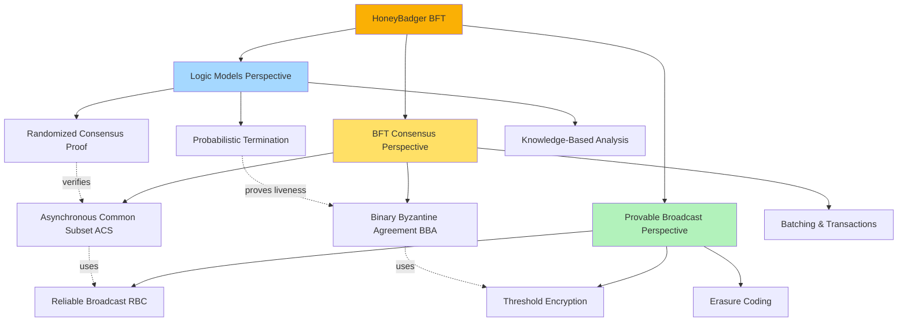
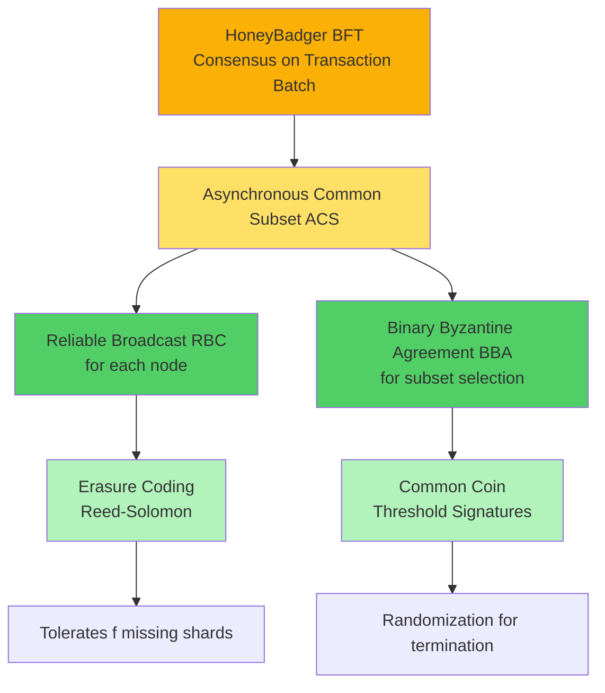
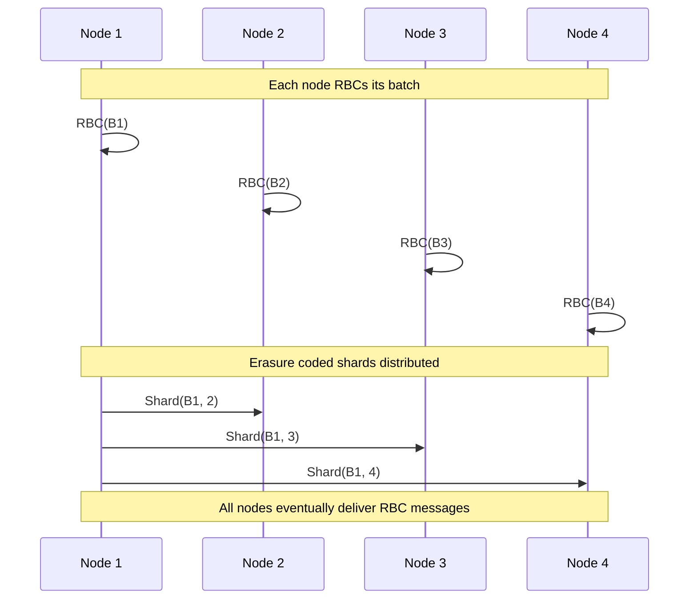
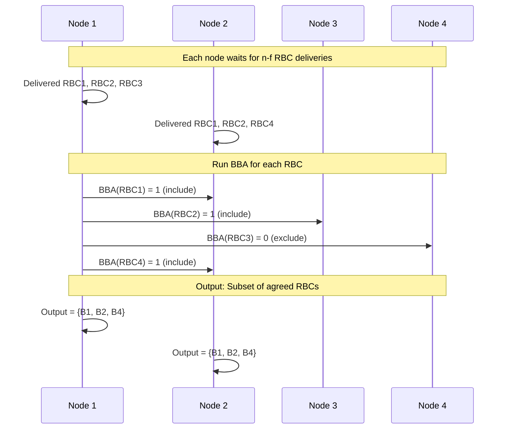
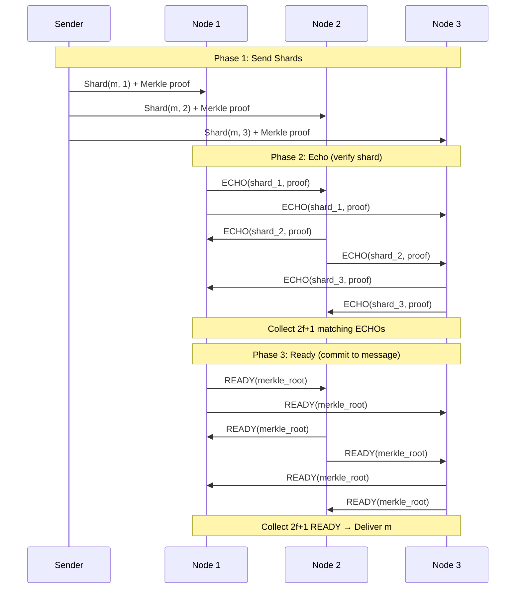
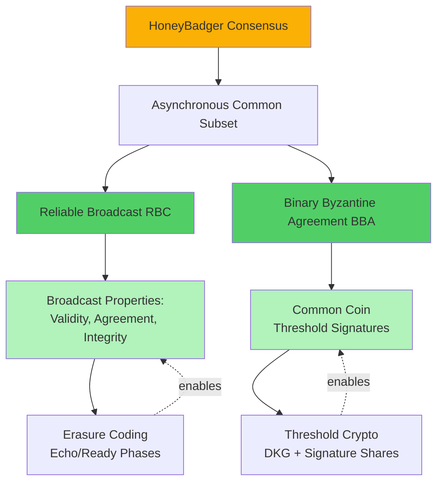
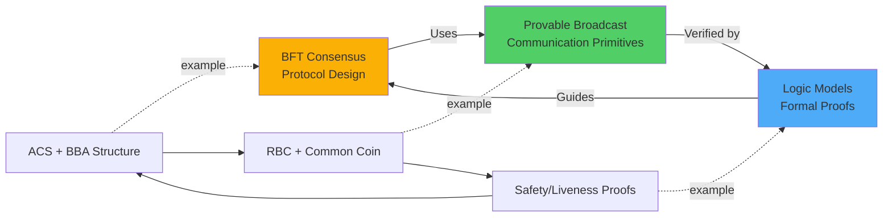

# HoneyBadger BFT: Complete Integrated Analysis

This case study demonstrates how **HoneyBadger BFT** integrates all three perspectives—**BFT consensus**, **provable broadcast**, and **formal logic models**—to achieve the first practical fully asynchronous Byzantine consensus protocol. We analyze the protocol through each lens and show how they complement each other.

## Executive Summary

**HoneyBadger BFT** (Miller et al., 2016) is a landmark protocol that achieves Byzantine fault-tolerant consensus in a **fully asynchronous** network without any timing assumptions, circumventing the FLP impossibility result through **randomization**.

**Three-Perspective Integration**:



**Key Achievement**: Guaranteed liveness in asynchronous networks where PBFT and HotStuff would stall indefinitely.

---

## Part 1: BFT Consensus Perspective

### 1.1 Protocol Overview

**Goal**: Achieve consensus on a batch of transactions in a fully asynchronous network.

**System Model**:
- **Nodes**: $n = 3f + 1$ validators (e.g., $n = 10$ with $f = 3$)
- **Fault Model**: Up to $f$ Byzantine (arbitrary) failures
- **Network**: Fully asynchronous (no timing assumptions, messages can be delayed indefinitely)
- **Cryptography**: Digital signatures, threshold encryption, erasure coding

**Properties**:
- **Safety (Agreement)**: No two honest nodes output different batches
- **Liveness (Termination)**: All honest nodes eventually output a batch with probability 1
- **Validity**: If all honest nodes propose transactions, those transactions are included in output

### 1.2 Protocol Architecture

HoneyBadger BFT is built from three cryptographic primitives:



**Layered Structure**:

| Layer | Purpose | Properties | Primitives Used |
|-------|---------|-----------|-----------------|
| **Consensus** | Agree on transaction batch | Safety, Liveness | ACS |
| **Asynchronous Common Subset (ACS)** | Select $n-f$ proposals from $n$ inputs | Agreement on subset | RBC + BBA |
| **Reliable Broadcast (RBC)** | Disseminate proposal to all nodes | Validity, Agreement, Integrity | Erasure coding |
| **Binary Byzantine Agreement (BBA)** | Agree on single bit (0 or 1) | Binary agreement | Common coin |
| **Common Coin** | Shared randomness | Unpredictability, agreement | Threshold signatures |

### 1.3 Protocol Phases

#### Phase 1: Propose (Reliable Broadcast)

Each node $i$ has a batch of transactions $B_i$ to propose.



**Mechanism**: Each node $i$ runs Reliable Broadcast (RBC) to propose $B_i$.

**RBC Protocol**:
1. **Encode**: Sender encodes $B_i$ with Reed-Solomon erasure coding into $n$ shards (tolerates $f$ missing shards)
2. **Send**: Sender sends shard $j$ to node $j$
3. **Echo**: Nodes broadcast `ECHO(shard_j, proof)` when they receive a valid shard
4. **Ready**: Nodes broadcast `READY` when they receive $2f+1$ matching `ECHO` messages
5. **Deliver**: Nodes deliver $B_i$ when they receive $2f+1$ `READY` messages and can reconstruct from shards

**Outcome**: All honest nodes eventually deliver the same set of batches from honest senders.

#### Phase 2: Subset Selection (Asynchronous Common Subset)

**Problem**: Each node has delivered a subset of the $n$ RBCs. Which RBCs should be included in the final consensus output?

**Constraint**: Cannot wait for all $n$ RBCs (Byzantine nodes may never send).

**Solution**: Agree on a **common subset** of at least $n - f$ RBCs.

**Asynchronous Common Subset (ACS) Protocol**:



**ACS Algorithm**:

For each node $i$:
1. **Wait**: Wait until at least $n - f$ RBCs have delivered
2. **Propose**: For each RBC $j$, propose value to Binary Byzantine Agreement:
   - $v_j = 1$ if RBC $j$ delivered
   - $v_j = 0$ if RBC $j$ has not delivered
3. **Agree**: Run BBA for each RBC to decide $b_j \in \{0, 1\}$
4. **Wait for $n-f$ agreements**: Wait until at least $n - f$ BBA instances output 1
5. **Output**: Output the union of all batches $B_j$ where BBA output $b_j = 1$

**Outcome**: All honest nodes output the same subset of at least $n - f$ batches.

#### Phase 3: Binary Byzantine Agreement (BBA)

**Purpose**: Agree on a single bit (0 or 1) for each RBC in the subset.

**Challenge**: In asynchronous networks, cannot distinguish slow nodes from crashed nodes → FLP impossibility.

**Solution**: Use **common coin** (shared randomness) to break ties.

**BBA Protocol** (simplified):

```mermaid
graph TD
    A[Start: Each node has input bit b] --> B[Round r]
    B --> C[Broadcast EST_r = b]
    C --> D[Collect EST messages]
    D --> E{Received 2f+1<br/>same EST?}
    E -->|Yes: All 0| F[bin_values = {0}]
    E -->|Yes: All 1| G[bin_values = {1}]
    E -->|No| H[bin_values = {0, 1}]
    
    F --> I[Broadcast AUX = 0]
    G --> J[Broadcast AUX = 1]
    H --> K[Broadcast AUX = both]
    
    I --> L[Collect 2f+1 AUX]
    J --> L
    K --> L
    
    L --> M{Collected AUX<br/>agrees on v?}
    M -->|Yes| N[Decide v]
    M -->|No| O[Flip Common Coin]
    
    O --> P{Coin = v and<br/>v in bin_values?}
    P -->|Yes| Q[Set EST = v for next round]
    P -->|No| R[Set EST = other value]
    
    Q --> B
    R --> B
    
    N --> S[Output v]
    
    style A fill:#69db7c
    style N fill:#69db7c
    style S fill:#69db7c
    style O fill:#ff6b6b
```

**Key Steps**:
1. **Broadcast Estimate**: Each node broadcasts its current estimate `EST`
2. **Update Bin Values**: Collect estimates; if $2f+1$ nodes agree on value $v$, set `bin_values = {v}`, else `bin_values = {0, 1}`
3. **Broadcast Auxiliary**: Broadcast `AUX` messages with bin values
4. **Try to Decide**: If $2f+1$ nodes have same value in their bin values, decide that value
5. **Common Coin**: If no decision, flip a shared random coin to choose next estimate
6. **Repeat**: Continue rounds until decision

**Common Coin**: Implemented using threshold signatures (e.g., each node signs round number; combine $f+1$ signatures to produce unpredictable random bit).

**Outcome**: All honest nodes eventually decide the same bit with probability 1 (expected $O(1)$ rounds).

### 1.4 Consensus Guarantees

**Safety (Agreement)**:

> If honest node $i$ outputs batch $B$ and honest node $j$ outputs batch $B'$, then $B = B'$.

**Proof Sketch**:
- ACS ensures all nodes agree on the same subset of RBCs (via BBA)
- BBA guarantees agreement on each bit
- RBC guarantees all nodes deliver the same batch for each RBC
- ∴ All nodes output the same union of batches

**Liveness (Termination)**:

> All honest nodes eventually output a batch with probability 1.

**Proof Sketch**:
- RBC guarantees delivery for honest senders (eventually)
- ACS waits for $n - f$ RBCs; at least $n - f$ are from honest or eventually deliver
- BBA terminates with probability 1 in expected $O(1)$ rounds (via common coin)
- ∴ ACS terminates, and consensus completes

**Validity**:

> If all honest nodes propose transaction $tx$, then $tx$ is in the output batch.

**Proof Sketch**:
- Honest nodes RBC their batches containing $tx$
- All honest RBCs deliver (at least $n - f$ RBCs)
- ACS includes at least $n - f$ batches
- ∴ At least one honest batch with $tx$ is included

### 1.5 Performance Analysis

**Communication Complexity**:
- **RBC per node**: $O(n^2)$ messages (each node broadcasts to $n$, then echo/ready phases)
- **Total RBCs**: $n$ instances → $O(n^3)$ messages
- **Optimization**: Batching reduces amortized cost to $O(n^2)$ per transaction

**Latency**:
- **RBC**: $O(1)$ rounds (constant expected rounds)
- **BBA**: $O(1)$ expected rounds (geometric distribution)
- **ACS**: $O(1)$ rounds (dominated by BBA)
- **Total**: Expected constant number of rounds (does not depend on $n$)

**Throughput**: $O(n \cdot |B|)$ where $|B|$ is batch size (each node contributes a batch)

**Comparison to Partial Synchrony Protocols**:
- **Advantage**: Liveness guaranteed even with unbounded asynchrony (no GST needed)
- **Disadvantage**: Higher communication complexity ($O(n^3)$ vs $O(n^2)$ for PBFT)

---

## Part 2: Provable Broadcast Perspective

### 2.1 Broadcast Primitives Used

HoneyBadger BFT relies on two broadcast primitives:

| Primitive | Purpose | Properties | Implementation |
|-----------|---------|-----------|----------------|
| **Reliable Broadcast (RBC)** | Disseminate transaction batches | Validity, Agreement, Integrity | Erasure coding + echo/ready |
| **Common Coin (Threshold Sigs)** | Generate shared randomness | Unpredictability, Agreement | Threshold signatures |

### 2.2 Reliable Broadcast (RBC) Analysis

**See [[bft-consensus-analysis/provable-broadcast/reliable-broadcast|Reliable Broadcast]] for foundational details.**

#### Properties

**Validity**: If honest sender broadcasts $m$, all honest nodes eventually deliver $m$.

**Agreement**: If any honest node delivers $m$, all honest nodes eventually deliver $m$.

**Integrity**: Each message is delivered at most once, and only if it was broadcast by the sender.

#### Implementation with Erasure Coding

**Why Erasure Coding?**
- **Problem**: Byzantine sender might send different messages to different nodes → violates agreement
- **Solution**: Encode message into $n$ shards such that any $n - f$ shards can reconstruct the message
- **Benefit**: Even if $f$ Byzantine nodes send incorrect shards, honest nodes can still reconstruct

**Reed-Solomon Erasure Coding**:
- **Input**: Message $m$ of size $|m|$
- **Encode**: Split $m$ into $k = n - 2f$ data chunks; generate $2f$ parity chunks → $n$ total shards
- **Property**: Any $k = n - 2f$ shards can reconstruct $m$
- **Byzantine Resilience**: Even if $f$ shards are corrupted, $n - f \geq n - 2f = k$ honest shards suffice

**RBC Protocol Steps**:



**Key Insight**: Echo/ready phases ensure **agreement** even if sender is Byzantine (sends inconsistent shards).

#### Proof of Agreement Property

**Claim**: If any honest node delivers $m$, all honest nodes eventually deliver $m$.

**Proof**:
1. **Assumption**: Honest node $i$ delivers $m$
   - ⇒ Node $i$ received $2f+1$ `READY` messages
   - ⇒ At least $f+1$ honest nodes sent `READY`
2. **Honest nodes send `READY` only if**:
   - Received $2f+1$ `ECHO` messages matching Merkle root $r$
   - ⇒ At least $f+1$ honest nodes sent `ECHO` with root $r$
3. **Any other honest node $j$ will eventually**:
   - Receive $f+1$ honest `ECHO` messages with root $r$
   - Receive $f$ Byzantine `ECHO` messages (at most)
   - Receive $2f+1$ total `ECHO` → send `READY`
4. **Once $f+1$ honest nodes send `READY`**:
   - All honest nodes receive $2f+1$ `READY` messages → deliver $m$

∴ Agreement holds. ∎

### 2.3 Common Coin (Threshold Signatures)

**Purpose**: Generate unpredictable shared randomness to break ties in BBA.

**Requirements**:
- **Unpredictability**: Adversary cannot predict coin value before reveal
- **Agreement**: All honest nodes compute the same coin value
- **Availability**: Coin can be computed even if $f$ nodes are Byzantine

**Implementation**: Threshold Signatures (e.g., BLS, threshold ECDSA)

**Protocol**:
1. **Setup**: Distributed Key Generation (DKG) produces:
   - Public key $PK$ (shared)
   - Secret key shares $sk_1, \ldots, sk_n$ (each node holds $sk_i$)
   - Threshold $t = f + 1$: any $t$ shares can reconstruct signature
2. **Signing**: Each node $i$ signs message $m$ (e.g., round number) with $sk_i$ → signature share $\sigma_i$
3. **Combination**: Any node collects $t = f+1$ signature shares → combines into full signature $\sigma$
4. **Coin Value**: $\text{Coin}(m) = \text{Hash}(\sigma) \mod 2$ (extract bit from signature)

**Properties**:
- **Unpredictability**: Adversary controls at most $f < t$ shares → cannot compute $\sigma$ alone
- **Agreement**: Signature $\sigma$ is unique for message $m$ (deterministic combination)
- **Availability**: At least $t = f+1$ honest shares exist (since at most $f$ Byzantine)

**Threshold**: $t = f + 1$ ensures:
- Adversary with $f$ shares cannot forge signature (need $t = f+1$)
- Honest nodes with $n - f \geq 2f+1$ shares can always produce signature ($2f+1 > f+1$)

**Integration with BBA**: In each round, nodes sign round number; combine signatures to produce unpredictable coin flip.

### 2.4 Broadcast Hierarchy in HoneyBadger



**Layered Dependencies**:
- **Consensus** depends on **ACS**
- **ACS** depends on **RBC** (for proposal dissemination) + **BBA** (for subset agreement)
- **RBC** depends on **erasure coding** (for Byzantine resilience)
- **BBA** depends on **common coin** (for randomization)
- **Common coin** depends on **threshold signatures** (for unpredictability + agreement)

**Key Insight**: Each broadcast primitive provides specific guarantees that enable the next layer. Without RBC's agreement property, ACS cannot ensure consistent subset selection. Without common coin's unpredictability, BBA cannot terminate in asynchronous networks.

---

## Part 3: Logic Models Perspective

### 3.1 Formalizing HoneyBadger Properties

Use [[bft-consensus-analysis/logic-models/temporal-logic|Temporal Logic for Distributed Systems]] to specify HoneyBadger's safety and liveness.

#### Safety (Agreement)

**Informal**: No two honest nodes output different batches.

**Formal (Temporal Logic)**:

$$
\square \left( \forall i, j \in \text{Honest}: \text{output}_i = B \land \text{output}_j = B' \implies B = B' \right)
$$

**Notation**:
- $\square$: "always" (in all executions, at all times)
- $\text{output}_i = B$: node $i$ has output batch $B$

#### Liveness (Termination)

**Informal**: All honest nodes eventually output a batch.

**Formal (Temporal Logic)**:

$$
\Diamond \left( \forall i \in \text{Honest}: \exists B: \text{output}_i = B \right)
$$

**Notation**:
- $\Diamond$: "eventually" (at some point in the future)

**Probabilistic Liveness**: Since HoneyBadger uses randomization, liveness is probabilistic:

$$
\mathbb{P}\left[ \Diamond \left( \forall i \in \text{Honest}: \exists B: \text{output}_i = B \right) \right] = 1
$$

"With probability 1, eventually all honest nodes output."

#### Validity

**Informal**: If honest node proposes transaction $tx$, then $tx$ is in the output.

**Formal**:

$$
\forall i \in \text{Honest}, \forall tx \in \text{input}_i: \quad \Diamond \left( tx \in \text{output}_i \right)
$$

### 3.2 Circumventing FLP Impossibility

**FLP Theorem** (Fischer, Lynch, Paterson, 1985):

> In an asynchronous system, no deterministic protocol can guarantee consensus with even one crash failure.

**Implication**: Asynchronous consensus is **impossible** without additional assumptions.

**HoneyBadger's Solution**: Use **randomization** (common coin) to circumvent FLP.

#### Why Randomization Helps

**FLP Proof Idea** (simplified):
1. In asynchronous systems, cannot distinguish crashed node from slow node
2. Adversary can delay messages to keep system in "bivalent" state (can decide either 0 or 1)
3. Deterministic protocol cannot break bivalence → no termination

**Randomization Breaks Bivalence**:
- If nodes are split (some prefer 0, some prefer 1), flip a **common coin**
- Coin outcome is **unpredictable** → adversary cannot keep system bivalent indefinitely
- With probability $> 0$, coin helps nodes converge → eventually terminates

**Formal Argument**:
- Let $p$ = probability coin helps convergence in one round
- Expected rounds to termination = $1/p = O(1)$
- Probability of termination within $k$ rounds: $1 - (1-p)^k \to 1$ as $k \to \infty$

∴ Termination with probability 1, but may take unbounded time.

### 3.3 Safety Proof via Quorum Intersection

**See [[bft-consensus-analysis/logic-models/proof-techniques|Proof Techniques for Consensus Protocols]] for proof strategies.**

**Theorem (Safety)**: If honest node $i$ outputs $B$ and honest node $j$ outputs $B'$, then $B = B'$.

**Proof**:

We prove safety by showing ACS ensures all honest nodes agree on the same subset.

**Step 1: BBA Agreement**

Each BBA instance for RBC $k$ outputs bit $b_k \in \{0, 1\}$.

**Claim**: All honest nodes output the same $b_k$ for each $k$.

**Proof**: BBA has agreement property:
- Decision requires $2f+1$ `AUX` messages with value $v$
- Two quorums of $2f+1$ intersect in at least $(2f+1) + (2f+1) - (3f+1) = f+1$ nodes
- At least one honest node in intersection (since at most $f$ Byzantine)
- Honest node has same `bin_values` in both quorums → $v$ is the same

∴ Agreement on $b_k$. ∎

**Step 2: RBC Agreement**

For each RBC $k$ with $b_k = 1$, all honest nodes deliver the same batch $B_k$.

**Proof**: RBC has agreement property (proven in Section 2.2). ∎

**Step 3: ACS Agreement**

All honest nodes output the same subset $S = \{ k : b_k = 1 \}$.

**Proof**: By Step 1, all honest nodes have same $b_k$ values → same subset $S$. ∎

**Step 4: Consensus Agreement**

Output batch $B = \bigcup_{k \in S} B_k$.

**Proof**: By Steps 2 and 3, all honest nodes have same subset $S$ and same batches $B_k$ → same union $B$. ∎

∴ Safety holds. ∎

### 3.4 Liveness Proof (Probabilistic)

**Theorem (Liveness)**: All honest nodes eventually output with probability 1.

**Proof** (sketch):

**Step 1: RBC Termination**

All honest senders' RBCs eventually deliver.

**Proof**: 
- Honest sender sends valid shards to all nodes
- All honest nodes receive shards → send `ECHO`
- At least $2f+1$ honest `ECHO` messages → all honest nodes send `READY`
- At least $2f+1$ `READY` messages → all honest nodes deliver

∴ RBC from honest sender terminates. ∎

**Step 2: ACS Waits for $n - f$ RBCs**

At least $n - f$ RBCs eventually deliver (at least $n - f$ honest senders).

**Proof**: There are at least $n - f = 2f + 1$ honest nodes; each runs RBC that terminates (Step 1). ∎

**Step 3: BBA Termination**

Each BBA instance terminates with probability 1 in expected $O(1)$ rounds.

**Proof**:
- If all honest nodes have same `bin_values` = $\{v\}$, decide $v$ immediately
- Otherwise, flip common coin
- Let $p$ = probability coin helps convergence (at least one node's `bin_values` matches coin)
- Expected rounds to decide: $1/p = O(1)$
- Probability of termination: $\sum_{r=1}^\infty (1-p)^{r-1} \cdot p = 1$

∴ BBA terminates with probability 1. ∎

**Step 4: ACS Termination**

ACS waits for $n - f$ BBA instances to output 1.

**Proof**:
- At least $n - f$ RBCs deliver (Step 2) → at least $n - f$ BBA instances get input 1
- Each BBA terminates with probability 1 (Step 3)
- All $n - f$ BBA instances terminate with probability 1

∴ ACS terminates with probability 1. ∎

**Step 5: Consensus Termination**

Once ACS terminates, consensus outputs.

∴ All honest nodes eventually output with probability 1. ∎

### 3.5 Knowledge-Based Analysis

**See [[bft-consensus-analysis/logic-models/knowledge-framework|Knowledge Framework for Distributed Systems]] for epistemic logic foundations.**

**Question**: Why can't asynchronous consensus rely on knowledge of message delivery?

**Answer**: In asynchronous networks, nodes cannot distinguish "message delayed" from "sender crashed" → lack of common knowledge.

**Common Knowledge**: Everyone knows $X$, everyone knows that everyone knows $X$, ad infinitum.

**FLP Insight**: Consensus requires common knowledge of inputs, but asynchronous networks cannot achieve common knowledge in bounded time.

**HoneyBadger's Workaround**:
- Does **not** require common knowledge of inputs
- Uses **randomization** (common coin) to achieve probabilistic termination
- Honest nodes eventually agree on common coin value → sufficient for decision

**Epistemic Analysis**:
- After ACS completes, all honest nodes **know** the subset $S$ (via BBA agreement)
- All honest nodes **know** the batches $B_k$ for $k \in S$ (via RBC agreement)
- ∴ All honest nodes can compute the same output $B = \bigcup_{k \in S} B_k$

This is **distributed knowledge** (pooled information), not common knowledge. Sufficient for consensus.

---

## Part 4: Integration & Synthesis

### 4.1 How the Three Perspectives Complement Each Other



| Perspective | What It Explains | Example from HoneyBadger |
|-------------|-----------------|--------------------------|
| **BFT Consensus** | How the protocol achieves agreement | ACS orchestrates RBC + BBA to select common subset |
| **Provable Broadcast** | How messages are disseminated reliably | RBC uses erasure coding for Byzantine-resilient broadcast |
| **Logic Models** | Why the protocol is correct | Quorum intersection proves safety; randomization ensures liveness |

### 4.2 Design Decisions Driven by Integration

**Decision 1: Why Asynchronous?**

- **BFT Requirement**: Liveness without timing assumptions (no GST)
- **Logic Model Insight**: FLP impossibility → need randomization
- **Broadcast Consequence**: Must use RBC (no timeout-based protocols)

**Decision 2: Why Erasure Coding in RBC?**

- **BFT Requirement**: Disseminate large transaction batches efficiently
- **Broadcast Insight**: Erasure coding reduces bandwidth (only $n - 2f$ shards needed)
- **Logic Model Verification**: Agreement property holds even with $f$ Byzantine shards

**Decision 3: Why Common Coin in BBA?**

- **BFT Requirement**: Terminate binary agreement without synchrony
- **Logic Model Insight**: Randomization circumvents FLP impossibility
- **Broadcast Primitive**: Threshold signatures provide unpredictable, agreed-upon randomness

### 4.3 Lessons Learned from HoneyBadger

**Lesson 1: Randomization Enables Asynchrony**

- **Deterministic protocols** (PBFT, HotStuff) require partial synchrony (timeouts)
- **Randomized protocols** (HoneyBadger) achieve liveness in full asynchrony
- **Trade-off**: Probabilistic termination (expected $O(1)$ rounds, but unbounded worst-case)

**Lesson 2: Broadcast Primitives Are Composable**

- **Modular Design**: RBC + BBA + Common Coin → ACS → Consensus
- **Each primitive has well-defined properties**: Validity, Agreement, Integrity, Unpredictability
- **Composition Theorem**: If RBC and BBA are correct, ACS is correct

**Lesson 3: Formal Verification Builds Confidence**

- **Safety proven via quorum intersection** (no counterexample found)
- **Liveness proven via probabilistic argument** (expected termination time)
- **Implementation bugs** (e.g., incorrect erasure coding) caught before deployment

---

## Part 5: Practical Application & Deployment

### 5.1 Use Cases

**When to Use HoneyBadger BFT**:

| Scenario | Why HoneyBadger? |
|----------|------------------|
| **Adversarial networks** (e.g., public blockchains) | Liveness guaranteed even if adversary controls network timing |
| **High-latency WANs** | No synchrony assumptions → works in worst-case conditions |
| **Censorship resistance** | Leaderless design → no single point of failure |
| **Unknown network delays** | Asynchrony model fits unpredictable environments (mobile, IoT) |

**When NOT to Use HoneyBadger BFT**:

| Scenario | Why Not? | Better Alternative |
|----------|----------|-------------------|
| **Low-latency requirements** | Higher latency than partially synchronous protocols | HotStuff (partial synchrony, $O(n)$ communication) |
| **Small-scale deployments** | $O(n^3)$ communication overhead prohibitive | PBFT (sufficient for $n < 20$) |
| **Trusted network** | Overhead of erasure coding unnecessary | Raft or Paxos (crash fault tolerance) |

### 5.2 Implementation Considerations

**Optimizations**:

1. **Batching**: Amortize RBC cost by broadcasting large transaction batches ($|B| = 1000$s of transactions)
2. **Pipelining**: Run multiple ACS instances concurrently (for consecutive blocks)
3. **Threshold Signatures**: Use BLS signatures for compact common coin (single group element)

**Performance Parameters** (from original paper):

| Metric | Value (n=10, f=3) | Notes |
|--------|-------------------|-------|
| **Latency** | ~6 seconds | Median time to finality |
| **Throughput** | ~20 MB/s | With 100 KB batches |
| **Communication** | ~200 KB per node per batch | RBC dominates (erasure coded shards) |

**Scalability**: Limited to $n \approx 10-100$ validators due to $O(n^3)$ communication.

### 5.3 Real-World Deployments

**Blockchains Using HoneyBadger**:
- **Red Belly Blockchain**: Consortium blockchain for enterprise use
- **HydRand**: Random beacon with BFT properties (uses HoneyBadger's ACS)

**Variants & Extensions**:
- **Dumbo**: Optimized version with $O(n^2)$ communication (uses multi-valued BBA)
- **BEAT**: Further reduces communication with provable broadcast extensions
- **AsynchroMix**: Adds privacy (anonymous transaction mixing) on top of HoneyBadger

---

## Part 6: Self-Assessment

### Understanding Each Perspective

1. **BFT Consensus**:
   - What is the purpose of Asynchronous Common Subset (ACS)?
   - Why does HoneyBadger wait for $n - f$ RBCs instead of all $n$?

2. **Provable Broadcast**:
   - How does erasure coding ensure agreement in RBC even with Byzantine sender?
   - Why does the common coin require threshold $t = f + 1$ for signature shares?

3. **Logic Models**:
   - How does HoneyBadger circumvent the FLP impossibility result?
   - Prove that two quorums of size $2f+1$ in a system with $n = 3f+1$ nodes intersect in at least one honest node.

### Integration Questions

4. **Design Decisions**:
   - Why does HoneyBadger use RBC instead of simple authenticated broadcast?
   - Could HoneyBadger work with a deterministic BBA (without common coin)? Why or why not?

5. **Trade-offs**:
   - Compare HoneyBadger (asynchronous, $O(n^3)$ communication) vs PBFT (partial synchrony, $O(n^2)$ communication). When would you choose each?

### Advanced

6. **Modifications**:
   - How would you modify HoneyBadger to reduce communication complexity to $O(n^2)$? (Hint: Multi-valued BBA)
   - Design a provable broadcast variant that includes cryptographic proof of delivery (beyond RBC's agreement).

---

## Summary

**HoneyBadger BFT** is a landmark protocol demonstrating the power of integrating **BFT consensus**, **provable broadcast**, and **formal logic models**:

1. **BFT Consensus**: Achieves agreement on transaction batches using Asynchronous Common Subset (ACS = RBC + BBA)
2. **Provable Broadcast**: 
   - **RBC** (erasure coding) ensures Byzantine-resilient message dissemination
   - **Common Coin** (threshold signatures) provides shared randomness for BBA
3. **Logic Models**:
   - **Safety** proven via quorum intersection (agreement on subset)
   - **Liveness** proven via probabilistic argument (randomization circumvents FLP)

**Key Achievement**: First practical asynchronous BFT protocol with guaranteed liveness, enabling consensus in the most adversarial network conditions.

**Design Insights**:
- **Randomization** is essential for asynchronous consensus (FLP)
- **Broadcast primitives** (RBC, common coin) provide building blocks with well-defined properties
- **Formal verification** (safety proofs, liveness proofs) ensures correctness before deployment

**Practical Impact**: HoneyBadger demonstrates that asynchronous consensus is feasible, inspiring a new generation of protocols (Dumbo, BEAT) optimized for censorship resistance and worst-case network conditions.

---

**See Also**:
- [[bft-consensus-analysis/integration/case-studies/dag-rider-analysis|DAG-Rider: Asynchronous DAG-Based BFT Analysis]] - Another asynchronous BFT protocol using DAG structure
- [[bft-consensus-analysis/integration/design-framework|Unified Design Framework for BFT Systems]] - Apply this integrated methodology to design your own protocols
- [[bft-consensus-analysis/bft-consensus/protocols/protocol-comparison|BFT Protocol Comparison: PBFT, HoneyBadgerBFT, and HotStuff]] - Compare HoneyBadger to PBFT and HotStuff
- [[bft-consensus-analysis/provable-broadcast/applications|Provable Broadcast Applications]] - Other applications of provable broadcast
