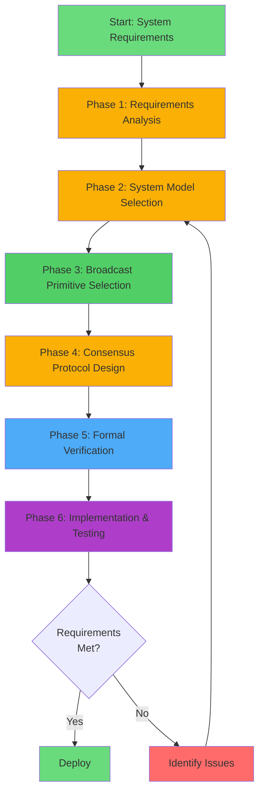
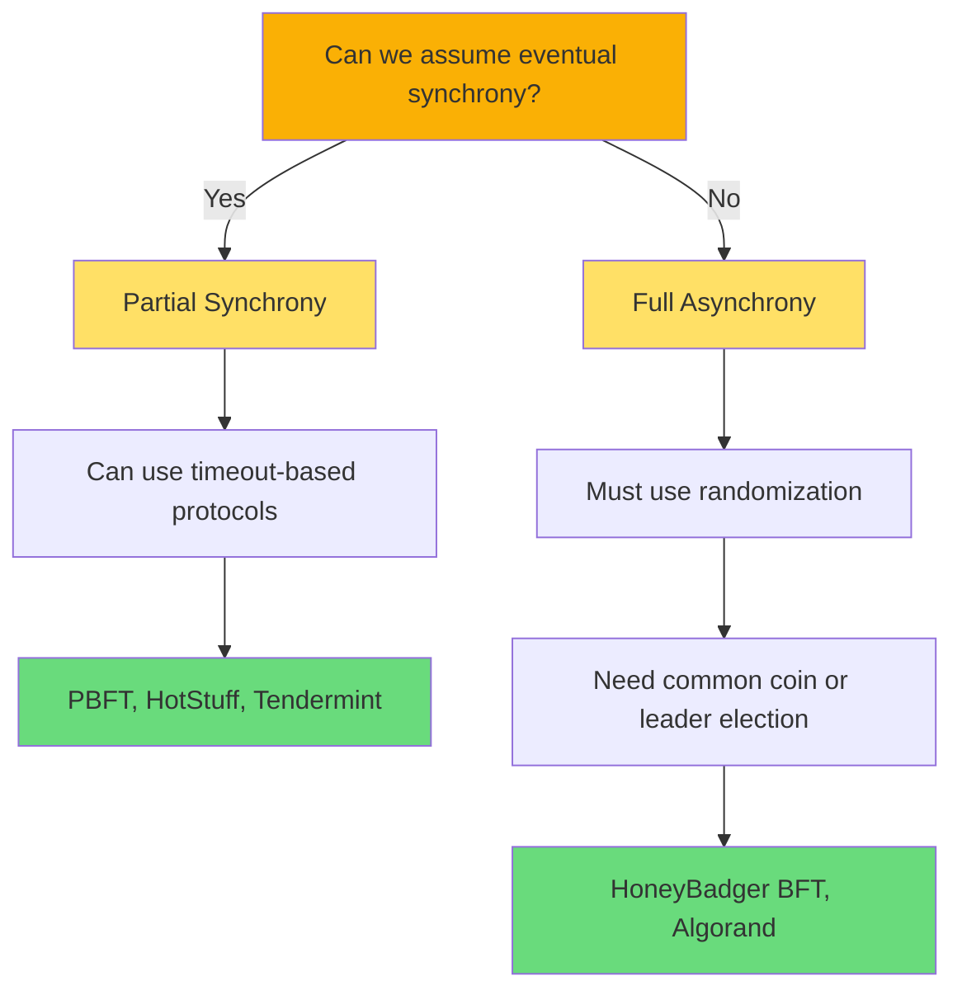
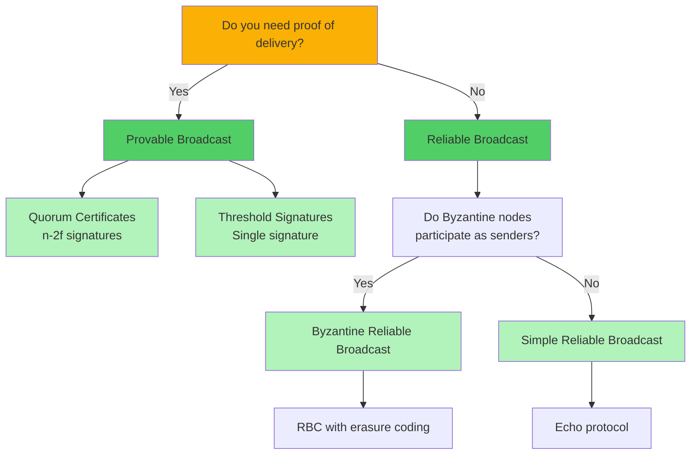
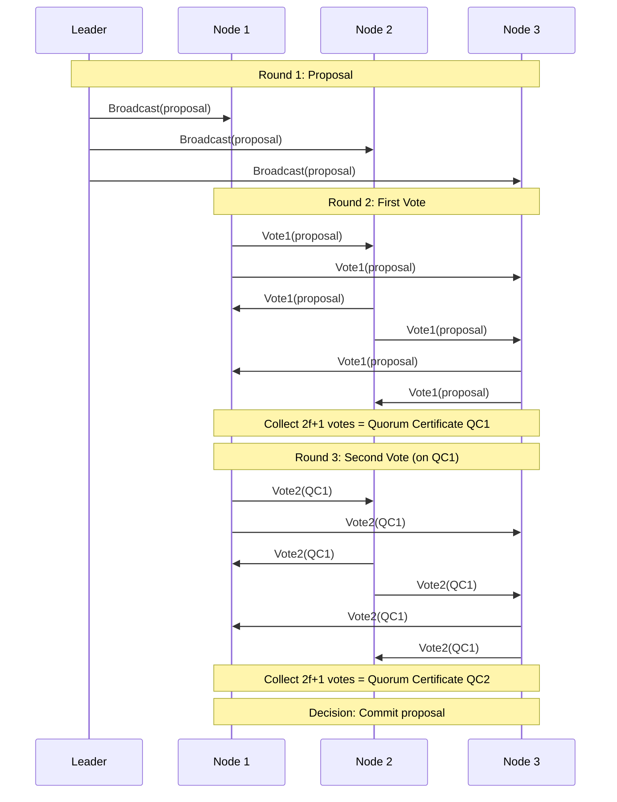
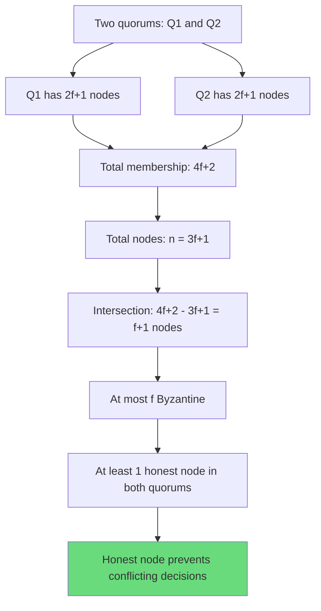

# Unified Design Framework for BFT Systems

This framework provides a systematic methodology for designing Byzantine Fault Tolerant consensus protocols by integrating **BFT consensus theory**, **provable broadcast mechanisms**, and **formal logic models**. Follow this framework to design correct, efficient, and verifiable distributed systems.

## Overview: The Design Process



**Framework Principles**:
1. **Logic-first**: Formalize requirements before designing protocols
2. **Broadcast-aware**: Choose communication primitives that match guarantees needed
3. **Verification-driven**: Prove correctness at each design stage
4. **Iterative**: Refine design based on verification feedback

---

## Phase 1: Requirements Analysis

**Goal**: Translate application needs into formal specifications using logic models.

### Step 1.1: Identify Application Requirements

**Questions to Answer**:

| Question | Purpose | Example |
|----------|---------|---------|
| What are we agreeing on? | Define consensus subject | Transaction batches, block proposals, configuration changes |
| Who participates? | Define node set | Fixed validator set, dynamic membership, permissioned/permissionless |
| What adversarial behavior must we tolerate? | Define threat model | Byzantine nodes, network attacks, rational adversaries |
| What are the performance goals? | Define constraints | Latency < 1s, throughput > 10k TPS, $n$ = 100-1000 nodes |
| What are the deployment constraints? | Define environment | WAN, LAN, mobile networks, blockchain, enterprise |

**Example: Blockchain Consensus**

```yaml
Application: Public blockchain consensus
Subject: Batches of transactions (blocks)
Participants: Dynamic set of validators (stake-weighted)
Adversary: Up to 33% Byzantine by stake
Performance: Finality < 10 seconds, 1000+ TPS
Environment: Wide-area network (WAN), high latency variance
```

### Step 1.2: Formalize Safety and Liveness

Use [[../logic-models/temporal-logic|temporal logic]] to specify properties precisely.

**Safety Properties** (something bad never happens):

$$
\square \left( \forall \text{ honest nodes } i, j: \quad \text{decided}_i(v) \land \text{decided}_j(w) \implies v = w \right)
$$

"Always, if two honest nodes decide, they decide the same value."

**Liveness Properties** (something good eventually happens):

$$
\Diamond \left( \forall \text{ honest nodes } i: \quad \text{decided}_i(v) \text{ for some } v \right)
$$

"Eventually, all honest nodes decide some value."

**Additional Properties**:
- **Validity**: If all honest nodes propose $v$, then all honest nodes decide $v$
- **Integrity**: Each node decides at most once
- **Irrevocability**: Once decided, the value cannot change (finality)

### Step 1.3: Define Success Metrics

| Metric | Measurement | Target |
|--------|-------------|--------|
| **Safety Violation Rate** | Probability of disagreement | 0% (proven impossible) |
| **Liveness Under Adversary** | Time to finality with $f$ Byzantine | < target latency |
| **Communication Complexity** | Messages per consensus decision | $O(n)$ or $O(n^2)$ acceptable |
| **Cryptographic Overhead** | Signature verification time | < 10% of total latency |
| **Fault Tolerance** | Maximum $f$ tolerated | $f < n/3$ Byzantine |

**Output**: Formal specification document with safety/liveness properties and performance targets.

---

## Phase 2: System Model Selection

**Goal**: Choose synchrony model and fault model based on requirements and impossibility results.

### Step 2.1: Understand Impossibility Results

Use [[../logic-models/overview|logic models]] to understand fundamental limits:

| Impossibility Result | System Model | Implication |
|---------------------|--------------|-------------|
| **FLP (1985)** | Asynchronous, deterministic, 1 crash | Must use randomization or partial synchrony |
| **DLS (1988)** | Asynchronous, Byzantine | Requires $n > 3f$ (need $n \geq 3f+1$) |
| **CAP Theorem** | Network partitions possible | Cannot have consistency + availability |

**Decision Tree**:



### Step 2.2: Select Synchrony Model

**Synchrony Models**:

1. **Synchronous**:
   - **Assumption**: Known upper bound $\Delta$ on message delivery time
   - **BFT Protocols**: Nakamoto consensus (Bitcoin PoW), early BFT protocols
   - **Trade-off**: Strong guarantees but unrealistic in practice (network delays vary)

2. **Partially Synchronous** ⭐ *Most Common*:
   - **Assumption**: Unknown $\Delta$ exists, or network is synchronous after unknown time GST
   - **BFT Protocols**: [[../bft-consensus/protocols/pbft|PBFT]], [[../bft-consensus/protocols/hotstuff|HotStuff]], Tendermint
   - **Trade-off**: Safety always holds; liveness guaranteed after synchrony period

3. **Asynchronous**:
   - **Assumption**: No timing assumptions; messages can be arbitrarily delayed
   - **BFT Protocols**: [[../bft-consensus/protocols/honeybadger-bft|HoneyBadger BFT]], BEAT, Dumbo
   - **Trade-off**: Liveness always holds (probabilistic); requires randomization

**Selection Guidance**:

| Use Case | Best Model | Rationale |
|----------|-----------|-----------|
| Blockchain (public) | Asynchronous or Partial Synchrony | Adversary can control network timing |
| Blockchain (permissioned) | Partial Synchrony | Known validators, reasonable network assumptions |
| Data Center Replication | Partial Synchrony | Controlled network, but failures happen |
| IoT / Mobile | Asynchronous | Unpredictable network delays |

### Step 2.3: Select Fault Model

**Fault Models**:

| Fault Model | Behavior | BFT Threshold | Use Case |
|-------------|----------|---------------|----------|
| **Crash** | Nodes stop responding | $f < n/2$ | Benign failures only |
| **Omission** | Nodes drop messages | $f < n/2$ | Network issues |
| **Byzantine** | Arbitrary behavior | $f < n/3$ | Malicious adversaries |

**Byzantine Fault Sub-Models**:
- **Static adversary**: Set of $f$ Byzantine nodes fixed at start
- **Adaptive adversary**: Can corrupt nodes during execution (harder)
- **Rational adversaries**: Profit-maximizing but not arbitrary (e.g., blockchain mining)

**Selection**: For BFT consensus, always assume **Byzantine faults** with $f < n/3$.

### Step 2.4: Define Cryptographic Assumptions

| Primitive | Assumption | Used For |
|-----------|-----------|----------|
| **Digital Signatures** | Existentially unforgeable under chosen message attack (EUF-CMA) | Message authentication, non-repudiation |
| **Hash Functions** | Collision resistance | Content addressing, commitment schemes |
| **Threshold Signatures** | Discrete log hardness, trusted setup or distributed key generation | Compact quorum certificates |
| **Verifiable Random Functions (VRF)** | Uniqueness, unpredictability | Leader election, common coin |

**Output**: System model document specifying synchrony assumptions, fault model ($n, f$), and cryptographic primitives.

---

## Phase 3: Broadcast Primitive Selection

**Goal**: Choose communication primitives that provide the guarantees needed for consensus.

### Step 3.1: Map Consensus Properties to Broadcast Properties

Use [[relationships|the relationships]] between BFT consensus and provable broadcast:

| Consensus Requirement | Broadcast Property | Primitive |
|-----------------------|-------------------|-----------|
| Safety (no disagreement) | **Agreement**: All honest nodes deliver same message | Any reliable broadcast |
| Validity (correct proposal accepted) | **Validity**: Honest sender's message delivered correctly | Reliable broadcast |
| Non-repudiation (prove delivery) | **Provability**: Cryptographic proof of delivery | [[../provable-broadcast/provable-broadcast|Provable broadcast]] |
| Censorship resistance | **Guaranteed delivery**: Byzantine nodes can't block messages | Byzantine reliable broadcast |
| Efficiency (low overhead) | **Compact proofs**: $O(1)$ or $O(\log n)$ certificate size | Threshold signatures |

### Step 3.2: Broadcast Primitive Decision Tree



### Step 3.3: Broadcast Primitive Catalog

#### Option 1: Reliable Broadcast (RBC)

**Properties**: Validity, Agreement, Integrity  
**Fault Tolerance**: Tolerates $f < n/3$ Byzantine senders  
**Communication**: $O(n^2)$ messages, $O(n \cdot |m|)$ total bandwidth  
**Implementation**: Erasure coding + echo/ready phases

**When to Use**:
- Asynchronous consensus (HoneyBadger BFT)
- Large message payloads (erasure coding reduces bandwidth)
- Don't need compact delivery proofs

**See [[../provable-broadcast/reliable-broadcast]] for details.**

#### Option 2: Provable Broadcast

**Properties**: Validity, Agreement, Integrity, **Provability**  
**Fault Tolerance**: $f < n/3$ Byzantine  
**Communication**: $O(n^2)$ messages for quorum certificates  
**Implementation**: Digital signatures + quorum certificates (n - 2f signatures)

**When to Use**:
- Need proof of delivery for accountability
- Nodes must prove they delivered messages to external observers
- Blockchain state machine replication

**See [[../provable-broadcast/provable-broadcast]] for details.**

#### Option 3: Threshold Signature Broadcast

**Properties**: Provability with compact certificates  
**Fault Tolerance**: $f < n/3$ Byzantine  
**Communication**: $O(n)$ messages (leader aggregates signatures)  
**Implementation**: BLS threshold signatures or threshold ECDSA

**When to Use**:
- Leader-based protocols (PBFT, HotStuff)
- Need compact quorum certificates ($O(1)$ size)
- Can afford trusted setup or DKG

**Advantage**: Reduces communication from $O(n^2)$ to $O(n)$ for quorum certificates.

#### Option 4: Authenticated Broadcast (Simple)

**Properties**: Validity, Agreement (under partial synchrony)  
**Fault Tolerance**: $f < n/3$ Byzantine  
**Communication**: $O(n)$ messages (leader sends to all)  
**Implementation**: Digital signatures

**When to Use**:
- Partially synchronous model (can use timeouts)
- Leader-based protocols
- Small messages

**Limitation**: Requires synchrony for liveness; leader can censor messages.

### Step 3.4: Choose Broadcast Primitive

**Example Decision Matrix**:

| Protocol Design | Synchrony Model | Message Size | Accountability? | Best Broadcast Primitive |
|-----------------|----------------|--------------|----------------|--------------------------|
| Blockchain consensus | Asynchronous | Large (batches) | Yes | RBC + provability extension |
| Permissioned BFT | Partial Sync | Small | Yes | Threshold sig broadcast |
| High-throughput consensus | Asynchronous | Large | No | RBC with erasure coding |
| Leader-based voting | Partial Sync | Small | Yes | Authenticated broadcast + quorum certs |

**Output**: Selected broadcast primitives with justification for each use in protocol.

---

## Phase 4: Consensus Protocol Design

**Goal**: Design the BFT consensus protocol by orchestrating broadcast primitives and voting phases.

### Step 4.1: Protocol Architecture Pattern

**Common BFT Protocol Structure**:



### Step 4.2: Design Components

#### Component 1: Proposal Mechanism

**Leader-Based**:
- Single leader proposes value
- Leader election: Round-robin, stake-weighted random, VRF
- Efficiency: $O(n)$ communication when leader honest
- Failure mode: View change when leader Byzantine or unavailable

**Leaderless**:
- All nodes propose concurrently
- Agreement via subset selection (e.g., ACS in HoneyBadger)
- Efficiency: $O(n^2)$ communication always
- Advantage: No single point of failure

**Choice Guidance**:
- **Leader-based**: Partial synchrony, performance critical ($O(n)$ desired)
- **Leaderless**: Asynchrony, censorship resistance critical

#### Component 2: Voting Mechanism

**Quorum Voting**:
- Nodes vote on proposals
- $2f+1$ votes = quorum certificate (Byzantine quorum)
- Two quorums intersect in at least one honest node

**Threshold**:
- $n - f = 2f + 1$ votes (same as quorum voting)
- Aggregated into single threshold signature
- Compact certificate: $O(1)$ size vs $O(n)$

**Randomized Agreement**:
- Binary Byzantine Agreement (BBA) for 0/1 decision
- Common coin to break ties
- Probabilistic termination

#### Component 3: View Change / Failure Recovery

**Purpose**: Handle Byzantine or crashed leader.

**Mechanism**:
- Nodes timeout waiting for proposal (partial synchrony) or progress (asynchrony)
- Broadcast `VIEW-CHANGE` messages
- New leader elected in next view
- Must transfer locked values to ensure safety

**Safety Invariant**: View change cannot enable conflicting decisions.

### Step 4.3: Protocol Phases Checklist

Design your protocol with these phases:

| Phase | Purpose | Broadcast Primitive | Output |
|-------|---------|---------------------|--------|
| **1. Proposal** | Leader disseminates value | RBC or authenticated broadcast | All nodes receive proposal |
| **2. First Vote** | Nodes vote on proposal | Authenticated broadcast or gossip | Quorum certificate QC1 (2f+1 votes) |
| **3. Second Vote** (optional) | Nodes vote on QC1 | Authenticated broadcast | Quorum certificate QC2 |
| **4. Commit** | Decide value | Local decision | Finality |
| **5. View Change** | Replace Byzantine leader | Broadcast `VIEW-CHANGE` messages | New view with new leader |

**Example: Three-Phase Commit (PBFT-style)**:
1. **Pre-Prepare**: Leader broadcasts proposal
2. **Prepare**: Nodes broadcast prepare votes → QC1
3. **Commit**: Nodes broadcast commit votes → QC2 → Decide

**Example: Two-Phase Commit (HotStuff-style)**:
1. **Prepare**: Leader broadcasts proposal → Nodes vote → QC
2. **Commit**: Leader broadcasts QC → Nodes vote → Decide

### Step 4.4: Ensure Safety and Liveness

**Safety Mechanism**: Quorum Intersection



**Liveness Mechanism**:
- **Partial Synchrony**: Guaranteed after GST (timeout-based progress)
- **Asynchrony**: Probabilistic via randomization (common coin)

### Step 4.5: Calculate Communication Complexity

| Protocol Design Pattern | Communication per Decision | Rationale |
|------------------------|---------------------------|-----------|
| **Leader + Individual Votes** | $O(n^2)$ | Leader sends to $n$; each node sends vote to $n$ |
| **Leader + Threshold Sigs** | $O(n)$ | Leader sends to $n$; nodes send vote to leader; leader broadcasts aggregate |
| **Leaderless + Subset Selection** | $O(n^2)$ or $O(n^3)$ | All $n$ nodes broadcast; selection requires additional round |

**Optimization Techniques**:
- **Threshold signatures**: Reduce certificate size from $O(n)$ to $O(1)$
- **Gossip protocols**: Reduce message redundancy
- **Pipelining**: Overlap proposal and voting phases

**Output**: Complete protocol specification with pseudocode and message formats.

---

## Phase 5: Formal Verification

**Goal**: Prove the protocol satisfies safety and liveness properties using logic models.

### Step 5.1: Formalize Protocol Semantics

**Approach**: Encode protocol in formal language.

**Options**:
1. **Temporal Logic Specification** ([[../logic-models/temporal-logic]]):
   - Specify properties in LTL or CTL
   - Verify using model checker (e.g., TLA+, SPIN)

2. **Threshold Automata** ([[../logic-models/threshold-automata]]):
   - Model protocol as state machine with threshold guards
   - Verify using ByMC or Ivy

3. **Interactive Theorem Proving**:
   - Encode protocol in Coq, Isabelle, or Lean
   - Prove safety and liveness as theorems

**Example: TLA+ Specification Outline**:

```tla
VARIABLES
    view,           \* Current view number
    proposal,       \* Proposed value
    votes,          \* Set of votes received
    decided         \* Decision value

Init ==
    /\ view = 0
    /\ proposal = NoProposal
    /\ votes = {}
    /\ decided = NoDecision

Propose ==
    /\ view' = view
    /\ proposal' \in Values
    /\ votes' = votes
    /\ decided' = decided

Vote ==
    /\ votes' = votes \cup {vote}
    /\ Cardinality(votes') >= 2*f + 1 => Decide

Decide ==
    /\ Cardinality(votes) >= 2*f + 1
    /\ decided' = proposal
    /\ UNCHANGED <<view, proposal, votes>>

Safety ==
    \A n1, n2 \in Nodes: decided[n1] /= NoDecision /\ decided[n2] /= NoDecision => decided[n1] = decided[n2]

Liveness ==
    <>[] (\A n \in HonestNodes: decided[n] /= NoDecision)
```

### Step 5.2: Prove Safety Property

**Safety Invariant**: No two honest nodes decide different values.

**Proof Strategy** (Quorum Intersection):

1. **Assumption**: At most $f < n/3$ Byzantine nodes
2. **Lemma 1**: Any two quorums of size $2f+1$ intersect in at least $f+1$ nodes
   - **Proof**: $(2f+1) + (2f+1) - (3f+1) = f+1$
3. **Lemma 2**: Any intersection of $f+1$ nodes contains at least one honest node
   - **Proof**: At most $f$ are Byzantine, so at least $(f+1) - f = 1$ is honest
4. **Theorem (Safety)**: If node $A$ decides $v$ and node $B$ decides $w$, then $v = w$
   - **Proof**: Both decisions require quorums. By Lemmas 1-2, quorums share honest node. Honest node votes consistently, so $v = w$.

**See [[../logic-models/proof-techniques]] for detailed proof methods.**

### Step 5.3: Prove Liveness Property

**Liveness**: All honest nodes eventually decide (under appropriate conditions).

**Proof Strategy** (depends on synchrony model):

#### Partial Synchrony (after GST)

1. **Assumption**: Network becomes synchronous after time GST
2. **Lemma 1**: Honest leader's proposal reaches all honest nodes within $\Delta$ (synchrony bound)
3. **Lemma 2**: All honest nodes vote and votes reach all nodes within $2\Delta$
4. **Theorem**: All honest nodes collect $2f+1$ votes within $3\Delta$ and decide

#### Asynchrony (probabilistic)

1. **Assumption**: Common coin outputs each bit with probability 1/2
2. **Lemma 1**: Probability all honest nodes see same coin output: $\geq 1/2$
3. **Lemma 2**: Expected number of rounds until agreement: $O(1)$
4. **Theorem**: All honest nodes decide with probability 1 in expected $O(1)$ rounds

### Step 5.4: Verify with Automated Tools

**Tools**:

| Tool | Language | Best For | Limitation |
|------|---------|----------|------------|
| **TLA+** | Temporal logic | Partial synchrony protocols | State explosion for large $n$ |
| **Ivy** | First-order logic | Threshold automata, parameterized verification | Learning curve |
| **Coq/Isabelle** | Higher-order logic | Complete formal proofs | Labor-intensive |
| **ByMC** | Threshold automata | BFT protocols, automated | Limited expressiveness |

**Verification Checklist**:
- [ ] Safety holds in all executions (no counterexample found)
- [ ] Liveness holds under synchrony/randomness assumptions
- [ ] View change preserves safety invariants
- [ ] Byzantine nodes cannot cause disagreement or permanent blocking

**Output**: Formal verification report with proofs or model checking results.

---

## Phase 6: Implementation & Testing

**Goal**: Build a working implementation and validate against adversarial scenarios.

### Step 6.1: Implementation Best Practices

**Architecture**:
```
Protocol Implementation
├── Network Layer (P2P, message serialization)
├── Cryptographic Layer (signatures, hashing, threshold crypto)
├── Broadcast Primitives (RBC, provable broadcast)
├── Consensus State Machine (proposal, voting, decision logic)
├── View Change Handler (leader election, state transfer)
└── Application Interface (submit transactions, query state)
```

**Modules**:
1. **Message Handler**: Validate signatures, check message format
2. **Broadcast Module**: Implement RBC, provable broadcast, or threshold sig broadcast
3. **Voting Module**: Collect votes, form quorum certificates
4. **State Machine**: Track views, proposals, votes, decisions
5. **Leader Election**: Round-robin, stake-weighted, or VRF-based

### Step 6.2: Testing Strategy

**Unit Tests**:
- Broadcast primitives deliver correctly under $f$ Byzantine nodes
- Quorum certificate validation accepts valid QCs, rejects invalid
- View change logic transfers state correctly

**Integration Tests**:
- Honest nodes reach consensus on same value
- Consensus terminates within expected time
- View change successfully replaces Byzantine leader

**Adversarial Tests**:

| Attack Scenario | Expected Behavior |
|-----------------|-------------------|
| **Byzantine leader proposes conflicting values** | Honest nodes reject or timeout → view change |
| **Byzantine nodes equivocate (send different messages)** | Broadcast ensures agreement; conflicting votes ignored |
| **Byzantine nodes censor messages (don't relay)** | Quorum of honest nodes ensures delivery |
| **Network partition** | Safety preserved; liveness may stall until partition heals |
| **Message delay attack** | Partially synchronous: liveness after GST; Asynchronous: liveness via randomization |

**Performance Benchmarks**:
- Latency to finality (median, p95, p99)
- Throughput (transactions per second)
- Communication overhead (messages per decision, bandwidth usage)
- Scalability (how performance degrades with $n$)

### Step 6.3: Deployment Checklist

- [ ] Cryptographic parameters secure (key sizes, signature schemes)
- [ ] Network configured correctly (peer discovery, message routing)
- [ ] Monitoring and logging in place (detect Byzantine behavior, track performance)
- [ ] Graceful degradation under faults (view change works, state recovers)
- [ ] Documentation complete (API, configuration, operational procedures)

**Output**: Production-ready implementation with test results and deployment guide.

---

## Worked Example: Designing a Blockchain Consensus Protocol

Let's apply this framework to design a BFT consensus protocol for a permissioned blockchain.

### Example: Phase 1 - Requirements

**Application**: Enterprise blockchain for supply chain tracking

**Requirements**:
- **Subject**: Batches of 1000-10000 transactions (blocks)
- **Participants**: $n = 21$ validator nodes (known identities)
- **Adversary**: Up to $f = 6$ Byzantine validators (< n/3)
- **Performance**: Finality < 5 seconds, throughput > 5000 TPS
- **Environment**: WAN with variable latency (50-500ms)

**Formal Specification**:
- **Safety**: $\square \, (\text{decided}_i(b) \land \text{decided}_j(b') \implies b = b')$
- **Liveness**: $\Diamond \, (\forall i \in \text{Honest}: \text{decided}_i(\text{block}))$

### Example: Phase 2 - System Model

**Synchrony Model**: Partial Synchrony
- **Rationale**: WAN has variable latency; cannot assume asynchrony due to performance goals (< 5s finality)
- **Assumption**: Network synchronous after GST; use timeouts for liveness

**Fault Model**: Byzantine, $f = 6 < n/3 = 7$ (with $n = 21$)

**Cryptographic Primitives**:
- **Digital Signatures**: ECDSA (compatible with existing blockchain infrastructure)
- **Hash Functions**: SHA-256

### Example: Phase 3 - Broadcast Primitive

**Broadcast Primitive**: Provable Broadcast with Quorum Certificates
- **Rationale**: Need proof of block delivery for audit trails and accountability
- **Properties**: Validity, Agreement, Provability
- **Implementation**: Each validator signs block; collect $n - 2f = 21 - 12 = 9$ signatures

**Alternative Considered**: Threshold signatures (BLS) for compact certificates
- **Rejected**: Trusted setup complexity, ECDSA compatibility preferred

### Example: Phase 4 - Protocol Design

**Protocol Architecture**: Leader-Based, Three-Phase Voting (PBFT-style)

**Phases**:
1. **Propose**: Leader broadcasts block (provable broadcast)
2. **Prepare**: Validators vote on block → QC-Prepare (15 signatures)
3. **Commit**: Validators vote on QC-Prepare → QC-Commit (15 signatures) → Decide

**View Change**:
- Timeout: 10 seconds (2x expected latency)
- New leader: $(view + 1) \mod 21$

**Communication Complexity**:
- Leader sends block to 21 validators: $O(n)$
- Each validator broadcasts prepare vote to 21 validators: $O(n^2)$
- Each validator broadcasts commit vote to 21 validators: $O(n^2)$
- **Total**: $O(n^2) = O(21^2) = 441$ messages per block

**Optimization**: Leader collects votes and broadcasts aggregated QC → $O(n) = O(21)$ messages

### Example: Phase 5 - Formal Verification

**Verification Approach**: Model checking with TLA+

**Safety Proof**:
- **Invariant**: If QC-Commit exists for block $b$ in view $v$, no QC-Commit for $b' \neq b$ in view $v'$
- **Proof**: Any two QCs share at least one honest validator (quorum intersection); honest validator doesn't sign conflicting blocks

**Liveness Proof**:
- **Assumption**: After GST, network delivers messages within $\Delta = 2$ seconds
- **Claim**: Honest leader's block reaches decision within $3\Delta = 6$ seconds
  - Propose: $\Delta$ to deliver block
  - Prepare: $\Delta$ to collect votes
  - Commit: $\Delta$ to collect votes
- **View Change**: If leader Byzantine, timeout triggers view change within 10 seconds; new leader is honest with probability $> 2/3$

**TLA+ Model Checking**: No safety violations found for $n \leq 7$ nodes (exhaustive search)

### Example: Phase 6 - Implementation

**Technology Stack**:
- **Language**: Rust (memory safety, performance)
- **Networking**: libp2p (P2P communication)
- **Cryptography**: `ring` crate (ECDSA, SHA-256)
- **Serialization**: Protocol Buffers

**Testing Results**:
- **Latency**: Median 3.2s, p95 4.8s, p99 6.1s ✅ (< 5s target for median)
- **Throughput**: 6200 TPS ✅ (> 5000 TPS target)
- **Byzantine Resilience**: Consensus maintained with 6 Byzantine validators ✅

**Deployment**: 21 validators across 5 continents (AWS regions)

---

## Common Design Patterns

### Pattern 1: Leader-Based Voting (PBFT, HotStuff)

**Use When**: Partial synchrony, performance critical, leader accountability acceptable

**Structure**:
1. Leader proposes
2. Validators vote → quorum certificate
3. Repeat voting or decide

**Advantages**: $O(n)$ communication with leader aggregation  
**Disadvantages**: Single point of failure (mitigated by view change)

### Pattern 2: Leaderless Subset Selection (HoneyBadger BFT)

**Use When**: Asynchrony, censorship resistance critical

**Structure**:
1. All nodes propose concurrently (RBC)
2. Select subset of $n - f$ proposals (ACS)
3. Agree on selected subset (BBA)

**Advantages**: No single point of failure, guaranteed liveness  
**Disadvantages**: $O(n^2)$ communication, higher latency

### Pattern 3: DAG-Based Consensus (Hashgraph, DAG-Rider)

**Use When**: High throughput, asynchrony, partial ordering acceptable

**Structure**:
1. Nodes create event blocks referencing parent events (DAG)
2. Gossip events to peers
3. Total ordering emerges from DAG structure (e.g., topological sort)

**Advantages**: High throughput, asynchronous  
**Disadvantages**: Complex ordering logic, eventual finality

**See [[case-studies/dag-rider-analysis]] for details.**

---

## Design Trade-Off Matrix

| Dimension | PBFT (Partial Sync) | HoneyBadger (Async) | HotStuff (Partial Sync) | DAG-Rider (Async) |
|-----------|---------------------|---------------------|------------------------|-------------------|
| **Synchrony** | Partial | Asynchronous | Partial | Asynchronous |
| **Communication** | $O(n^2)$ | $O(n^2)$ | $O(n)$ | $O(n)$ |
| **Latency** | $3\Delta$ (3 phases) | $O(1)$ expected rounds | $2\Delta$ (2 phases) | Variable (DAG depth) |
| **Liveness** | After GST | Probabilistic (always) | After GST | Probabilistic (always) |
| **Broadcast** | Authenticated | RBC + erasure coding | Threshold signatures | Gossip + causal ordering |
| **View Change** | Explicit (timeout) | Implicit (randomization) | Explicit (timeout) | N/A (no leader) |
| **Best Use Case** | Permissioned blockchain | Censorship-resistant blockchain | High-performance blockchain | High-throughput async systems |

---

## Anti-Patterns (Common Mistakes)

### Anti-Pattern 1: Assuming Synchrony for Liveness

**Mistake**: Design protocol that requires synchrony for safety.

**Problem**: Network delays are unpredictable; synchrony assumptions can be violated.

**Fix**: Safety should hold in all cases; liveness can depend on synchrony (partial synchrony model).

### Anti-Pattern 2: Using Unreliable Broadcast

**Mistake**: Assume simple message passing (send/receive) is sufficient.

**Problem**: Byzantine nodes can equivocate (send different messages to different nodes).

**Fix**: Use Byzantine reliable broadcast (RBC, BRB) or provable broadcast with signatures.

### Anti-Pattern 3: Quorum Size $< 2f + 1$

**Mistake**: Use quorum size $f + 1$ (simple majority).

**Problem**: Two quorums may not intersect in an honest node (with $f$ Byzantine).

**Fix**: Always use Byzantine quorum: $2f + 1$ with $n \geq 3f + 1$.

### Anti-Pattern 4: Ignoring View Change Safety

**Mistake**: Design view change that doesn't transfer locked values.

**Problem**: View change may enable conflicting decisions.

**Fix**: Ensure view change preserves safety invariant (e.g., transfer prepared values to new leader).

### Anti-Pattern 5: No Formal Verification

**Mistake**: Implement protocol based on informal description without proofs.

**Problem**: Subtle bugs may violate safety or liveness.

**Fix**: Use logic models (TLA+, Ivy) to verify correctness before implementation.

---

## Self-Assessment Questions

### Comprehension

1. **Requirements Analysis**:
   - How do you formalize "all nodes eventually agree" in temporal logic?
   - Why is it important to separate safety and liveness properties?

2. **System Model**:
   - What is the difference between partial synchrony and asynchrony?
   - Why does Byzantine consensus require $n \geq 3f + 1$ nodes?

3. **Broadcast Primitives**:
   - When should you use provable broadcast instead of reliable broadcast?
   - What is the benefit of threshold signatures over quorum certificates?

### Application

4. **Design**:
   - You're designing a blockchain for a consortium of 10 banks. Which synchrony model and broadcast primitive would you choose? Why?
   - How would you modify PBFT to use threshold signatures instead of individual votes?

5. **Verification**:
   - Prove that two quorums of size $2f+1$ in a system of $n = 3f+1$ nodes intersect in at least one honest node.
   - How would you verify liveness for an asynchronous protocol?

### Advanced

6. **Trade-offs**:
   - Compare leader-based (HotStuff) vs leaderless (HoneyBadger) protocols. What are the trade-offs in synchrony, communication, and censorship resistance?
   - Design a protocol that achieves $O(n)$ communication in asynchrony (hint: DAG-based).

7. **Failures**:
   - What happens to PBFT if the network is permanently asynchronous (GST never occurs)?
   - How does HoneyBadger BFT handle a Byzantine leader if there is no leader?

---

## Quick Reference: Design Checklist

Use this checklist when designing a new BFT protocol:

### Requirements
- [ ] Safety property formalized in temporal logic
- [ ] Liveness property formalized in temporal logic
- [ ] Performance targets specified (latency, throughput)
- [ ] Fault tolerance goal defined ($f$, $n$)

### System Model
- [ ] Synchrony model chosen (synchronous, partial synchrony, asynchronous)
- [ ] Fault model defined (crash, Byzantine, adaptive)
- [ ] Cryptographic primitives selected (signatures, hashing, threshold crypto)
- [ ] Impossibility results reviewed (FLP, DLS, CAP)

### Broadcast Primitives
- [ ] Broadcast properties mapped to consensus requirements
- [ ] Broadcast primitive selected (RBC, provable broadcast, threshold sigs)
- [ ] Communication complexity analyzed

### Protocol Design
- [ ] Proposal mechanism designed (leader-based or leaderless)
- [ ] Voting mechanism designed (quorum votes, threshold sigs, randomization)
- [ ] View change mechanism designed (if leader-based)
- [ ] Safety invariant identified (quorum intersection or other)
- [ ] Liveness mechanism identified (timeout, randomization)

### Verification
- [ ] Safety proof completed (quorum intersection, invariants)
- [ ] Liveness proof completed (synchrony or probabilistic)
- [ ] Formal verification attempted (TLA+, Ivy, Coq)
- [ ] No counterexamples found

### Implementation
- [ ] Implementation architecture designed
- [ ] Unit tests for broadcast primitives
- [ ] Integration tests for consensus
- [ ] Adversarial tests for Byzantine scenarios
- [ ] Performance benchmarks meet targets

---

## Next Steps

- **Case Studies**: See how this framework was applied to real protocols:
  - [[case-studies/honeybadger-complete]] - HoneyBadger BFT integrated analysis
  - [[case-studies/dag-rider-analysis]] - DAG-Rider protocol analysis
- **Deepen Understanding**:
  - [[relationships]] - How BFT, broadcast, and logic models interconnect
  - [[../bft-consensus/protocols/protocol-comparison]] - Compare existing protocols
  - [[../logic-models/formal-verification]] - Learn verification techniques
- **Apply the Framework**: Design your own BFT protocol using this systematic methodology

---

## Summary

This unified design framework integrates:
1. **BFT Consensus Theory**: Protocol design patterns and fault tolerance
2. **Provable Broadcast Mechanisms**: Communication primitives with guarantees
3. **Formal Logic Models**: Specification, verification, and impossibility results

**Six-Phase Process**:
1. **Requirements Analysis**: Formalize safety, liveness, and performance goals
2. **System Model Selection**: Choose synchrony and fault model based on impossibility results
3. **Broadcast Primitive Selection**: Match broadcast guarantees to consensus requirements
4. **Consensus Protocol Design**: Orchestrate proposal, voting, and view change phases
5. **Formal Verification**: Prove safety and liveness using logic models
6. **Implementation & Testing**: Build, test, and deploy with adversarial validation

**Key Insight**: By systematically integrating all three perspectives (BFT, broadcast, logic), you can design protocols that are correct, efficient, and verifiable. This framework prevents common mistakes and guides you from requirements to deployment.

**Use this framework to design production-ready BFT consensus protocols with confidence.**
