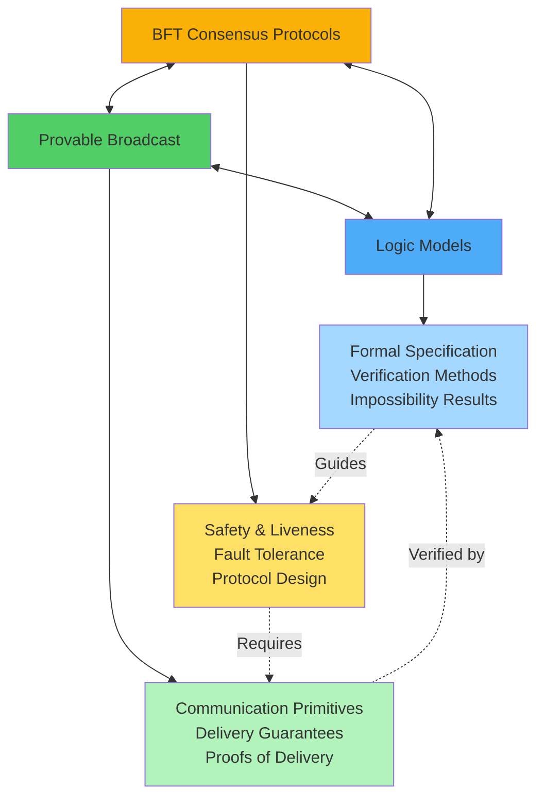
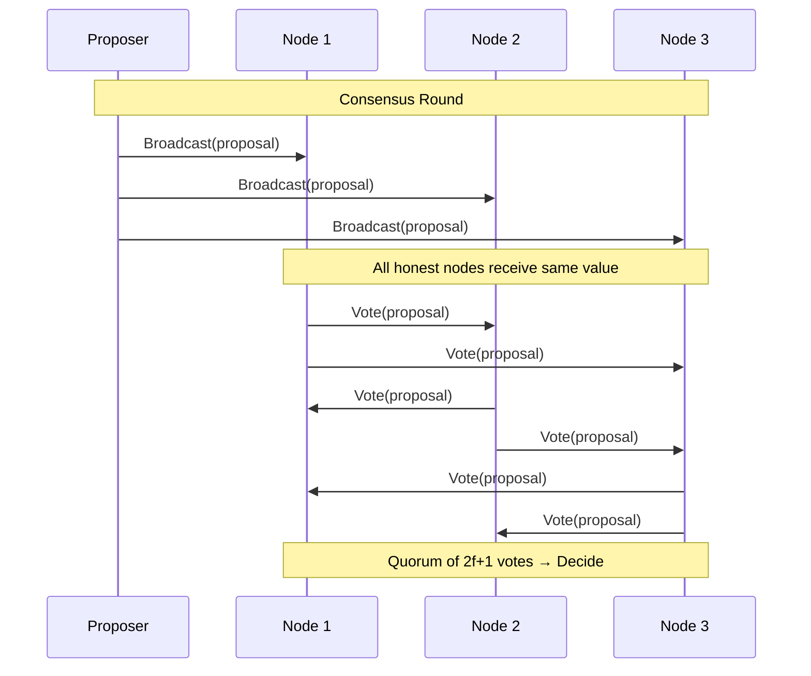
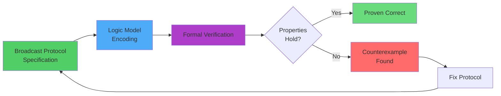
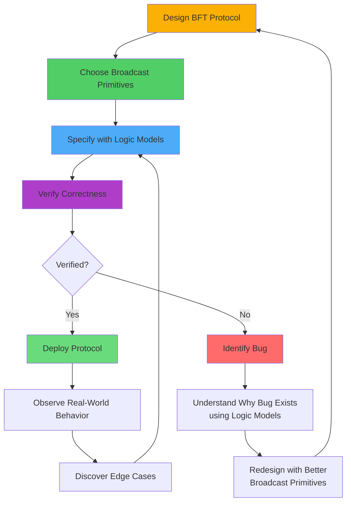
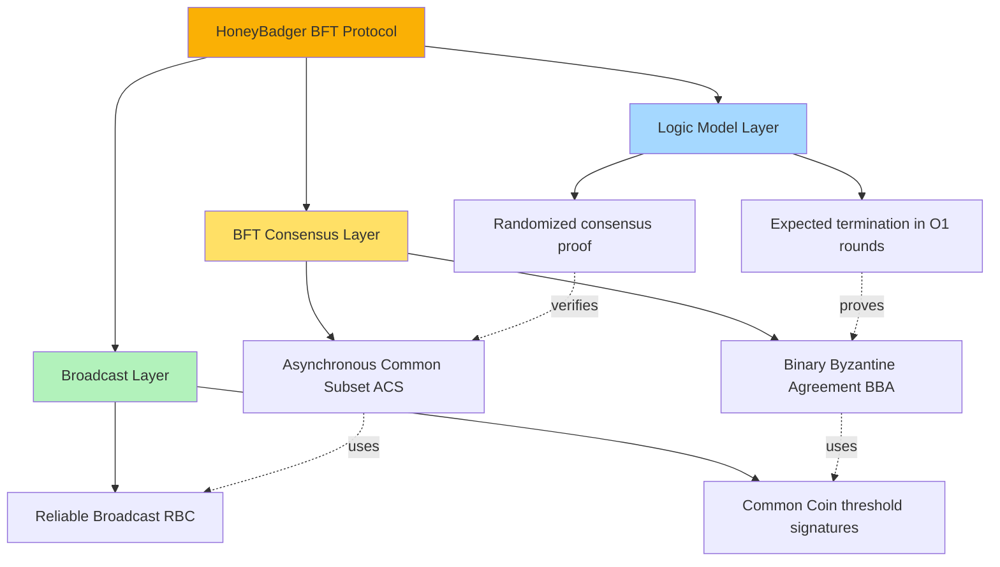
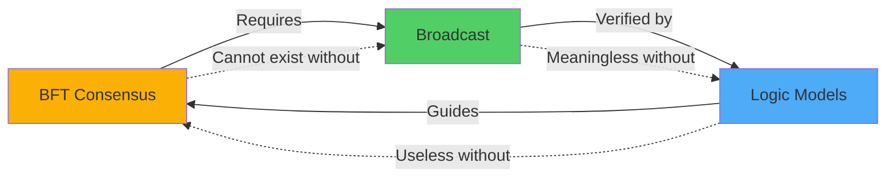

# Relationships Between BFT, Broadcast, and Logic Models

Understanding Byzantine Fault Tolerant consensus requires integrating three complementary perspectives: **BFT consensus protocols**, **provable broadcast mechanisms**, and **formal logic models**. This note maps the relationships between these domains and shows how they mutually reinforce each other.

## Overview: The Three Pillars

### The Three Domains

1. **[[bft-consensus-analysis/bft-consensus/fundamentals|BFT Consensus Fundamentals]]**: Protocols for achieving agreement in the presence of Byzantine failures
   - **Focus**: Practical distributed systems that tolerate malicious behavior
   - **Outputs**: Working protocols (PBFT, HoneyBadger, HotStuff)
   - **Properties**: Safety, liveness, fault tolerance thresholds

2. **[[bft-consensus-analysis/provable-broadcast/overview|Provable Broadcast: Overview]]**: Communication primitives with cryptographic proofs of delivery
   - **Focus**: Reliable message dissemination with verifiable evidence
   - **Outputs**: Broadcast mechanisms (RBC, BRB, provable broadcast)
   - **Properties**: Validity, agreement, integrity, provability

3. **[[bft-consensus-analysis/logic-models/overview|Logic Models for Distributed Systems]]**: Formal frameworks for reasoning about distributed systems
   - **Focus**: Mathematical foundations for specification and verification
   - **Outputs**: Proofs of correctness, impossibility results
   - **Properties**: Soundness, completeness, decidability

## Fundamental Relationships

### 1. BFT Consensus → Provable Broadcast

**Relationship**: BFT consensus protocols **depend on** broadcast primitives to disseminate values and votes among nodes.

#### How Broadcast Enables Consensus

Every BFT consensus protocol requires reliable communication:

**Key Dependencies**:

| BFT Protocol Property | Requires Broadcast Property |
|----------------------|----------------------------|
| **Safety** (No disagreement) | **Agreement** (All honest nodes deliver same message) |
| **Validity** (Correct proposal accepted) | **Validity** (If honest sender broadcasts $m$, all deliver $m$) |
| **Liveness** (Eventually decide) | **Guaranteed Delivery** (Messages not censored) |
| **Non-repudiation** | **Provability** (Cryptographic proof of delivery) |

#### Concrete Examples

- **[[bft-consensus-analysis/bft-consensus/protocols/pbft|PBFT: Practical Byzantine Fault Tolerance]]**:
  - Uses **authenticated broadcast** (digital signatures) for pre-prepare, prepare, commit phases
  - Quorum certificates prove $2f+1$ nodes witnessed a value
  
- **[[bft-consensus-analysis/bft-consensus/protocols/honeybadger-bft|HoneyBadgerBFT: Asynchronous Byzantine Consensus]]**:
  - Uses **[[bft-consensus-analysis/provable-broadcast/reliable-broadcast|Reliable Broadcast]]** (RBC) with erasure coding
  - Each node RBCs its input; ACS ensures $n-f$ values are delivered
  
- **[[bft-consensus-analysis/bft-consensus/protocols/hotstuff|HotStuff: Linear-Complexity BFT Consensus]]**:
  - Uses **broadcast with threshold signatures** for proposals
  - Leader aggregates $n-f$ votes into single quorum certificate

**See [[bft-consensus-analysis/provable-broadcast/applications|Provable Broadcast Applications]] for detailed analysis.**

---

### 2. Provable Broadcast → Logic Models

**Relationship**: Logic models **formally specify and verify** the properties of broadcast mechanisms.

#### How Logic Models Formalize Broadcast

Broadcast properties are stated informally but must be proven rigorously:

**Informal Statement** (Agreement):
> "If any honest node delivers message $m$, then all honest nodes eventually deliver $m$."

**Formal Statement** ([[bft-consensus-analysis/logic-models/temporal-logic|Temporal Logic for Distributed Systems]]):

$$
\forall \text{honest } i, j: \quad \text{delivered}_i(m) \implies \Diamond \text{delivered}_j(m)
$$

Where:
- $\Diamond$ means "eventually" (temporal operator)
- $\text{delivered}_i(m)$ means "node $i$ has delivered message $m$"

#### Verification Techniques

Logic models enable rigorous proofs:

**Example: Proving Reliable Broadcast Agreement**

Using [[bft-consensus-analysis/logic-models/threshold-automata|Threshold Automata for Parameterized Verification]]:

1. **Model**: States = {init, echoed, ready, delivered}
2. **Transitions**: Guarded by message counts (e.g., "received $2f+1$ echo messages")
3. **Invariant**: If one honest node is in "delivered", all honest nodes will reach "delivered"
4. **Proof**: Show invariant preserved by all transitions

**See [[bft-consensus-analysis/logic-models/formal-verification|Formal Verification of Consensus Protocols]] for detailed techniques.**

---

### 3. Logic Models → BFT Consensus

**Relationship**: Logic models **guide the design** of BFT protocols and **prove their correctness**.

#### How Logic Models Guide Consensus Design

##### Impossibility Results Set Boundaries

Logic models identify what is **not possible**:

| Impossibility Result | System Model | Implication for BFT |
|---------------------|--------------|---------------------|
| **FLP (1985)** | Asynchronous, 1 crash | Deterministic consensus impossible → need randomization or synchrony |
| **DLS (1988)** | Asynchronous, Byzantine | Requires $n > 3f$ nodes for consensus |
| **CAP Theorem** | Partitioned network | Cannot have consistency + availability → choose trade-offs |

**Example**: [[bft-consensus-analysis/bft-consensus/protocols/honeybadger-bft|HoneyBadgerBFT: Asynchronous Byzantine Consensus]] uses **randomization** (common coin) to circumvent FLP impossibility in asynchronous networks.

##### Correctness Proofs Build Confidence

Logic models prove protocols are correct:

**PBFT Safety Proof Sketch** (using [[bft-consensus-analysis/logic-models/knowledge-framework|Knowledge Framework for Distributed Systems]]):

1. **Assumption**: At most $f < n/3$ Byzantine nodes ($n = 3f+1$)
2. **Invariant**: Two quorums of $2f+1$ nodes must intersect in at least one honest node
3. **Proof**:
   - Two quorums have $(2f+1) + (2f+1) = 4f+2$ total memberships
   - With only $n = 3f+1$ nodes, they share at least $(4f+2) - (3f+1) = f+1$ nodes
   - At most $f$ are Byzantine, so at least **1 honest node** is in both quorums
   - This honest node prevents conflicting decisions

**See [[bft-consensus-analysis/logic-models/proof-techniques|Proof Techniques for Consensus Protocols]] for more examples.**

#### Verification Enables Trust

Modern BFT protocols are verified using:
- **Model checking**: Exhaustive state space exploration (e.g., TLA+)
- **Theorem proving**: Interactive proof assistants (e.g., Coq, Isabelle)
- **Automated verification**: Threshold automata verification tools

**Example**: HotStuff has been formally verified in Ivy, proving safety and liveness under partial synchrony.

---

## Synthesis: How the Three Domains Work Together

### The Virtuous Cycle

### Integrated Design Process

When designing a new BFT consensus protocol:

1. **Start with Logic Models** ([[bft-consensus-analysis/logic-models/overview|Logic Models for Distributed Systems]]):
   - Formalize safety and liveness requirements
   - Understand impossibility results and system model constraints
   - Define fault tolerance goals ($f < n/3$ for Byzantine)

2. **Select Broadcast Primitives** ([[bft-consensus-analysis/provable-broadcast/overview|Provable Broadcast: Overview]]):
   - Choose appropriate broadcast mechanism (RBC, provable broadcast, threshold sigs)
   - Match broadcast guarantees to consensus requirements
   - Consider communication complexity and cryptographic assumptions

3. **Design BFT Protocol** ([[bft-consensus-analysis/bft-consensus/fundamentals|BFT Consensus Fundamentals]]):
   - Orchestrate rounds of broadcasting and voting
   - Define leader election or randomized coin flips
   - Handle view changes and failure recovery

4. **Verify with Logic Models**:
   - Prove safety: No two honest nodes decide differently
   - Prove liveness: All honest nodes eventually decide
   - Validate fault tolerance threshold

5. **Implement and Test**:
   - Build working implementation
   - Test against adversarial scenarios
   - Measure performance (latency, throughput)

**See [[bft-consensus-analysis/integration/design-framework|Unified Design Framework for BFT Systems]] for detailed methodology.**

---

## Cross-Domain Mappings

### Mapping 1: Properties Across Domains

| BFT Consensus | Provable Broadcast | Logic Model Framework |
|--------------|--------------------|-----------------------|
| **Safety**: No disagreement | **Agreement**: Same message delivered | **Invariant**: ∀i,j: decided(i,v) ∧ decided(j,w) ⇒ v=w |
| **Liveness**: Eventually decide | **Guaranteed Delivery**: Message eventually delivered | **Temporal**: ◇ (all honest nodes decided) |
| **Validity**: Honest proposal accepted | **Validity**: Honest sender's message delivered | **Precondition**: honest(sender) ⇒ ◇ delivered(m) |
| **Fault Tolerance**: $f < n/3$ | **Byzantine Resilience**: Tolerates $f$ malicious senders | **Quantification**: ∀ adversary with |adversary| ≤ f |

### Mapping 2: Techniques Across Domains

| Technique | BFT Consensus Use | Broadcast Use | Logic Model Use |
|-----------|-------------------|---------------|-----------------|
| **Quorum Certificates** | Prove $2f+1$ nodes voted | Prove message delivered to quorum | Model as threshold guard |
| **Digital Signatures** | Non-repudiation of votes | Authenticate message sender | Axiomatize crypto assumptions |
| **Erasure Coding** | Efficient proposal dissemination | Reliable broadcast with $f$ failures | Model as information-theoretic property |
| **Threshold Cryptography** | Common coin, randomization | Provable broadcast certificates | Model as distributed computation |

### Mapping 3: Challenges Across Domains

| Challenge | BFT Perspective | Broadcast Perspective | Logic Model Perspective |
|-----------|----------------|----------------------|------------------------|
| **Asynchrony** | Cannot timeout Byzantine nodes | Cannot bound delivery time | FLP impossibility |
| **Byzantine Failures** | Nodes can equivocate, censor | Malicious sender forges messages | Need Byzantine quorum ($2f+1$) |
| **Network Partition** | Consensus may stall | Delivery may be delayed | Safety vs. liveness trade-off |
| **Scalability** | $O(n^2)$ or $O(n^3)$ communication | Broadcast to all $n$ nodes | State space explosion in verification |

---

## Practical Examples: Integration in Action

### Example 1: HoneyBadger BFT (Fully Asynchronous Consensus)

**Integration of Three Perspectives**:

1. **BFT Consensus**: Achieves agreement on a batch of transactions using Asynchronous Common Subset (ACS)
2. **Broadcast**: Each node uses RBC to broadcast its input; ACS ensures $n-f$ RBCs complete
3. **Logic Models**: Probabilistic termination proven using randomness from common coin

**See [[case-studies/honeybadger-complete|case-studies/honeybadger-complete]] for detailed analysis.**

### Example 2: PBFT (Partially Synchronous Consensus)

1. **BFT Consensus**: Three-phase protocol (pre-prepare, prepare, commit) with view changes
2. **Broadcast**: Leader broadcasts proposals; nodes broadcast votes with digital signatures
3. **Logic Models**: Safety proven via quorum intersection; liveness requires eventual synchrony

**Analysis**:
- **Broadcast enables**: Agreement property via $2f+1$ quorums
- **Logic proves**: No two nodes commit different values in same view
- **BFT requires**: View change when leader is Byzantine

### Example 3: HotStuff (Linear Communication Complexity)

1. **BFT Consensus**: Leader-based protocol with pipelined voting
2. **Broadcast**: Uses **threshold signatures** for compact quorum certificates
3. **Logic Models**: Verified in Ivy; safety proven via locked values, liveness proven via view synchronization

**Key Innovation**:
- **Threshold signatures** (broadcast technique) reduce BFT communication from $O(n^3)$ to $O(n)$
- **Logic models** prove this optimization preserves safety and liveness

---

## Conceptual Insights: Why Integration Matters

### Insight 1: Broadcast is Not Just Message Passing

**Naive View**: "BFT protocols just send messages over the network."

**Reality**: Broadcast primitives provide **semantic guarantees** that enable consensus:
- Agreement ensures all honest nodes receive the same value
- Provability provides non-repudiation (needed for accountability)
- Byzantine-resilient broadcast filters out malicious messages

**Without proper broadcast**: Consensus protocols fail catastrophically (e.g., Byzantine nodes cause disagreement).

### Insight 2: Logic Models Reveal Fundamental Limits

**Naive View**: "We can always design a better consensus protocol."

**Reality**: Logic models prove some things are **provably impossible**:
- FLP: No deterministic asynchronous consensus with crash failures
- DLS: Need $n > 3f$ for Byzantine consensus
- CAP: Cannot have consistency + availability + partition tolerance

**Implication**: Protocol designers must make informed trade-offs, not chase impossible goals.

### Insight 3: The Three Perspectives Are Inseparable

- **BFT without Broadcast**: No way to communicate proposals and votes reliably
- **Broadcast without Logic**: Cannot prove correctness or understand limitations
- **Logic without BFT**: Theoretical framework with no practical application

**Conclusion**: Mastery of BFT consensus requires understanding all three domains and their relationships.

---

## Learning Path: Navigating the Three Domains

### For Protocol Designers

1. **Start with Logic Models** ([[bft-consensus-analysis/logic-models/overview|Logic Models for Distributed Systems]]):
   - Understand FLP impossibility, Byzantine lower bounds
   - Learn to specify safety and liveness formally

2. **Study Broadcast Primitives** ([[bft-consensus-analysis/provable-broadcast/overview|Provable Broadcast: Overview]]):
   - Learn RBC, BRB, provable broadcast properties
   - Understand quorum certificates and threshold signatures

3. **Analyze Existing Protocols** ([[bft-consensus-analysis/bft-consensus/protocols/protocol-comparison|BFT Protocol Comparison: PBFT, HoneyBadgerBFT, and HotStuff]]):
   - See how PBFT, HoneyBadger, HotStuff integrate broadcast and logic
   - Identify trade-offs (synchrony assumptions, communication complexity)

4. **Apply Integrated Framework** ([[bft-consensus-analysis/integration/design-framework|Unified Design Framework for BFT Systems]]):
   - Design new protocols with all three perspectives in mind

### For Researchers

1. **Master Logic Models First** ([[bft-consensus-analysis/logic-models/formal-verification|Formal Verification of Consensus Protocols]]):
   - Deep dive into epistemic logic, temporal logic, threshold automata
   - Study impossibility proofs and verification techniques

2. **Connect Logic to Broadcast** ([[bft-consensus-analysis/provable-broadcast/properties|Provable Broadcast Properties]]):
   - Formalize broadcast properties in temporal logic
   - Prove correctness of broadcast mechanisms

3. **Apply to BFT Protocols**:
   - Verify existing protocols (PBFT, HoneyBadger, HotStuff)
   - Discover new impossibility results or optimality results

### For Practitioners

1. **Start with BFT Protocols** ([[bft-consensus-analysis/bft-consensus/fundamentals|BFT Consensus Fundamentals]]):
   - Understand safety, liveness, fault tolerance intuitively
   - Learn major protocols (PBFT, Tendermint, HotStuff)

2. **Understand Broadcast Primitives** ([[bft-consensus-analysis/provable-broadcast/applications|Provable Broadcast Applications]]):
   - Recognize which broadcast each protocol uses
   - Understand communication complexity implications

3. **Optional: Study Logic Models** ([[bft-consensus-analysis/logic-models/overview|Logic Models for Distributed Systems]]):
   - Gain confidence in protocol correctness
   - Understand why certain design choices are necessary

---

## Self-Assessment Questions

### Understanding Relationships

1. **BFT → Broadcast**:
   - Why does BFT consensus require broadcast primitives instead of simple message passing?
   - How does the broadcast agreement property ensure consensus safety?

2. **Broadcast → Logic**:
   - How would you formally specify the provability property of provable broadcast?
   - What verification technique would you use to prove Byzantine reliable broadcast correct?

3. **Logic → BFT**:
   - How does the FLP impossibility result constrain BFT protocol design?
   - Why does the $f < n/3$ Byzantine bound come from quorum intersection?

### Integration Understanding

4. **Synthesis**:
   - Pick a BFT protocol (PBFT, HoneyBadger, HotStuff). Identify:
     - Which broadcast primitive it uses
     - Which logic model properties it satisfies
     - How the broadcast enables the consensus guarantees

5. **Design**:
   - You're designing a BFT protocol for a blockchain with $n=100$ validators.
     - Which broadcast primitive would you choose and why?
     - What synchrony model would you assume?
     - How would you verify the protocol's correctness?

### Advanced

6. **Trade-offs**:
   - Compare PBFT (partial synchrony, $O(n^2)$ communication) vs HoneyBadger (asynchrony, $O(n^2)$ communication).
     - Which broadcast primitives differ?
     - Which logic model assumptions differ?
     - What are the practical implications?

---

## Next Steps

- **Apply Integration**: [[bft-consensus-analysis/integration/design-framework|Unified Design Framework for BFT Systems]] - Use all three perspectives to design protocols
- **Case Studies**: 
  - [[case-studies/honeybadger-complete|case-studies/honeybadger-complete]] - HoneyBadger BFT integrated analysis
  - [[case-studies/dag-rider-analysis|case-studies/dag-rider-analysis]] - DAG-Rider protocol analysis
- **Deepen Understanding**:
  - [[bft-consensus-analysis/bft-consensus/protocols/protocol-comparison|BFT Protocol Comparison: PBFT, HoneyBadgerBFT, and HotStuff]] - Compare protocols across dimensions
  - [[bft-consensus-analysis/provable-broadcast/vs-reliable-broadcast|Provable Broadcast vs Reliable Broadcast]] - Understand broadcast hierarchy
  - [[bft-consensus-analysis/logic-models/proof-techniques|Proof Techniques for Consensus Protocols]] - Learn verification methods

---

## Summary

The three domains are **mutually reinforcing**:

1. **BFT Consensus** provides practical protocols that solve real distributed systems problems
2. **Provable Broadcast** provides communication primitives that enable consensus guarantees
3. **Logic Models** provide formal foundations that prove correctness and identify limits

**Key Insight**: You cannot deeply understand Byzantine Fault Tolerant consensus without integrating all three perspectives. Each illuminates the others:
- Broadcast explains **how** BFT protocols communicate
- Logic models explain **why** BFT protocols work (or cannot work)
- BFT protocols demonstrate **practical application** of broadcast and logic

**Mastery of BFT consensus = Mastery of all three domains + their relationships.**

---

**See Also**:
- [[bft-consensus-analysis/index|BFT Consensus Analysis: Entry Point]] - Return to main navigation
- [[bft-consensus-analysis/glossary|Glossary: BFT Consensus, Provable Broadcast, and Logic Models]] - Technical term definitions
- [[bft-consensus-analysis/references|References: Bibliography and External Sources]] - Source materials and citations
