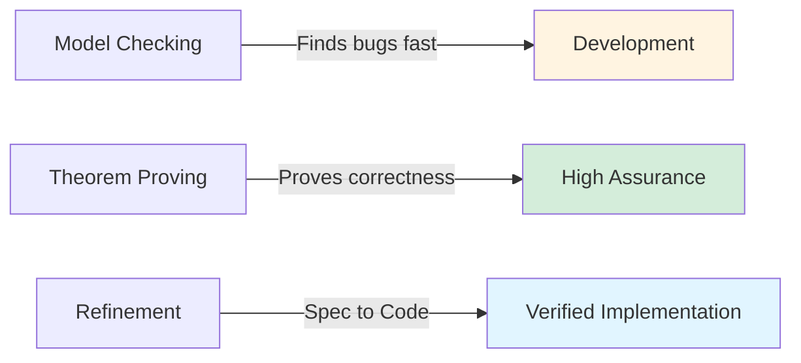
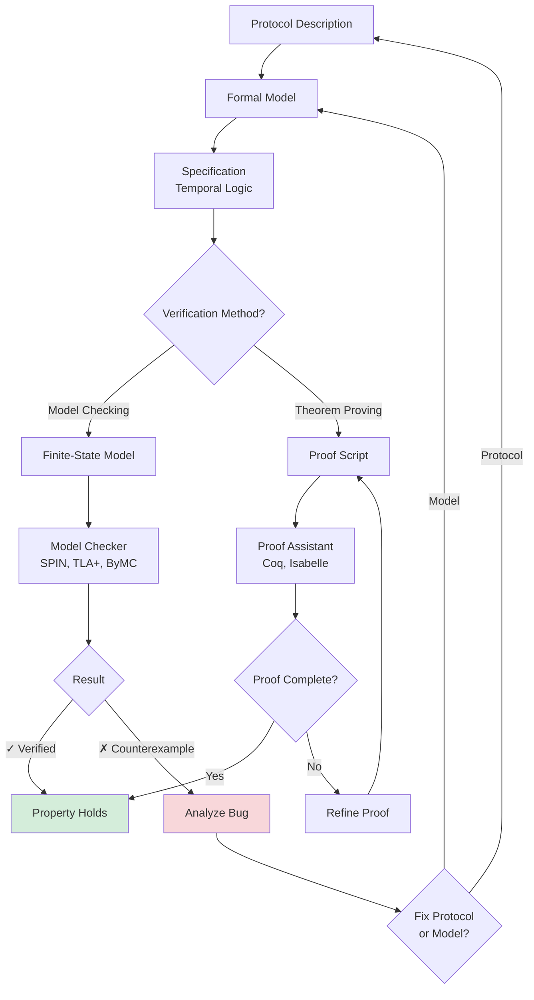

# Formal Verification of Consensus Protocols

**Formal verification** is the process of mathematically proving that a consensus protocol satisfies its specification. Unlike testing (which checks specific executions), verification provides **guarantees for all possible executions**.

## Why Verify Consensus Protocols?

### The Problem with Testing

**Testing Limitations**:
- **Finite Coverage**: Tests cover specific scenarios, not all possible interleavings
- **Concurrency Bugs**: Rare race conditions may only occur after millions of executions
- **Byzantine Behavior**: Hard to anticipate all malicious strategies
- **Asynchronous Networks**: Infinite possible message delay patterns

**Example**: A BFT protocol tested with 1 million executions may still have a bug that appears only in the 1,000,001st execution.

### What Verification Provides

**Guarantees**:
- **Completeness**: All reachable states are checked (no missed bugs)
- **Precision**: Mathematical proof, not probabilistic confidence
- **Documentation**: Proof artifacts explain why the protocol works
- **Trust**: Critical systems (financial, aerospace) require proofs, not tests

**Example**: PBFT's safety proof ensures that no matter how Byzantine nodes behave, agreement is never violated (for $f < n/3$).

## Verification Approaches

### 1. Model Checking

**Idea**: Exhaustively explore all reachable states of a **finite** model.

**Process**:
1. **Model** the protocol as a finite-state machine
2. **Specify** properties in temporal logic (LTL, CTL)
3. **Run** an automated model checker (SPIN, TLA+, NuSMV)
4. **Result**: ✓ Verified or ✗ Counterexample

**Pros**:
- Fully automated
- Provides counterexamples when properties fail
- No expertise required beyond modeling

**Cons**:
- State explosion: $O(2^n)$ states for $n$ boolean variables
- Requires finite model (bounded number of processes, messages)
- Liveness is hard (requires fairness assumptions)

**Best For**: Small to medium systems, finding bugs

→ See [[bft-consensus-analysis/logic-models/threshold-automata|Threshold Automata for Parameterized Verification]] for specialized model checking of BFT protocols

### 2. Theorem Proving

**Idea**: Write a **formal proof** that the protocol satisfies its specification, verified by a proof assistant.

**Process**:
1. **Formalize** the protocol in a proof language (Coq, Isabelle, Lean)
2. **State** theorems (e.g., "Agreement holds for all executions")
3. **Prove** theorems using tactics, lemmas, and induction
4. **Check** proof mechanically with proof assistant

**Pros**:
- Handles infinite state spaces (arbitrary $n$, unbounded buffers)
- Proves properties for all parameterizations
- High assurance (machine-checked proofs)

**Cons**:
- Labor-intensive (weeks to months of expert effort)
- Requires deep expertise in formal methods
- No automated counterexamples (if proof fails, manual debugging)

**Best For**: High-assurance systems, parameterized verification

### 3. Refinement

**Idea**: Prove that a **concrete implementation** refines an **abstract specification**.

**Process**:
1. **Specify** high-level behavior (e.g., "replicated state machine")
2. **Implement** low-level protocol (e.g., PBFT message passing)
3. **Prove** refinement: Every execution of implementation matches specification
4. **Use** proof to verify implementation correctness

**Pros**:
- Bridges gap between specification and code
- Modular (verify layers independently)
- Enables verified compilation (specification → verified code)

**Cons**:
- Requires both specification and implementation to be formalized
- Refinement proofs can be complex
- Tools still maturing

**Best For**: End-to-end verification, critical infrastructure

### Comparison

| Approach | Automation | State Space | Effort | Assurance |
|----------|------------|-------------|--------|-----------|
| Model Checking | High | Finite | Low-Medium | Medium |
| Theorem Proving | Low | Infinite | High | High |
| Refinement | Medium | Infinite | Medium-High | High |



**Recommendation**: Use model checking during development, then apply theorem proving for final assurance.

## Verification Workflow



## Model Checking: TLA+ Example

### Protocol: Two-Phase Commit (Simplified)

**Specification** (TLA+):
```tla
VARIABLES msgs, rmState, tmState

Init ==
  /\ msgs = {}
  /\ rmState = [rm \in RM |-> "working"]
  /\ tmState = "init"

TMPrepare ==
  /\ tmState = "init"
  /\ tmState' = "preparing"
  /\ msgs' = msgs \cup {[type |-> "prepare"]}
  /\ UNCHANGED rmState

RMReceivePrepare(rm) ==
  /\ [type |-> "prepare"] \in msgs
  /\ rmState[rm] = "working"
  /\ rmState' = [rmState EXCEPT ![rm] = "prepared"]
  /\ msgs' = msgs \cup {[type |-> "prepared", rm |-> rm]}
  /\ UNCHANGED tmState

...

Agreement ==
  \A rm1, rm2 \in RM :
    (rmState[rm1] = "committed" /\ rmState[rm2] = "committed")
      => TRUE  \* Both committed (no disagreement)
```

**Model Checking**:
```bash
tlc TwoPhaseCommit.tla
```

**Output**:
```
✓ Agreement property holds for all reachable states
✗ Liveness property violated (counterexample: TM crashes before commit)
```

**Interpretation**:
- Safety (Agreement) verified ✓
- Liveness requires additional assumptions (TM recovery)

→ See [[bft-consensus-analysis/logic-models/temporal-logic|Temporal Logic for Distributed Systems]] for LTL/CTL specifications

## Theorem Proving: Coq Example

### Protocol: Simple Consensus

**Formalization** (Coq):
```coq
(* State type *)
Inductive State := Undecided | Decided (v : Value).

(* Correct process *)
Definition correct (p : Process) : Prop := (* ... *).

(* Agreement property *)
Theorem agreement :
  forall (exec : Execution) (p1 p2 : Process) (v1 v2 : Value),
    correct p1 -> correct p2 ->
    decided exec p1 v1 -> decided exec p2 v2 ->
    v1 = v2.
Proof.
  intros exec p1 p2 v1 v2 H_p1 H_p2 H_dec1 H_dec2.
  (* Inductive proof over execution steps *)
  induction exec as [| step exec' IH].
  - (* Base case: Empty execution *)
    contradiction.
  - (* Inductive case: *)
    destruct step as [propose | vote | commit].
    + (* Propose step: ... *)
      apply IH.
    + (* Vote step: Use quorum intersection *)
      apply quorum_intersection.
      (* Proof that any two quorums overlap in ≥ f+1 honest nodes *)
      ...
    + (* Commit step: ... *)
      reflexivity.
Qed.
```

**Benefits**:
- Proof is **machine-checked** (Coq verifies every step)
- Works for **arbitrary $n$** (not just specific values)
- Proof artifact is **documentation** (explains why agreement holds)

## Case Study: IronFleet

**IronFleet** (Hawblitzel et al., 2015) is a methodology for building **verified distributed systems**.

### Approach

1. **Specify** protocol in Dafny (high-level)
2. **Implement** protocol in Dafny (executable)
3. **Prove** refinement: Implementation refines specification
4. **Compile** Dafny to C# (verified compiler)
5. **Deploy** with assurance

### Results

**Protocols Verified**:
- **Paxos**: Multi-decree consensus
- **RSM** (Replicated State Machine): Key-value store
- **SHT** (Sharded Hash Table): Distributed hash table

**Performance**: Comparable to hand-optimized implementations (e.g., Apache ZooKeeper)

**Assurance**: Machine-checked proofs of safety and liveness

**Lesson**: Formal verification is **practical** for real-world systems.

## Case Study: Verdi

**Verdi** (Wilcox et al., 2015) is a framework for **verifying distributed systems implementations** in Coq.

### Approach

1. **Formalize** network semantics (message passing, failures)
2. **Implement** protocol in Coq
3. **Prove** correctness properties (safety, liveness)
4. **Extract** to OCaml (verified extraction)
5. **Run** in real networks

### Results

**Protocols Verified**:
- **Raft**: Consensus protocol (used in etcd, Consul)
- **Key-Value Store**: Linearizable operations
- **Chain Replication**: Strong consistency

**Assurance**:
- **No bugs found** in verified implementations (vs. bugs in unverified Raft implementations)
- **End-to-end verification**: Specification to executable code

**Lesson**: Verification **prevents bugs** that testing misses.

## Verification Challenges

### 1. State Explosion

**Problem**: Model checking explores $O(2^n)$ states for $n$ variables.

**Mitigations**:
- **Abstraction**: Reduce state space (e.g., bound number of processes)
- **Symmetry Reduction**: Exploit symmetry (processes are identical)
- **Partial Order Reduction**: Avoid exploring equivalent interleavings
- **Symbolic Model Checking**: Use BDDs (binary decision diagrams)

→ See [[bft-consensus-analysis/logic-models/threshold-automata|Threshold Automata for Parameterized Verification]] for parameterized abstraction

### 2. Liveness is Hard

**Problem**: Liveness requires reasoning about infinite executions.

**Mitigations**:
- **Fairness Assumptions**: Assume messages eventually delivered
- **Well-Founded Orderings**: Prove progress decreases a metric
- **Temporal Reasoning**: Use LTL/CTL with fairness operators

**Example** (TLA+):
```tla
Liveness == WF_vars(Next) => <>[]Decided
```
"Under weak fairness, eventually all nodes decide."

### 3. Cryptography

**Problem**: Cryptographic assumptions (unforgeability, collision resistance) are hard to model.

**Mitigations**:
- **Assume Perfect Cryptography**: Treat signatures as unforgeable
- **Symbolic Cryptography**: Abstract crypto operations (Dolev-Yao model)
- **Computational Assumptions**: Model probability of forgery as negligible

**Example**: In PBFT verification, assume Byzantine nodes cannot forge signatures of honest nodes.

### 4. Implementation Gap

**Problem**: Verified model ≠ actual code (bugs in implementation not caught).

**Mitigations**:
- **Refinement Proofs**: Prove code refines model (IronFleet, Verdi)
- **Verified Compilation**: Use verified compilers (CompCert, CakeML)
- **Code Extraction**: Generate code from proof (Coq extraction)

**Example**: Verdi extracts OCaml code from Coq proof, ensuring correctness.

## Verification Tools

### Model Checkers

| Tool | Language | Focus | Best For |
|------|----------|-------|----------|
| **TLA+** | TLA+ spec | Temporal logic | General distributed systems |
| **SPIN** | Promela | LTL | Concurrent algorithms |
| **ByMC** | Threshold automata | BFT protocols | Parameterized BFT |
| **NuSMV** | SMV | CTL | Symbolic model checking |
| **PRISM** | Probabilistic | Probabilistic CTL | Randomized protocols |

### Theorem Provers

| Tool | Logic | Style | Best For |
|------|-------|-------|----------|
| **Coq** | Higher-order | Tactic-based | Mathematical proofs |
| **Isabelle** | Higher-order | Declarative | Large developments |
| **Lean** | Dependent types | Tactic-based | Modern proof engineering |
| **Dafny** | First-order | Auto-active | Verified software |
| **TLA+ Proof System** | TLA+ logic | Declarative | TLA+ specs |

### Refinement Frameworks

| Framework | Language | Extraction | Best For |
|-----------|----------|------------|----------|
| **IronFleet** | Dafny | C# | Verified distributed systems |
| **Verdi** | Coq | OCaml | Verified implementations |
| **Ivy** | Ivy | C++ | Verified protocols |

## Practical Verification Strategy

### Phase 1: Development (Model Checking)

**Goal**: Find bugs quickly

**Approach**:
1. Model protocol in TLA+ or SPIN
2. Specify safety properties (agreement, validity)
3. Run model checker with small parameters ($n=4, f=1$)
4. Fix bugs found in counterexamples
5. Iterate until no bugs found

**Effort**: Days to weeks

### Phase 2: Assurance (Theorem Proving)

**Goal**: Prove correctness for all parameterizations

**Approach**:
1. Formalize protocol in Coq or Isabelle
2. State theorems (safety, liveness)
3. Prove theorems using induction, invariants
4. Check proofs mechanically
5. Document proof insights

**Effort**: Weeks to months

### Phase 3: Deployment (Refinement)

**Goal**: Ensure implementation matches verified model

**Approach**:
1. Implement protocol in Dafny or Coq
2. Prove refinement from specification
3. Extract executable code
4. Test extracted code (sanity check)
5. Deploy with confidence

**Effort**: Months

## Self-Assessment Questions

1. **Concepts**:
   - What is the difference between model checking and theorem proving?
   - Why is testing insufficient for verifying consensus protocols?
   - What does a counterexample from a model checker tell you?

2. **Application**:
   - How would you verify PBFT's agreement property using TLA+?
   - What fairness assumption is needed to verify liveness in an asynchronous protocol?
   - How does refinement help bridge the gap between specification and code?

3. **Tools**:
   - When should you use model checking vs. theorem proving?
   - What is the advantage of TLA+ over SPIN for distributed systems?
   - How does Verdi ensure the extracted OCaml code matches the Coq proof?

4. **Advanced**:
   - How do you handle state explosion in model checking?
   - What is the Dolev-Yao model for cryptography in verification?
   - How would you verify a protocol for arbitrary $n$ using Coq?

## See Also

**Within Logic Models**:
- [[overview|overview]] — Introduction to logic models
- [[bft-consensus-analysis/logic-models/temporal-logic|Temporal Logic for Distributed Systems]] — Temporal logic for specifications
- [[bft-consensus-analysis/logic-models/threshold-automata|Threshold Automata for Parameterized Verification]] — Parameterized verification
- [[bft-consensus-analysis/logic-models/proof-techniques|Proof Techniques for Consensus Protocols]] — Manual proof strategies

**Related Concepts**:
- [[bft-consensus-analysis/bft-consensus/fundamentals|BFT Consensus Fundamentals]] — BFT consensus basics
- [[bft-consensus-analysis/bft-consensus/properties/safety-properties|Safety Properties in BFT Consensus]] — Safety properties to verify
- [[bft-consensus-analysis/bft-consensus/properties/liveness-properties|Liveness Properties in BFT Consensus]] — Liveness properties to verify
- [[bft-consensus-analysis/bft-consensus/protocols/pbft|PBFT: Practical Byzantine Fault Tolerance]] — PBFT verification example

**Tools**:
- [TLA+ Toolbox](https://lamport.azurewebsites.net/tla/toolbox.html)
- [SPIN Model Checker](https://spinroot.com/)
- [Coq Proof Assistant](https://coq.inria.fr/)
- [ByMC (Byzantine Model Checker)](https://github.com/konnov/bymc)
- [Verdi Framework](https://github.com/uwplse/verdi)

**External Resources**:
- Lamport: "Specifying Systems" (2002) — TLA+ textbook
- Hawblitzel et al.: "IronFleet: Proving Practical Distributed Systems Correct" (2015)
- Wilcox et al.: "Verdi: A Framework for Implementing and Formally Verifying Distributed Systems" (2015)

---

**Next**: Learn [[bft-consensus-analysis/logic-models/proof-techniques|Proof Techniques for Consensus Protocols]] to manually prove consensus properties.
