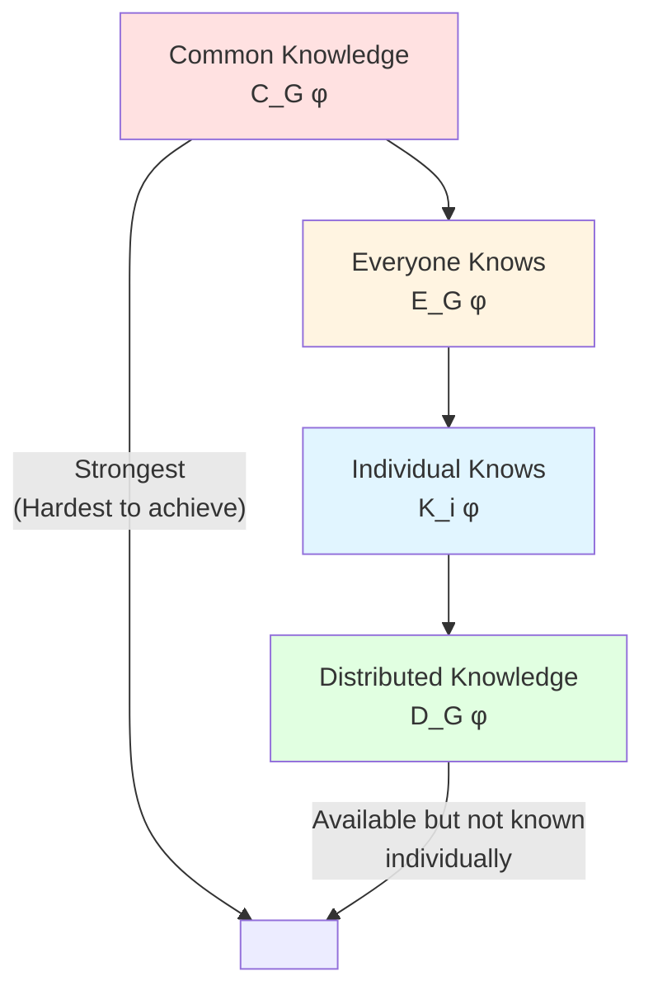
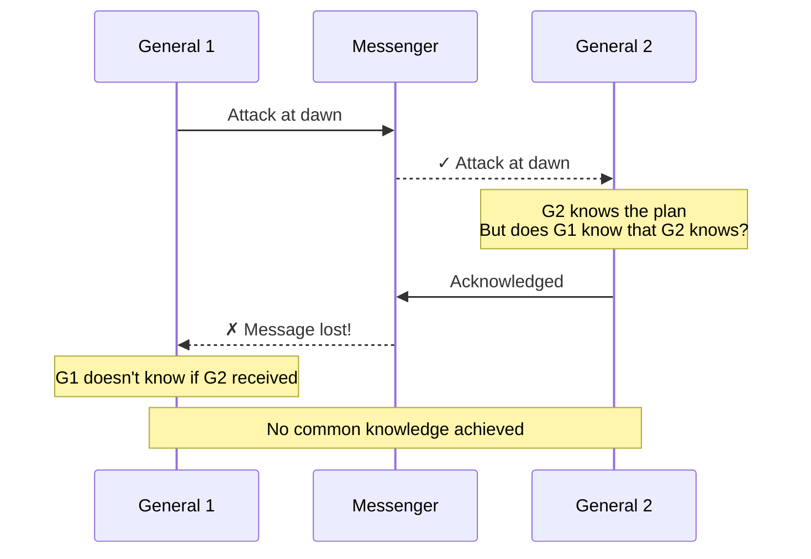
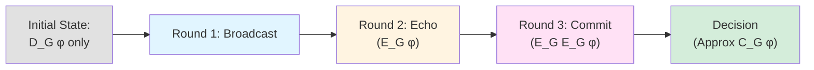

# Knowledge Framework for Distributed Systems

The **knowledge framework** (also called **epistemic logic**) provides a formal way to reason about what nodes **know** in a distributed system. This framework, pioneered by Halpern and Moses, is fundamental to understanding consensus impossibility results and protocol design.

## The Central Question

> **What does it mean for a node to "know" something in a distributed system?**

In a centralized system, knowledge is straightforward—a process knows what's in its memory. But in a distributed system:
- Nodes have **partial views** (only their local state + messages received)
- Messages can be **delayed** or **lost**
- Some nodes may be **Byzantine** (lying)

The knowledge framework formalizes these intuitions.

## Levels of Knowledge

### 1. Local Knowledge

**Definition**: Node $i$ knows fact $\phi$ if $\phi$ is true in all possible global states consistent with $i$'s local observations.

**Notation**: $K_i \phi$ ("Node $i$ knows $\phi$")

**Example**:
```
Scenario: Alice receives message m from Bob
- Alice knows: "I received a message claiming to be from Bob"
- Alice does NOT know: "Bob sent this message" (could be forged)
- Alice does NOT know: "Other nodes also received messages from Bob"
```

**Formal Semantics**:
$$
K_i \phi \text{ holds at global state } s \iff \phi \text{ is true in all states indistinguishable from } s \text{ by } i
$$

Two states are **indistinguishable** to node $i$ if $i$ has the same local state in both.

### 2. Distributed Knowledge

**Definition**: The knowledge that would be available if all nodes **pooled** their information.

**Notation**: $D_G \phi$ ("The group $G$ has distributed knowledge of $\phi$")

**Example**:
```
Scenario: 3 nodes vote
- Alice knows: "I voted yes"
- Bob knows: "I voted yes"
- Carol knows: "I voted no"

Distributed knowledge: "2 out of 3 voted yes"
(No single node knows this, but combining their knowledge reveals it)
```

**Formal Semantics**:
$$
D_G \phi \text{ holds} \iff \phi \text{ is true in all states where } G \text{'s combined local states match}
$$

**Key Property**: $D_G \phi$ does NOT mean any node in $G$ knows $\phi$—it means a hypothetical observer with access to all their states would know $\phi$.

### 3. Common Knowledge

**Definition**: Everyone knows $\phi$, everyone knows that everyone knows $\phi$, everyone knows that everyone knows that everyone knows $\phi$, ad infinitum.

**Notation**: $C_G \phi$ ("The group $G$ has common knowledge of $\phi$")

**Recursive Definition**:
$$
\begin{align}
E_G \phi &\equiv \bigwedge_{i \in G} K_i \phi \quad \text{(Everyone knows)} \\
C_G \phi &\equiv E_G \phi \land E_G E_G \phi \land E_G E_G E_G \phi \land \ldots
\end{align}
$$

**Example**:
```
Scenario: Public announcement in a room
- Announcement: "The meeting starts at 10 AM"
- Everyone hears it
- Everyone sees everyone else hear it
- Everyone sees everyone else see everyone else hear it
- ...

This is common knowledge.
```

**Distributed Systems Insight**: Common knowledge is **impossible** to achieve in asynchronous systems with failures!

## The Knowledge Hierarchy



**Strength Ordering**:
$$
C_G \phi \implies E_G \phi \implies K_i \phi \quad \text{for any } i \in G
$$

But: $D_G \phi \not\Rightarrow K_i \phi$ (distributed knowledge isn't individual knowledge)

## Why Common Knowledge is Impossible

### The Coordinated Attack Problem

Two generals must coordinate an attack:



**The Impossibility**:
1. G1 sends "Attack at dawn" → G2 receives it
2. G2 knows the plan, but G1 doesn't know that G2 knows
3. G2 sends ACK → G1 receives it
4. G1 knows that G2 knows, but G2 doesn't know that G1 knows that G2 knows
5. This regress continues forever

**Conclusion**: With unreliable communication, common knowledge of the attack plan is **impossible**.

### Connection to Consensus

**Theorem (Halpern & Moses)**:
> In an asynchronous system with crash failures, consensus requires common knowledge of the decision.

**But**: Common knowledge is unattainable in asynchronous systems.

**Therefore**: Consensus is impossible in asynchronous systems (this is the FLP impossibility theorem).

## Knowledge in Consensus Protocols

### What Consensus Actually Needs

Protocols don't need **true common knowledge**, but rather:

**Approximate Common Knowledge**: High confidence that enough nodes know the decision.

**How Protocols Achieve This**:

1. **Quorum-Based Protocols** (PBFT, HotStuff):
   - Node $i$ decides after receiving $2f+1$ votes for value $v$
   - $K_i$: "At least $f+1$ honest nodes voted for $v$" (quorum intersection)
   - Close to $E_G$: With high probability, other honest nodes also received $2f+1$ votes

2. **Certificates** (Provable Broadcast):
   - Delivery certificate = cryptographic proof that $n-2f$ nodes received message
   - $K_i$: "A supermajority received this message" (via certificate)
   - Enables stronger knowledge claims than just receiving messages

3. **Multiple Rounds**:
   - Round 1: Propose value
   - Round 2: Echo (everyone knows)
   - Round 3: Commit (everyone knows that everyone knows)
   - More rounds → closer to common knowledge

### Knowledge Gain Diagram



## Formal Knowledge Axioms

The knowledge operator $K_i$ satisfies these properties:

### K1: Knowledge Implies Truth
$$
K_i \phi \implies \phi
$$
"If node $i$ knows $\phi$, then $\phi$ is true."
(Prevents "knowledge" of false facts)

### K2: Logical Omniscience
$$
K_i (\phi \implies \psi) \land K_i \phi \implies K_i \psi
$$
"Nodes can perform logical deduction."
(Idealized assumption)

### K3: Positive Introspection
$$
K_i \phi \implies K_i K_i \phi
$$
"If $i$ knows $\phi$, then $i$ knows that $i$ knows $\phi$."
(Nodes are aware of their own knowledge)

### K4: Negative Introspection
$$
\neg K_i \phi \implies K_i \neg K_i \phi
$$
"If $i$ doesn't know $\phi$, then $i$ knows that $i$ doesn't know $\phi$."
(Nodes know the limits of their knowledge)

**Note**: K2 is often unrealistic (nodes have bounded computation), but simplifies reasoning.

## Knowledge and Byzantine Faults

### Challenges with Byzantine Nodes

**Problem**: Byzantine nodes can **lie** about what they know.

**Example**:
```
Byzantine node B claims: "I know φ is true"
But actually: B knows ¬φ (or doesn't know φ at all)
```

**Implication**: We cannot trust knowledge claims from Byzantine nodes.

### Solution: Cryptographic Proofs

Instead of trusting claims, require **unforgeable proofs**:

**Digital Signatures**:
- Byzantine node cannot forge signature of honest node
- $K_i$: "Honest node $j$ signed message $m$" is reliable (if signature verifies)

**Threshold Signatures**:
- Requires $t$ nodes to produce signature
- Byzantine minority ($f < n/3$) cannot forge threshold signature
- Provides provable distributed knowledge

**Quorum Certificates**:
- Collection of $2f+1$ signed votes
- Quorum intersection ensures at least $f+1$ honest votes
- Enables reasoning about what honest nodes collectively know

## Knowledge in Action: PBFT

Let's trace knowledge evolution in PBFT:

### Initial State
- $K_{\text{client}}$: "I want to execute transaction $tx$"
- $K_i$ for replicas: Nothing about $tx$ yet

### After PRE-PREPARE
- $K_i$: "Leader proposed $tx$ in view $v$, sequence $n$"
- Not $E_G$ yet (other replicas may not have received)

### After PREPARE (2f+1 messages)
- $K_i$: "At least $f+1$ honest replicas prepared $tx$ at $(v,n)$"
- Quorum intersection ensures safety
- Close to $E_G$ (replicas likely have similar knowledge)

### After COMMIT (2f+1 messages)
- $K_i$: "At least $f+1$ honest replicas committed to $tx$ at $(v,n)$"
- Safe to execute (agreement property ensured)
- Approximates $E_G E_G$ (everyone knows that everyone knows)

### Why This Works
- **Quorum Overlap**: Any two quorums of $2f+1$ nodes overlap in $\geq f+1$ honest nodes
- **Certificates**: Each phase produces a certificate (collection of signed messages)
- **Progressive Knowledge**: Each round increases knowledge level
- **Byzantine Resistance**: Signatures prevent equivocation

## Practical Applications

### 1. Protocol Design

**Question**: How many rounds are needed for consensus?

**Knowledge Answer**:
- 1 round: Achieves $K_i \phi$ for some nodes
- 2 rounds: Achieves $E_G \phi$ (everyone knows)
- 3 rounds: Achieves $E_G E_G \phi$ (everyone knows everyone knows)
- Consensus often needs $\geq 2$ rounds (unless synchronous)

### 2. Impossibility Results

**Question**: Can we solve consensus in an asynchronous system with 1 crash failure?

**Knowledge Answer**:
- Consensus needs common knowledge
- Common knowledge impossible with crash failures in async systems
- Therefore, **NO** (FLP theorem)

### 3. Optimizations

**Question**: Can we reduce message complexity?

**Knowledge Answer**:
- If we use **threshold signatures** instead of individual signatures:
  - Same knowledge gain with fewer messages
  - HotStuff uses this to achieve $O(n)$ vs PBFT's $O(n^2)$

### 4. Debugging

**Question**: Why does the protocol violate safety in this execution?

**Knowledge Answer**:
- Trace knowledge evolution
- Find point where $K_i \phi \land K_j \neg \phi$ (nodes have conflicting knowledge)
- This reveals the bug (e.g., insufficient quorum size)

## Knowledge vs. Time

The knowledge framework can be combined with temporal logic:

**Temporal Knowledge Operators**:
- $\Box K_i \phi$: "Node $i$ always knows $\phi$"
- $\Diamond K_i \phi$: "Node $i$ eventually knows $\phi$"
- $K_i \Box \phi$: "Node $i$ knows that $\phi$ always holds"
- $K_i \Diamond \phi$: "Node $i$ knows that $\phi$ eventually holds"

**Example** (Liveness):
$$
\text{Liveness} = \Diamond (\forall i \in \text{Correct} : K_i \text{decided})
$$
"Eventually all correct nodes know they have decided."

→ See [[bft-consensus-analysis/logic-models/temporal-logic|Expressing Safety & Liveness]] for temporal operators

## Self-Assessment Questions

1. **Definitions**:
   - What is the difference between distributed knowledge and common knowledge?
   - Why is common knowledge impossible in asynchronous systems?
   - What does $K_i K_j \phi$ mean?

2. **Application**:
   - If a quorum of $2f+1$ nodes out of $n=3f+1$ knows $\phi$, does any individual node know that the quorum knows $\phi$?
   - How do delivery certificates (from provable broadcast) help establish knowledge?
   - Why does PBFT need three phases (PRE-PREPARE, PREPARE, COMMIT)?

3. **Advanced**:
   - How can you model Byzantine lies in the knowledge framework?
   - What knowledge level is achieved after one round of an all-to-all broadcast?
   - How does the knowledge framework explain the $f < n/3$ threshold for Byzantine consensus?

## See Also

**Within Logic Models**:
- [[overview|overview]] — Introduction to logic models
- [[bft-consensus-analysis/logic-models/temporal-logic|Expressing Safety & Liveness]] — Combining knowledge with time
- [[bft-consensus-analysis/logic-models/formal-verification|Formal Verification Techniques]] — Using knowledge in proofs
- [[bft-consensus-analysis/logic-models/proof-techniques|Proof Techniques for Consensus Protocols]] — Proof strategies using knowledge

**Related Concepts**:
- [[bft-consensus-analysis/bft-consensus/fundamentals|BFT Fundamentals]] — BFT consensus basics
- [[bft-consensus-analysis/bft-consensus/properties/fault-tolerance-threshold|Fault Tolerance Threshold: Why f < n/3 for Byzantine Failures]] — Why f < n/3
- [[bft-consensus-analysis/provable-broadcast/provable-broadcast|Provable Broadcast Mechanisms]] — Delivery certificates
- [[bft-consensus-analysis/bft-consensus/protocols/pbft|PBFT]] — Knowledge in PBFT

**External Resources**:
- Halpern & Moses: "Knowledge and Common Knowledge in a Distributed Environment" (1990)
- Fagin et al.: "Reasoning About Knowledge" (1995)
- [Decentralized Thoughts: The FLP Impossibility](https://decentralizedthoughts.github.io)

---

**Next**: Learn about [[bft-consensus-analysis/logic-models/temporal-logic|Expressing Safety & Liveness]] to express how knowledge evolves over time.
