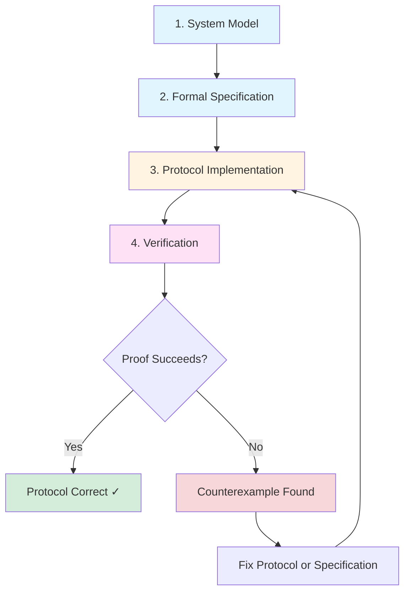
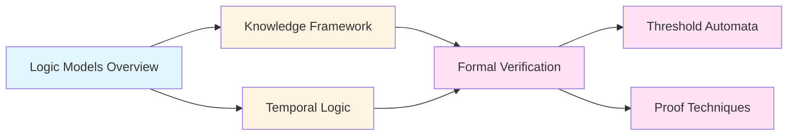

# Logic Models for Distributed Systems

**Logic models** provide formal mathematical frameworks for reasoning about distributed systems, particularly for specifying and verifying properties of consensus protocols and broadcast mechanisms. They enable rigorous proofs of correctness and help identify impossibility results.

## Overview

When designing Byzantine Fault Tolerant consensus protocols, we need to answer critical questions:

- **Does the protocol guarantee safety?** (No two honest nodes decide differently)
- **Does the protocol guarantee liveness?** (All honest nodes eventually decide)
- **Under what conditions do these properties hold?**
- **What happens if the network is asynchronous? If messages are delayed?**

Logic models give us precise languages to:
1. **Specify** what we want (safety, liveness, agreement)
2. **Model** the system (nodes, messages, failures, timing)
3. **Prove** that the implementation satisfies the specification
4. **Identify** fundamental limits (impossibility results)

## Why Logic Models Matter for BFT Consensus

### The Specification Gap

Natural language descriptions of consensus properties can be ambiguous:
- "All honest nodes agree" — At what point in time? What if they join late?
- "Eventually all nodes decide" — How long is "eventually"? Under what conditions?

Logic models eliminate ambiguity through mathematical precision.

### Classic Example: FLP Impossibility

The famous Fischer-Lynch-Paterson (FLP) theorem states:

> **There is no deterministic protocol that guarantees consensus in an asynchronous system with even one crash failure.**

This result was proven using formal logic models:
- **System Model**: Asynchronous message passing, at most one crash failure
- **Specification**: Agreement + Validity + Termination
- **Proof**: Show there always exists an execution where nodes never decide

Without logic models, such impossibility results cannot be rigorously established.

## Key Logic Model Frameworks

### 1. Epistemic Logic (Knowledge Framework)

**Focus**: What nodes **know** at different points in execution.

**Key Concepts**:
- **Local Knowledge**: What a single node knows from its observations
- **Distributed Knowledge**: Knowledge available if all nodes pooled information
- **Common Knowledge**: Infinite recursion of mutual knowledge

**Application**: Explains why consensus requires approximate common knowledge and why it's hard to achieve in asynchronous systems.

→ See [[bft-consensus-analysis/logic-models/knowledge-framework|Knowledge Framework for Distributed Systems]] for details

### 2. Temporal Logic

**Focus**: How system properties evolve **over time**.

**Key Concepts**:
- **Safety Properties**: "Something bad never happens" (e.g., no disagreement)
- **Liveness Properties**: "Something good eventually happens" (e.g., termination)
- **Temporal Operators**: □ (always), ◇ (eventually), ○ (next)

**Application**: Expresses consensus properties formally (e.g., "eventually all honest nodes decide" = ◇ decided).

→ See [[bft-consensus-analysis/logic-models/temporal-logic|Temporal Logic for Distributed Systems]] for details

### 3. Threshold Automata

**Focus**: Modeling protocols with **quorum-based decisions** and **parameterized verification**.

**Key Concepts**:
- **Guard Conditions**: Transitions enabled when threshold of messages received
- **Parameterized Systems**: Proof works for any number n of nodes
- **Cutoff Results**: Often sufficient to check small system sizes

**Application**: Automated verification of BFT protocols like PBFT, HotStuff using model checkers.

→ See [[bft-consensus-analysis/logic-models/threshold-automata|Threshold Automata for Parameterized Verification]] for details

## The Logic Model Workflow



### Step-by-Step Process

**1. Define System Model**
- Specify network model (synchronous, asynchronous, partial synchrony)
- Define failure model (crash faults, Byzantine faults, threshold f < n/3)
- Describe message passing semantics

**2. Write Formal Specification**
- Express safety properties (Agreement, Validity)
- Express liveness properties (Termination)
- Specify timing assumptions if applicable

**3. Implement Protocol**
- Design message flow (propose, echo, commit phases)
- Define node state transitions
- Specify decision rules

**4. Verify Correctness**
- **Manual Proof**: Use invariants, induction, simulation arguments
- **Automated Tools**: Model checkers (TLA+, ByMC), theorem provers (Coq, Isabelle)

**5. Iterate**
- If verification fails, analyze counterexample
- Determine if bug is in protocol or specification
- Refine and re-verify

## Logic Models in Practice

### Case Study: PBFT Safety Proof

**Specification** (Safety):
```
Agreement: ∀i,j ∈ Correct : decided(i) ∧ decided(j) → value(i) = value(j)
```

**Key Invariant**:
> "If 2f+1 honest replicas pre-prepare value v in view V, no other value v' ≠ v can be prepared in view V."

**Proof Technique**:
1. Show quorum intersection: Any two quorums of 2f+1 nodes overlap in at least f+1 honest nodes
2. Argue by contradiction: If v ≠ v' both prepared, quorum intersection ensures ≥1 honest node sent conflicting messages
3. Protocol rule prevents honest nodes from sending conflicting messages
4. Therefore, Agreement holds

→ See [[bft-consensus-analysis/logic-models/proof-techniques|Proof Techniques for Consensus Protocols]] for detailed proof strategies

## Benefits of Logic Models

| Benefit | Description | Example |
|---------|-------------|---------|
| **Precision** | Eliminates ambiguity in specifications | "Eventually" → ◇ (temporal operator) |
| **Rigor** | Enables mathematical proofs of correctness | PBFT safety proof via invariants |
| **Automation** | Tools can verify protocols automatically | TLA+ model checking for HotStuff |
| **Impossibility Results** | Proves what cannot be done | FLP theorem, CAP theorem |
| **Comparative Analysis** | Formal comparison of protocols | PBFT vs HotStuff message complexity |
| **Bug Detection** | Finds subtle edge cases | Counterexamples from model checkers |

## Integration with BFT Consensus

Logic models connect to BFT consensus in three ways:

### 1. Specification
Define what BFT consensus **means**:
```
Safety:   □ (decided(i) ∧ decided(j) → value(i) = value(j))
Liveness: ◇ (∀i ∈ Correct : decided(i))
```

### 2. Protocol Design
Guide design choices:
- **Quorum sizes**: n - f ensures quorum intersection (threshold automata reasoning)
- **View changes**: Ensure liveness despite Byzantine leaders (temporal reasoning)
- **Certificates**: Cryptographic proof of distributed knowledge (epistemic reasoning)

### 3. Verification
Prove correctness:
- **Manual**: Inductive invariants for safety, progress measures for liveness
- **Automated**: Model checking for finite-state systems, theorem proving for infinite systems

→ See [[bft-consensus-analysis/logic-models/formal-verification|Formal Verification of Consensus Protocols]] for verification techniques

## Limitations and Challenges

### Model Abstraction
- **Issue**: Real implementations have details not captured in models (network stack, cryptography bugs)
- **Mitigation**: Verified compilers, refinement proofs from model to code

### State Space Explosion
- **Issue**: Asynchronous systems have unbounded state spaces
- **Mitigation**: Abstraction techniques, bounded model checking, cutoff theorems

### Liveness is Hard
- **Issue**: Proving liveness requires fairness assumptions (messages eventually delivered)
- **Mitigation**: Assume eventual synchrony, use probabilistic arguments

### Human Effort
- **Issue**: Manual proofs require expertise and time
- **Mitigation**: Automated tools, proof assistants, reusable proof libraries

## Learning Path



**Recommended Reading Order**:
1. **Start here**: Logic Models Overview (this note)
2. **Foundations**: [[bft-consensus-analysis/logic-models/knowledge-framework|Knowledge Framework for Distributed Systems]] — Understand epistemic logic
3. **Foundations**: [[bft-consensus-analysis/logic-models/temporal-logic|Temporal Logic for Distributed Systems]] — Learn temporal operators
4. **Application**: [[bft-consensus-analysis/logic-models/formal-verification|Formal Verification of Consensus Protocols]] — See how to verify protocols
5. **Advanced**: [[bft-consensus-analysis/logic-models/threshold-automata|Threshold Automata for Parameterized Verification]] — Parameterized verification
6. **Advanced**: [[bft-consensus-analysis/logic-models/proof-techniques|Proof Techniques for Consensus Protocols]] — Master proof strategies

## Self-Assessment Questions

1. **Conceptual**:
   - What is the difference between a safety property and a liveness property?
   - Why do we need formal logic models instead of natural language specifications?
   - What does the FLP theorem tell us about asynchronous consensus?

2. **Application**:
   - How would you express "all honest nodes eventually decide" in temporal logic?
   - What is the key insight that makes quorum-based protocols work?
   - Why is common knowledge unattainable in asynchronous systems?

3. **Integration**:
   - How do logic models help verify [[bft-consensus-analysis/bft-consensus/protocols/pbft|PBFT: Practical Byzantine Fault Tolerance]]?
   - What role does [[bft-consensus-analysis/provable-broadcast/provable-broadcast|Provable Broadcast Protocol]] play in establishing distributed knowledge?
   - How would you model a [[bft-consensus-analysis/bft-consensus/properties/safety-properties|Safety Properties in BFT Consensus]]?

## See Also

**Within Logic Models**:
- [[bft-consensus-analysis/logic-models/knowledge-framework|Knowledge Framework for Distributed Systems]] — Epistemic logic and distributed knowledge
- [[bft-consensus-analysis/logic-models/temporal-logic|Temporal Logic for Distributed Systems]] — LTL, CTL, and temporal operators
- [[bft-consensus-analysis/logic-models/formal-verification|Formal Verification of Consensus Protocols]] — Verification techniques and tools
- [[bft-consensus-analysis/logic-models/threshold-automata|Threshold Automata for Parameterized Verification]] — Parameterized verification for quorum protocols
- [[bft-consensus-analysis/logic-models/proof-techniques|Proof Techniques for Consensus Protocols]] — Invariants, simulation, induction

**Related Domains**:
- [[bft-consensus-analysis/bft-consensus/fundamentals|BFT Consensus Fundamentals]] — BFT consensus basics
- [[bft-consensus-analysis/bft-consensus/properties/safety-properties|Safety Properties in BFT Consensus]] — Safety in BFT
- [[bft-consensus-analysis/bft-consensus/properties/liveness-properties|Liveness Properties in BFT Consensus]] — Liveness in BFT
- [[bft-consensus-analysis/provable-broadcast/overview|Provable Broadcast: Overview]] — Provable broadcast and certificates

**External Resources**:
- [Decentralized Thoughts: Impossibility Results](https://decentralizedthoughts.github.io)
- Halpern & Moses: "Knowledge and Common Knowledge in a Distributed Environment" (1990)
- Leslie Lamport: "The Temporal Logic of Actions" (1994)

---

**Next**: Dive into [[bft-consensus-analysis/logic-models/knowledge-framework|Knowledge Framework for Distributed Systems]] to understand epistemic logic and how nodes reason about what they know.
