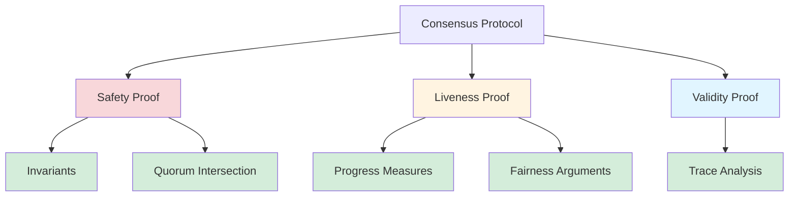

# Proof Techniques for Consensus Protocols

This note presents **manual proof techniques** for establishing correctness of Byzantine Fault Tolerant consensus protocols. These techniques complement automated verification and provide deep insights into **why** protocols work.

## Overview of Proof Strategies

### The Three Pillars



**Safety (Something bad never happens)**:
- Technique: **Invariants** (properties that hold in all reachable states)
- Example: "No two honest nodes decide different values"

**Liveness (Something good eventually happens)**:
- Technique: **Progress measures** (metrics that decrease until goal achieved)
- Example: "View number increases until all nodes decide"

**Validity (Decided value is legitimate)**:
- Technique: **Trace analysis** (show every execution satisfies the property)
- Example: "Decided value was proposed by a correct node"

## Technique 1: Inductive Invariants

### Definition

An **invariant** $I$ is a property that:
1. **Holds initially**: $I$ is true in the initial state
2. **Preserved by transitions**: If $I$ holds before a transition, $I$ holds after

**Consequence**: $I$ holds in **all reachable states**.

### Proof Template

**Goal**: Prove safety property $\phi$ (e.g., Agreement)

**Strategy**:
1. **Identify invariant** $I$ that implies $\phi$ (i.e., $I \Rightarrow \phi$)
2. **Prove base case**: $I$ holds in initial state
3. **Prove inductive step**: For each transition rule, if $I$ holds before, $I$ holds after
4. **Conclude**: $I$ holds always, so $\phi$ holds always

### Example: PBFT Agreement

**Property** (Agreement):
$$
\Box \left( \forall i,j \in \text{Correct} : \text{decided}(i, v) \land \text{decided}(j, v') \to v = v' \right)
$$

**Invariant** $I$:
$$
\text{If } 2f+1 \text{ replicas prepared } (v, n, V) \text{, no other value } v' \neq v \text{ can be prepared at } (*, n, V)
$$

**Proof**:

**Base Case**: Initially, no replicas have prepared anything → $I$ holds vacuously.

**Inductive Step**: Consider transition "Replica $i$ prepares $(v, n, V)$":
- **Pre-condition**: Replica $i$ received $2f+1$ PRE-PREPARE messages for $(v, n, V)$
- **Assumption**: $I$ holds before this transition
- **Goal**: Show $I$ holds after this transition

**Argument**:
1. Suppose replica $j$ prepared $(v', n, V)$ where $v' \neq v$
2. Then $j$ received $2f+1$ PRE-PREPARE for $(v', n, V)$
3. Quorums of size $2f+1$ in a system of $n=3f+1$ overlap in $\geq f+1$ nodes
4. At least $f+1$ replicas sent PRE-PREPARE for both $(v, n, V)$ and $(v', n, V)$
5. But at least one of these $f+1$ is honest (since $f$ is the max Byzantine count)
6. Honest replicas don't send conflicting PRE-PREPAREs (protocol rule)
7. **Contradiction** → $v = v'$ → $I$ holds after transition

**Conclusion**: $I$ holds in all states. Since decided values must be prepared, Agreement follows.

### Key Insights

**Strengthening**: Often the invariant $I$ is **stronger** than the property $\phi$ you want to prove.
- $\phi$: "No disagreement"
- $I$: "At most one value prepared per sequence number" (stronger, easier to prove inductively)

**Finding Invariants**: Requires creativity and protocol understanding. Common patterns:
- Quorum overlap properties
- Message counting (e.g., "At most $f$ VOTE messages for conflicting values")
- State constraints (e.g., "View number never decreases")

## Technique 2: Quorum Intersection

### The Quorum Argument

**Setup**: System with $n$ nodes, at most $f$ Byzantine.

**Quorum Definition**: A set of $Q \geq n - f$ nodes.

**Quorum Intersection Lemma**:
$$
\text{If } |Q_1| \geq n - f \text{ and } |Q_2| \geq n - f \text{, then } |Q_1 \cap Q_2| \geq n - 2f
$$

**For BFT** ($n = 3f+1$):
$$
|Q_1 \cap Q_2| \geq (3f+1) - 2f = f + 1
$$

**Implication**: Any two quorums overlap in **at least one honest node** (since at most $f$ are Byzantine).

### Application: Byzantine Broadcast Agreement

**Property**: If two honest nodes deliver values $v$ and $v'$ from the same sender, then $v = v'$.

**Proof**:
1. Node $i$ delivers $v$ after receiving $n-f$ ECHOs for $v$
2. Node $j$ delivers $v'$ after receiving $n-f$ ECHOs for $v'$
3. Quorums of $n-f$ overlap in $\geq n - 2f$ nodes
4. For $n=3f+1$: overlap $\geq f+1$ nodes
5. At least one honest node sent ECHO for both $v$ and $v'$
6. Honest nodes send at most one ECHO per sender (protocol rule)
7. Therefore, $v = v'$

**Visualization**:

```mermaid
graph TD
    subgraph Quorum Q1 "Quorum Q₁ (n-f nodes)"
    A1[Node 1<br/>ECHO v]
    A2[Node 2<br/>ECHO v]
    A3[Node 3<br/>ECHO v]
    A4[Node 4<br/>ECHO v]
    A5["..."]
    end
    
    subgraph Quorum Q2 "Quorum Q₂ (n-f nodes)"
    B1[Node 3<br/>ECHO v']
    B2[Node 4<br/>ECHO v']
    B3[Node 5<br/>ECHO v']
    B4[Node 6<br/>ECHO v']
    B5["..."]
    end
    
    subgraph Intersection "Overlap ≥ f+1"
    C1[Node 3: Honest]
    C2[Node 4: Could be Byzantine]
    C3["..."]
    end
    
    style C1 fill:#d4edda
    style C2 fill:#f8d7da
```

**Node 3 is honest** and in both quorums → sent ECHO for $v$ → must have $v = v'$.

### Why f < n/3?

**Question**: Why can BFT consensus tolerate only $f < n/3$ Byzantine faults?

**Answer**: Quorum intersection requires $\geq 1$ honest node.

**Math**:
$$
|Q_1 \cap Q_2| \geq n - 2f
$$

For at least 1 honest node in the intersection:
$$
n - 2f \geq f + 1 \implies n \geq 3f + 1
$$

**Therefore**: $f < n/3$ is the **tight bound** for Byzantine consensus.

→ See [[../bft-consensus/properties/fault-tolerance-threshold]] for detailed analysis

## Technique 3: Temporal Induction

### Temporal Properties

**Goal**: Prove temporal property $\phi$ (e.g., $\Box \psi$ or $\Diamond \psi$)

**Challenge**: Standard induction proves properties at individual states. How to prove properties over **sequences** of states?

### Temporal Induction Template

**For Always Properties** ($\Box \psi$):

**Goal**: Prove $\Box \psi$ (ψ holds in all future states)

**Proof**:
1. **Base Case**: Prove $\psi$ holds in the initial state
2. **Inductive Step**: For every transition, if $\psi$ holds before, $\psi$ holds after
3. **Conclude**: $\psi$ holds in all reachable states → $\Box \psi$

(This is just invariant induction!)

**For Eventually Properties** ($\Diamond \psi$):

**Goal**: Prove $\Diamond \psi$ (ψ eventually holds)

**Strategy**:
1. Define a **progress measure** $M$ (e.g., round number, view number)
2. **Prove** $M$ is well-founded (bounded below)
3. **Prove** $M$ decreases on each transition (or stays same, but eventually decreases)
4. **Prove** when $M$ reaches minimum, $\psi$ holds
5. **Conclude**: $\psi$ eventually holds → $\Diamond \psi$

### Example: Eventual Decision in PBFT

**Property** (Liveness):
$$
\Diamond (\forall i \in \text{Correct} : \text{decided}(i))
$$

**Progress Measure**: $M = $ (number of correct nodes that have not decided)

**Proof**:
1. **Well-Founded**: $M \geq 0$ (count of undecided nodes)
2. **Decrease**: Under partial synchrony, eventually:
   - Honest leader proposes
   - All correct nodes receive proposal
   - All correct nodes vote
   - All correct nodes receive $2f+1$ votes
   - At least one correct node decides → $M$ decreases
3. **Minimum**: When $M = 0$, all correct nodes have decided
4. **Conclude**: $M$ eventually reaches 0 → $\Diamond \text{all decided}$

**Note**: Requires **fairness assumption** (messages eventually delivered).

→ See [[temporal-logic]] for temporal operators

## Technique 4: Simulation Arguments

### Idea

Prove protocol $P_1$ satisfies property $\phi$ by showing:
1. There exists a **simpler protocol** $P_2$ that satisfies $\phi$
2. **Every execution** of $P_1$ can be **simulated** by an execution of $P_2$
3. **Conclude**: $P_1$ also satisfies $\phi$

### Simulation Relation

**Definition**: A relation $R$ between states of $P_1$ and $P_2$ such that:
- **Initial states**: $s_1$ initial in $P_1$ → $\exists s_2$ initial in $P_2$ with $R(s_1, s_2)$
- **Transitions**: If $R(s_1, s_2)$ and $s_1 \to s_1'$ in $P_1$, then $\exists s_2'$ with $s_2 \to^* s_2'$ in $P_2$ and $R(s_1', s_2')$

**Consequence**: Every $P_1$ execution corresponds to a $P_2$ execution.

### Example: PBFT simulates Byzantine Agreement

**Protocol $P_1$**: PBFT (complex, multiple phases)

**Protocol $P_2$**: Byzantine Agreement (abstract spec: "All honest nodes agree")

**Simulation**:
- **State Mapping**: Map PBFT replica states (INIT, PREPARED, COMMITTED) to BA states (UNDECIDED, DECIDED)
- **Transition Mapping**: PBFT COMMIT phase → BA DECIDE
- **Preservation**: If PBFT reaches COMMITTED, BA reaches DECIDED with same value

**Proof**: Show $R$ is a simulation relation → PBFT refines Byzantine Agreement.

→ See [[formal-verification]] for refinement verification

## Technique 5: Contradiction and Adversary Arguments

### Proof by Contradiction

**Strategy**:
1. **Assume** property $\phi$ is violated (e.g., two nodes decide differently)
2. **Derive** a contradiction (e.g., quorum intersection violated)
3. **Conclude**: Assumption was false → $\phi$ holds

### Example: PBFT Agreement (Contradiction Style)

**Claim**: Two correct replicas cannot decide different values.

**Proof by Contradiction**:
1. **Assume** replica $i$ decides $v$ and replica $j$ decides $v' \neq v$
2. **By protocol**: $i$ decided after receiving $2f+1$ COMMIT for $v$
3. **By protocol**: $j$ decided after receiving $2f+1$ COMMIT for $v'$
4. **Quorum intersection**: The two quorums overlap in $\geq f+1$ nodes
5. **Implication**: At least one honest node sent COMMIT for both $v$ and $v'$
6. **Protocol rule**: Honest nodes send COMMIT only after receiving $2f+1$ PREPARE
7. **Subargument**: If honest node prepares $v$, no honest node can prepare $v' \neq v$ (via quorum intersection on PREPARE phase)
8. **Contradiction**: Honest node cannot send COMMIT for both $v$ and $v'$
9. **Conclude**: Assumption false → $v = v'$

### Adversary Arguments

**Strategy**:
1. **Model adversary** as Byzantine nodes with arbitrary behavior
2. **Constrain adversary**: At most $f$ Byzantine nodes
3. **Prove** property holds **despite worst-case adversary strategy**

**Example**: Liveness under asynchrony
- **Adversary**: Delays all messages arbitrarily
- **Argument**: Even with delays, once network becomes synchronous, progress is made
- **Conclusion**: Liveness holds under **eventual synchrony**

→ See [[../bft-consensus/fundamentals#synchrony-models]] for synchrony assumptions

## Technique 6: Knowledge-Based Proofs

### Using Epistemic Logic

**Strategy**:
1. **Express property** using knowledge operators (e.g., $K_i \phi$: "Node $i$ knows $\phi$")
2. **Trace knowledge evolution** through protocol phases
3. **Prove** sufficient knowledge is gained for decision

### Example: Knowledge in Consensus

**Property**: Nodes decide only when they have sufficient knowledge.

**Proof**:
1. **Phase 1 (Propose)**: Leader knows $K_{\text{leader}}(\text{proposed}(v))$
2. **Phase 2 (Vote)**: After $2f+1$ votes, node $i$ knows $K_i(\text{quorum voted for } v)$
3. **Phase 3 (Commit)**: After $2f+1$ commits, node $i$ knows $K_i(E_{\text{Correct}} \text{ voted for } v)$ (everyone knows)
4. **Decision**: Knowledge level sufficient for safety → decide $v$

**Insight**: Protocols progressively increase knowledge until decision is safe.

→ See [[knowledge-framework]] for epistemic logic

## Technique 7: Case Analysis

### Exhaustive Case Enumeration

**Strategy**:
1. **Identify all possible cases** (e.g., message arrival orders, Byzantine behaviors)
2. **Prove property in each case** separately
3. **Conclude**: Property holds in all cases

### Example: Byzantine Broadcast Validity

**Property**: If sender is correct and broadcasts $m$, all correct nodes deliver $m$.

**Cases**:
1. **Case 1**: Sender sends $m$ to all nodes
   - All correct nodes receive $m$
   - All correct nodes ECHO $m$
   - All correct nodes receive $n-f$ ECHOs
   - All correct nodes deliver $m$ ✓

2. **Case 2**: Sender sends $m$ to some, $m'$ to others (equivocation attempt)
   - But sender is **correct** → doesn't equivocate
   - Case impossible ✓

3. **Case 3**: Byzantine nodes interfere
   - At most $f$ Byzantine nodes
   - Correct nodes form quorum of $n-f$ → enough ECHOs
   - Deliver $m$ ✓

**Conclusion**: In all cases, correct nodes deliver $m$.

## Common Proof Patterns

### Pattern 1: Quorum-Based Safety

**Template**:
1. Show property requires $Q_1$ quorum to achieve state $S_1$
2. Show violating property requires $Q_2$ quorum to achieve state $S_2$
3. Prove $Q_1 \cap Q_2 \geq f+1$ (contains honest node)
4. Show honest node cannot be in both $Q_1$ and $Q_2$ (protocol rule)
5. Conclude: Property cannot be violated

**Applies To**: Agreement, Byzantine Broadcast, Atomic Commit

### Pattern 2: Well-Founded Progress

**Template**:
1. Define progress measure $M$ (e.g., round number)
2. Prove $M$ is well-founded (bounded)
3. Prove fairness ensures $M$ decreases eventually
4. Prove when $M$ minimal, goal achieved
5. Conclude: Goal eventually achieved

**Applies To**: Liveness, Termination, View Changes

### Pattern 3: Inductive Counting

**Template**:
1. Count messages/votes of a certain type
2. Prove count $\leq f$ for Byzantine votes (since $\leq f$ Byzantine nodes)
3. Prove count $\geq n - f$ for correct votes (quorum)
4. Derive property from counts (e.g., majority is honest)

**Applies To**: Vote Counting, Threshold Signatures, Byzantine Agreement

## Self-Assessment Questions

1. **Invariants**:
   - What is an inductive invariant? How do you prove one?
   - Why do we often need to strengthen the invariant beyond the property we want to prove?
   - Give an example of an invariant for PBFT's PREPARE phase.

2. **Quorum Intersection**:
   - Prove that two quorums of size $2f+1$ in a system of $n=3f+1$ overlap in at least $f+1$ nodes.
   - Why is this intersection crucial for Byzantine consensus?
   - What happens if quorums are smaller than $2f+1$?

3. **Temporal Reasoning**:
   - How do you prove an "always" property ($\Box \psi$)?
   - How do you prove an "eventually" property ($\Diamond \psi$)?
   - What role does fairness play in liveness proofs?

4. **Advanced**:
   - How would you prove PBFT's liveness under partial synchrony?
   - What is a simulation relation, and how does it help in proofs?
   - How can knowledge-based reasoning simplify consensus proofs?

## Practical Tips

### Tip 1: Start Simple
Begin with simplified protocol (e.g., crash faults only) before tackling Byzantine faults.

### Tip 2: Visualize
Draw diagrams of quorum overlaps, message flows, and state transitions.

### Tip 3: Check Edge Cases
Test invariants on corner cases (e.g., exactly $f$ Byzantine nodes, all in same quorum).

### Tip 4: Use Mechanization
Even for manual proofs, sketch in Coq/Isabelle to catch errors.

### Tip 5: Learn from Examples
Study published proofs (PBFT paper, HotStuff paper) for proof patterns.

## See Also

**Within Logic Models**:
- [[overview]] — Introduction to logic models
- [[temporal-logic]] — Temporal logic operators
- [[knowledge-framework]] — Epistemic logic for knowledge proofs
- [[formal-verification]] — Automated verification techniques

**Related Concepts**:
- [[../bft-consensus/fundamentals]] — BFT consensus properties
- [[../bft-consensus/properties/safety-properties]] — Safety properties to prove
- [[../bft-consensus/properties/liveness-properties]] — Liveness properties to prove
- [[../bft-consensus/properties/fault-tolerance-threshold]] — Why f < n/3

**Protocols**:
- [[../bft-consensus/protocols/pbft]] — PBFT proof example
- [[../bft-consensus/protocols/hotstuff]] — HotStuff simplified proofs
- [[../provable-broadcast/provable-broadcast]] — Broadcast correctness proofs

**External Resources**:
- Lamport: "Specifying Systems" (2002) — TLA+ proofs
- Lynch: "Distributed Algorithms" (1996) — Formal proofs textbook
- Cachin et al.: "Introduction to Reliable and Secure Distributed Programming" (2011)
- [Decentralized Thoughts: Consensus Proofs](https://decentralizedthoughts.github.io)

---

**Congratulations!** You've completed the Logic Models domain. You now have the tools to formally specify, verify, and prove correctness of Byzantine consensus protocols. Consider applying these techniques to analyze protocols in the [[../integration/relationships|integration]] section.
