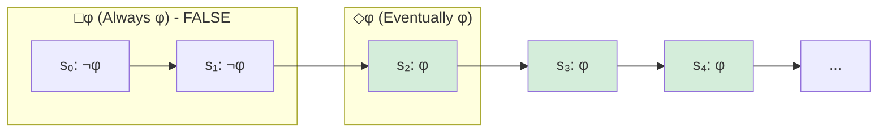
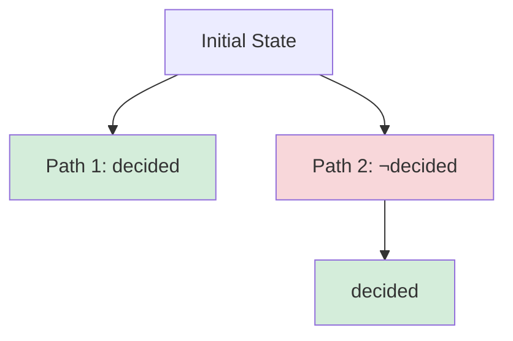
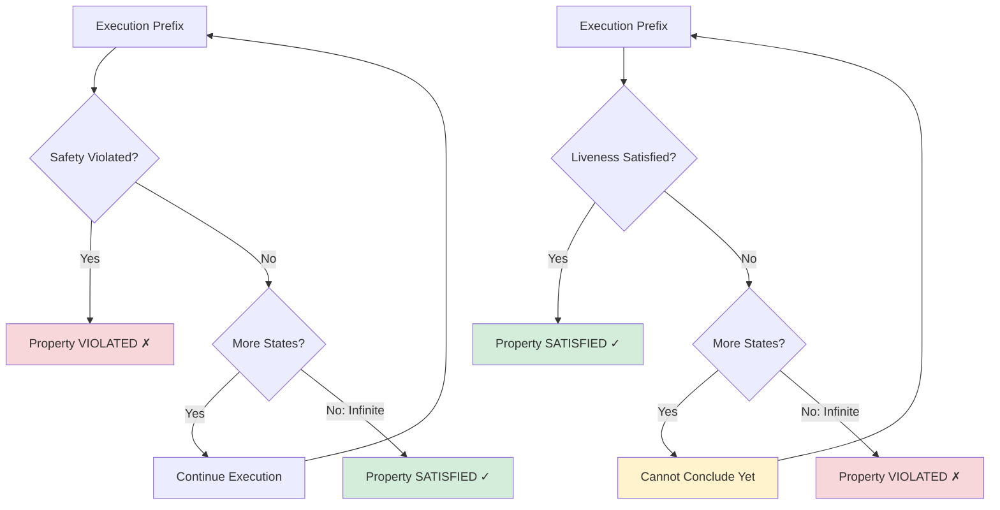
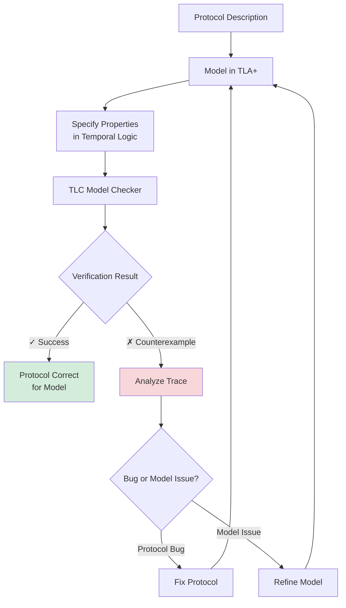

# Temporal Logic for Distributed Systems

**Temporal logic** extends classical logic with operators that express how propositions change **over time**. It provides the formal language for specifying safety and liveness properties in distributed systems, particularly BFT consensus protocols.

## The Problem: Properties Over Time

Consider these informal consensus requirements:
- "No two nodes decide differently" ← **Safety** (must hold at all times)
- "All nodes eventually decide" ← **Liveness** (must hold eventually)
- "After a node decides, it never changes its decision" ← **Persistence**

How do we express "at all times", "eventually", "after", and "never" precisely?

**Solution**: Temporal logic operators.

## Basic Temporal Operators

### Core Operators

| Operator | Symbol | Meaning | Example |
|----------|--------|---------|---------|
| **Next** | ○φ | φ holds in the next state | ○(sent → received) |
| **Always** | □φ | φ holds in all future states | □(decided → ¬change) |
| **Eventually** | ◇φ | φ holds in some future state | ◇decided |
| **Until** | φ U ψ | φ holds until ψ becomes true | ¬decided U commit |

### Visual Intuition



At state $s_0$:
- $\Diamond \phi$ is **true** (φ holds at $s_2$)
- $\Box \phi$ is **false** (φ doesn't hold at $s_0, s_1$)
- $\circ \phi$ is **false** (φ doesn't hold at $s_1$)

## Linear Temporal Logic (LTL)

**Model**: Time is a linear sequence of states (an execution trace).

**Syntax**:
$$
\phi ::= p \mid \neg \phi \mid \phi_1 \land \phi_2 \mid \circ \phi \mid \phi_1 \, U \, \phi_2
$$

**Semantics**: $\phi$ is interpreted over an infinite sequence of states $s_0, s_1, s_2, \ldots$

### Derived Operators

From the basic operators, we derive:

**Eventually**:
$$
\Diamond \phi \equiv \text{true} \, U \, \phi
$$
"φ holds at some point in the future"

**Always**:
$$
\Box \phi \equiv \neg \Diamond \neg \phi
$$
"φ holds at all points in the future"

**Weak Until**:
$$
\phi \, W \, \psi \equiv (\phi \, U \, \psi) \lor \Box \phi
$$
"φ holds until ψ, or φ holds forever"

### Consensus Properties in LTL

**Agreement (Safety)**:
$$
\Box \left( \bigwedge_{i,j \in \text{Correct}} (decided_i \land decided_j) \to (value_i = value_j) \right)
$$
"Always, if two correct nodes have decided, they decided on the same value."

**Validity (Safety)**:
$$
\Box \left( decided(v) \to \bigvee_{i \in \text{Correct}} proposed(i, v) \right)
$$
"Always, if a value is decided, it was proposed by some correct node."

**Termination (Liveness)**:
$$
\Diamond \left( \bigwedge_{i \in \text{Correct}} decided_i \right)
$$
"Eventually, all correct nodes decide."

**Irrevocability (Safety)**:
$$
\Box \left( decided_i(v) \to \Box decided_i(v) \right)
$$
"Always, if a node decides on v, it always decides on v (no changes)."

## Computation Tree Logic (CTL)

**Model**: Time is a tree of possible execution paths (branching futures).

**Motivation**: Systems are non-deterministic (scheduler choices, message delays, failures). CTL reasons about **all possible executions**.

### Path Quantifiers

| Quantifier | Symbol | Meaning |
|------------|--------|---------|
| **All paths** | A | φ holds on all execution paths |
| **Some path** | E | φ holds on at least one execution path |

**Syntax**: Every temporal operator must be preceded by a path quantifier.

$$
\phi ::= p \mid \neg \phi \mid \phi_1 \land \phi_2 \mid AX\phi \mid EX\phi \mid A(\phi_1 \, U \, \phi_2) \mid E(\phi_1 \, U \, \phi_2)
$$

### Common CTL Patterns

**Inevitability**: $AG \, EF \, \phi$
"On all paths, always, φ is reachable"
(Strong fairness)

**Possibility**: $EF \, \phi$
"There exists a path where φ eventually holds"
(Reachability)

**Safety**: $AG \, \phi$
"On all paths, φ always holds"

### CTL vs LTL



**Question**: Does "eventually decided" hold?

- **LTL**: Depends on which path is taken (trace-specific)
  - On Path 1: $\Diamond decided$ is **true**
  - On Path 2: $\Diamond decided$ is **true**
  
- **CTL**: Quantify over paths
  - $AF \, decided$ (on **all** paths, eventually decided) = **true**
  - $EF \, decided$ (on **some** path, eventually decided) = **true**

**Key Difference**: CTL can express properties LTL cannot (and vice versa).

**Example** (CTL-only property):
$$
AG \, EF \, reset
$$
"Always possible to reset the system"
(On every path, at every state, there's a path to reset)

**Example** (LTL-only property):
$$
\Diamond \Box \phi
$$
"Eventually φ holds forever"
(CTL cannot express "eventually forever" without intermediate states)

## Fairness Assumptions

Liveness properties often require **fairness**:

### Weak Fairness
"If an action is continuously enabled, it eventually executes."

**LTL**:
$$
\Box \Diamond enabled(a) \to \Box \Diamond executed(a)
$$

**Application**: If a message is continuously in the send buffer, it eventually gets sent.

### Strong Fairness
"If an action is infinitely often enabled, it eventually executes."

**LTL**:
$$
\Diamond \Box enabled(a) \to \Box \Diamond executed(a)
$$

**Application**: If a node is infinitely often ready to propose, it eventually proposes.

**Consensus Implication**:
- Without fairness: Adversary can delay messages forever, violating liveness
- With fairness: Messages eventually delivered → protocols terminate

## Safety vs. Liveness

**Alpern & Schneider's Characterization**:

### Safety Property
"Something bad never happens"

**Formal**: If a safety property $\phi$ is violated, the violation occurs at a **finite prefix** of the execution.

$$
\text{Safety: } \phi = \Box \psi
$$

**Examples**:
- **Agreement**: No two nodes decide differently (violated if it ever happens)
- **Validity**: Decided value was proposed (violated if a non-proposed value is decided)
- **Mutual Exclusion**: No two processes in critical section (violated the moment it happens)

**Violation is Irreversible**: Once violated, cannot be undone.

### Liveness Property
"Something good eventually happens"

**Formal**: A liveness property cannot be violated at any finite prefix—you must wait to see the entire (infinite) execution.

$$
\text{Liveness: } \phi = \Diamond \psi
$$

**Examples**:
- **Termination**: All nodes eventually decide (not violated until infinite time passes)
- **Progress**: A message is eventually delivered
- **Non-blocking**: A request eventually receives a response

**Violation Requires Infinity**: Cannot declare violation at any finite point.

### Why the Distinction Matters



**Testing Implications**:
- **Safety**: Can be violated in finite tests (find a bad execution)
- **Liveness**: Cannot be fully verified in finite tests (need infinite waiting or formal proof)

## Temporal Logic in Protocol Verification

### Example: PBFT Properties

**1. Agreement (Safety)**:
```
□ (∀i,j ∈ Correct : commit(i,v,n) ∧ commit(j,v',n) → v = v')
```
"Always, if two correct replicas commit at the same sequence number, they commit the same value."

**2. Liveness (with Synchrony Assumption)**:
```
(□◇synchrony) → ◇(∀i ∈ Correct : decided(i))
```
"If the network is eventually synchronous, then eventually all correct replicas decide."

**3. View Change Correctness (Safety)**:
```
□ (view_change(v → v+1) → preparedCertificate(v))
```
"Always, a view change from v to v+1 requires a valid prepared certificate from view v."

### Example: Provable Broadcast Properties

From [[bft-consensus-analysis/provable-broadcast/properties|Provable Broadcast Properties]]:

**Consistency (Safety)**:
```
□ (deliver(i,m,cert) ∧ deliver(j,m',cert') ∧ sender(cert)=sender(cert') → m = m')
```
"Always, two deliveries from the same sender have the same message."

**Provability (Safety)**:
```
□ (deliver(i,m,cert) → ∃Q:|Q|≥n-2f, ∀j∈Q : received(j,m))
```
"Always, a delivery certificate proves that at least n-2f nodes received the message."

**Liveness (with Fairness)**:
```
(correct(sender) ∧ broadcast(sender,m)) → ◇(∀i∈Correct : deliver(i,m,cert))
```
"If a correct sender broadcasts m, eventually all correct nodes deliver m."

## Temporal Logic Model Checking

### Approach

1. **Model the system** as a Kripke structure (state transition graph)
2. **Write specification** in LTL or CTL
3. **Run model checker** (e.g., SPIN, NuSMV, TLA+)
4. **Result**:
   - ✓ Property holds for all reachable states
   - ✗ Counterexample trace showing violation

### Example Workflow



→ See [[bft-consensus-analysis/logic-models/formal-verification|Formal Verification of Consensus Protocols]] for detailed verification techniques

## Bounded Temporal Operators

For practical verification, we often use **bounded versions**:

**Bounded Eventually**:
$$
\Diamond_{\leq k} \phi
$$
"φ holds within k steps"

**Bounded Always**:
$$
\Box_{\leq k} \phi
$$
"φ holds for the next k steps"

**Application**: Model checkers explore states up to depth k (bounded model checking).

**Trade-off**:
- **Soundness**: If a violation is found, it's real
- **Completeness**: If no violation found in k steps, property may still be violated at step k+1

## Combining Knowledge and Time

**Distributed Temporal Epistemic Logic (DTEL)** combines knowledge operators with temporal operators:

**Examples**:

**Eventual Knowledge**:
$$
\Diamond K_i \phi
$$
"Node i eventually knows φ"

**Persistent Knowledge**:
$$
K_i \Box \phi
$$
"Node i knows that φ always holds"

**Common Knowledge Over Time**:
$$
\Diamond C_G decided
$$
"Eventually, there is common knowledge of the decision"
(Unattainable in asynchronous systems!)

**Application**: Express sophisticated distributed system properties.

→ See [[bft-consensus-analysis/logic-models/knowledge-framework|Knowledge Framework for Distributed Systems]] for knowledge operators

## Temporal Patterns in Consensus

### Pattern 1: Response
$$
\Box (\phi \to \Diamond \psi)
$$
"Always, if φ happens, eventually ψ happens"

**Example**: $\Box (propose(v) \to \Diamond decided)$
"Whenever a value is proposed, eventually a decision is made"

### Pattern 2: Precedence
$$
\neg \psi \, W \, \phi
$$
"ψ cannot happen until φ has happened"

**Example**: $\neg commit \, W \, prepare$
"Cannot commit until prepare phase completes"

### Pattern 3: Absence
$$
\Box \neg \phi
$$
"φ never happens"

**Example**: $\Box \neg (decided_i(v) \land decided_i(v') \land v \neq v')$
"A node never decides two different values"

### Pattern 4: Universality
$$
\Box \phi
$$
"φ always holds"

**Example**: $\Box (f < n/3)$
"The fault threshold is always maintained"

## Self-Assessment Questions

1. **Operators**:
   - What is the difference between □φ and ◇φ?
   - How would you express "φ holds in the next two states" in LTL?
   - What does AG EF φ mean in CTL?

2. **Safety vs. Liveness**:
   - Is "agreement" a safety or liveness property? Why?
   - Why can't you test liveness properties with finite executions?
   - Give an example of a property that is both safety and liveness.

3. **Application**:
   - Write the LTL formula for "once a node decides, it never changes its decision."
   - Express "if a correct node broadcasts, all correct nodes eventually deliver" in LTL.
   - How would you verify PBFT's agreement property using temporal logic?

4. **Advanced**:
   - Can CTL express "eventually φ holds forever"? If not, why?
   - How do fairness assumptions affect liveness properties?
   - What is the relationship between □◇ and ◇□?

## See Also

**Within Logic Models**:
- [[overview|overview]] — Introduction to logic models
- [[bft-consensus-analysis/logic-models/knowledge-framework|Knowledge Framework for Distributed Systems]] — Epistemic logic for distributed systems
- [[bft-consensus-analysis/logic-models/formal-verification|Formal Verification of Consensus Protocols]] — Verification techniques using temporal logic
- [[bft-consensus-analysis/logic-models/proof-techniques|Proof Techniques for Consensus Protocols]] — Proving temporal properties

**Related Concepts**:
- [[bft-consensus-analysis/bft-consensus/properties/safety-properties|Safety Properties in BFT Consensus]] — Safety in BFT consensus
- [[bft-consensus-analysis/bft-consensus/properties/liveness-properties|Liveness Properties in BFT Consensus]] — Liveness in BFT consensus
- [[bft-consensus-analysis/bft-consensus/fundamentals|BFT Consensus Fundamentals]] — Consensus properties overview
- [[bft-consensus-analysis/provable-broadcast/properties|Provable Broadcast Properties]] — Temporal properties of broadcast

**External Resources**:
- Leslie Lamport: "The Temporal Logic of Actions" (1994)
- Pnueli: "The Temporal Logic of Programs" (1977)
- Baier & Katoen: "Principles of Model Checking" (2008)
- [TLA+ Homepage](https://lamport.azurewebsites.net/tla/tla.html)

---

**Next**: Explore [[bft-consensus-analysis/logic-models/formal-verification|Formal Verification of Consensus Protocols]] to see how temporal logic is used to verify consensus protocols.
