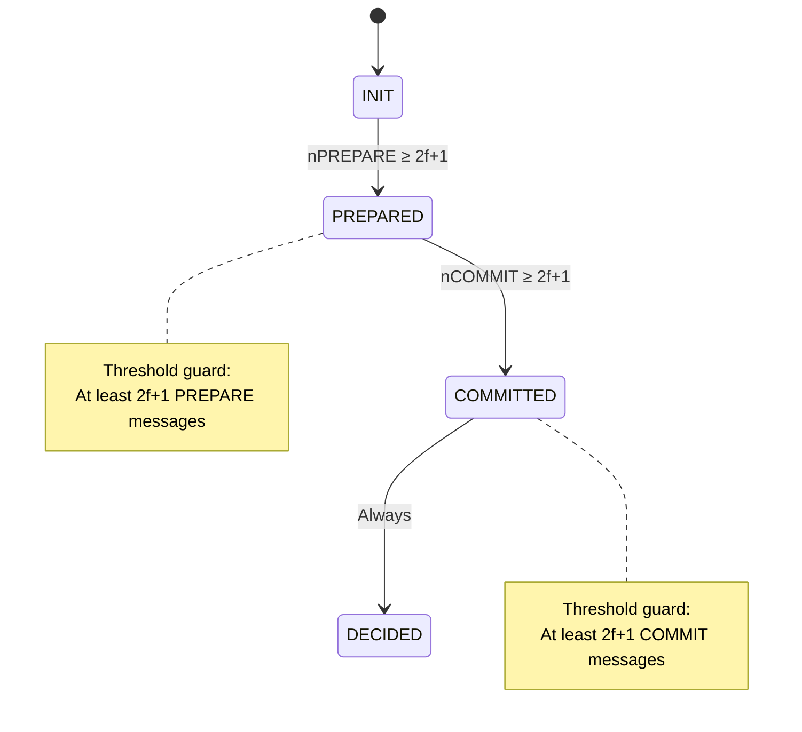
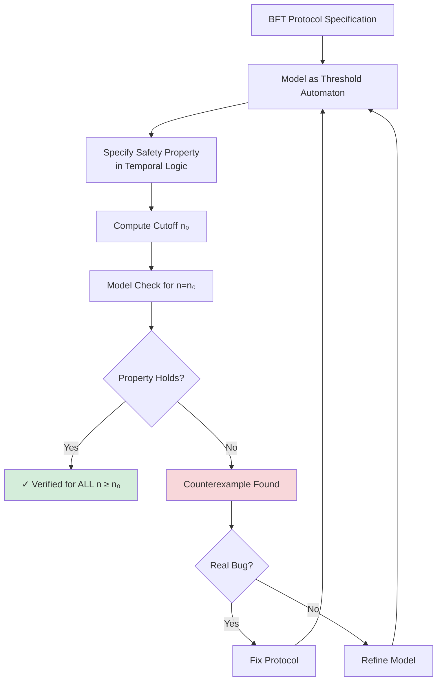

# Threshold Automata for Parameterized Verification

**Threshold automata** are a specialized formal model for verifying **quorum-based distributed protocols** with an **arbitrary number of processes**. They enable automated verification of Byzantine fault-tolerant consensus algorithms regardless of the system size $n$.

## The Parameterized Verification Problem

### The Challenge

**Question**: How do we verify a BFT protocol for **any** number of nodes $n$?

**Naive Approach**:
- Verify for $n=4$ (1 Byzantine fault)
- Verify for $n=7$ (2 Byzantine faults)
- Verify for $n=10$ (3 Byzantine faults)
- ...

**Problem**: This doesn't prove correctness for all $n$—and model checking becomes infeasible as $n$ grows (state explosion).

### The Solution: Parameterized Verification

**Goal**: Verify the protocol **once**, with $n$ as a symbolic parameter, proving correctness for **all** instantiations.

**Threshold Automata Insight**:
BFT protocols have a special structure—they use **threshold guards** (e.g., "wait for $2f+1$ messages"). Threshold automata exploit this structure to enable tractable verification.

## What is a Threshold Automaton?

### Formal Definition

A **threshold automaton** is a tuple $\mathcal{A} = (L, I, \Gamma, R)$:

- **$L$**: Finite set of **local states** (e.g., INIT, PREPARED, COMMITTED)
- **$I \in L$**: Initial local state
- **$\Gamma$**: Set of **shared variables** (counters for messages received)
- **$R$**: Set of **guarded rules** for state transitions

### Key Feature: Threshold Guards

Rules have **guards** of the form:
$$
\sum_{l \in S} n_l \geq T(n, f)
$$

**Meaning**: "Transition is enabled when at least $T(n,f)$ processes are in states $S$."

**Example**:
$$
n_{\text{PREPARED}} \geq 2f + 1
$$
"A process can move to COMMITTED when at least $2f+1$ processes are in PREPARED."

### Why This Matters

**Standard Automata**: Guards use equality ($x = 5$) or simple comparisons ($x > 3$)
**Threshold Automata**: Guards use **parameterized thresholds** ($x \geq 2f+1$) involving $n$ and $f$

This structure enables **cutoff results**—verifying small instances suffices for all $n$.

## Threshold Automata for PBFT

### System Model

**Processes**: $n = 3f + 1$ (where $f$ is the maximum Byzantine faults)

**Local States**:
```
L = {INIT, PREPARED, COMMITTED, DECIDED}
```

**Shared Variables** (message counters):
```
Γ = {nPREPARE, nCOMMIT}
```
- $nPREPARE[i]$: Number of PREPARE messages process $i$ received
- $nCOMMIT[i]$: Number of COMMIT messages process $i$ received

### Transition Rules

**Rule 1: INIT → PREPARED**
```
Guard: nPREPARE[i] ≥ 2f + 1
Effect: 
  - state[i] := PREPARED
  - Broadcast COMMIT
  - Increment nCOMMIT[j] for all j
```

**Rule 2: PREPARED → COMMITTED**
```
Guard: nCOMMIT[i] ≥ 2f + 1
Effect:
  - state[i] := COMMITTED
```

**Rule 3: COMMITTED → DECIDED**
```
Guard: state[i] = COMMITTED
Effect:
  - state[i] := DECIDED
```

### Visualization



## The Cutoff Theorem

**Theorem (Konnov et al., 2017)**:
> For threshold automata modeling BFT consensus, it suffices to verify the protocol for a **small cutoff** $n_0$ (often $n_0 = 7$). If the property holds for $n_0$, it holds for all $n \geq n_0$.

### Intuition

**Why Cutoffs Exist**:

1. **Threshold Structure**: Guards only check if a threshold is met, not the exact count
2. **Monotonicity**: Adding more correct processes doesn't break safety (more votes strengthen quorums)
3. **Symmetry**: Processes are identical (no process IDs matter for correctness)

**Example**:
- Verify PBFT with $n=7$ (2 Byzantine faults)
- If agreement holds for $n=7$, it holds for $n=10, 13, 100, \ldots$

**Benefit**: Verification becomes **decidable** and **efficient**—check a finite state space.

### Cutoff Calculation

For BFT consensus with $f < n/3$:

**Common Cutoffs**:
- $n_0 = 4$ for $f=1$ (minimal BFT system)
- $n_0 = 7$ for $f=2$
- $n_0 = 10$ for $f=3$

**General Formula** (for quorum-based protocols):
$$
n_0 = 3f_{\max} + 1
$$
where $f_{\max}$ is the maximum $f$ you want to verify (often 2 or 3 suffices).

## Formal Verification Workflow



### Tools

**ByMC (Byzantine Model Checker)**:
- Input: Threshold automaton + temporal logic property
- Output: Verified ✓ or counterexample ✗
- Supports PBFT, Tendermint, and other BFT protocols

**PRISM**:
- Probabilistic model checker
- Can handle threshold guards with probabilistic transitions

**TLA+** (with manual abstraction):
- Not specialized for threshold automata, but can model them
- Requires manual proof of cutoff

## Example: Verifying PBFT Agreement

### Property (Agreement)

**Temporal Logic**:
$$
\Box \left( \forall i,j \in \text{Correct} : \text{state}[i] = \text{DECIDED} \land \text{state}[j] = \text{DECIDED} \to \text{value}[i] = \text{value}[j] \right)
$$

"Always, if two correct processes decide, they decide the same value."

### Verification Steps

**1. Model PBFT as Threshold Automaton** (shown above)

**2. Set Parameters**:
- $n = 7$ (cutoff for $f=2$)
- $f = 2$ (Byzantine faults)

**3. Run ByMC**:
```bash
bymc pbft.ta --property agreement.ltl
```

**4. Result**:
```
✓ Agreement property holds for n=7, f=2
✓ By cutoff theorem, holds for all n ≥ 7
```

**5. Interpretation**:
- PBFT's agreement property is **verified** for arbitrary $n$ (assuming $n = 3f+1$)

## Threshold Guards in Detail

### Guard Types

**Type 1: Simple Threshold**
$$
n_l \geq k
$$
"At least $k$ processes in state $l$"

**Example**: $n_{\text{PREPARED}} \geq 2f+1$

**Type 2: Sum Over States**
$$
\sum_{l \in S} n_l \geq k
$$
"At least $k$ processes in any state from set $S$"

**Example**: $n_{\text{PREPARED}} + n_{\text{COMMITTED}} \geq n - f$

**Type 3: Comparison of Counters**
$$
n_{l_1} > n_{l_2} + k
$$
"State $l_1$ has at least $k$ more processes than state $l_2$"

**Example**: $n_{\text{vote}_A} > n_{\text{vote}_B}$ (quorum for A larger than for B)

### Semantics

**Global State**: $\mathbf{n} = (n_{l_1}, n_{l_2}, \ldots, n_{l_k})$ where $n_{l_i}$ is the number of processes in state $l_i$.

**Guard Evaluation**: Guard $g$ is **enabled** at global state $\mathbf{n}$ if:
$$
g(\mathbf{n}, n, f) = \text{true}
$$

**Transition**: If guard enabled, a process can transition, updating the global state.

### Why Thresholds Enable Cutoffs

**Key Property**: Threshold guards are **monotone**.

**Monotonicity**:
If guard $g(\mathbf{n}, n, f)$ is true, and we **add more correct processes** (increasing $n$ and $\mathbf{n}$), then $g$ remains true.

**Example**:
- Guard: $n_{\text{PREPARED}} \geq 2f+1$
- If true for $n=7, f=2$ (i.e., 5 prepared processes)
- Then true for $n=10, f=3$ (i.e., 5 prepared processes still meet $2 \cdot 3 + 1 = 7$... wait, this needs 7!)

**Correction**: Cutoff reasoning is more subtle—it accounts for the **ratio** of correct to faulty processes.

**Proper Reasoning**:
- For $n=7, f=2$: At least 5 correct processes
- For $n=10, f=3$: At least 7 correct processes
- Threshold $2f+1$ scales with $f$
- **Cutoff theorem** proves that if quorum intersection holds for $n_0$, it holds for all $n$

## Limitations of Threshold Automata

### 1. Restricted to Threshold Guards

**Not All Protocols Fit**:
- Protocols with complex logic (e.g., "if leader is in state X and majority is in Y") may not fit threshold automaton structure
- Ad-hoc protocols without clear quorum-based transitions are hard to model

### 2. Safety Only (Primarily)

**Liveness is Harder**:
- Cutoff theorems typically apply to **safety properties**
- Liveness requires additional assumptions (fairness, eventual synchrony)
- Tools like ByMC focus on safety; liveness verification is less automated

### 3. Abstraction Loss

**Model May Not Capture All Details**:
- Cryptographic operations abstracted away
- Network model simplified (e.g., no Byzantine message corruption beyond faulty senders)
- Implementation bugs (off-by-one errors) not caught if model is abstract

### 4. Manual Modeling Required

**Modeling is Non-Trivial**:
- Converting a protocol description to a threshold automaton requires expertise
- Must identify local states, shared variables, and guard conditions correctly
- Errors in modeling lead to incorrect verification results

## Advanced Topics

### 1. Parameterized Complexity

**Question**: What is the complexity of verifying a threshold automaton?

**Answer**: Often **PSPACE-complete** for reachability, but:
- **Cutoff results** reduce it to polynomial time (for fixed cutoff)
- **Specialized algorithms** exploit threshold structure for efficiency

### 2. Byzantine Model Checker (ByMC) Internals

**ByMC Algorithm**:
1. **Abstract** the threshold automaton to a finite-state system
2. **Compute cutoff** $n_0$ using theoretical results
3. **Model check** the abstracted system for $n = n_0$
4. **Conclude** via cutoff theorem

**Abstraction**: Counter abstraction (track intervals of counters, not exact values)

### 3. Combining with Other Formalisms

**Threshold Automata + Temporal Epistemic Logic**:
- Model knowledge evolution alongside state transitions
- Express properties like "after 2f+1 PREPARE messages, node knows agreement is achievable"

**Threshold Automata + Probabilistic Transitions**:
- Model randomized consensus (e.g., randomized leader election)
- Use probabilistic model checkers (PRISM)

## Practical Example: Modeling HotStuff

**HotStuff Phases**: PREPARE, PRE-COMMIT, COMMIT, DECIDE

**Threshold Automaton**:

**Local States**:
```
L = {INIT, PREPARE, PRE-COMMIT, COMMIT, DECIDE}
```

**Shared Variables**:
```
Γ = {nPREPARE, nPRE-COMMIT, nCOMMIT}
```

**Rules**:

**R1**: INIT → PREPARE
```
Guard: Received PREPARE proposal from leader
Effect: Broadcast PREPARE vote
```

**R2**: PREPARE → PRE-COMMIT
```
Guard: nPREPARE ≥ 2f + 1
Effect: Broadcast PRE-COMMIT vote
```

**R3**: PRE-COMMIT → COMMIT
```
Guard: nPRE-COMMIT ≥ 2f + 1
Effect: Broadcast COMMIT vote
```

**R4**: COMMIT → DECIDE
```
Guard: nCOMMIT ≥ 2f + 1
Effect: Decide on value
```

**Verification**:
- Run ByMC with $n=7, f=2$
- Check agreement property: $\Box (\text{DECIDE}(v) \land \text{DECIDE}(v') \to v = v')$
- Result: ✓ Verified for all $n \geq 7$

→ See [[bft-consensus-analysis/bft-consensus/protocols/hotstuff|HotStuff: Linear-Complexity BFT Consensus]] for protocol details

## Self-Assessment Questions

1. **Concepts**:
   - What is a threshold guard? Give an example from BFT consensus.
   - What is the cutoff theorem, and why is it useful?
   - Why can't threshold automata easily verify liveness properties?

2. **Modeling**:
   - How would you model PBFT's PREPARE phase as a threshold automaton rule?
   - What shared variables would you need for a three-phase BFT protocol?
   - How do you represent Byzantine processes in a threshold automaton?

3. **Verification**:
   - If a property holds for $n=7, f=2$, under what conditions does it hold for all $n$?
   - What is the typical cutoff for BFT protocols with $f < n/3$?
   - How would you verify that two quorums always overlap in at least $f+1$ honest nodes?

4. **Advanced**:
   - How does counter abstraction help make verification tractable?
   - What are the limitations of threshold automata compared to general model checking?
   - How would you combine threshold automata with probabilistic reasoning?

## See Also

**Within Logic Models**:
- [[overview|overview]] — Introduction to logic models
- [[bft-consensus-analysis/logic-models/formal-verification|Formal Verification of Consensus Protocols]] — Verification techniques overview
- [[bft-consensus-analysis/logic-models/proof-techniques|Proof Techniques for Consensus Protocols]] — Manual proof strategies
- [[bft-consensus-analysis/logic-models/temporal-logic|Temporal Logic for Distributed Systems]] — Temporal logic for specifications

**Related Concepts**:
- [[bft-consensus-analysis/bft-consensus/protocols/pbft|PBFT: Practical Byzantine Fault Tolerance]] — PBFT protocol (threshold automaton example)
- [[bft-consensus-analysis/bft-consensus/protocols/hotstuff|HotStuff: Linear-Complexity BFT Consensus]] — HotStuff (simplified threshold structure)
- [[bft-consensus-analysis/bft-consensus/properties/fault-tolerance-threshold|Fault Tolerance Threshold: Why f < n/3 for Byzantine Failures]] — Why 2f+1 quorums
- [[bft-consensus-analysis/provable-broadcast/provable-broadcast|Provable Broadcast Protocol]] — Quorum certificates

**Tools**:
- [ByMC (Byzantine Model Checker)](https://github.com/konnov/bymc)
- [PRISM Model Checker](https://www.prismmodelchecker.org/)
- [TLA+ Toolbox](https://lamport.azurewebsites.net/tla/toolbox.html)

**External Resources**:
- Konnov et al.: "Parameterized Model Checking of Fault-Tolerant Distributed Algorithms by Abstraction" (2017)
- John et al.: "Parameterized Model Checking of Rendezvous Algorithms for Robots with Lights" (2013)
- Lazić et al.: "A Cutoff Theorem for Threshold-Guarded Distributed Algorithms" (2017)

---

**Next**: Learn [[bft-consensus-analysis/logic-models/formal-verification|Formal Verification of Consensus Protocols]] techniques to apply these models in practice.
