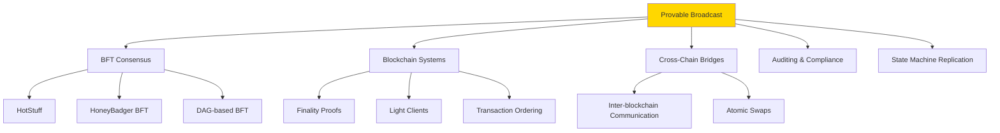
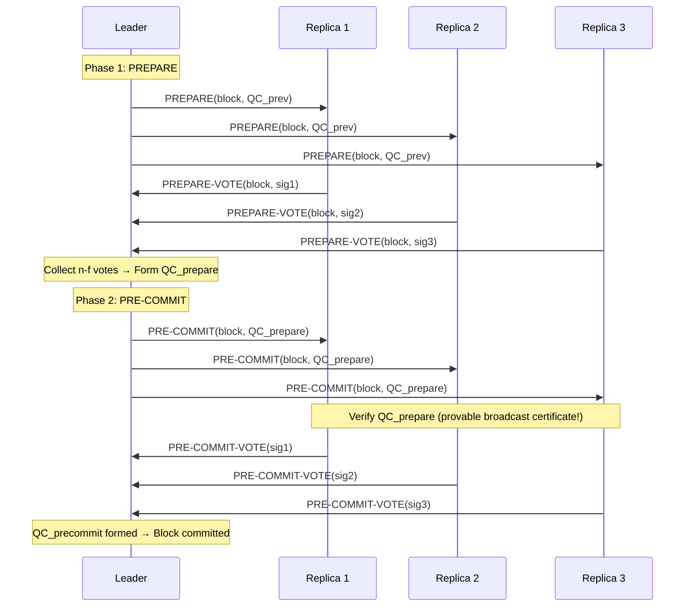
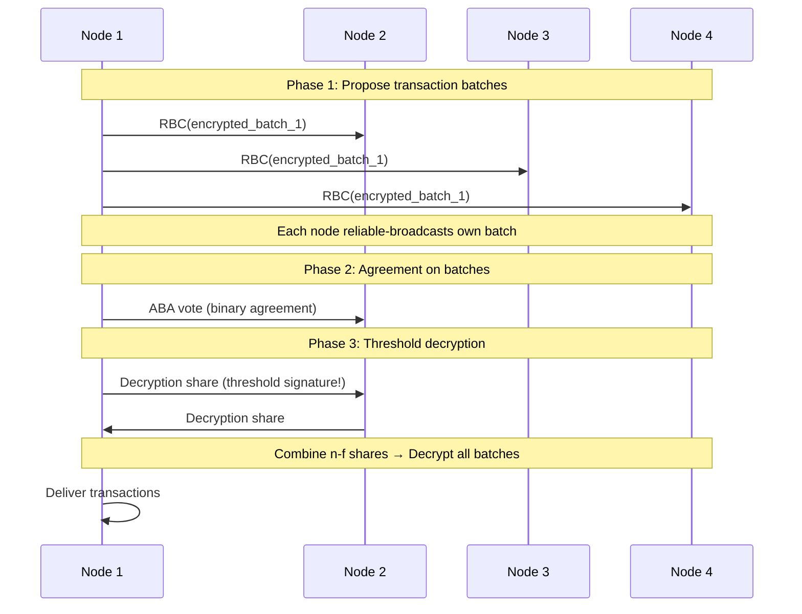
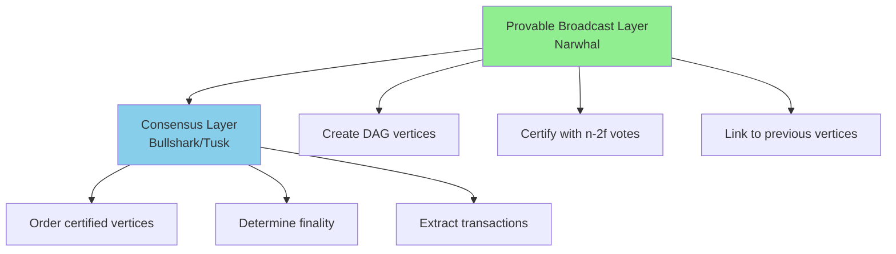
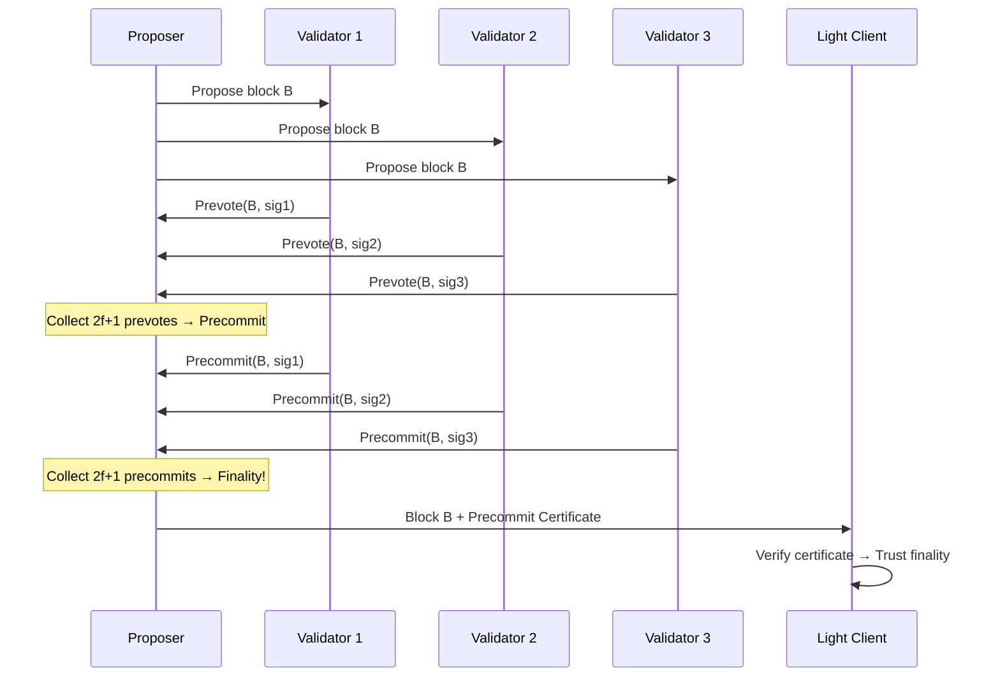
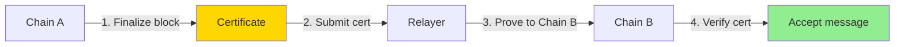
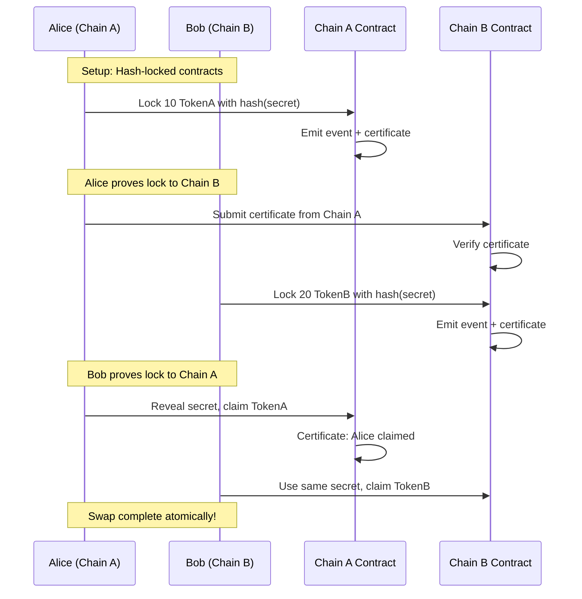

# Provable Broadcast Applications

**Provable broadcast** has become a fundamental building block in modern distributed systems, particularly in blockchain and Byzantine Fault Tolerant consensus protocols. This note explores real-world applications, implementation patterns, and design considerations.

## Overview

Provable broadcast's key innovation — **delivery certificates** — enables applications that require:
- **Trustless verification**: External parties can verify claims without trust
- **Accountability**: Detect and prove Byzantine behavior
- **Single-round commitment**: Reduce consensus latency
- **Cross-system communication**: Prove state across system boundaries



## Application 1: BFT Consensus Protocols

### HotStuff (Quorum Certificates)

**[[hotstuff|HotStuff]]** uses provable broadcast to achieve **linear communication complexity** (O(n) instead of O(n²)) and **responsive liveness** (progress at network speed).

#### How It Works



**Key Insight**: Quorum Certificate (QC) **is** a provable broadcast certificate! It proves n - f replicas accepted the proposal.

**Benefits**:
- **Linear messages**: Leader collects votes (O(n)), broadcasts QC (O(n))
- **Pipelining**: QC from round i used as proof in round i+1
- **Fast path**: 2 round-trips to commit (vs 3 in PBFT)

**Implementation**:
```python
class HotStuffReplica:
    def on_prepare(self, block, qc_prev):
        """Respond to leader's PREPARE"""
        # Verify previous QC (provable broadcast certificate!)
        if self.verify_qc(qc_prev):
            vote = self.sign(block)
            self.send_to_leader(vote)
    
    def verify_qc(self, qc):
        """Verify quorum certificate"""
        # Check: n - f valid signatures on the same block
        return (
            len(qc.signatures) >= self.n - self.f and
            all(self.verify_signature(sig, qc.block) for sig in qc.signatures)
        )
```

### HoneyBadger BFT (Threshold Signatures)

**[[honeybadger-bft|HoneyBadgerBFT]]** uses threshold cryptography for **asynchronous BFT** with guaranteed liveness even under network attacks.

#### How It Works



**Key Insight**: Threshold signatures create **constant-size certificates** (O(1)) for each batch, enabling high throughput.

**Benefits**:
- **Asynchronous safety**: No timing assumptions
- **Guaranteed liveness**: Progress even with Byzantine delays
- **Compact proofs**: O(1) certificate size (BLS threshold signatures)

**Implementation**:
```python
class HoneyBadgerNode:
    def propose_batch(self, transactions):
        """Propose encrypted transaction batch"""
        # Encrypt with threshold encryption
        encrypted = self.threshold_encrypt(transactions)
        # Provable broadcast the encrypted batch
        cert = self.provable_broadcast(encrypted)
        return cert
    
    def decrypt_batch(self, encrypted_batch):
        """Threshold decrypt after agreement"""
        # Each node creates decryption share (threshold signature)
        share = self.create_decryption_share(encrypted_batch)
        # Broadcast shares
        self.broadcast(share)
        # Combine n-f shares → decrypt
        if len(self.shares[encrypted_batch]) >= self.n - self.f:
            decrypted = self.threshold_decrypt(encrypted_batch, self.shares)
            return decrypted
```

### DAG-based BFT (Narwhal, Bullshark, Tusk)

Modern DAG-based protocols separate **data dissemination** (provable broadcast) from **ordering** (consensus).

#### Architecture



**Key Insight**: Provable broadcast (Narwhal) runs continuously, building a certified DAG. Consensus (Bullshark) runs separately to order the DAG.

**Benefits**:
- **Decoupled throughput**: Data dissemination not blocked by consensus
- **High throughput**: Parallel certificate creation
- **Censorship resistance**: All certified vertices eventually ordered

**Vertex Certificate**:
```json
{
  "vertex": {
    "author": "node_5",
    "round": 42,
    "payload": ["tx1", "tx2", "tx3"],
    "parents": ["vertex_38", "vertex_39", "vertex_40"]
  },
  "certificate": {
    "signatures": ["sig1", "sig2", ..., "sig7"],  // n-2f signatures
    "signers": [1, 2, 3, 4, 5, 6, 7]
  }
}
```

## Application 2: Blockchain Finality

### Finality Proofs

In blockchain systems, **finality** means a block cannot be reverted. Provable broadcast certificates serve as **finality proofs**.

#### Example: Tendermint



**Certificate as Finality Proof**:
```python
class FinalityProof:
    block: BlockHeader
    precommit_cert: Certificate  # 2f+1 validator signatures
    
    def verify(self, validator_set):
        """Light client can verify without full node"""
        # Check certificate has 2f+1 valid signatures
        if len(self.precommit_cert.signatures) < 2 * f + 1:
            return False
        
        # Verify each signature against validator set
        for sig in self.precommit_cert.signatures:
            if not validator_set.verify(sig, self.block):
                return False
        
        return True  # Block is final!
```

**Use Case**: **Light clients** can verify block finality by checking certificates, without downloading the entire blockchain.

### State Checkpointing

Provable broadcast enables efficient **state checkpointing** with verifiable proofs.

```python
def create_checkpoint(state, epoch):
    """Create verifiable checkpoint"""
    state_hash = hash(state)
    
    # Provable broadcast the state hash
    proposal = {"epoch": epoch, "state_hash": state_hash}
    certificate = provable_broadcast(proposal)
    
    # Certificate proves n-2f nodes agreed on this state
    return Checkpoint(epoch, state_hash, certificate)

def verify_checkpoint(checkpoint, validator_set):
    """Anyone can verify checkpoint"""
    return verify_certificate(
        checkpoint.certificate,
        checkpoint.state_hash,
        validator_set
    )
```

**Benefits**:
- **Fast sync**: New nodes download checkpoint instead of full history
- **Trustless**: Certificate proves checkpoint validity
- **Efficient**: Only need to verify signatures, not re-execute

## Application 3: Cross-Chain Communication

### Inter-Blockchain Communication (IBC)

Provable broadcast certificates enable **trustless cross-chain communication**.

#### Relay Pattern



**Implementation**:
```python
class IBCRelay:
    def relay_message(self, msg, cert_chain_a):
        """Relay message from Chain A to Chain B"""
        # 1. Verify certificate from Chain A
        assert verify_certificate(cert_chain_a, msg, chain_a_validators)
        
        # 2. Create proof for Chain B
        proof = {
            "message": msg,
            "certificate": cert_chain_a,
            "validator_set": chain_a_validators
        }
        
        # 3. Submit to Chain B
        chain_b.receive_ibc_message(proof)

# Chain B verifies:
def receive_ibc_message(proof):
    """Chain B verifies message from Chain A"""
    # Verify the certificate proves consensus on Chain A
    if verify_certificate(
        proof.certificate,
        proof.message,
        proof.validator_set
    ):
        # Trust the message came from Chain A
        execute_message(proof.message)
```

**Real-World Example**: **Cosmos IBC** uses this pattern to enable token transfers between independent blockchains.

### Atomic Cross-Chain Swaps

Provable broadcast enables **atomic swaps** without trusted intermediaries.



**Key**: Certificates prove events on one chain to the other chain trustlessly.

## Application 4: Auditing & Compliance

### Verifiable Transaction Logs

Provable broadcast creates **tamper-evident, verifiable logs**.

```python
class AuditLog:
    def __init__(self):
        self.entries = []
        self.certificates = {}
    
    def log_transaction(self, tx):
        """Log transaction with provable broadcast"""
        entry = {
            "timestamp": time.time(),
            "transaction": tx,
            "prev_hash": hash(self.entries[-1]) if self.entries else None
        }
        
        # Provable broadcast the log entry
        cert = provable_broadcast(entry)
        
        self.entries.append(entry)
        self.certificates[hash(entry)] = cert
        
        return cert
    
    def verify_log(self, entry_index):
        """External auditor verifies log entry"""
        entry = self.entries[entry_index]
        cert = self.certificates[hash(entry)]
        
        # Verify certificate proves n-2f nodes logged this entry
        return verify_certificate(cert, entry, validator_set)
```

**Use Case**: Financial institutions use provable broadcast to create **auditable transaction logs** that regulators can verify without trusting the institution.

### Regulatory Compliance

```python
class ComplianceProof:
    def prove_aml_check(self, transaction):
        """Prove AML check was performed"""
        aml_result = {
            "transaction": transaction,
            "checks_performed": ["identity_verification", "sanctions_screening"],
            "result": "PASS",
            "timestamp": time.time()
        }
        
        # Provable broadcast to compliance nodes
        cert = provable_broadcast(aml_result)
        
        return ComplianceProof(aml_result, cert)
    
    def verify_compliance(proof):
        """Regulator verifies compliance"""
        # Certificate proves multiple compliance nodes agreed
        return verify_certificate(
            proof.certificate,
            proof.aml_result,
            compliance_node_set
        )
```

**Benefit**: Regulators can **verify compliance claims** without accessing sensitive data or trusting a single entity.

## Application 5: State Machine Replication

### Certified State Transitions

Provable broadcast enables **verifiable state machine replication**.

```python
class ReplicatedStateMachine:
    def __init__(self):
        self.state = {}
        self.transition_log = []
    
    def execute_transition(self, command):
        """Execute state transition with certificate"""
        # 1. Propose transition
        transition = {
            "command": command,
            "prev_state_hash": hash(self.state),
            "timestamp": time.time()
        }
        
        # 2. Provable broadcast transition
        cert = provable_broadcast(transition)
        
        # 3. Apply transition
        new_state = self.apply(command, self.state)
        
        # 4. Log with certificate
        self.transition_log.append({
            "transition": transition,
            "certificate": cert,
            "new_state_hash": hash(new_state)
        })
        
        self.state = new_state
        return cert
    
    def verify_state_history(self, state_index):
        """Anyone can verify state transition history"""
        entry = self.transition_log[state_index]
        
        # Verify certificate for this transition
        return verify_certificate(
            entry.certificate,
            entry.transition,
            validator_set
        )
```

**Use Case**: **Distributed databases** (e.g., Spanner, CockroachDB with BFT) use provable broadcast to ensure all replicas apply the same state transitions.

## Performance Considerations

### Certificate Size Optimization

| Technique | Certificate Size | Verification Cost | Use Case |
|-----------|-----------------|------------------|----------|
| **Individual Signatures** | O(n) | O(n) | Small n, need accountability |
| **Threshold Signatures (BLS)** | O(1) | O(1) | Large n, compact proofs |
| **Aggregated Signatures** | O(1) | O(n) | Large n, fast verification less critical |
| **Merkle Tree + Bitmap** | O(log n) | O(log n) | Balance size and verification |

### Bandwidth Optimization

```python
class OptimizedProvableBroadcast:
    def broadcast_with_erasure_coding(self, data):
        """Use erasure coding to reduce bandwidth"""
        # Encode data: n shards, recover from any n-f
        shards = erasure_encode(data, n_shards=self.n, threshold=self.n - self.f)
        
        # Each node sends only its shard
        for i, node in enumerate(self.nodes):
            node.send(shards[i])
        
        # Certificate proves n-2f nodes have their shards
        # Can reconstruct data from any n-f shards
        cert = collect_votes(threshold=self.n - 2 * self.f)
        
        return cert
```

**Benefit**: Reduces bandwidth from O(n × message_size) to O(message_size / n) per node.

## Design Patterns

### Pattern 1: Leader-Based Certificate Aggregation

```python
# Nodes send votes only to leader
votes → leader → QC → broadcast QC

# Pro: O(n) messages instead of O(n²)
# Con: Leader can censor (but can't forge)
```

### Pattern 2: Gossip-Based Certificate Formation

```python
# Nodes gossip votes to random peers
votes → gossip → eventually all collect n-2f → form QC

# Pro: Decentralized, no leader bottleneck
# Con: Slower convergence
```

### Pattern 3: Hierarchical Certificate Aggregation

```python
# Tree-based aggregation
nodes → level_1_aggregators → level_2_aggregators → root

# Pro: O(log n) latency
# Con: More complex, intermediate failures
```

## Self-Assessment Questions

1. **How does HotStuff use provable broadcast to achieve linear communication complexity?**
   - *Hint: Think about leader aggregation and QC propagation*

2. **Why are threshold signatures particularly useful for HoneyBadger BFT?**
   - *Hint: Consider asynchronous network and certificate size*

3. **How do provable broadcast certificates enable trustless cross-chain communication?**
   - *Hint: What can a certificate prove to an external blockchain?*

4. **What is the advantage of separating data dissemination (provable broadcast) from ordering (consensus) in DAG-based BFT?**
   - *Hint: Think about throughput and parallelism*

5. **Why is provable broadcast essential for blockchain finality proofs?**
   - *Hint: What do light clients need to verify?*

## Related Concepts

- **[[provable-broadcast]]**: Protocol specifications
- **[[hotstuff]]**: Linear BFT using QCs
- **[[honeybadger-bft]]**: Asynchronous BFT with threshold signatures
- **[[protocol-comparison]]**: Comparing BFT protocols
- **[[overview]]**: Introduction to provable broadcast

## References

- Yin, M., et al. (2019). "HotStuff: BFT Consensus with Linearity and Responsiveness"
- Miller, A., et al. (2016). "The Honey Badger of BFT Protocols"
- Danezis, G., et al. (2022). "Narwhal and Tusk: A DAG-based Mempool and Efficient BFT Consensus"
- Decentralized Thoughts (2022). "What is Provable Broadcast?"
- See **[[references]]** for complete bibliography
