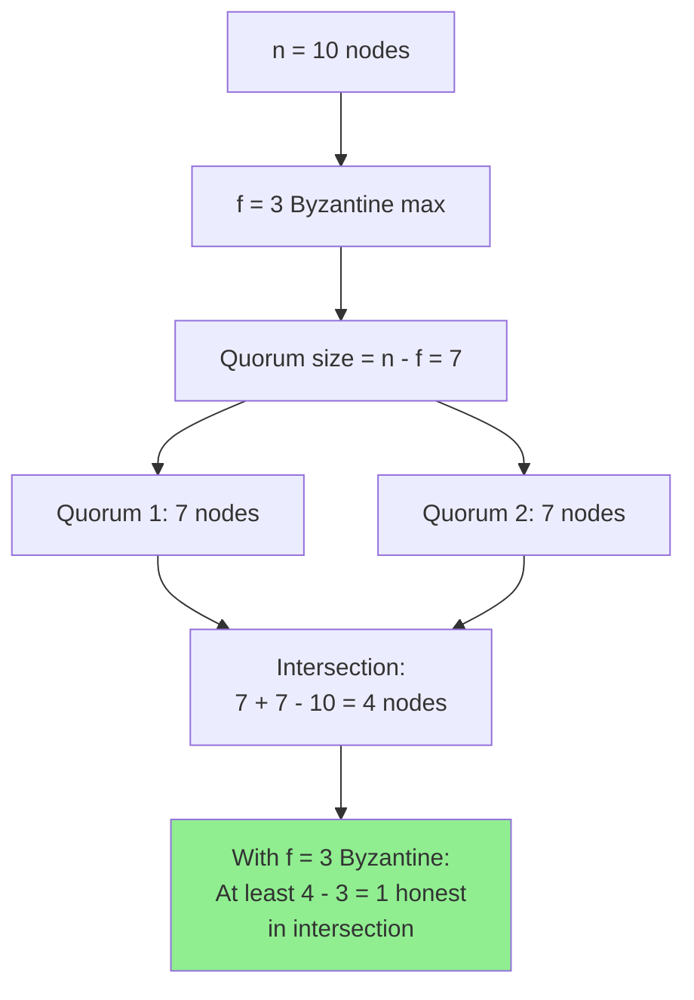
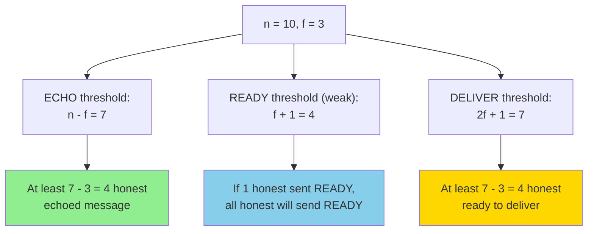
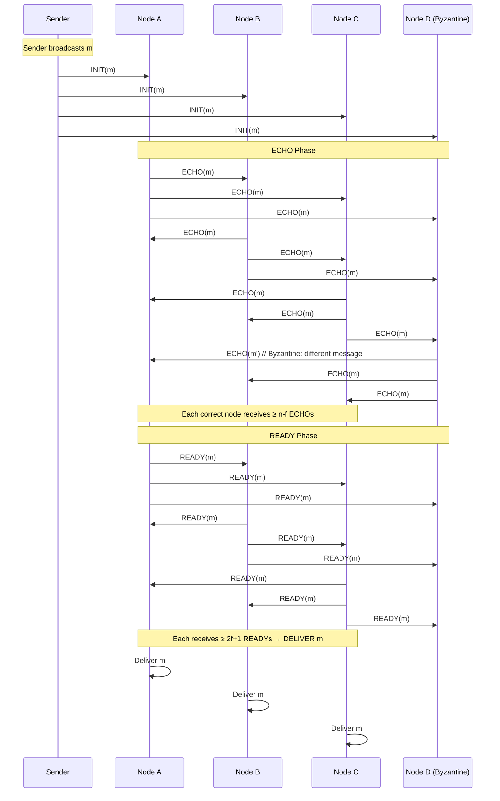

# Byzantine Reliable Broadcast

**Byzantine Reliable Broadcast** extends **[[reliable-broadcast|Reliable Broadcast]]** to handle **Byzantine (malicious) failures**, where faulty nodes can exhibit arbitrary behavior including lying, equivocation, and collusion. This is a critical building block for Byzantine Fault Tolerant consensus protocols.

## Problem Statement

In a distributed system with **Byzantine failures**, nodes can:
- Send different messages to different recipients (**equivocation**)
- Lie about messages they received
- Collude with other Byzantine nodes
- Arbitrarily deviate from the protocol

**Goal**: Ensure all **correct** (honest) nodes deliver the same set of messages, even when Byzantine nodes actively try to cause disagreement.

**Challenge**: Byzantine nodes can split the network by sending conflicting information to different nodes, making agreement much harder than with crash failures.

## System Model

### Assumptions

- **Fault Model**: Byzantine failures (arbitrary malicious behavior)
- **Network**: Asynchronous (no timing assumptions for safety; eventual synchrony for liveness)
- **Nodes**: $n$ total nodes, at most $f$ Byzantine where $f < \frac{n}{3}$
- **Communication**: Authenticated point-to-point channels (digital signatures prevent forgery)
- **Cryptography**: Public key infrastructure (PKI) — each node has known public key

### Why f < n/3?

With Byzantine failures, we need:
$$
f < \frac{n}{3} \quad \text{equivalently} \quad n \geq 3f + 1
$$

This is **strictly stronger** than the $f < n/2$ requirement for crash failures.

**Reasoning**:
- Need quorums of size $n - f$ (at least $f + 1$ honest nodes)
- Any two quorums must overlap in **at least $f + 1$ nodes**
- Overlap must contain **at least 1 honest node** to detect Byzantine conflicts
- Intersection size: $(n - f) + (n - f) - n = 2n - 2f - n = n - 2f$
- For at least 1 honest: $n - 2f > f \implies n > 3f \implies f < n/3$



## Properties

Byzantine Reliable Broadcast satisfies the same properties as **[[reliable-broadcast|Reliable Broadcast]]**, but strengthened to resist Byzantine attacks:

### 1. Validity

**Informal**: If a **correct** node broadcasts message $m$, then all correct nodes eventually deliver $m$.

**Formal**:
$$
\forall p \in \text{Correct}, \forall m: \text{broadcast}_p(m) \implies \forall q \in \text{Correct}: \Diamond \text{deliver}_q(m)
$$

**Key**: Only correct senders trigger Validity. Byzantine senders may or may not have their messages delivered.

### 2. Agreement

**Informal**: If one correct node delivers message $m$, then all correct nodes eventually deliver $m$.

**Formal**:
$$
\forall p, q \in \text{Correct}, \forall m: \text{deliver}_p(m) \implies \Diamond \text{deliver}_q(m)
$$

**Strengthening**: Even if sender is Byzantine and tries to split the network, Agreement ensures consistency.

### 3. Integrity

**Informal**: Every message is delivered at most once, and only if broadcast by its designated sender.

**Formal**:
- **No duplication**: Each message delivered at most once per node
- **No creation**: If correct node $p$ delivers $m$ attributed to sender $s$, then either:
  - $s$ is correct and broadcast $m$, OR
  - $s$ is Byzantine (no guarantees)

**Note**: Integrity doesn't prevent Byzantine senders from broadcasting garbage, only that honest nodes don't fabricate messages.

## Bracha's Byzantine Reliable Broadcast Protocol

The classic protocol by Gabriel Bracha (1987) achieves Byzantine reliable broadcast in an asynchronous model.

### Protocol Overview

**Three-phase design**:
1. **INIT**: Sender initiates broadcast
2. **ECHO**: Nodes relay message to each other
3. **READY**: Nodes commit to delivering message

**Key Insight**: Two rounds of voting (ECHO + READY) ensure Byzantine nodes cannot split correct nodes.

### Detailed Protocol

```python
# Sender s broadcasts message m:
1. Send INIT(m) to all nodes

# Receiver p (any node):

# Phase 1: ECHO
upon receiving INIT(m) from s for the first time:
    send ECHO(m) to all nodes

# Phase 2: READY (first trigger)
upon receiving ECHO(m) from (n - f) distinct nodes:
    send READY(m) to all nodes

# Phase 2: READY (second trigger - "weak support")
upon receiving READY(m) from (f + 1) distinct nodes:
    if not yet sent READY(m):
        send READY(m) to all nodes

# Phase 3: DELIVERY
upon receiving READY(m) from (2f + 1) distinct nodes:
    deliver m
```

### Why These Thresholds?

| Threshold | Reasoning |
|-----------|-----------|
| **ECHO: n - f** | Ensures at least one correct node echoed (since at most f are Byzantine) |
| **READY: f + 1** | If any correct node sends READY, all correct nodes will send READY (weak support) |
| **DELIVER: 2f + 1** | Ensures at least f + 1 correct nodes sent READY (majority of correct nodes) |



### Protocol Execution



## Why Bracha's Protocol Works

### Safety: Agreement

**Claim**: If one correct node delivers $m$, all correct nodes deliver $m$.

**Proof Sketch**:
1. Node $p$ delivers $m$ → received READY(m) from $2f + 1$ nodes
2. At least $(2f + 1) - f = f + 1$ correct nodes sent READY(m)
3. Any other correct node $q$ will receive READY(m) from at least $f + 1$ nodes
4. Node $q$ sends READY(m) (via "weak support" rule)
5. Eventually all correct nodes send READY(m)
6. All correct nodes receive $2f + 1$ READY(m) → all deliver ∎

### Safety: Integrity

**Claim**: If sender is correct and broadcasts $m$, no correct node delivers $m' \neq m$.

**Proof Sketch**:
1. Correct sender sends INIT(m) to all
2. All correct nodes send ECHO(m)
3. Byzantine nodes (at most $f$) cannot generate $n - f$ ECHO(m') for $m' \neq m$
4. No correct node sends READY(m') for $m' \neq m$
5. Byzantine nodes (at most $f$) cannot generate $2f + 1$ READY(m')
6. No correct node delivers $m'$ ∎

### Liveness: Validity

**Claim**: If correct sender broadcasts $m$ and network is eventually synchronous, all correct nodes deliver $m$.

**Proof Sketch**:
1. Correct sender sends INIT(m) to all
2. All correct nodes (at least $n - f$) send ECHO(m)
3. All correct nodes receive $n - f$ ECHO(m) → send READY(m)
4. All correct nodes receive at least $(n - f) \geq 2f + 1$ READY(m)
5. All correct nodes deliver $m$ ∎

## Preventing Equivocation

### Attack Scenario

**Byzantine sender tries to equivocate**:
```
Byzantine sender S:
  - Sends INIT("value A") to nodes {1, 2, 3}
  - Sends INIT("value B") to nodes {4, 5, 6}
Goal: Make nodes 1-3 deliver A, nodes 4-6 deliver B
```

### How Bracha Prevents It

```
Phase 1 - ECHO:
  Nodes 1-3 send ECHO(A)
  Nodes 4-6 send ECHO(B)
  Each group receives only ~n/2 ECHOs (not enough for threshold n - f)

Phase 2 - READY:
  No node sends READY(A) or READY(B) 
  (because neither reaches n - f ECHO threshold)

Result: Neither value is delivered → Attack fails
```

**Key**: The $n - f$ ECHO threshold prevents split deliveries. Byzantine sender cannot create two groups of $n - f$ nodes (would need $2(n - f) = 2n - 2f$ nodes, but only $n$ exist and $2n - 2f > n$ for $f > 0$).

## Comparison with Crash-Tolerant Broadcast

| Aspect | Crash Failures | Byzantine Failures |
|--------|---------------|-------------------|
| **Fault Tolerance** | f < n/2 | f < n/3 |
| **Quorum Size** | f + 1 | n - f (= 2f + 1) |
| **Message Phases** | 1-2 | 3 (INIT, ECHO, READY) |
| **Equivocation** | N/A (honest nodes) | Prevented by thresholds |
| **Authentication** | Optional | Required (signatures) |
| **Message Complexity** | O(n) to O(n²) | O(n²) |

## Message Complexity Analysis

**Messages per broadcast**:
- **INIT**: Sender → all = $n$ messages
- **ECHO**: Each of $n$ nodes → all = $n \times n = n^2$ messages
- **READY**: Each of $n$ nodes → all = $n \times n = n^2$ messages

**Total**: $n + n^2 + n^2 = O(n^2)$ messages

**Optimization**: Only send ECHO/READY once per message, not per sender.

## Practical Optimizations

### 1. Message Batching

Instead of broadcasting each message separately, batch multiple messages:
```python
broadcast_batch([m1, m2, m3, ...])
# Amortizes O(n²) cost over multiple messages
```

### 2. Early READY

Some implementations send READY after $\lceil \frac{n + f + 1}{2} \rceil$ ECHOs (rather than $n - f$):
- Faster in optimistic case
- Still safe (requires proof adjustment)

### 3. Merkle Tree Batching

Broadcast Merkle root, let nodes request missing leaves:
- Reduces message size for large payloads
- Still O(n²) message count but smaller messages

## Use Cases

### 1. Byzantine Consensus Building Block

**[[pbft|PBFT]]**, **[[honeybadger-bft|HoneyBadgerBFT]]**, and other protocols use Byzantine reliable broadcast to:
- Disseminate proposals
- Ensure all replicas see the same requests
- Build higher-level agreement

### 2. Blockchain Transaction Propagation

Broadcast transactions to all nodes ensuring:
- All honest nodes see the same transaction set
- Byzantine nodes cannot censor transactions (Validity)
- No transaction equivocation

### 3. Distributed Ledger Replication

Replicate ledger updates across nodes:
- Guarantees all honest replicas have consistent ledgers
- Tolerates malicious replicas trying to fork the ledger

## Limitations

### Does NOT Provide

❌ **Ordering**: Byzantine reliable broadcast doesn't specify message delivery order
❌ **Provability**: No certificates proving delivery to others (see **[[provable-broadcast]]**)
❌ **Sender Accountability**: Can't prove sender equivocated (all nodes just reject)
❌ **Efficiency**: O(n²) message complexity is high for large networks

### Extensions

- **Total Order Broadcast**: Add ordering guarantees (atomic broadcast)
- **[[provable-broadcast|Provable Broadcast]]**: Add delivery certificates
- **Threshold Cryptography**: Reduce message sizes with aggregated signatures

## Self-Assessment Questions

1. **Why does Byzantine reliable broadcast require f < n/3 instead of f < n/2?**
   - *Hint: Think about quorum intersection with Byzantine nodes*

2. **What prevents a Byzantine sender from successfully equivocating?**
   - *Hint: How many nodes are needed to reach the ECHO threshold?*

3. **Why does Bracha's protocol have both ECHO and READY phases?**
   - *Hint: What happens if only ECHO phase exists?*

4. **What is the minimum number of correct nodes that send READY before delivery?**
   - *Hint: With threshold 2f+1 and at most f Byzantine, how many must be correct?*

5. **Can Byzantine reliable broadcast guarantee message delivery order?**
   - *Hint: Do the properties specify anything about order?*

## Next Steps

- **[[provable-broadcast]]**: Add delivery certificates for accountability
- **[[properties]]**: Formal property definitions
- **[[overview]]**: Compare broadcast primitives
- **[[honeybadger-bft]]**: See Byzantine broadcast in action

## References

- Bracha, G. (1987). "Asynchronous Byzantine Agreement Protocols"
- Cachin, C., Guerraoui, R., & Rodrigues, L. (2011). "Introduction to Reliable and Secure Distributed Programming"
- See **[[references]]** for complete bibliography
