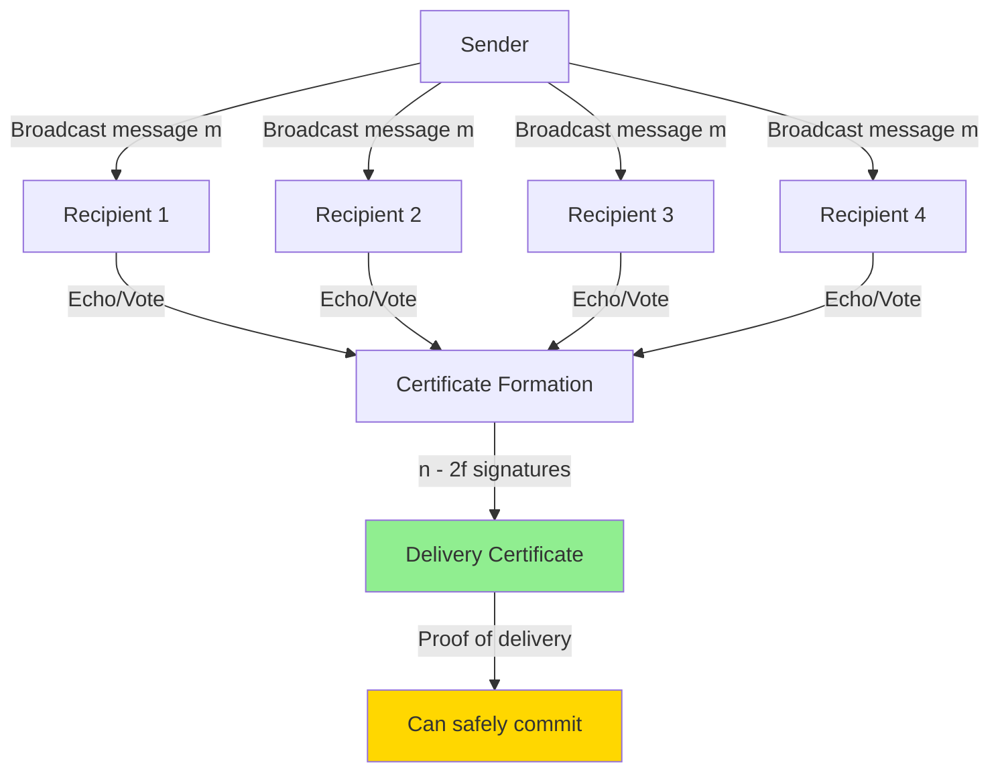
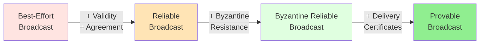

# Provable Broadcast: Overview

**Provable broadcast** is a communication primitive for distributed systems that extends reliable broadcast with **delivery certificates** — cryptographic or quorum-based proof that a message has been delivered by a supermajority of nodes. This primitive is fundamental to modern Byzantine Fault Tolerant (BFT) consensus protocols.

## What is Provable Broadcast?

In distributed systems, nodes need to broadcast messages to all other nodes reliably. However, Byzantine (malicious) nodes can exhibit arbitrary behavior, including:
- Sending different messages to different recipients (**equivocation**)
- Lying about whether they received a message
- Selectively delivering messages to only some nodes

**Provable broadcast** solves these problems by requiring nodes to produce **proof** that a message was delivered by enough honest nodes to ensure safety.

### Core Concept

**Key Insight**: A delivery certificate proves that at least **n - 2f** nodes (a supermajority) have received and acknowledged the message. Since at most **f** nodes are Byzantine, this means at least **n - 3f > f** honest nodes delivered it — ensuring all honest nodes will eventually deliver it.

## Why Provable Broadcast Matters

### 1. Prevents Equivocation

Without delivery certificates, a Byzantine sender can:
- Send value `v₁` to half the nodes
- Send value `v₂` to the other half
- Cause honest nodes to disagree on what was broadcast

**With provable broadcast**: Any value that gets a certificate has proof of delivery by n - 2f nodes. A Byzantine sender cannot create certificates for two conflicting values.

### 2. Single-Round Commitment

Traditional Byzantine consensus requires multiple communication rounds to achieve agreement. With provable broadcast:
- **Round 1**: Sender broadcasts message
- **Round 2**: Recipients echo/vote, forming a certificate
- **Commitment**: Certificate proves supermajority delivery, enabling immediate commitment

This reduces latency from O(message rounds) to O(1) in many protocols.

### 3. Foundation for Modern BFT Protocols

Provable broadcast is used as a building block in:
- **[[hotstuff|HotStuff]]**: Quorum certificates for leader proposals
- **[[honeybadger-bft|HoneyBadgerBFT]]**: Threshold signatures for asynchronous agreement
- **DAG-based BFT**: Certificates link vertices in the DAG structure
- **Blockchain consensus**: Proof of block validity and finality

## The Broadcast Hierarchy

Provable broadcast sits in a hierarchy of broadcast primitives with increasing guarantees:

1. **[[reliable-broadcast|Reliable Broadcast]]**: Ensures all honest nodes deliver the same messages (crash fault tolerant)
2. **[[byzantine-reliable-broadcast|Byzantine Reliable Broadcast]]**: Extends reliability to Byzantine fault model (f < n/3)
3. **Provable Broadcast**: Adds cryptographic/quorum certificates proving delivery

## Historical Context

### Before Provable Broadcast

Early BFT protocols like **[[pbft|PBFT]]** (1999) used multi-round agreement:
- **Pre-prepare**: Leader proposes value
- **Prepare**: Replicas vote on proposal
- **Commit**: Replicas commit after seeing enough prepare votes

This required **3 phases** and **O(n²)** messages for each consensus decision.

### With Provable Broadcast

Modern protocols like **[[hotstuff|HotStuff]]** (2019) use provable broadcast to:
- Reduce phases from 3 to 2 (or even 1 in pipelined mode)
- Reduce messages from **O(n²)** to **O(n)** per decision
- Enable pipelining where certificates from one round feed the next

## Real-World Examples

### Example 1: Threshold Signatures (HoneyBadgerBFT)

In **[[honeybadger-bft|HoneyBadgerBFT]]**:
1. Node broadcasts encrypted transaction batch
2. Each recipient decrypts and signs the batch
3. Once **n - f** signatures collected, they're combined into a **threshold signature**
4. Threshold signature = delivery certificate (proof n - f nodes delivered)

### Example 2: Quorum Certificates (HotStuff)

In **[[hotstuff|HotStuff]]**:
1. Leader proposes block with `PREPARE` message
2. Each replica sends `PREPARE-VOTE` signature
3. Leader collects **n - f** signatures into a **Quorum Certificate (QC)**
4. QC proves supermajority agreement on the block

## Key Properties

Provable broadcast must satisfy (see **[[properties]]** for details):

| Property | Description |
|----------|-------------|
| **Validity** | If honest sender broadcasts m, all honest nodes deliver m |
| **Agreement** | If honest node delivers m, all honest nodes deliver m |
| **Integrity** | Messages are delivered at most once and only if broadcast |
| **Provability** | Delivered messages have verifiable certificates proving n - 2f deliveries |

## Comparison with Consensus

**Broadcast ≠ Consensus**:

| Aspect | Provable Broadcast | Consensus |
|--------|-------------------|-----------|
| **Goal** | Deliver same messages to all | Agree on a single value/sequence |
| **Sender** | Known sender | Any proposer can initiate |
| **Output** | Set of delivered messages | Single agreed value |
| **Usage** | Building block | End goal |

**Relationship**: Provable broadcast is often used **within** consensus protocols. For example:
- Consensus round 1: Leader uses provable broadcast to propose a value
- Consensus round 2: Nodes use the delivery certificate to agree on the proposal

## Performance Characteristics

### Message Complexity

| Protocol Type | Messages per Broadcast |
|--------------|------------------------|
| Reliable Broadcast (crash faults) | O(n) |
| Byzantine Reliable Broadcast | O(n²) |
| Provable Broadcast (signatures) | O(n) |
| Provable Broadcast (threshold crypto) | O(n) + threshold signature |

### Communication Rounds

- **Optimistic case**: 2 rounds (broadcast → certificate formation)
- **With failures**: May require view change or retransmission
- **Pipelined**: Certificates from round i used in round i+1 (effectively 1 round amortized)

## Trade-offs

### Advantages
- ✅ Prevents equivocation by Byzantine senders
- ✅ Enables single-round commitment decisions
- ✅ Reduces communication rounds in consensus
- ✅ Provides objective proof of message delivery

### Disadvantages
- ❌ Higher communication overhead (certificates require n - 2f signatures)
- ❌ Cryptographic overhead (signature verification)
- ❌ Requires threshold cryptography or quorum coordination
- ❌ More complex implementation than basic broadcast

## Applications

See **[[applications]]** for detailed use cases, including:
- **Blockchain consensus**: Finality proofs, block certificates
- **Distributed databases**: Replication with Byzantine resistance
- **Byzantine agreement**: Building block for multi-valued consensus
- **State machine replication**: Certified transaction ordering

## Next Steps

### For Beginners
1. Read **[[reliable-broadcast]]** to understand the crash-fault tolerant baseline
2. Study **[[byzantine-reliable-broadcast]]** to see Byzantine extensions
3. Learn about **[[properties]]** to understand formal guarantees

### For Practitioners
1. Explore **[[provable-broadcast]]** for implementation details
2. Compare with **[[vs-reliable-broadcast]]** to understand design trade-offs
4. Study **[[hotstuff]]** or **[[honeybadger-bft]]** for real-world usage

### For Researchers
1. Examine **[[applications]]** for open research questions
2. Review formal verification techniques for provable broadcast
3. Study optimality results (message complexity lower bounds)

## Self-Assessment Questions

Test your understanding:

1. **What is the key difference between reliable broadcast and provable broadcast?**
   - *Hint: Think about what additional guarantee provable broadcast provides*

2. **Why does a delivery certificate require n - 2f signatures rather than just n - f?**
   - *Hint: Consider what happens if f Byzantine nodes don't deliver*

3. **How does provable broadcast prevent equivocation?**
   - *Hint: Can a Byzantine sender create two valid certificates for different values?*

4. **Why is provable broadcast useful in blockchain consensus?**
   - *Hint: Think about proving finality to external observers*

5. **What is the trade-off between provable broadcast and simple broadcast?**
   - *Hint: Consider communication overhead vs. guarantees*

## Related Concepts

### Within Broadcast Domain
- **[[reliable-broadcast]]**: Crash fault tolerant baseline
- **[[byzantine-reliable-broadcast]]**: Byzantine fault tolerant extension
- **[[provable-broadcast]]**: Full specification and protocols
- **[[properties]]**: Formal properties and guarantees

### BFT Consensus
- **[[fundamentals]]**: BFT consensus basics
- **[[hotstuff]]**: Modern protocol using quorum certificates
- **[[honeybadger-bft]]**: Asynchronous protocol using threshold signatures
- **[[protocol-comparison]]**: How different protocols use broadcast

### Formal Methods
- **[[temporal-logic]]**: Specifying broadcast properties formally
- **[[formal-verification]]**: Proving broadcast correctness

## References

- Cachin, C., Guerraoui, R., & Rodrigues, L. (2011). "Introduction to Reliable and Secure Distributed Programming" - Chapter on broadcast abstractions
- Decentralized Thoughts blog (2022). "What is Provable Broadcast?" [decentralized-thoughts-2022-provable-broadcast]
- See **[[references]]** for complete bibliography
