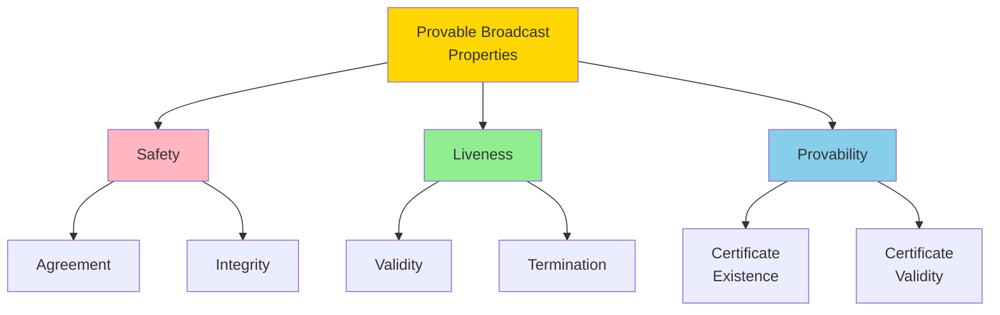
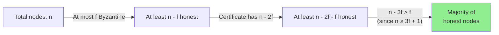
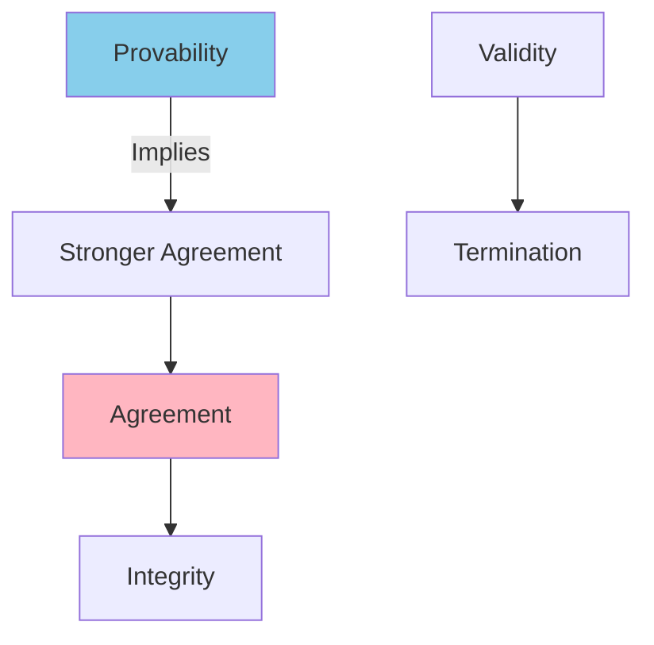

# Provable Broadcast Properties

This note provides a formal specification of the properties that a **provable broadcast** primitive must satisfy. These properties extend classical broadcast properties with **provability** — cryptographic or quorum-based certificates proving message delivery.

## Overview of Properties

Provable broadcast guarantees can be categorized into:

1. **Safety Properties**: Bad things never happen (agreement, integrity)
2. **Liveness Properties**: Good things eventually happen (validity, termination)
3. **Provability Properties**: Delivery can be proven with certificates (NEW)



## Core Properties

### 1. Validity (Liveness)

**Informal**: If an honest node broadcasts a message, all honest nodes eventually deliver it.

**Formal**: 
$$
\forall p_i \in \text{Honest}, \forall m: \\
\text{broadcast}_i(m) \implies \forall p_j \in \text{Honest}: \Diamond \text{deliver}_j(m)
$$

Where:
- $p_i$ = node $i$
- $\text{Honest}$ = set of honest (non-Byzantine) nodes
- $\Diamond$ = "eventually" (temporal logic operator)

**Intuition**: Honest senders can't be censored. If an honest node initiates a broadcast, the system ensures all honest nodes receive it.

**Example**:
```
Time 0: Honest node A broadcasts message "transfer $10"
Time 1-5: Message propagates through network
Time 6: All honest nodes have delivered "transfer $10"
         Byzantine nodes may or may not deliver (doesn't matter)
```

**Note**: Validity requires honest sender. If a Byzantine node broadcasts, no guarantees apply.

### 2. Agreement (Safety)

**Informal**: If one honest node delivers a message, all honest nodes deliver the same message.

**Formal**:
$$
\forall p_i, p_j \in \text{Honest}, \forall m: \\
\text{deliver}_i(m) \implies \Diamond \text{deliver}_j(m)
$$

**Intuition**: Honest nodes never disagree on which messages were delivered. This prevents the system from diverging into inconsistent states.

**Example**:
```
Scenario: Node A delivers message m at time T
Result: All other honest nodes B, C, D eventually deliver m
Violation: Node B delivers m but node C never delivers m (ILLEGAL)
```

**Relationship to Consensus**: Agreement is similar to the **agreement** property in consensus, but for message delivery rather than value selection.

### 3. Integrity (Safety)

**Informal**: Messages are delivered at most once and only if they were broadcast.

**Formal** (two sub-properties):

**No Duplication**:
$$
\forall p_i \in \text{Honest}, \forall m: \\
\text{deliver}_i(m) \text{ occurs at most once}
$$

**No Creation**:
$$
\forall p_i \in \text{Honest}, \forall m, \forall p_j: \\
\text{deliver}_i(m) \text{ from } p_j \implies p_j \text{ broadcast } m \text{ or is Byzantine}
$$

**Intuition**: 
- No message is delivered twice to the same node
- Honest nodes can't fabricate messages attributed to other honest nodes
- Only the original broadcaster (or Byzantine nodes) can be the source

**Example**:
```
Valid: Node A broadcasts m, nodes B and C each deliver m once
Invalid: Node B delivers m twice
Invalid: Node B delivers m claiming it's from honest node A, but A never broadcast m
```

### 4. Provability (NEW)

**Informal**: When an honest node delivers a message, it possesses a certificate proving that at least **n - 2f** nodes delivered the message.

**Formal**:
$$
\forall p_i \in \text{Honest}, \forall m: \\
\text{deliver}_i(m) \implies \exists \text{cert}_m: \text{valid}(\text{cert}_m) \land |\text{cert}_m| \geq n - 2f
$$

Where:
- $\text{cert}_m$ = delivery certificate for message $m$
- $\text{valid}(\text{cert}_m)$ = certificate is cryptographically or cryptographically-quorum valid
- $|\text{cert}_m|$ = number of signatures/votes in the certificate

**Intuition**: Delivery is provable to anyone (even external observers) via an objective certificate. This enables:
- **Accountability**: Prove a node misbehaved
- **Non-repudiation**: Sender can't deny broadcasting
- **Auditing**: Third parties can verify delivery occurred

**Certificate Requirements**:

A valid certificate must:
1. **Authenticate Sources**: Each signature/vote must be verifiable to a specific node
2. **Threshold**: Contain at least **n - 2f** signatures/votes
3. **Consistency**: All signatures/votes must refer to the same message $m$
4. **Unforgeable**: Byzantine nodes cannot forge signatures from honest nodes

**Why n - 2f?**



**Mathematical Proof**:
- Total nodes: $n$
- Byzantine nodes: at most $f$
- Honest nodes: at least $n - f$
- Certificate size: $n - 2f$
- Minimum honest in certificate: $n - 2f - f = n - 3f$
- For $n \geq 3f + 1$: $n - 3f \geq 1$ (at least one honest node)
- For $n = 3f + 1$: $n - 3f = 1$ (exactly one honest node guaranteed)
- Actually: $n - 2f = f + 1$ honest nodes minimum (since $n - 2f = 3f + 1 - 2f = f + 1$)

So **n - 2f** ensures at least **f + 1** honest nodes signed, which is a majority.

## Property Relationships

### Dependencies



**Provability strengthens Agreement**: If a certificate exists with n - 2f signatures, and at most f are Byzantine, then at least f + 1 honest nodes delivered. By Agreement, all honest nodes must eventually deliver.

### Safety vs. Liveness

| Property | Type | Adversary Can Violate? |
|----------|------|----------------------|
| Agreement | Safety | No (if f < n/3) |
| Integrity | Safety | No (if cryptography holds) |
| Validity | Liveness | Yes (by delaying messages) |
| Provability | Safety* | No (if f < n/3 and crypto holds) |

*Provability is a safety property about certificate existence, but delivery itself is liveness.

## Byzantine Fault Tolerance Threshold

All properties hold **if and only if** the number of Byzantine nodes $f$ satisfies:

$$
f < \frac{n}{3}
$$

Equivalently: $n \geq 3f + 1$

**Why f < n/3?**

1. **Agreement Requirement**: Need enough honest nodes to outvote Byzantine in all quorums
2. **Quorum Intersection**: Any two quorums of size n - f must overlap in at least 2f + 1 nodes
3. **Certificate Validity**: n - 2f signatures ensure at least f + 1 honest signers

**Impossibility Result**: For $f \geq n/3$, provable broadcast (and Byzantine consensus) is impossible in asynchronous systems.

## Certificate Validity Criteria

A delivery certificate is **valid** if:

### Cryptographic Signatures

For individual signatures:
```
Valid(cert_m) ⟺ 
  (|cert_m| ≥ n - 2f) ∧ 
  (∀ sig ∈ cert_m: Verify(sig, m, pk_i)) ∧
  (All signatures from distinct nodes)
```

Where:
- $\text{Verify}(\text{sig}, m, pk_i)$ = signature verification with public key $pk_i$
- Distinct nodes ensures no node contributes multiple signatures

### Threshold Signatures

For threshold cryptography (e.g., BLS signatures):
```
Valid(cert_m) ⟺ 
  ThresholdVerify(cert_m, m, threshold_pk, n - 2f)
```

Where:
- $\text{threshold\_pk}$ = group public key
- Certificate is a single aggregated signature representing n - 2f shares

**Advantage**: Threshold signatures are **O(1)** size vs. **O(n)** for individual signatures.

### Quorum Certificates (HotStuff-style)

```
Valid(QC_m) ⟺ 
  (|QC_m.votes| ≥ n - f) ∧
  (∀ vote ∈ QC_m.votes: Verify(vote.sig, m, vote.sender.pk)) ∧
  (QC_m.view = current_view) ∧
  (All votes for same message m and view)
```

HotStuff uses **n - f** (rather than n - 2f) to form quorum certificates for additional safety margin.

## Formal Specification (TLA+-style)

```tla
VARIABLES 
  messages,      \* Set of broadcast messages
  delivered,     \* Map: node -> set of delivered messages
  certificates   \* Map: message -> certificate

Honest == {p ∈ Nodes : ~Byzantine[p]}

\* Validity
Validity == 
  ∀ p ∈ Honest, m ∈ messages:
    (sender[m] = p) ⟹ 
    ◇(∀ q ∈ Honest: m ∈ delivered[q])

\* Agreement
Agreement == 
  ∀ p, q ∈ Honest, m:
    (m ∈ delivered[p]) ⟹ ◇(m ∈ delivered[q])

\* Integrity - No Duplication
NoDuplication == 
  ∀ p ∈ Honest, m:
    Cardinality({t ∈ Time : DeliverEvent(p, m, t)}) ≤ 1

\* Integrity - No Creation
NoCreation == 
  ∀ p ∈ Honest, m:
    (m ∈ delivered[p]) ⟹ 
    (sender[m] ∈ Nodes ∧ (sender[m] ∈ Honest ⟹ m ∈ messages))

\* Provability
Provability ==
  ∀ p ∈ Honest, m:
    (m ∈ delivered[p]) ⟹
    ∃ cert ∈ certificates[m]:
      ∧ Valid(cert)
      ∧ Cardinality(cert.signers) ≥ n - 2f
      ∧ ∀ sig ∈ cert: VerifySignature(sig, m)
```

## Comparing Broadcast Types

| Property | Best-Effort | Reliable | Byzantine Reliable | Provable |
|----------|-------------|----------|-------------------|----------|
| Validity | ❌ | ✅ | ✅ | ✅ |
| Agreement | ❌ | ✅ | ✅ | ✅ |
| Integrity | ❌ | ✅ | ✅ | ✅ |
| Provability | ❌ | ❌ | ❌ | ✅ |
| Fault Model | None | Crash | Byzantine | Byzantine |
| Certificate | ❌ | ❌ | ❌ | ✅ |
| Threshold | N/A | f < n/2 | f < n/3 | f < n/3 |

## Provability Applications

### Use Case 1: Accountability

**Problem**: How to prove a node misbehaved?

**Solution**: With delivery certificates:
1. Node A claims it never received message m
2. Other nodes present certificate with A's signature
3. A is proven to be lying → accountability

### Use Case 2: Checkpointing

**Problem**: How to prove system state to external observers?

**Solution**: 
1. Nodes agree on state hash h via provable broadcast
2. Certificate for h proves n - 2f nodes agreed
3. External auditor can verify certificate without trusting any single node

### Use Case 3: Fast Consensus

**Problem**: Traditional BFT consensus requires 3 phases

**Solution**: With provable broadcast:
1. Leader proposes value v
2. Nodes create certificate for v
3. Certificate proves supermajority saw v → can commit immediately
4. Reduces from 3 phases to 2 (or 1 amortized)

## Violations and Attacks

### What Provable Broadcast PREVENTS

✅ **Equivocation**: Byzantine sender cannot create two valid certificates for conflicting messages
✅ **Censorship**: Honest sender's messages cannot be blocked (Validity)
✅ **Inconsistency**: Honest nodes cannot deliver different messages (Agreement)

### What Provable Broadcast DOES NOT Prevent

❌ **Network Delays**: Byzantine nodes can delay (but not permanently block) delivery
❌ **Sender Failures**: If sender crashes before broadcasting, no guarantees
❌ **Message Content**: Certificate proves delivery, not that message content is "correct"

### Attack Example: Failed Equivocation

```
Scenario: Byzantine node B tries to equivocate
  - Sends "Transfer $10 to Alice" to nodes {1, 2, 3, 4}
  - Sends "Transfer $10 to Bob" to nodes {5, 6, 7, 8}

Result: 
  - Message to Alice gets signatures from {1, 2, 3, 4}
  - Message to Bob gets signatures from {5, 6, 7, 8}
  - Neither message reaches n - 2f signatures (need 9 for n=12, f=3)
  - No certificate forms for either message
  - No delivery occurs → attack fails
```

**Key**: Certificate threshold n - 2f ensures at least f + 1 honest nodes must agree. Byzantine nodes cannot split honest nodes into conflicting certificates.

## Self-Assessment Questions

1. **Why is Agreement a safety property and Validity a liveness property?**
   - *Hint: Think about what can violate each in finite vs. infinite time*

2. **What is the minimum number of honest signatures in a certificate of size n - 2f?**
   - *Hint: If f nodes are Byzantine, how many of the n - 2f are guaranteed honest?*

3. **Can a Byzantine sender create two valid certificates for different messages?**
   - *Hint: How many honest nodes would need to sign both?*

4. **Why does provability require n - 2f rather than n - f signatures?**
   - *Hint: What happens if only n - f signatures are required and f nodes are Byzantine?*

5. **How does a certificate enable faster consensus?**
   - *Hint: What does a certificate prove that eliminates the need for additional rounds?*

## Related Concepts

- **[[bft-consensus-analysis/provable-broadcast/overview|Provable Broadcast Overview]]**: Introduction to provable broadcast
- **[[bft-consensus-analysis/provable-broadcast/reliable-broadcast|Reliable Broadcast]]**: Baseline crash fault tolerant broadcast
- **[[bft-consensus-analysis/provable-broadcast/provable-broadcast|Provable Broadcast Mechanisms]]**: Full protocol specifications
- **[[bft-consensus-analysis/bft-consensus/properties/safety-properties|Safety]]**: BFT consensus safety properties
- **[[bft-consensus-analysis/bft-consensus/properties/liveness-properties|Liveness]]**: BFT consensus liveness properties
- **[[bft-consensus-analysis/logic-models/temporal-logic|Expressing Safety & Liveness]]**: Formal specification techniques

## References

See **[[bft-consensus-analysis/references|References]]** for:
- Cachin, Guerraoui, Rodrigues (2011) - Formal broadcast properties
- Decentralized Thoughts (2022) - Provable broadcast explanation
- Halpern & Moses (2000) - Knowledge and distributed systems
