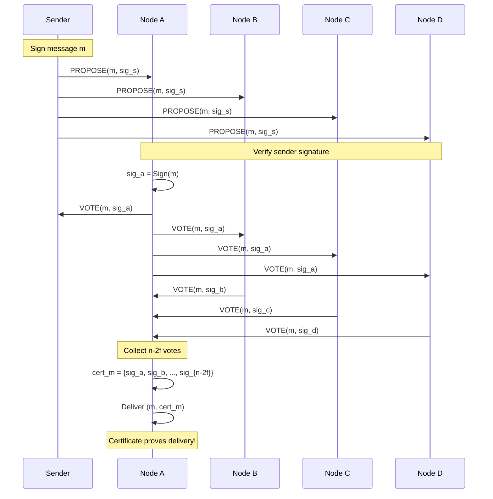
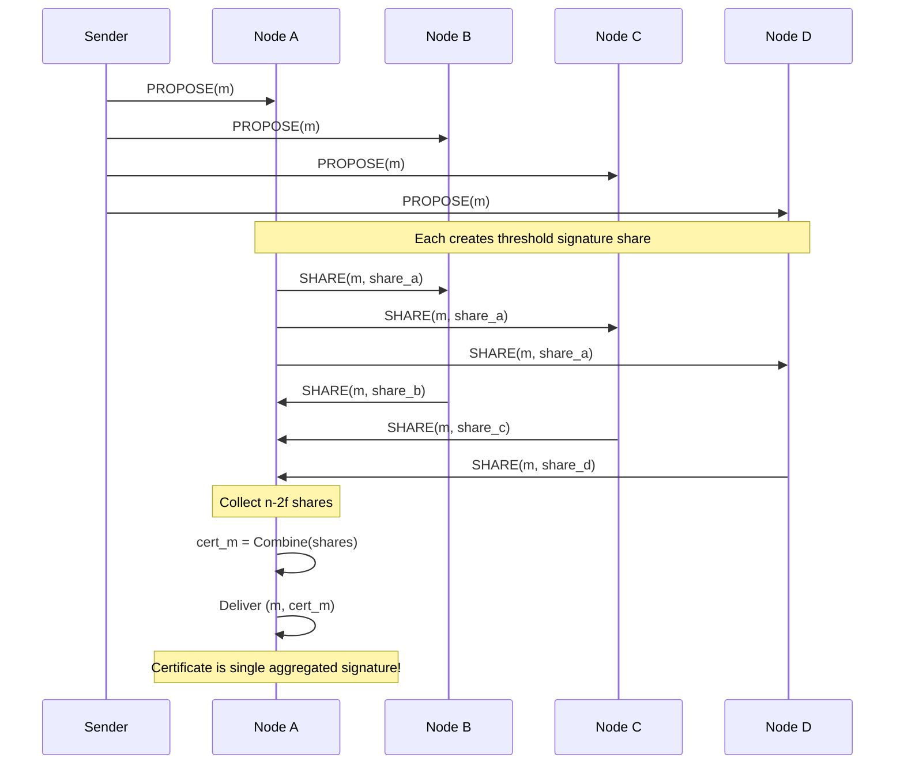

# Provable Broadcast Protocol

**Provable broadcast** is a Byzantine fault-tolerant communication primitive that extends **[[bft-consensus-analysis/provable-broadcast/byzantine-reliable-broadcast|Byzantine Reliable Broadcast]]** with **delivery certificates** — cryptographic or quorum-based proofs that a message was delivered by a supermajority of nodes. This note provides the detailed protocol specification and implementation approaches.

## Key Innovation

The distinguishing feature of provable broadcast is the **delivery certificate**:


**Certificate Properties**:
- **Verifiable**: Anyone can verify the certificate without trusting any single node
- **Unforgeable**: Byzantine nodes cannot create fake certificates (cryptographic security)
- **Threshold-based**: Requires n - 2f signatures/votes (ensures at least f + 1 honest nodes agreed)
- **Self-contained**: Certificate is objective proof, independent of sender claims

## Protocol Specification

### System Model

- **Nodes**: $n \geq 3f + 1$ where $f$ is maximum Byzantine failures
- **Network**: Asynchronous (for safety), eventually synchronous (for liveness)
- **Cryptography**: Public key infrastructure (PKI) with digital signatures
- **Channels**: Authenticated point-to-point links

### Provable Broadcast Interface

```python
# API
def broadcast(message):
    """Sender initiates provable broadcast of message"""
    
def deliver(message, certificate):
    """Node delivers message with its certificate"""
    
def get_certificate(message):
    """Returns delivery certificate for message (if delivered)"""
    
def verify_certificate(message, certificate):
    """Verifies certificate is valid for message"""
```

## Protocol Variants

There are two main approaches to implementing provable broadcast: **signature-based** and **threshold cryptography-based**.

### Variant 1: Signature-Based Provable Broadcast

Used in protocols like **[[bft-consensus-analysis/bft-consensus/protocols/hotstuff|HotStuff: Linear-Complexity BFT Consensus]]**.

#### Protocol Steps

```python
# Sender s broadcasts message m:
1. Sign message: sig_s = Sign(m, sk_s)
2. Send (PROPOSE, m, sig_s) to all nodes

# Receiver p:
3. Upon receiving (PROPOSE, m, sig_s) from s:
   a. Verify: Verify(sig_s, m, pk_s)
   b. If valid and first time seeing m:
      - Sign vote: sig_p = Sign(m, sk_p)
      - Send (VOTE, m, sig_p) to all nodes
      - Add sig_p to local certificate cert_m

4. Upon collecting (VOTE, m, sig_i) from n - 2f distinct nodes:
   a. cert_m = {sig_1, sig_2, ..., sig_{n-2f}}
   b. Deliver (m, cert_m)

5. Certificate verification (anyone can verify):
   Valid(cert_m) ⟺ 
     (|cert_m| ≥ n - 2f) ∧ 
     (∀ sig ∈ cert_m: Verify(sig, m, pk_i)) ∧
     (All signatures from distinct nodes)
```

#### Message Flow



#### Certificate Structure

```json
{
  "message": "transfer $10 from A to B",
  "signatures": [
    {"node": "node1", "sig": "0x1a2b3c..."},
    {"node": "node2", "sig": "0x4d5e6f..."},
    {"node": "node3", "sig": "0x7g8h9i..."},
    ...
    // Total: n - 2f signatures
  ],
  "timestamp": 1642780800,
  "view": 5
}
```

**Certificate Size**: $O(n)$ (one signature per node in the quorum)

**Advantages**:
- ✅ Simple to understand and implement
- ✅ Works with standard ECDSA/EdDSA signatures
- ✅ Individual node accountability (can identify each signer)

**Disadvantages**:
- ❌ Certificate size grows linearly with n
- ❌ Verification time O(n) (must verify each signature)

### Variant 2: Threshold Signature Provable Broadcast

Used in protocols like **[[bft-consensus-analysis/bft-consensus/protocols/honeybadger-bft|HoneyBadgerBFT: Asynchronous Byzantine Consensus]]**.

#### Setup Phase (One-time)

```python
# Trusted dealer or DKG (Distributed Key Generation)
1. Generate threshold signature scheme:
   - Group public key: PK
   - Secret key shares: sk_1, sk_2, ..., sk_n (one per node)
   - Threshold: t = n - 2f

2. Distribute sk_i to each node i

# Property: Any t signature shares can be combined into valid signature
```

#### Protocol Steps

```python
# Sender s broadcasts message m:
1. Send (PROPOSE, m) to all nodes

# Receiver p:
2. Upon receiving (PROPOSE, m) from s:
   a. If valid and first time seeing m:
      - Sign with threshold share: share_p = ThresholdSign(m, sk_p)
      - Send (SHARE, m, share_p) to all nodes
      - Add share_p to local share pool

3. Upon collecting (SHARE, m, share_i) from n - 2f distinct nodes:
   a. Combine shares: cert_m = Combine({share_1, ..., share_{n-2f}})
   b. Deliver (m, cert_m)

4. Certificate verification (anyone can verify):
   Valid(cert_m) ⟺ ThresholdVerify(cert_m, m, PK, n - 2f)
```

#### Message Flow



#### Certificate Structure

```json
{
  "message": "transfer $10 from A to B",
  "threshold_signature": "0xABCDEF123456...",  // Single signature!
  "signers_bitmap": "1111...110",  // Which nodes contributed
  "timestamp": 1642780800
}
```

**Certificate Size**: $O(1)$ — constant size regardless of n!

**Advantages**:
- ✅ **Constant certificate size** (huge win for large n)
- ✅ **Fast verification** (single signature check)
- ✅ Bandwidth efficient

**Disadvantages**:
- ❌ Requires trusted setup or DKG (distributed key generation)
- ❌ Less individual accountability (harder to identify specific signers)
- ❌ More complex cryptography (BLS signatures, pairings)

### Variant 3: Verifiable Random Function (VRF) Enhanced

Some protocols add VRF to enable **unpredictable leader selection**:

```python
# Each node includes VRF proof in vote
vote_p = (sig_p, vrf_proof_p)

# Leader for next round determined by lowest VRF output
# Prevents Byzantine nodes from predicting and attacking future leaders
```

Used in: Algorand, dfinity.

## Properties Satisfaction

### Validity

**If correct sender broadcasts $m$, all correct nodes deliver $m$**

**Proof**:
1. Correct sender sends PROPOSE(m) to all $n$ nodes
2. At least $n - f$ nodes (all correct nodes) receive PROPOSE(m)
3. Each of $n - f$ correct nodes sends VOTE/SHARE to all
4. Each correct node receives at least $(n - f) - f = n - 2f$ votes/shares
5. Certificate forms with $n - 2f$ signatures
6. All correct nodes deliver $(m, cert_m)$ ∎

### Agreement

**If one correct node delivers $m$, all correct nodes deliver $m$**

**Proof**:
1. Correct node $p$ delivers $m$ with certificate $cert_m$
2. $cert_m$ contains $n - 2f$ signatures
3. At least $(n - 2f) - f = n - 3f \geq f + 1$ correct nodes signed (since $n \geq 3f + 1$)
4. These $f + 1$ correct nodes sent votes to all
5. Each correct node receives votes from at least $f + 1$ correct nodes
6. Eventually all correct nodes accumulate $n - 2f$ votes
7. All correct nodes deliver $(m, cert_m)$ ∎

### Integrity

**Messages delivered at most once and only if broadcast**

**Proof**:
1. Certificate requires $n - 2f$ valid signatures for message $m$
2. Byzantine nodes (at most $f$) cannot forge signatures of honest nodes (cryptographic assumption)
3. To reach $n - 2f$ signatures, at least $n - 2f - f = n - 3f \geq 1$ honest node must sign
4. Honest nodes only sign messages they received from sender
5. Honest nodes deduplicate (sign each message once) ∎

### Provability

**Delivered messages have verifiable certificates**

**Proof**:
1. Delivery only occurs after collecting $n - 2f$ votes/shares
2. Certificate contains these signatures
3. Verification checks:
   - Each signature is valid for message $m$
   - At least $n - 2f$ distinct nodes signed
   - (Threshold variant) Combined signature is valid
4. Verification succeeds ⟹ certificate is valid ∎

## Preventing Equivocation

**Byzantine sender tries to broadcast two different values**:

```
Scenario: Byzantine sender S attempts:
  - Send PROPOSE("value A") to nodes {1, 2, 3, 4, 5}
  - Send PROPOSE("value B") to nodes {6, 7, 8, 9, 10}

Analysis (n = 10, f = 3):
  - "value A" can get at most 5 votes
  - "value B" can get at most 5 votes
  - Need n - 2f = 10 - 6 = 4 votes for certificate
  
  Wait, both could get certificates! Bug?
  
  NO: Honest nodes vote for FIRST value seen
  - If honest nodes split: 3 vote A, 4 vote B
  - A gets: 5 Byzantine + 3 honest = 8... wait
  
  Actually: Byzantine nodes can vote for both!
  - But honest nodes (≥ 7) will NOT vote for both
  - For both A and B to get 4 votes each from honest:
    Need 4 + 4 = 8 honest nodes
  - We only have n - f = 7 honest nodes
  - At most ONE value gets 4+ honest votes
  
Result: At most one certificate forms
```

**Key Insight**: Since $n - 2f > n/2$, two conflicting messages cannot both reach the certificate threshold with honest nodes voting consistently.

**Mathematical Proof**:
- Honest nodes: at least $n - f$
- Certificate threshold: $n - 2f$
- For two conflicting certificates to form: need $2(n - 2f)$ honest votes
- But: $2(n - 2f) = 2n - 4f > n - f$ (since $n \geq 3f + 1$)
- Contradiction: cannot have $2n - 4f$ honest votes when only $n - f$ honest nodes exist ∎

## Communication Complexity

### Signature-Based

| Phase | Messages | Bytes per Message | Total Communication |
|-------|----------|------------------|-------------------|
| PROPOSE | n | O(payload) | O(n × payload) |
| VOTE | n² | O(signature) | O(n² × sig_size) |
| **Total** | **O(n²)** | | **O(n² × sig_size)** |

**Certificate size**: O(n × signature size) ≈ 64n bytes (for ECDSA)

### Threshold Signature-Based

| Phase | Messages | Bytes per Message | Total Communication |
|-------|----------|------------------|-------------------|
| PROPOSE | n | O(payload) | O(n × payload) |
| SHARE | n² | O(share_size) | O(n² × share_size) |
| **Total** | **O(n²)** | | **O(n² × share_size)** |

**Certificate size**: O(1) ≈ 96 bytes (for BLS signatures)

**Winner**: Threshold signatures for large n (constant certificate size)

## Optimizations

### 1. Early Certificate Formation

Instead of broadcasting votes to all nodes:
```python
# Optimized: Send votes only to leader/aggregator
Upon receiving PROPOSE(m):
  sig_p = Sign(m, sk_p)
  Send (VOTE, m, sig_p) to LEADER only

Leader:
  Collect n - 2f votes
  Form certificate
  Broadcast (DELIVER, m, cert_m) to all
```

**Benefit**: Reduces O(n²) to O(n) messages
**Drawback**: Leader can censor (but cannot forge certificate)

### 2. Pipelined Certificates

In consensus protocols using provable broadcast:
```python
Round i: Create certificate cert_i
Round i+1: Include cert_i as proof of previous round
# Amortizes cost: 2 rounds become 1 amortized
```

Used in: **[[bft-consensus-analysis/bft-consensus/protocols/hotstuff|HotStuff: Linear-Complexity BFT Consensus]]** (pipelined BFT)

### 3. Aggregated Signatures (BLS)

Instead of n individual signatures:
```python
# Aggregate n signatures into one
cert_m = Aggregate([sig_1, sig_2, ..., sig_n])
# Verify all at once
Verify(cert_m, m, [pk_1, pk_2, ..., pk_n])
```

**Benefit**: Certificate size O(1), verification still O(n) but faster than n individual checks

### 4. Batching Multiple Messages

Broadcast multiple messages with single certificate:
```python
batch = [m1, m2, m3, ..., mk]
cert_batch = ProvableBroadcast(Hash(batch))
# Amortizes O(n²) over k messages
```

## Implementation Considerations

### Certificate Storage

```python
class ProvableBroadcastNode:
    def __init__(self):
        self.certificates = {}  # message_hash -> certificate
        self.pending_votes = {}  # message_hash -> set of signatures
        self.delivered = set()  # message_hash of delivered messages
    
    def broadcast(self, message):
        sig = self.sign(message)
        self.send_to_all(('PROPOSE', message, sig))
    
    def on_propose(self, message, sig):
        if self.verify(sig, message):
            vote = self.sign(message)
            self.send_to_all(('VOTE', message, vote))
            self.pending_votes[hash(message)].add(vote)
            self.check_certificate_ready(message)
    
    def check_certificate_ready(self, message):
        msg_hash = hash(message)
        if len(self.pending_votes[msg_hash]) >= self.n - 2 * self.f:
            cert = self.create_certificate(message, self.pending_votes[msg_hash])
            self.deliver(message, cert)
            self.certificates[msg_hash] = cert
```

### Timeout & Retransmission

```python
def broadcast_with_timeout(message, timeout=30):
    """Broadcast with timeout for certificate formation"""
    cert = None
    start_time = time.time()
    
    while cert is None and time.time() - start_time < timeout:
        cert = try_get_certificate(message)
        if cert is None:
            retransmit_votes(message)  # Ask nodes to resend votes
            time.sleep(1)
    
    if cert is None:
        raise BroadcastTimeoutError("Failed to form certificate")
    
    return cert
```

### Byzantine Vote Detection

```python
def on_vote(self, message, signature, sender):
    """Handle incoming vote, detecting Byzantine behavior"""
    msg_hash = hash(message)
    
    # Check for equivocation: sender voted for conflicting messages
    if sender in self.votes_by_sender:
        previous_msg = self.votes_by_sender[sender]
        if previous_msg != msg_hash:
            self.report_byzantine(sender, "Equivocation detected")
            return  # Ignore Byzantine vote
    
    # Store vote
    if self.verify(signature, message, sender.public_key):
        self.pending_votes[msg_hash].add(signature)
        self.votes_by_sender[sender] = msg_hash
```

## Real-World Usage

### HotStuff (Quorum Certificates)

```python
# Leader proposes block
leader.broadcast_propose(block)

# Replicas vote
for replica in replicas:
    vote = replica.sign(block)
    replica.send_to_leader(vote)

# Leader forms QC (quorum certificate)
QC = leader.collect_votes(n - f)  # Note: n-f, not n-2f (HotStuff uses stronger threshold)
leader.broadcast_preprepare(block, QC)
```

### HoneyBadgerBFT (Threshold Signatures)

```python
# Propose transaction batch
node.broadcast_propose(encrypted_batch)

# Nodes threshold-sign
share = node.threshold_sign(encrypted_batch)
node.broadcast_share(share)

# Combine shares into certificate
cert = combine_shares(shares[:n - f])
node.deliver(batch, cert)
```

### DAG-based BFT (Vertex Certificates)

```python
# Create DAG vertex with certificate from previous vertices
vertex = Vertex(
    data=transactions,
    parents=previous_vertices,
    cert=certificate_from_parents
)
provable_broadcast(vertex)
# New vertex gets own certificate proving delivery
```

## Self-Assessment Questions

1. **What is the key difference between Byzantine reliable broadcast and provable broadcast?**
   - *Hint: What additional artifact does provable broadcast produce?*

2. **Why do certificates require n - 2f signatures rather than a simple majority (n/2)?**
   - *Hint: Consider Byzantine nodes in the quorum*

3. **How do threshold signatures improve upon individual signatures for provable broadcast?**
   - *Hint: Think about certificate size and verification complexity*

4. **Can a Byzantine sender create two valid certificates for conflicting messages?**
   - *Hint: How many honest nodes would need to vote for both?*

5. **Why is provable broadcast useful for implementing BFT consensus?**
   - *Hint: How does a certificate help reduce consensus rounds?*

## Related Concepts

- **[[bft-consensus-analysis/provable-broadcast/byzantine-reliable-broadcast|Byzantine Reliable Broadcast]]**: Foundation without certificates
- **[[bft-consensus-analysis/provable-broadcast/properties|Provable Broadcast Properties]]**: Formal property specifications
- **[[bft-consensus-analysis/provable-broadcast/vs-reliable-broadcast|Provable Broadcast vs Reliable Broadcast]]**: Detailed comparison
- **[[bft-consensus-analysis/bft-consensus/protocols/hotstuff|HotStuff: Linear-Complexity BFT Consensus]]**: Quorum certificate usage
- **[[bft-consensus-analysis/bft-consensus/protocols/honeybadger-bft|HoneyBadgerBFT: Asynchronous Byzantine Consensus]]**: Threshold signature usage
- **[[bft-consensus-analysis/provable-broadcast/applications|Provable Broadcast Applications]]**: Use cases in blockchain and distributed systems

## References

- Decentralized Thoughts (2022). "What is Provable Broadcast?"
- Yin et al. (2019). "HotStuff: BFT Consensus with Linearity and Responsiveness"
- Miller et al. (2016). "The Honey Badger of BFT Protocols"
- See **[[bft-consensus-analysis/references|References: Bibliography and External Sources]]** for complete bibliography
