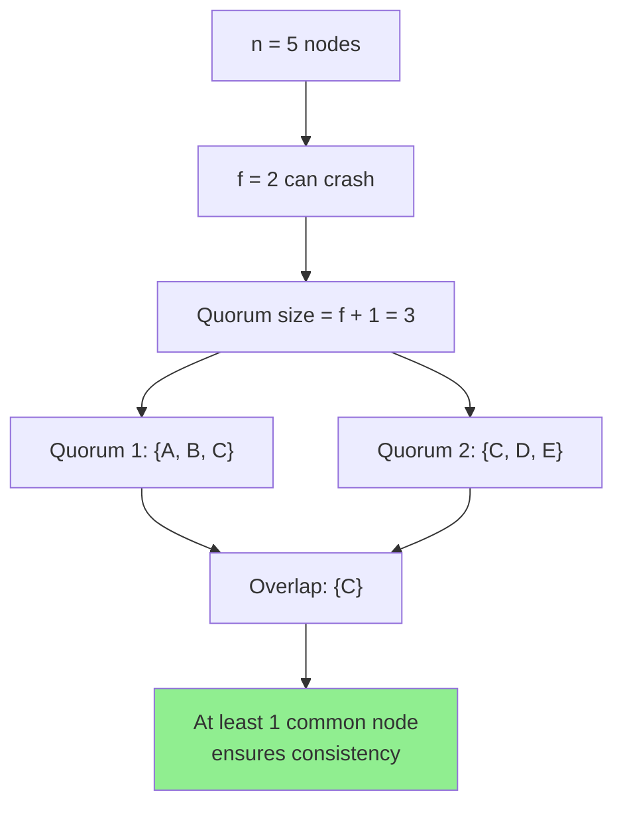
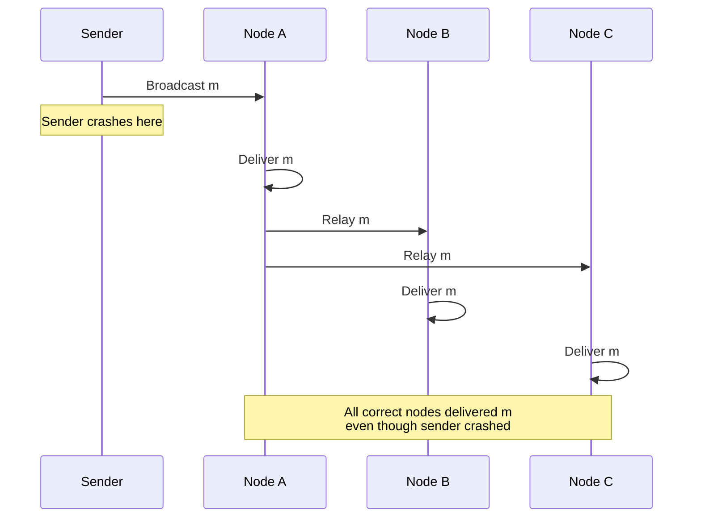
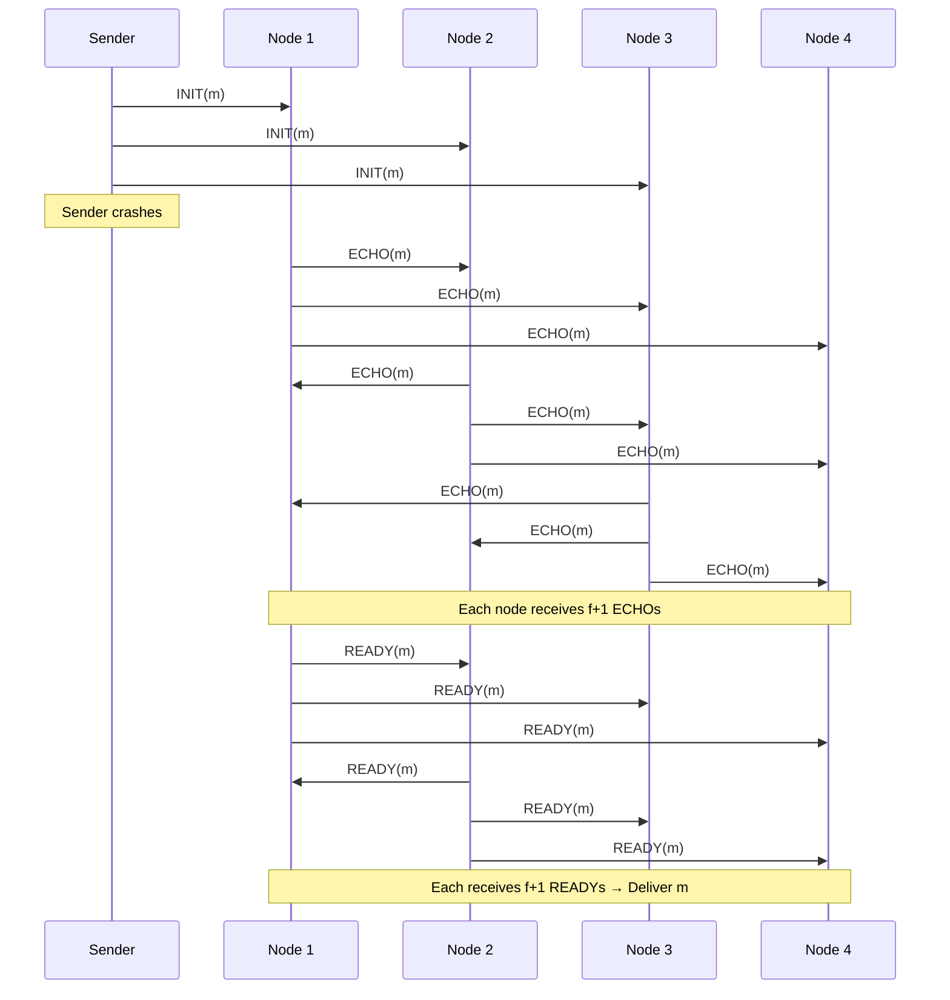

# Reliable Broadcast

**Reliable broadcast** is a communication primitive that ensures all correct nodes deliver the same set of messages, even in the presence of **crash failures**. It is the foundation for more advanced broadcast mechanisms like **[[bft-consensus-analysis/provable-broadcast/byzantine-reliable-broadcast|Byzantine Reliable Broadcast]]** and **[[bft-consensus-analysis/provable-broadcast/provable-broadcast|Provable Broadcast Protocol]]**.

## Problem Statement

In a distributed system with **crash failures**, nodes can:
- Stop responding permanently (crash)
- Have messages lost due to network failures
- Experience arbitrary delays

**Goal**: Ensure that all **correct** (non-crashed) nodes deliver the same messages in a consistent manner.

**Non-Goal**: Reliable broadcast does NOT tolerate Byzantine (malicious) failures — nodes are assumed to be honest but may crash.

## System Model

### Assumptions

- **Fault Model**: Crash failures only (no Byzantine behavior)
- **Network**: Asynchronous (no timing assumptions)
- **Nodes**: $n$ total nodes, at most $f$ can crash where $f < \frac{n}{2}$
- **Communication**: Point-to-point, reliable channels (messages not lost between correct nodes)
- **Cryptography**: Not required (trust model assumes honest nodes)

### Why f < n/2?

With crash failures, we need:
$$
f < \frac{n}{2} \quad \text{equivalently} \quad n \geq 2f + 1
$$

**Reasoning**: 
- Any two quorums of size $f + 1$ must overlap in at least 1 node
- This overlap ensures consistency even if $f$ nodes crash
- With $f \geq n/2$, quorums might not overlap → inconsistency possible



## Properties

Reliable broadcast must satisfy three properties:

### 1. Validity

**Informal**: If a correct node broadcasts message $m$, then all correct nodes eventually deliver $m$.

**Formal**:
$$
\forall p \in \text{Correct}, \forall m: \text{broadcast}_p(m) \implies \forall q \in \text{Correct}: \Diamond \text{deliver}_q(m)
$$

**Example**:
```
Node A (correct) broadcasts "commit transaction X"
→ All correct nodes {B, C, D, E} eventually deliver "commit transaction X"
```

### 2. Agreement

**Informal**: If a correct node delivers message $m$, then all correct nodes eventually deliver $m$.

**Formal**:
$$
\forall p, q \in \text{Correct}, \forall m: \text{deliver}_p(m) \implies \Diamond \text{deliver}_q(m)
$$

**Example**:
```
Node B delivers message m from node A
→ All other correct nodes {C, D, E} eventually deliver m
```

**Key Insight**: Agreement ensures consistency even if the sender crashes mid-broadcast.

### 3. Integrity

**Informal**: Every message is delivered at most once, and only if it was broadcast.

**Formal**:
$$
\forall p \in \text{Correct}, \forall m, \forall s: \\
(\text{deliver}_p(m) \text{ from } s) \implies (s \text{ broadcast } m \text{ or } s \text{ crashed})
$$

**Sub-properties**:
- **No duplication**: A message is delivered at most once to each node
- **No creation**: Messages are not fabricated; they must have been broadcast

## Protocols

### Protocol 1: Lazy Reliable Broadcast (Best Effort Network)

**Assumption**: Network is best-effort (messages may be lost)

**Mechanism**:
```
Sender s broadcasts m:
  1. Send m to all nodes

Receiver p upon receiving m from s:
  1. If m not yet delivered:
     a. Deliver m
     b. Relay m to all other nodes
```

**How it works**:
- Sender sends message once
- First receiver relays to everyone else
- Ensures delivery even if sender crashes immediately after first send



**Properties**:
- ✅ Validity: Sender sends to all, so all receive
- ✅ Agreement: First receiver relays to ensure all deliver
- ✅ Integrity: Deliver only once, from actual sender
- **Message Complexity**: O(n²) in worst case (sender + relays)

### Protocol 2: Eager Reliable Broadcast (Reliable Channels)

**Assumption**: Channels between correct nodes are reliable (no loss)

**Mechanism**:
```
Sender s broadcasts m:
  1. Send m to all nodes

Receiver p upon receiving m from s:
  1. If m not yet delivered:
     a. Deliver m
```

**How it works**:
- Since channels are reliable, sender's single send is sufficient
- No relaying needed

**Properties**:
- ✅ All properties satisfied
- **Message Complexity**: O(n) — optimal!

**Trade-off**: Requires stronger network assumption (reliable channels).

### Protocol 3: Bracha's Reliable Broadcast (Byzantine-Resilient Foundation)

While designed for Byzantine settings, Bracha's protocol also works for crash faults.

**Mechanism**:
```
Sender s broadcasts m:
  1. Send INIT(m) to all nodes

Receiver p:
  1. Upon receiving INIT(m) from s for the first time:
     a. Send ECHO(m) to all nodes
  
  2. Upon receiving ECHO(m) from (f + 1) distinct nodes:
     a. Send READY(m) to all nodes
  
  3. Upon receiving READY(m) from (f + 1) distinct nodes:
     a. Deliver m
```

**Why this works**:
- **ECHO phase**: Ensures at least one correct node received from sender
- **READY phase**: Ensures all correct nodes will eventually deliver
- **Threshold f + 1**: Majority guarantees overlap



**Message Complexity**: O(n²) — each node sends to all others twice (ECHO + READY)

**Advantage**: Also handles Byzantine failures (with adjusted thresholds)

## Comparison with Best-Effort Broadcast

| Property | Best-Effort Broadcast | Reliable Broadcast |
|----------|----------------------|-------------------|
| **Validity** | ❌ (sender crash → no delivery) | ✅ (delivery guaranteed) |
| **Agreement** | ❌ (nodes may differ) | ✅ (all correct deliver same) |
| **Integrity** | ✅ (no duplication/creation) | ✅ (no duplication/creation) |
| **Crash Tolerance** | ❌ | ✅ (f < n/2) |
| **Message Complexity** | O(n) | O(n) to O(n²) |

## Use Cases

### 1. Distributed Databases

**Problem**: Replicate writes across database replicas.

**Solution**: Primary uses reliable broadcast to send updates. Even if primary crashes mid-update, all replicas receive the same updates.

### 2. Configuration Updates

**Problem**: Deploy configuration changes to a cluster.

**Solution**: Manager broadcasts config changes. All nodes apply the same config even if manager crashes.

### 3. Group Communication

**Problem**: Chat application ensuring all members see the same messages.

**Solution**: Message sender uses reliable broadcast. All recipients see the same message history.

## Limitations

### Does NOT Handle

❌ **Byzantine Failures**: Malicious nodes can violate properties
❌ **Ordering**: Reliable broadcast doesn't specify delivery order (see Total Order Broadcast)
❌ **Sender Authentication**: No cryptographic proof of sender identity
❌ **Provability**: No certificates proving delivery to others

### Extensions Needed For

- **Byzantine Faults** → **[[bft-consensus-analysis/provable-broadcast/byzantine-reliable-broadcast|Byzantine Reliable Broadcast]]**
- **Delivery Proof** → **[[bft-consensus-analysis/provable-broadcast/provable-broadcast|Provable Broadcast Protocol]]**
- **Ordering** → **Total Order Broadcast / Atomic Broadcast**

## Mathematical Analysis

### Quorum Intersection

**Lemma**: Any two quorums of size $f + 1$ intersect in at least 1 node.

**Proof**:
- Total nodes: $n \geq 2f + 1$
- Quorum size: $f + 1$
- Union of two quorums: at most $2(f + 1) = 2f + 2$
- By pigeonhole: $2f + 2 - (2f + 1) = 1$ node must be in both quorums ∎

**Application**: This overlap ensures that if quorum Q₁ decides to deliver, quorum Q₂ will eventually learn about it (via the shared node).

### Termination Guarantee

**Theorem**: If sender is correct, all correct nodes eventually deliver.

**Proof** (Lazy Reliable Broadcast):
1. Correct sender sends m to all nodes
2. At least one correct node p receives m (since n ≥ 2f + 1 > f, at least one correct exists)
3. Node p relays m to all nodes
4. All correct nodes receive m from p
5. All correct nodes deliver m ∎

## Implementation Considerations

### Message Deduplication

```python
class ReliableBroadcast:
    def __init__(self):
        self.delivered = set()  # Track delivered messages
    
    def receive(self, message):
        msg_id = (message.sender, message.seq_num)
        if msg_id not in self.delivered:
            self.deliver(message)
            self.delivered.add(msg_id)
            self.relay(message)  # Relay to ensure Agreement
```

### Crash Detection

Reliable broadcast doesn't require crash detection (works in asynchronous model). However, crash detection can optimize:
- Stop relaying messages from detected-crashed nodes
- Reduce message overhead

### Network Optimization

- **Multicast**: Use IP multicast for efficient O(n) broadcasting
- **Gossip**: Probabilistic relaying reduces O(n²) to O(n log n)
- **Hierarchical**: Tree-based relay patterns

## Self-Assessment Questions

1. **Why is f < n/2 required for reliable broadcast with crash faults?**
   - *Hint: Think about quorum intersection*

2. **What happens if the sender crashes immediately after sending to just one node?**
   - *Hint: How does the protocol ensure all correct nodes still deliver?*

3. **Why is reliable broadcast insufficient for Byzantine fault tolerance?**
   - *Hint: What can malicious nodes do that crash faults cannot?*

4. **What is the difference between Validity and Agreement properties?**
   - *Hint: Validity is about correct senders; Agreement is about correct receivers*

5. **Can reliable broadcast guarantee message ordering?**
   - *Hint: Do the properties specify anything about delivery order?*

## Next Steps

- **[[bft-consensus-analysis/provable-broadcast/byzantine-reliable-broadcast|Byzantine Reliable Broadcast]]**: Extend to tolerate malicious failures
- **[[bft-consensus-analysis/provable-broadcast/provable-broadcast|Provable Broadcast Protocol]]**: Add delivery certificates
- **[[bft-consensus-analysis/provable-broadcast/properties|Provable Broadcast Properties]]**: Formal property specifications
- **[[overview|overview]]**: High-level broadcast comparison

## References

- Cachin, C., Guerraoui, R., & Rodrigues, L. (2011). "Introduction to Reliable and Secure Distributed Programming"
- Bracha, G. (1987). "Asynchronous Byzantine Agreement Protocols"
- See **[[bft-consensus-analysis/references|References: Bibliography and External Sources]]** for complete bibliography
