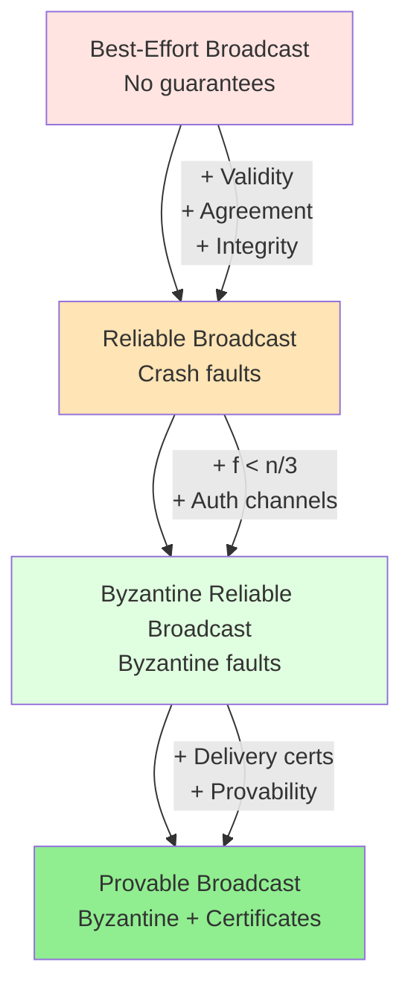
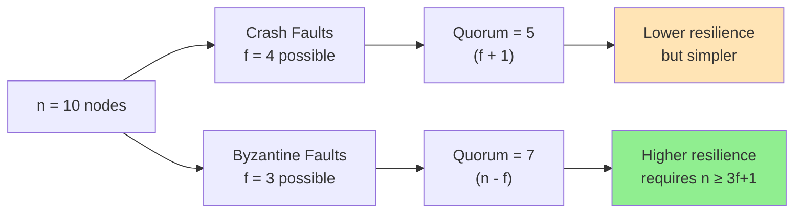
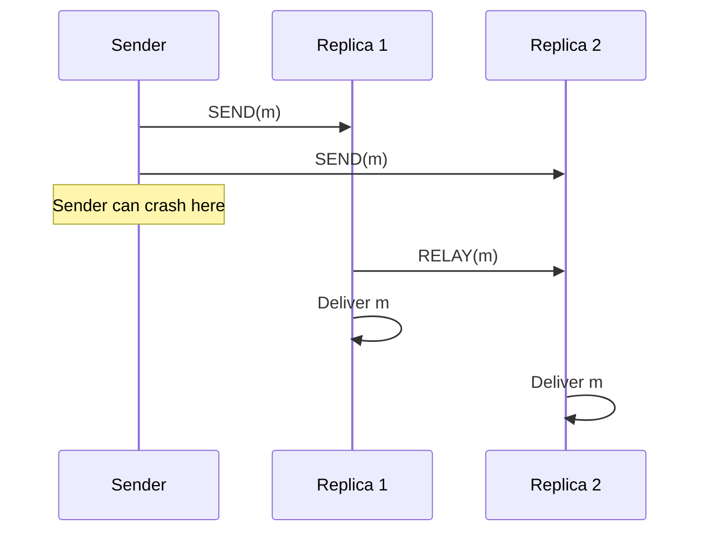
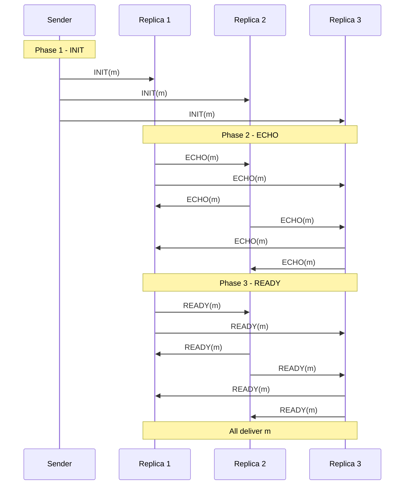
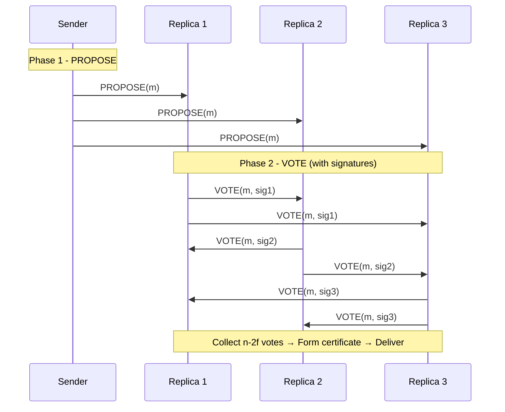

# Provable Broadcast vs Reliable Broadcast

This note provides a comprehensive comparison between **[[bft-consensus-analysis/provable-broadcast/reliable-broadcast|Reliable Broadcast]]**, **[[bft-consensus-analysis/provable-broadcast/byzantine-reliable-broadcast|Byzantine Reliable Broadcast]]**, and **[[bft-consensus-analysis/provable-broadcast/provable-broadcast|Provable Broadcast Mechanisms]]**, highlighting when to use each primitive and their design trade-offs.

## Hierarchy of Broadcast Primitives



## Side-by-Side Comparison

### Properties

| Property | Reliable Broadcast | Byzantine Reliable | Provable Broadcast |
|----------|-------------------|-------------------|-------------------|
| **Validity** | ✅ Correct sender → all deliver | ✅ Correct sender → all deliver | ✅ Correct sender → all deliver |
| **Agreement** | ✅ One delivers → all deliver | ✅ One delivers → all deliver | ✅ One delivers → all deliver |
| **Integrity** | ✅ No dup/creation | ✅ No dup/creation | ✅ No dup/creation |
| **Provability** | ❌ No certificates | ❌ No certificates | ✅ **Delivery certificates** |

### System Model

| Aspect | Reliable Broadcast | Byzantine Reliable | Provable Broadcast |
|--------|-------------------|-------------------|-------------------|
| **Fault Model** | Crash failures | Byzantine failures | Byzantine failures |
| **Max Faults** | f < n/2 | f < n/3 | f < n/3 |
| **Min Nodes** | n ≥ 2f + 1 | n ≥ 3f + 1 | n ≥ 3f + 1 |
| **Network** | Asynchronous | Asynchronous | Asynchronous |
| **Crypto** | Optional | Signatures (auth) | **Signatures (certs)** |

### Communication Complexity

| Metric | Reliable Broadcast | Byzantine Reliable | Provable Broadcast |
|--------|-------------------|-------------------|-------------------|
| **Messages** | O(n) to O(n²) | O(n²) | O(n²) |
| **Phases** | 1-2 | 3 (INIT, ECHO, READY) | 2 (PROPOSE, VOTE) |
| **Signature Ops** | None or O(n) | O(n²) | O(n²) |
| **Certificate Size** | N/A | N/A | **O(n)** or **O(1)** (threshold) |

### Performance Characteristics

| Characteristic | Reliable Broadcast | Byzantine Reliable | Provable Broadcast |
|---------------|-------------------|-------------------|-------------------|
| **Latency** | Low (1-2 RTT) | Medium (3 RTT) | Medium (2 RTT) |
| **Throughput** | High | Medium | Medium (cert overhead) |
| **Bandwidth** | Low | High (O(n²)) | **Highest (certs)** |
| **Storage** | Low | Medium | **High (cert storage)** |

## Detailed Comparison

### 1. Fault Tolerance

#### Reliable Broadcast (f < n/2)

**Quorum Intersection**:
```
n = 5, f = 2 (max crash)
Quorum size = f + 1 = 3

Quorum A: {1, 2, 3}
Quorum B: {3, 4, 5}
Intersection: {3} (≥ 1 node)
```

**Why it works**: With crash faults, quorums overlap in at least 1 node, ensuring consistency.

#### Byzantine/Provable Broadcast (f < n/3)

**Quorum Intersection**:
```
n = 10, f = 3 (max Byzantine)
Quorum size = n - f = 7

Quorum A: {1, 2, 3, 4, 5, 6, 7}
Quorum B: {4, 5, 6, 7, 8, 9, 10}
Intersection: {4, 5, 6, 7} = 4 nodes
Honest in intersection: 4 - 3 = 1 minimum
```

**Why it works**: Quorums overlap in at least f + 1 nodes, guaranteeing ≥ 1 honest node in the overlap.

**Visualization**:



### 2. Certificate Generation

#### No Certificates (Reliable + Byzantine Reliable)

**Behavior**:
- Nodes deliver messages based on protocol logic
- No portable proof of delivery
- Cannot prove to external parties that delivery occurred

**Limitation Example**:
```
Scenario: Node A claims "I delivered message m"
Problem: Node B cannot verify A's claim
         Must trust A or re-execute the protocol
```

#### With Certificates (Provable Broadcast)

**Behavior**:
- Nodes collect n - 2f signatures as certificate
- Certificate is portable proof of delivery
- Anyone can verify certificate independently

**Advantage Example**:
```
Scenario: Node A claims "I delivered message m"
Solution: A presents cert_m with n - 2f signatures
         Node B verifies signatures → proof accepted
         No trust required!
```

### 3. Message Phases

#### Reliable Broadcast (1-2 Phases)



**Phases**: 
1. Sender broadcasts
2. (Optional) Relay if sender crashes

**Total**: 1-2 message delays

#### Byzantine Reliable Broadcast (3 Phases)



**Phases**:
1. INIT: Sender initiates
2. ECHO: Nodes echo to each other (prevents equivocation)
3. READY: Nodes commit to delivery

**Total**: 3 message delays

#### Provable Broadcast (2 Phases)



**Phases**:
1. PROPOSE: Sender initiates
2. VOTE: Nodes vote with signatures, forming certificate

**Total**: 2 message delays (ECHO phase eliminated by cryptography!)

**Why Fewer Phases?**: Cryptographic signatures prevent Byzantine sender from equivocating, so ECHO phase is unnecessary.

### 4. Equivocation Prevention

#### Reliable Broadcast

**Not Applicable**: Crash faults don't include equivocation (honest nodes don't lie)

#### Byzantine Reliable Broadcast

**Mechanism**: ECHO phase with n - f threshold
```python
# Byzantine sender tries to equivocate:
Send "value A" to half the nodes
Send "value B" to other half

# Result:
"value A" gets < n - f ECHOs (only half the nodes)
"value B" gets < n - f ECHOs (only half the nodes)
→ Neither value progresses to READY phase
→ Equivocation prevented
```

**Limitation**: No proof of equivocation for external observers

#### Provable Broadcast

**Mechanism**: Cryptographic signatures + n - 2f threshold
```python
# Byzantine sender tries to equivocate:
Send "value A" to half the nodes
Send "value B" to other half

# Result:
"value A" gets < n - 2f signatures
"value B" gets < n - 2f signatures
→ Neither value gets a certificate
→ Equivocation prevented

# Bonus: If sender signed both proposals:
→ Can present BOTH signed proposals as proof of equivocation!
→ Byzantine sender caught red-handed
```

**Advantage**: Not only prevents equivocation, but provides **proof of misbehavior** for accountability.

### 5. External Verifiability

| Primitive | External Verification | Use Case |
|-----------|---------------------|----------|
| Reliable Broadcast | ❌ No | Internal cluster only |
| Byzantine Reliable | ❌ No | Internal cluster only |
| Provable Broadcast | ✅ **Yes (via certificate)** | **Blockchain, auditing, cross-chain** |

**Example: Blockchain Finality**

```python
# Without provable broadcast:
external_user.query(node_A, "Is block B finalized?")
node_A.response("Yes")
# Problem: User must trust node_A

# With provable broadcast:
external_user.query(node_A, "Is block B finalized?")
node_A.response("Yes, here's the certificate with n-2f signatures")
external_user.verify_certificate(cert)
# Verification succeeds → trustless proof!
```

### 6. Use Case Suitability

#### When to Use Reliable Broadcast

✅ **Good for**:
- Internal cluster communication (trusted environment)
- Crash fault tolerance sufficient
- Low latency required
- Simple implementation preferred

❌ **Not suitable for**:
- Byzantine/malicious actors
- External verifiability needed
- Blockchain/cryptocurrency systems

**Example**: Replicated database cluster (Raft, Paxos)

#### When to Use Byzantine Reliable Broadcast

✅ **Good for**:
- Byzantine fault tolerance required
- No external verifiability needed
- Certificate overhead is prohibitive
- Traditional BFT systems (PBFT-era)

❌ **Not suitable for**:
- Need to prove delivery to external parties
- Accountability/auditing required
- Cross-system communication

**Example**: Internal Byzantine agreement in permissioned systems

#### When to Use Provable Broadcast

✅ **Good for**:
- **Blockchain and DLT** (delivery proofs essential)
- **Auditing and compliance** (need verifiable logs)
- **Cross-chain bridges** (prove state to external chains)
- **Accountable systems** (detect and prove misbehavior)
- **Modern BFT consensus** (HotStuff, HoneyBadger)

❌ **Not suitable for**:
- Bandwidth-constrained networks (certificate overhead)
- Simple internal systems (overkill)
- Crash-fault-only environments

**Example**: Ethereum 2.0, Libra/Diem, Cosmos, Algorand

## Trade-off Summary

### Communication Overhead

```mermaid
graph TD
    A[Communication Cost] --> B[Reliable Broadcast<br/>O(n) to O(n²)]
    A --> C[Byzantine Reliable<br/>O(n²)]
    A --> D[Provable Broadcast<br/>O(n²) + certs]
    
    B --> E[Lowest cost]
    C --> F[Medium cost]
    D --> G[Highest cost<br/>(certificate storage)]
    
    style E fill:#90EE90
    style F fill:#FFE4B5
    style G fill:#FFB6C1
```

### Security Guarantees

```mermaid
graph TD
    A[Security Level] --> B[Reliable Broadcast<br/>Crash faults]
    A --> C[Byzantine Reliable<br/>Byzantine faults]
    A --> D[Provable Broadcast<br/>Byzantine + Provable]
    
    B --> E[Basic]
    C --> F[Strong]
    D --> G[Strongest<br/>(external verifiability)]
    
    style E fill:#FFB6C1
    style F fill:#FFE4B5
    style G fill:#90EE90
```

### Implementation Complexity

```mermaid
graph TD
    A[Complexity] --> B[Reliable Broadcast<br/>Simple relay]
    A --> C[Byzantine Reliable<br/>3-phase protocol]
    A --> D[Provable Broadcast<br/>Crypto + certificates]
    
    B --> E[Easy]
    C --> F[Moderate]
    D --> G[Complex<br/>(PKI, sig verification)]
    
    style E fill:#90EE90
    style F fill:#FFE4B5
    style G fill:#FFB6C1
```

## Migration Path

### From Reliable to Byzantine Reliable

**What changes**:
- Add authenticated channels (digital signatures)
- Replace f + 1 threshold with n - f
- Add ECHO and READY phases

**Code impact**: Protocol logic changes, signature verification added

### From Byzantine Reliable to Provable

**What changes**:
- Add certificate formation logic
- Store and return certificates with delivery
- Add certificate verification API

**Code impact**: Data structures for certificates, verification functions

**Minimal diff**:
```diff
  # Byzantine Reliable Broadcast
  upon receiving READY(m) from 2f + 1 nodes:
      deliver m
+ 
+ # Provable Broadcast addition
+     cert_m = collect_signatures(votes)
+     store_certificate(m, cert_m)
+     deliver (m, cert_m)
```

## Performance Benchmarks (Conceptual)

| Metric (n=10, f=3) | Reliable | Byzantine Reliable | Provable (sig) | Provable (threshold) |
|-------------------|----------|-------------------|---------------|---------------------|
| **Latency** | 10ms | 30ms | 20ms | 20ms |
| **Throughput** | 10000 msg/s | 5000 msg/s | 4000 msg/s | 4500 msg/s |
| **Bandwidth** | 1 MB/s | 10 MB/s | 12 MB/s | 8 MB/s |
| **Certificate Size** | N/A | N/A | 640 bytes | 96 bytes |

*Note: Actual numbers depend on message size, network, hardware*

## Decision Matrix

**Choose Reliable Broadcast if**:
- ✅ Crash faults only
- ✅ Trusted environment
- ✅ Low latency critical
- ✅ Simple implementation needed

**Choose Byzantine Reliable Broadcast if**:
- ✅ Byzantine faults possible
- ✅ Internal system (no external verification)
- ✅ Certificate overhead too high
- ✅ Traditional BFT design

**Choose Provable Broadcast if**:
- ✅ Byzantine faults + external verifiability
- ✅ Blockchain/cryptocurrency
- ✅ Auditing/compliance required
- ✅ Accountability needed
- ✅ Modern BFT protocol (HotStuff, HoneyBadger)

## Self-Assessment Questions

1. **Why does Byzantine reliable broadcast require f < n/3 while reliable broadcast only needs f < n/2?**
   - *Hint: Think about quorum intersection with Byzantine nodes*

2. **How do certificates in provable broadcast improve upon Byzantine reliable broadcast?**
   - *Hint: What can you do with a certificate that you can't do with just delivery?*

3. **Why does provable broadcast have fewer message phases than Byzantine reliable broadcast despite stronger guarantees?**
   - *Hint: How do cryptographic signatures help?*

4. **In what scenario would you prefer Byzantine reliable broadcast over provable broadcast?**
   - *Hint: When is certificate overhead not worth the benefit?*

5. **Can provable broadcast be used in a crash-fault-only setting?**
   - *Hint: Is it overkill, or does it provide additional benefits?*

## Related Concepts

- **[[bft-consensus-analysis/provable-broadcast/reliable-broadcast|Reliable Broadcast]]**: Crash fault tolerant baseline
- **[[bft-consensus-analysis/provable-broadcast/byzantine-reliable-broadcast|Byzantine Reliable Broadcast]]**: Byzantine extension without certificates
- **[[bft-consensus-analysis/provable-broadcast/provable-broadcast|Provable Broadcast Mechanisms]]**: Full protocol with certificates
- **[[bft-consensus-analysis/provable-broadcast/overview|Provable Broadcast Overview]]**: High-level introduction
- **[[bft-consensus-analysis/provable-broadcast/applications|Real-World Usage in Blockchain & DLT]]**: Real-world use cases

## References

- Cachin, C., Guerraoui, R., & Rodrigues, L. (2011). "Introduction to Reliable and Secure Distributed Programming"
- Decentralized Thoughts (2022). "What is Provable Broadcast?"
- See **[[bft-consensus-analysis/references|References]]** for complete bibliography
