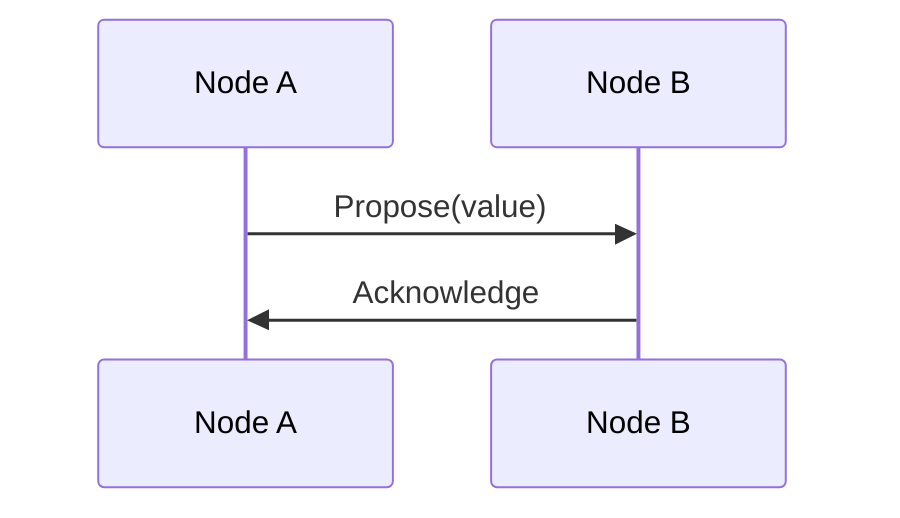

# Note Schema: Obsidian YAML Frontmatter Standards

**Feature**: 001-bft-consensus-analysis  
**Purpose**: Define the structure and metadata standards for all Obsidian notes in this knowledge base

---

## Standard YAML Frontmatter Template

All notes MUST include the following YAML frontmatter at the top:

```yaml
---
title: "Human-Readable Title"
type: concept | protocol | mechanism | framework | case-study | glossary | reference
tags: [bft, consensus, <additional-tags>]
created: YYYY-MM-DD
updated: YYYY-MM-DD
status: draft | review | complete
related:
  - [[related-note-1]]
  - [[related-note-2]]
references:
  - source-key-1
  - source-key-2
---
```

---

## Field Specifications

### Required Fields

#### `title` (string)
- Human-readable title for the note
- Should match the primary heading (#) in the note body
- Use title case for proper nouns, sentence case otherwise
- Example: `"Byzantine Fault Tolerant Consensus Fundamentals"`

#### `type` (enum)
- **Purpose**: Categorize the note for filtering and organization
- **Values**:
  - `concept` - Foundational ideas, definitions, explanations
  - `protocol` - Specific consensus protocol descriptions (PBFT, HoneyBadgerBFT, etc.)
  - `mechanism` - Communication primitives or building blocks (broadcasts, signatures)
  - `framework` - Logic models, verification systems, theoretical frameworks
  - `case-study` - Integrated analyses of real-world protocols
  - `glossary` - Glossary of terms
  - `reference` - Bibliography and citations

#### `tags` (list of strings)
- **Purpose**: Enable search and cross-referencing
- **Required tags**: All notes must include `bft` and `consensus`
- **Recommended tags**:
  - Domain: `broadcast`, `logic-model`, `formal-verification`, `cryptography`
  - Synchrony: `synchronous`, `asynchronous`, `partial-synchrony`
  - Protocol: `pbft`, `honeybadger`, `hotstuff`, `dag-based`
  - Property: `safety`, `liveness`, `agreement`, `validity`
  - Level: `introductory`, `intermediate`, `advanced`

**Example:**
```yaml
tags: [bft, consensus, broadcast, provable-broadcast, advanced, cryptography]
```

#### `created` (date)
- ISO 8601 date format: `YYYY-MM-DD`
- Date the note was originally created
- Example: `2026-01-21`

#### `updated` (date)
- ISO 8601 date format: `YYYY-MM-DD`
- Date of last significant edit
- Initially same as `created`, updated on revisions
- Example: `2026-01-25`

#### `status` (enum)
- **Values**:
  - `draft` - Initial version, may be incomplete
  - `review` - Ready for peer review
  - `complete` - Reviewed and finalized
- Enables incremental development and quality tracking

### Optional Fields

#### `related` (list of wikilinks)
- Explicit cross-references to conceptually related notes
- Use in addition to inline wikilinks for key relationships
- Example:
```yaml
related:
  - [[bft-consensus-fundamentals]]
  - [[provable-broadcast-overview]]
  - [[temporal-logic]]
```

#### `references` (list of strings)
- Keys to entries in the central `references.md` file
- Use consistent key naming: `author-year-shortname`
- Example:
```yaml
references:
  - halpern-moses-2000-knowledge
  - miller-2016-honeybadger
  - decentralized-thoughts-2022-provable-broadcast
```

#### `prerequisites` (list of wikilinks)
- Notes that should be read before this one
- Helps readers follow learning progression
- Example:
```yaml
prerequisites:
  - [[byzantine-failures]]
  - [[reliable-broadcast]]
```

#### `difficulty` (enum)
- Optional complexity indicator
- **Values**: `introductory`, `intermediate`, `advanced`
- Helps users self-select appropriate content

---

## Type-Specific Templates

### Template: Protocol Note

```yaml
---
title: "Protocol Name"
type: protocol
tags: [bft, consensus, <protocol-specific-tags>]
created: YYYY-MM-DD
updated: YYYY-MM-DD
status: draft
synchrony_model: synchronous | asynchronous | partially-synchronous
fault_tolerance: "f < n/3"
year_introduced: YYYY
related:
  - [[other-protocol-comparison]]
references:
  - original-paper-key
prerequisites:
  - [[bft-consensus-fundamentals]]
---
```

### Template: Mechanism Note

```yaml
---
title: "Mechanism Name (e.g., Provable Broadcast)"
type: mechanism
tags: [bft, consensus, broadcast, <specific-tags>]
created: YYYY-MM-DD
updated: YYYY-MM-DD
status: draft
extends: "Base mechanism name (optional)"
properties: [validity, agreement, integrity, provability]
related:
  - [[reliable-broadcast]]
  - [[protocols-using-this-mechanism]]
references:
  - mechanism-paper-key
---
```

### Template: Framework Note

```yaml
---
title: "Framework Name (e.g., Temporal Logic for Consensus)"
type: framework
tags: [bft, consensus, logic-model, formal-verification]
created: YYYY-MM-DD
updated: YYYY-MM-DD
status: draft
logic_type: epistemic | temporal | modal | automata-based
tool_support: "Tool names or N/A"
related:
  - [[consensus-properties]]
  - [[verified-protocols]]
references:
  - framework-paper-key
---
```

### Template: Case Study Note

```yaml
---
title: "Case Study: Protocol Name"
type: case-study
tags: [bft, consensus, case-study, <protocol-tags>]
created: YYYY-MM-DD
updated: YYYY-MM-DD
status: draft
protocol_analyzed: "Protocol Name"
integration_aspects: [bft-properties, broadcast-mechanism, formal-verification]
related:
  - [[protocol-note]]
  - [[mechanism-used]]
  - [[verification-framework]]
references:
  - protocol-paper-key
  - verification-paper-key
---
```

### Template: Concept Note

```yaml
---
title: "Concept Name"
type: concept
tags: [bft, consensus, <concept-domain>]
created: YYYY-MM-DD
updated: YYYY-MM-DD
status: draft
difficulty: introductory | intermediate | advanced
related:
  - [[related-concept]]
references:
  - foundational-source-key
---
```

---

## Note Body Structure Standards

After the YAML frontmatter, notes should follow this structure:

```markdown
---
[YAML frontmatter here]
---

# Note Title

[Brief 1-2 sentence overview of the topic]

## Prerequisites

[If applicable, list concepts readers should understand first, with links]

## Overview / Introduction

[Accessible explanation of the core concept, starting with intuition]

## [Main Sections - vary by note type]

### Section 1
### Section 2
...

## Examples

[Concrete examples demonstrating the concept]

## Relationships

[How this concept connects to other areas]

## Formal Specification

[Mathematical or logical formalization, if applicable]

## Further Reading

[Links to related notes and external references]

## References

[If not using central references.md, list sources inline]
```

---

## Wikilink Conventions

### Internal Links

Use `[[note-name]]` syntax for internal references:
- `[[bft-consensus-fundamentals]]` - Link to another note
- `[[bft-consensus-fundamentals#safety-properties]]` - Link to specific section
- `[[bft-consensus-fundamentals|BFT fundamentals]]` - Link with custom display text

### Embedding Content

Use `![[note-name]]` to transclude (embed) content:
- `![[glossary#byzantine-failure]]` - Embed specific section
- Useful for reusing definitions or common explanations

### External Links

Use standard markdown for external references:
- `[Link Text](https://example.com)` - Standard external link
- Prefer citing via `references.md` for academic sources

---

## Diagram and Code Block Standards

### Mermaid Diagrams

Use Mermaid for visual representations:

````markdown

````

**Supported diagram types:**
- `sequenceDiagram` - Message flows, protocol interactions
- `flowchart` - Decision trees, state machines
- `graph` - Entity relationships
- `classDiagram` - Structural models

### Code Examples

Use language-tagged code blocks:

````markdown
```python
# Python example
def byzantine_agreement(nodes, faulty_threshold):
    assert faulty_threshold < len(nodes) / 3
```
````

### Mathematical Notation

Use LaTeX for equations:

```markdown
Inline math: $f < n/3$

Block math:
$$
\forall i,j \in \text{Correct} : \text{decided}(i) \land \text{decided}(j) \to \text{value}(i) = \text{value}(j)
$$
```

---

## Quality Checklist

Before marking a note as `status: complete`, verify:

- ✅ YAML frontmatter is complete and valid
- ✅ All required fields are present
- ✅ Tags include required `bft` and `consensus`
- ✅ Title matches the primary heading
- ✅ At least one reference is cited
- ✅ Technical claims are sourced
- ✅ Related notes are linked (bidirectionally where possible)
- ✅ Prerequisites are stated (if applicable)
- ✅ Examples are provided for complex concepts
- ✅ Diagrams or tables are included for clarity
- ✅ Formal notation is consistent with other notes
- ✅ Glossary terms are linked on first use
- ✅ Note follows the body structure standards

---

## Validation Scripts (Future)

For automated validation, consider:

```bash
# Check YAML frontmatter validity
yq eval frontmatter.yaml

# Verify all wikilinks resolve
# (Obsidian does this automatically, but could script for CI)

# Check tag consistency
# Ensure all notes have required tags

# Reference verification
# Ensure all reference keys exist in references.md
```

---

## Version History

- **v1.0 (2026-01-21)**: Initial schema definition
- Future versions will update as the knowledge base evolves

---

## See Also

- [[data-model]] - Conceptual knowledge domain model
- [[quickstart]] - Navigation guide for the knowledge base
- [[references]] - Central bibliography
