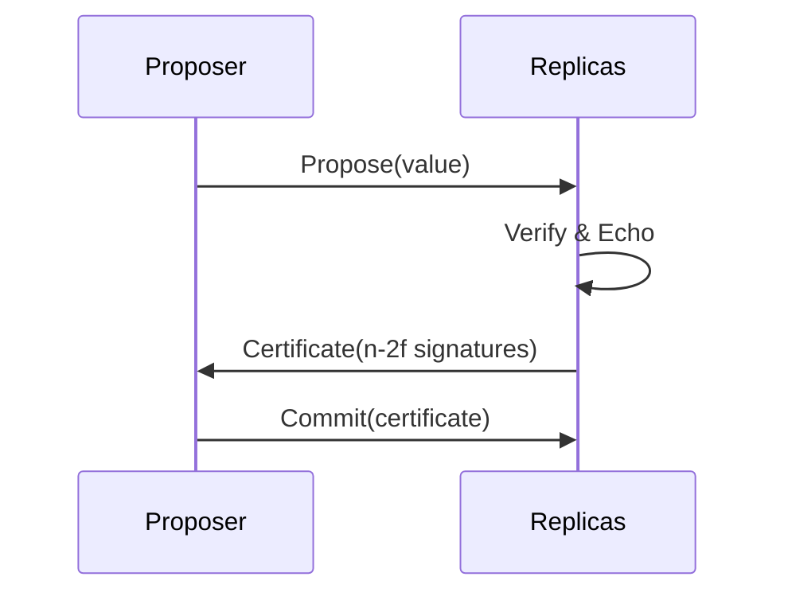

# Research: BFT Consensus, Provable Broadcast, and Logic Models

**Feature**: 001-bft-consensus-analysis  
**Phase**: 0 - Research & Technology Discovery  
**Date**: 2026-01-21

## Research Overview

This document consolidates research findings on three interconnected areas of distributed systems theory and practice:

1. **Byzantine Fault Tolerant (BFT) Consensus Algorithms** - Practical protocols that tolerate arbitrary (malicious) failures
2. **Provable Broadcast** - Communication primitive providing cryptographic proof of message delivery
3. **Logic Models for Consensus** - Formal frameworks for reasoning about knowledge and agreement in distributed systems

The goal is to understand each area independently and identify their relationships to enable comprehensive documentation in the Obsidian knowledge base.

---

## 1. Byzantine Fault Tolerant Consensus

### Decision: Document PBFT, HoneyBadgerBFT, and HotStuff as primary examples

**Rationale:**
- These three protocols represent different points in the design space:
  - **PBFT** (Practical Byzantine Fault Tolerance): Foundational partially synchronous protocol, widely studied
  - **HoneyBadgerBFT**: Fully asynchronous protocol with guaranteed liveness even in adversarial networks
  - **HotStuff**: Modern partially synchronous protocol with linear communication complexity (O(n) vs PBFT's O(n²))
- They illustrate key trade-offs between synchrony assumptions, communication complexity, and scalability
- All three are used in real-world blockchain and distributed ledger systems

**Key Properties to Document:**

| Protocol | Safety | Liveness | Synchrony Model | Communication Complexity |
|----------|--------|----------|----------------|-------------------------|
| PBFT | f < n/3 Byzantine | During synchrony only | Partially synchronous | O(n²) |
| HoneyBadgerBFT | f < n/3 Byzantine | Always (asynchronous) | Fully asynchronous | Higher (batching) |
| HotStuff | f < n/3 Byzantine | During synchrony | Partially synchronous | O(n) |

**Alternatives Considered:**
- **Paxos/Raft**: Rejected as they are not BFT (only handle crash failures, not Byzantine faults)
- **Tendermint**: Similar to HotStuff but less theoretically distinct
- **FBFT, Zyzzyva**: More specialized; the three chosen protocols better cover the design space

**Implementation Approach:**
- Create separate notes for each protocol under `content/bft-consensus-analysis/bft-consensus/protocols/`
- Include diagrams showing message flows for each protocol phase
- Document the f < n/3 Byzantine fault tolerance threshold with mathematical justification
- Explain safety (all honest nodes agree) vs liveness (progress is eventually made)

---

## 2. Provable Broadcast

### Decision: Focus on provable broadcast as a building block for modern BFT consensus

**Rationale:**
- Provable broadcast extends reliable broadcast with **delivery certificates** - cryptographic or quorum-based proof that a message has been delivered by a supermajority of nodes
- This is critical for BFT protocols because it prevents equivocation (Byzantine senders sending different values to different receivers)
- Modern BFT protocols (HoneyBadgerBFT, HotStuff, DAG-based BFT) use provable broadcast as a core primitive
- The decentralizedthoughts.github.io article provides authoritative explanation of the concept

**Key Concepts to Document:**

1. **Reliable Broadcast Properties:**
   - Validity: If a correct process broadcasts a message, all correct processes eventually deliver it
   - No duplication/creation: No message is delivered twice or if it wasn't broadcast
   - Agreement: If a correct process delivers a message, all correct processes deliver it

2. **Provable Broadcast Extensions:**
   - **Delivery Certificate**: Proof that ≥ n - 2f nodes (a supermajority) have delivered the message
   - **Single-round Commitment**: Can often commit in one round-trip because certificate proves broad agreement
   - **Byzantine Resistance**: Certificate is objective evidence that cannot be forged by Byzantine actors

3. **Differences from Reliable Broadcast:**

| Property | Reliable Broadcast | Provable Broadcast |
|----------|-------------------|-------------------|
| Proof of delivery | No | Yes (certificate) |
| Byzantine safety | Requires multiple rounds | Single round possible |
| Equivocation prevention | Limited | Strong (via certificates) |
| Communication overhead | Lower | Higher (certificate generation) |

**Alternatives Considered:**
- **Atomic Broadcast/Total Order Broadcast**: Adds ordering but doesn't provide delivery certificates
- **Byzantine Reliable Broadcast**: More general but lacks the specific provability property

**Implementation Approach:**
- Create notes explaining the progression: reliable broadcast → Byzantine reliable broadcast → provable broadcast
- Include examples from HoneyBadgerBFT (uses threshold cryptography) and HotStuff (uses quorum certificates)
- Provide visual diagrams showing certificate formation and verification
- Document cryptographic proof mechanisms (digital signatures, threshold signatures)

---

## 3. Logic Models for Distributed Consensus

### Decision: Base documentation on Halpern & Moses "Knowledge and common knowledge in a distributed environment" (arxiv cs/0006009)

**Rationale:**
- This foundational paper provides the formal logic framework for reasoning about knowledge in distributed systems
- Introduces critical concepts:
  - **Knowledge**: What each processor knows based on local information
  - **Distributed Knowledge**: Knowledge available if all nodes pooled their information
  - **Common Knowledge**: Everyone knows fact X, everyone knows that everyone knows X, recursively
- Explains why consensus is hard: true common knowledge is unattainable in asynchronous distributed systems with failures
- Provides theoretical underpinning for impossibility results (FLP theorem) and practical protocol design

**Key Concepts to Document:**

1. **Knowledge Levels:**
   - **Local Knowledge**: What a single node knows from its observations
   - **Distributed Knowledge**: Knowledge that exists collectively but not individually
   - **Common Knowledge**: Mutual knowledge at infinite depth (never achievable in practice)

2. **Application to Consensus:**
   - Consensus requires approximate common knowledge among correct processes
   - Protocols use message exchanges to increase knowledge levels progressively
   - Safety requires sufficient knowledge; liveness requires eventual knowledge growth

3. **Modern Formal Verification:**
   - **Temporal Logic (LTL)**: Express properties like "eventually all nodes decide" (liveness) or "no two nodes decide differently" (safety)
   - **Threshold Automata**: Model BFT protocols with components like broadcast and decision layers
   - **Model Checking Tools**: Automated verification (ByMC, TLA+, Coq) to prove protocol correctness
   - Recent work: compositional verification, mechanized proofs for blockchain protocols

**Alternatives Considered:**
- **Process Calculi (π-calculus, CSP)**: More focused on concurrency than distributed knowledge
- **I/O Automata**: Good for distributed systems but less emphasis on knowledge reasoning
- **TLA+ alone**: Practical but lacks the epistemic logic foundation

**Implementation Approach:**
- Create accessible introduction to logic models starting with intuitive examples
- Explain knowledge hierarchy with concrete distributed system scenarios
- Show how temporal logic expresses consensus properties formally
- Provide case study applying logic models to verify a BFT protocol (e.g., PBFT safety proof)
- Bridge theory to practice: how formal verification tools use these foundations

---

## 4. Integration & Relationships

### Decision: Document integration through concrete case studies showing all three perspectives

**Rationale:**
- The unique value of this feature is showing how these three areas complement each other
- Practitioners benefit from seeing BFT protocols, provable broadcast mechanisms, and formal verification working together
- Case studies make abstract concepts concrete

**Key Relationships:**

1. **BFT Consensus ↔ Provable Broadcast:**
   - Provable broadcast provides the communication primitive that BFT protocols use
   - Example: HoneyBadgerBFT uses provable broadcast in its asynchronous common subset (ACS) protocol
   - The delivery certificates from provable broadcast enable BFT protocols to achieve quorum-based safety guarantees

2. **BFT Consensus ↔ Logic Models:**
   - Logic models provide the formal language to specify and verify BFT protocol correctness
   - Safety properties ("no two honest nodes decide differently") are expressed in temporal logic
   - Liveness properties ("eventually a decision is made") require fairness assumptions in the model
   - Knowledge-based reasoning explains why f < n/3 is the Byzantine fault tolerance threshold

3. **Provable Broadcast ↔ Logic Models:**
   - Provable broadcast properties (consistency, validity) can be formally specified using temporal logic
   - The delivery certificate concept can be modeled as a form of "proof of distributed knowledge"
   - Formal verification can prove that a provable broadcast implementation satisfies its specification

**Case Studies to Develop:**

1. **HoneyBadgerBFT Complete Analysis:**
   - BFT properties: Asynchronous consensus with f < n/3 fault tolerance
   - Broadcast mechanism: Threshold-encrypted provable broadcast
   - Formal verification: How its safety and liveness can be proven using temporal logic

2. **DAG-Based BFT (e.g., DAG-Rider):**
   - BFT properties: Leverages DAG structure for high throughput
   - Broadcast mechanism: Each vertex represents a provable broadcast with certificates
   - Formal verification: DAG non-forking properties proven using finite-state model checking

**Implementation Approach:**
- Create integration notes under `content/bft-consensus-analysis/integration/`
- Develop `relationships.md` explaining bidirectional connections
- Create detailed case study notes with diagrams showing protocol flow, broadcast mechanism, and formal properties
- Provide "design framework" guide showing how to apply all three perspectives when designing a new protocol

---

## Documentation Structure & Technology Choices

### Obsidian Markdown Conventions

**Decision:** Use Obsidian-flavored markdown with YAML frontmatter and wikilinks

**Rationale:**
- Already established in the repository (content/ directory is an Obsidian vault)
- YAML frontmatter enables metadata (tags, creation date, status)
- Wikilinks (`[[note-name]]`) provide seamless bidirectional linking
- Quartz static site generator (present in repo) can publish the vault to the web

**Standards:**
```yaml
---
title: "Note Title"
tags: [bft, consensus, distributed-systems]
created: 2026-01-21
status: draft
---
```

- Use `[[wikilink]]` syntax for internal references
- Use `![[note-name]]` to embed/transclude content
- Use code blocks with language tags for examples
- Use Mermaid diagrams where appropriate (Obsidian supports Mermaid)

### Visual Documentation

**Decision:** Create diagrams using Mermaid (for sequence diagrams, flowcharts) and ASCII art (for simple structures)

**Rationale:**
- Mermaid is supported natively in Obsidian
- Text-based diagrams are version-control friendly
- Easier to maintain than image files

**Example:**


### Citation & References

**Decision:** Maintain a central `references.md` with all external sources and use footnote-style citations in notes

**Rationale:**
- Traceable to authoritative sources per success criteria
- Central reference list prevents duplication
- Markdown footnotes/links provide easy navigation

**Format:**
```markdown
According to the provable broadcast analysis[^1], delivery certificates...

[^1]: [[references#Provable Broadcast - Decentralized Thoughts]]
```

---

## Open Questions & Future Research

### Resolved in This Phase:
- ✅ Which BFT protocols to document (PBFT, HoneyBadgerBFT, HotStuff)
- ✅ How provable broadcast differs from reliable broadcast
- ✅ Which logic model paper to use (Halpern & Moses cs/0006009)
- ✅ Documentation format (Obsidian markdown)
- ✅ How to structure the content directory

### Deferred to Implementation:
- Specific Mermaid diagrams for each protocol (will be created during Phase 1)
- Detailed mathematical proofs for formal properties (will assess depth needed per note)
- Interactive elements (N/A for static documentation)
- Cross-linking strategy (will evolve organically during note creation)

---

## Success Metrics for Research Phase

| Criterion | Status | Evidence |
|-----------|--------|----------|
| Identified 3+ BFT protocols | ✅ PASS | PBFT, HoneyBadgerBFT, HotStuff |
| Understood provable broadcast | ✅ PASS | Properties, differences from reliable broadcast documented |
| Located logic model framework | ✅ PASS | Halpern & Moses cs/0006009 identified |
| Defined documentation structure | ✅ PASS | Obsidian markdown with directory structure |
| Identified relationships | ✅ PASS | BFT↔Broadcast, BFT↔Logic, Broadcast↔Logic |

---

## Next Steps (Phase 1)

1. **Create data-model.md**: Define knowledge domain entities and relationships
2. **Create contracts/**: Document the structure schema for notes (YAML frontmatter standards, linking conventions)
3. **Create quickstart.md**: Guide for navigating the documentation
4. **Update plan.md**: Incorporate research findings into the implementation plan

After Phase 1, the foundation will be ready for actual note creation (Phase 2 - Implementation).
